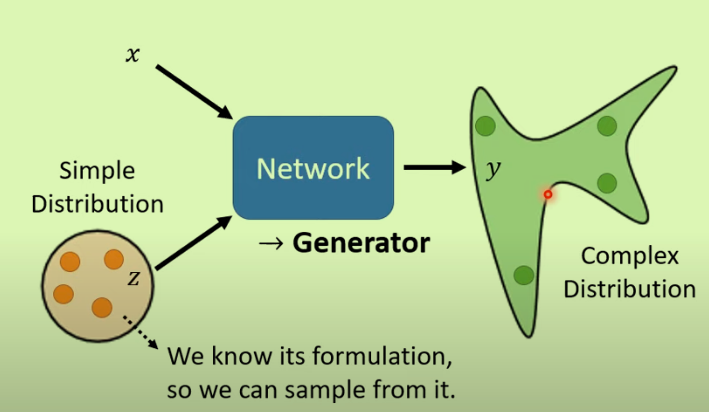
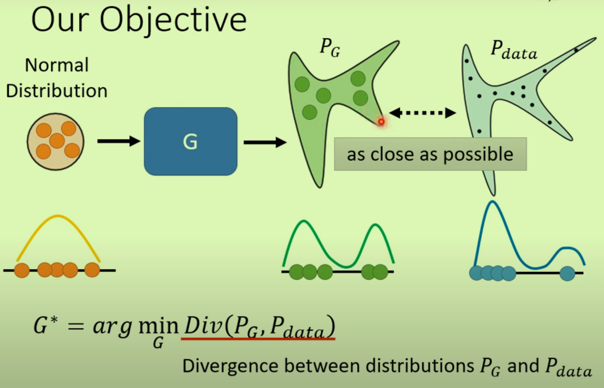
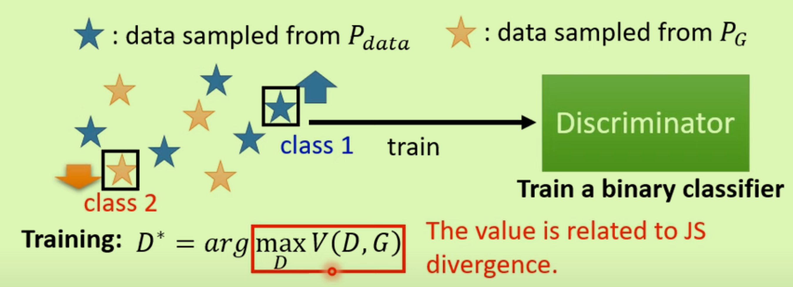

# Network as Generator

输入不仅是x，还加上了不同的z，因为有不同的z存在，导致输出的y也变成了范围。

我们需要，**同一个函数，同样的输入具有不同的输出。**

## GAN Generative Adversarial Network

### Discriminator

就是一个网络，CNN等根据问题决定。

来**辅助Generator，判断其不同的输出**。二者似敌似友。

### Generator与Dis的交互

1、固定Generator，利用Generator来训练Discrim

2、固定Dis（标准是定的），利用Discrim来训练Generator，最好能够骗过D

3、反复两步骤，反复训练二者

### GAN原理

- 这里的Loss就是Pg和Pdata之间的差距；所以就是要找到一个G使得Divergence越小越好；但是差距并不好算
- 对于差距，GAN只要从G和Data中Sample出数据就能利用Discrim计算差距：利用下式
- 