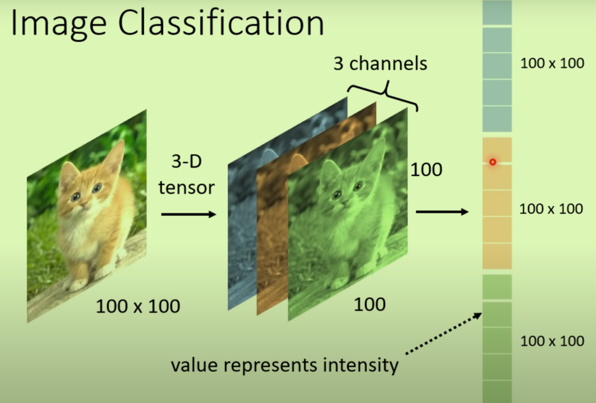
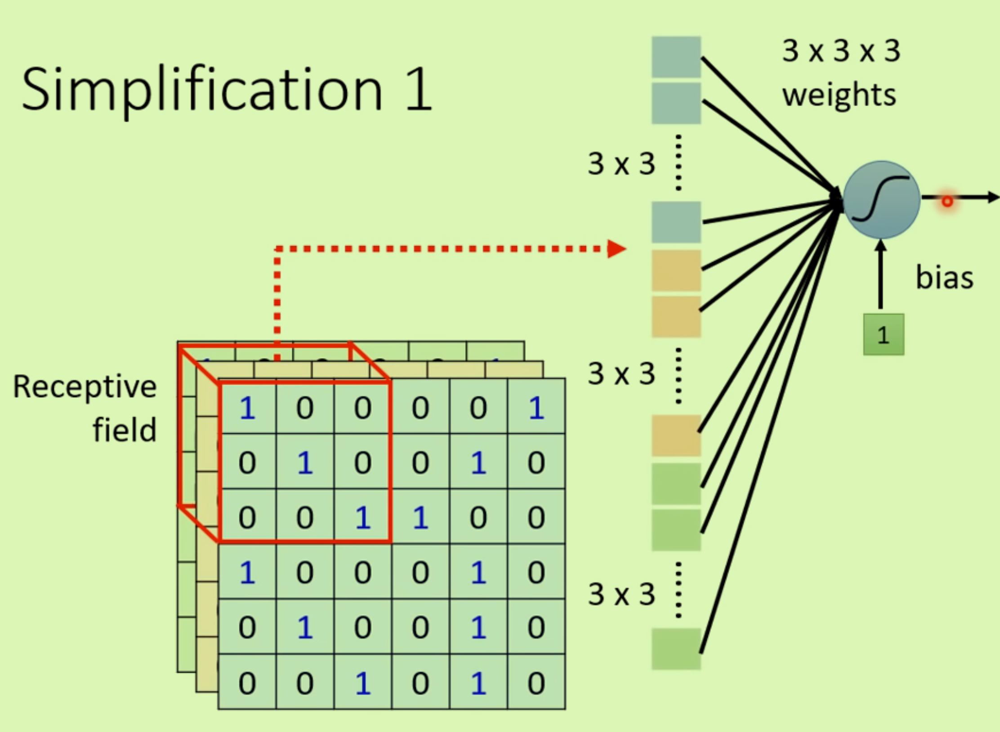
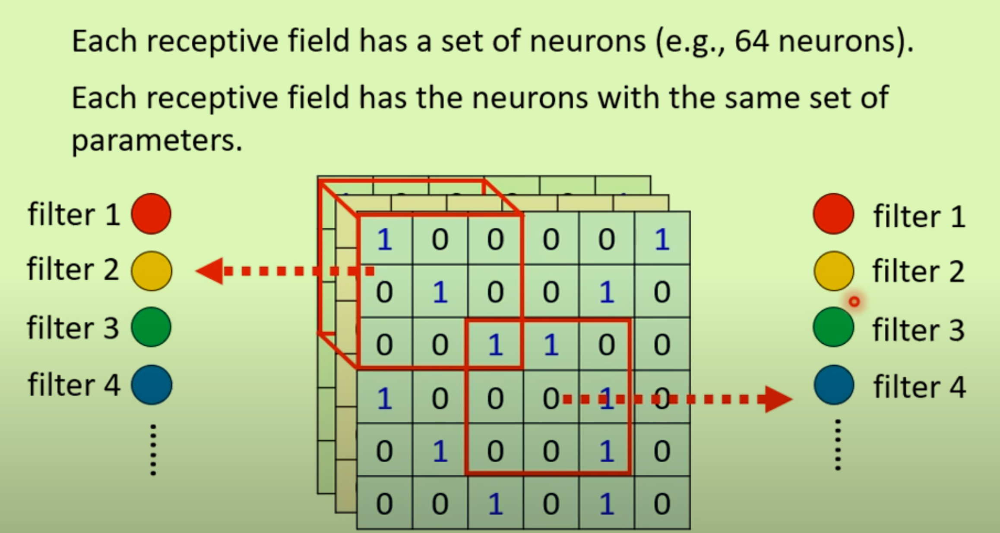

# Convolutional Neural Network CNN(影像)

## 图像输入

将图片变为一个向量，就可以输入到一个网络中——3维图片拉成向量

## 根据影像特性决定是否要全连接

1、不需要将整张图片当做输入，只需要一小部分就可以决定图片相关特征：

- 每组神经元只关注自己的**Receptive field（感受区域）**
- 

- 将感受区域拉成向量作为某个神经元的输入，感受区域的大小是自定义的；不同的神经元的感受区域可以重叠。

2、Stride各方向移动扫过整张图片

- 感受区域的移动（彼此之间最好有高度的重叠，防止遗漏）
- 如果有一部分overlap，将多出区域进行补充(padding)

## 共享参数

在特定卷积层中使用相同的权重和偏置对整个输入数据进行操作（*全连接唯一权重*）

在图像中，相同的特征（如边缘或角点）可以出现在不同的位置，通过参数共享，卷积神经网络能够检测到整个图像区域内的这些特征，无论它们出现在哪里。

通俗的来说，

- 你可以用同一个滤镜（同一组参数）查看图片的不同部分，以识别相同类型的特征。

- 参数共享使得网络只需要学习一组边缘检测的规则，然后就可以应用这些规则来检查整张图片的所有部分。

## 使用Filter来理解

CNN的每一层都有神经元Filter来对输入数据进行处理，会得到Feature Map,注意数据的Channel会不断变化

### Pooling

将Feature Map变小,Convolution和Pooling交替使用。

## 使用CNN来下围棋

- 输入是棋盘棋子的位置（19*19的向量），输出是某个位置：19x19中哪一个位置是最好的，总体是一个分类问题。

- 将棋盘视作19*19的图片，棋盘的channel是48（描述每一个位置）：棋盘的"channel"不再是颜色，而是用来表示不同的游戏状态和历史信息。

- Alpha Go中在第一层使用了5*5的范围，意味着他将棋盘上这样大小的范围当作一个最小特征。
- 但是围棋任务不使用Pooling