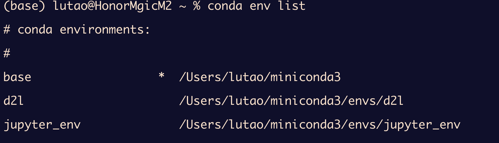
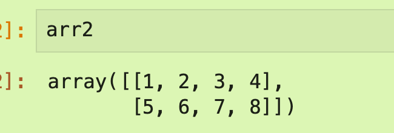
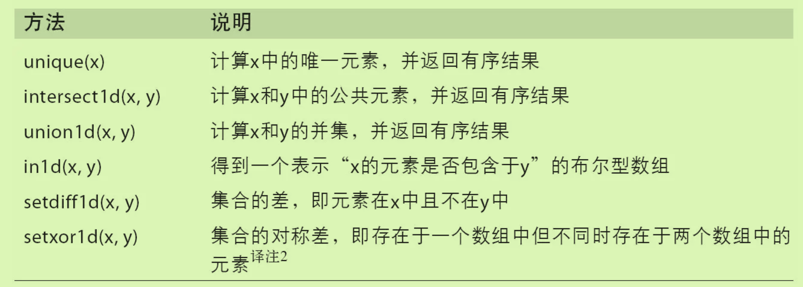
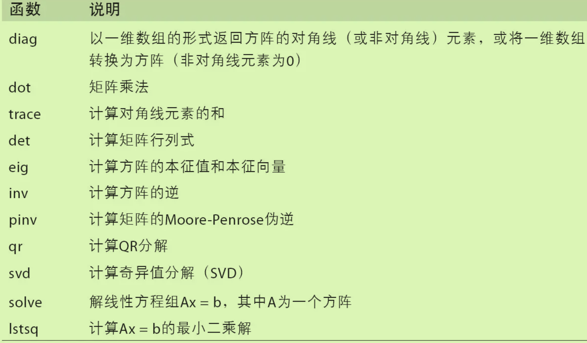

## 下载Numpy

### 启动独立环境

首先使用命令`conda env list`来查看当前所有可用的conda环境。



当前激活的环境前面会有一个星号。

我要使用jupyter时，需要**激活相对应的环境**：`conda activate jupyter_env`；当然退出conda环境的命令也有：`conda deactivate`

激活环境后再打开Jupyter NoteBook`jupyter notebook`


## 内容

### ndarray(Numpy中的数组)

#### 使用array函数

- 创建数组最简单的办法就是使用array函数。它接受一切序列型的对象（包括其他数组），然后产生一个新的含有传入数据的NumPy数组。

- ```python
  data2 = [[1, 2, 3, 4],[5, 6, 7, 8]]
  arr2 = np.array(data2)
  
  ```

- 

#### 使用zeros和ones函数

- 创建指定长度或形状的全0或者全1数组

- ```python
  np.zeros(10)
  np.zeros((3, 6))
  ```

### dtype数据类型

#### Astype

- 通过ndarray的astype方法明确地将一个数组从一个dtype转换成另一个dtype

- ```python
  float_arr = arr.astype(np.float64)
  ```

- **调用astype总会创建一个新的数组**（一个数据的备份），即使新的dtype与旧的dtype相同。

## Numpy数组运算

### 基本的索引和切片

切片的范围是左闭右开区间；

#### 与列表的区别

- 数组的切片是原始数组的视图，数据不会进行复制，修改反映到源数组身上。（会进行广播修改）

对二维数组进行访问,可以传入一个以逗号隔开的索引列表来选取单个元素

```python
arr2d = np.array([[1, 2, 3], [4, 5, 6], [7, 8, 9]])
arr2d[0, 2]
3
```

- 如果省略了后面的索引，则返回对象会是一个维度低一点的ndarray
- 对于这些高阶的数据，我们都使用的是**视图更改**（不是复制）。

#### 切片索引

对于高维数组进行切片，其冒号两侧分别是取哪些列，取哪些行。（注意左闭右开区间）

你可以一次传入多个切片，就像传入多个索引那样：(用逗号分隔，先切再切)

```python
In [90]: arr2d
Out[90]: 
array([[1, 2, 3],
       [4, 5, 6],
       [7, 8, 9]])

In [92]: arr2d[:2, 1:]
Out[92]: 
array([[2, 3],
       [5, 6]])
```

#### 布尔型索引

例如使用布尔型数组来进行数组的索引,布尔型数组的长度必须跟被索引的轴长度一致.

```python
In [102]: names == 'Bob'
Out[102]: array([ True, False, False,  True, False, False, False], dtype=bool)
//这里索引的是行，第0行和第3行是True故索引出这两行的结果
In [103]: data[names == 'Bob']
Out[103]: 
array([[ 0.0929,  0.2817,  0.769 ,  1.2464],
       [ 1.669 , -0.4386, -0.5397,  0.477 ]])
```

通过布尔型索引选取数组中的数据，将总是创建数据的副本，即使返回一模一样的数组也是如此。

#### 花式索引

利用整数数组进行索引

```python
In [117]: arr = np.empty((8, 4))

In [118]: for i in range(8):
   .....:     arr[i] = i

In [119]: arr
Out[119]: 
array([[ 0.,  0.,  0.,  0.],
       [ 1.,  1.,  1.,  1.],
       [ 2.,  2.,  2.,  2.],
       [ 3.,  3.,  3.,  3.],
       [ 4.,  4.,  4.,  4.],
       [ 5.,  5.,  5.,  5.],
       [ 6.,  6.,  6.,  6.],
       [ 7.,  7.,  7.,  7.]])

In [120]: arr[[4, 3, 0, 6]]
Out[120]: 
array([[ 4.,  4.,  4.,  4.],
       [ 3.,  3.,  3.,  3.],
       [ 0.,  0.,  0.,  0.],
       [ 6.,  6.,  6.,  6.]])
```

为了以特定顺序选取行子集，只需传入一个用于指定顺序的整数列表或ndarray即可.

还可以一次传入多个索引数组，前者是标识行数组，后者是标识列数组

```python
In [122]: arr = np.arange(32).reshape((8, 4))

In [123]: arr
Out[123]: 
array([[ 0,  1,  2,  3],
       [ 4,  5,  6,  7],
       [ 8,  9, 10, 11],
       [12, 13, 14, 15],
       [16, 17, 18, 19],
       [20, 21, 22, 23],
       [24, 25, 26, 27],
       [28, 29, 30, 31]])
# [1,0] [5,3] [7,1] [2,2]这四个位置上的值
In [124]: arr[[1, 5, 7, 2], [0, 3, 1, 2]]
Out[124]: array([ 4, 23, 29, 10])
```

### 数组的转置和轴转换

简单的转置

- 使用`.T`完成

ndarray的`swapspaces`方法

- （没看懂）

- ```python
  In [135]: arr
  Out[135]: 
  array([[[ 0,  1,  2,  3],
          [ 4,  5,  6,  7]],
         [[ 8,  9, 10, 11],
          [12, 13, 14, 15]]])
  # 
  In [136]: arr.swapaxes(1, 2)
  Out[136]: 
  array([[[ 0,  4],
          [ 1,  5],
          [ 2,  6],
          [ 3,  7]],
         [[ 8, 12],
          [ 9, 13],
          [10, 14],
          [11, 15]]])
  ```

## 通用函数ufunc

Ufuncs可以接受一个out可选参数，这样就能在数组原地进行操作：

```python
In [153]: np.sqrt(arr, arr) #后面这个arr就是可选参数，可以原地操作
Out[153]: array([    nan,     nan,     nan,  2.318 ,  1.9022,  1.8574,  2.2378])
```


## 利用数组进行数据处理

```python
points = np.arange(-5, 5, 0.01)
xs, ys = np.meshgrid(points, points)
# 最终ys是什么，以及arange的作用是什么
```

### 条件逻辑表述为数组运算

使用`numpy.where（condition,x1,x2）`函数，其中x1和x2可以是数组也可以是标量

```python
In [172]: arr = np.random.randn(4, 4)

In [173]: arr
Out[173]: 
array([[-0.5031, -0.6223, -0.9212, -0.7262],
       [ 0.2229,  0.0513, -1.1577,  0.8167],
       [ 0.4336,  1.0107,  1.8249, -0.9975],
       [ 0.8506, -0.1316,  0.9124,  0.1882]])

In [174]: arr > 0
Out[174]: 
array([[False, False, False, False],
       [ True,  True, False,  True],
       [ True,  True,  True, False],
       [ True, False,  True,  True]], dtype=bool)
# 效果就是将arr中所有>0的都设置为了2，<0的设置为了-2
In [175]: np.where(arr > 0, 2, -2)
Out[175]: 
array([[-2, -2, -2, -2],
       [ 2,  2, -2,  2],
       [ 2,  2,  2, -2],
       [ 2, -2,  2,  2]])
```

传递给where的数组大小可以不相等，甚至可以是标量值

### 数学和统计方法

sum、mean以及标准差std函数,不仅可以对整个数组计算还可以对指定轴进行计算

```python
In [178]: arr
Out[178]: 
array([[ 2.1695, -0.1149,  2.0037,  0.0296],
       [ 0.7953,  0.1181, -0.7485,  0.585 ],
       [ 0.1527, -1.5657, -0.5625, -0.0327],
       [-0.929 , -0.4826, -0.0363,  1.0954],
       [ 0.9809, -0.5895,  1.5817, -0.5287]])
#
In [182]: arr.mean(axis=1)
Out[182]: array([ 1.022 ,  0.1875, -0.502 , -0.0881,  0.3611])
# 
In [183]: arr.sum(axis=0)
Out[183]: array([ 3.1693, -2.6345,  2.2381,  1.1486])
```

- arr.mean(1)是“计算行的平均值”，arr.sum(0)是“计算每列的和”。（这里只能选1和0吗？）

在多维数组中，累加函数（如cumsum）返回的是同样大小的数组，但是会根据每个低维的切片沿着标记轴计算部分聚类（这里没太看懂）

```python
n [187]: arr
Out[187]: 
array([[0, 1, 2],
       [3, 4, 5],
       [6, 7, 8]])

In [188]: arr.cumsum(axis=0)
Out[188]: 
array([[ 0,  1,  2],
       [ 3,  5,  7],
       [ 9, 12, 15]])

In [189]: arr.cumprod(axis=1)
Out[189]: 
array([[  0,   0,   0],
       [  3,  12,  60],
       [  6,  42, 336]])
```


### 排序

同样使用`sort`函数，可以在其中加入一个轴标签作为参数，如果直接`arr.sort`是就地排序（修改视图）

顶级方法np.sort返回的是数组的已排序副本，而就地排序则会修改数组本身。计算数组分位数最简单的办法是对其进行排序，然后选取特定位置的值：

### 唯一化及其他集合逻辑

最常用的可能要数np.unique了，它用于找出数组中的唯一值并返回已排序的结果：

另一个函数np.in1d用于测试一个数组中的值在另一个数组中的成员资格，返回一个布尔型数组



## 用于数组的输入输出IO操作

np.save和np.load是读写磁盘数组数据的两个主要函数。默认情况下，数组是以未压缩的原始二进制格式保存在扩展名为.npy的文件中的：

```python
In [213]: arr = np.arange(10)
#写，保存
In [214]: np.save('some_array', arr)
#读，加载
In [215]: np.load('some_array.npy')
Out[215]: array([0, 1, 2, 3, 4, 5, 6, 7, 8, 9])
```

## Numpy中的线性代数

NumPy提供了一个用于矩阵乘法的dot函数（既是一个数组方法也是numpy命名空间中的一个函数）

x.dot(y)等价于np.dot(x, y)：

numpy.linalg中有一组标准的矩阵分解运算以及诸如求逆和行列式之类的东西


