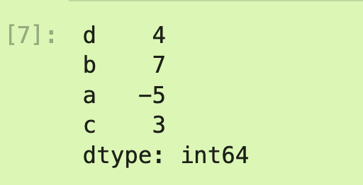

# Pandas

## 安装pandas库

第一次使用时遇到当前环境中没有pandas库这一情况，需要在我的jupyter虚拟环境中去下载pandas

```bash
conda install pandas
```

之后重启jupyter环境即可。

## Pandas重要数据结构

### Series

很像哈希表，或者是python中的字典，有index（键）和对应的值，其中Series是以对象为基本单位去操作，即通过Series创建的都是对象。

```python
import numpy as np
import pandas as  pd
from pandas import Series,DataFrame

obj2 = pd.Series([4, 7, -5, 3], index=['d', 'b', 'a', 'c'])

```



对于Series，其特点：

- 会根据运算的索引标签自动对齐数据
- 在python中可以直接通过字典创建Series对象

### DataFrame

将不同的（但得等长）的Series列组合在一起，就成了DataFrame，单独调用其中的某一列，可以使用对象.属性的方式调用。（很像将Series看作DataFrame对象中的属性），但跟推荐使用`DataFram['列名']`来调用其中的某一列。

