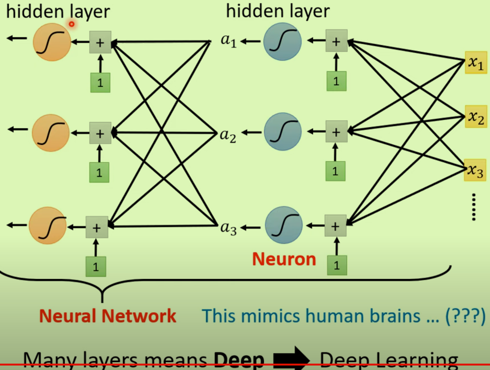

# 训练的三个步骤

## 1 Find Function with Unknown

定一个有未知参数的函数

### Domain Knowledge

### Model

y = b(weight) + w(bias) x1

- 两个未知参数b，w

## 2 Define Loss

### L(b,w)

*From Trainning Data*

- 本质也是一个函数

### Label

往往是真实值

### 不同决定差值的方式

## 3 Optimization

找到让Loss最小的w，b

### Gradient Descent

1、随机一个w0的点（其他参数也一样）

2、计算对应的微分（切线斜率），根据正负来左右移动w——向较低的地方移动

3、每次移动的**步伐长度**如何确定：自主设定学习率

4、最终停下移动参数的步伐：微分为0或者自定义停止，但是可能找不到最佳值。

### Hyperparameters

自定义的参数（如学习率）

# 根据实际问题改善模型

## 更复杂的曲线

- 不再是普通的单条折线，而是**复杂的折线Piecewise Linear Curves**——由constant+sum of a set of 组成

- 可以用PLC曲线可以去组成任何的连续曲线。
- 蓝色曲线(*有各种各样*）——PLC曲线——任意连续曲线

### 蓝色Function（Sigmod)

如何构造这个蓝色的函数：使用**Sigmoid函数逼近**从而达到蓝色曲线（Hard Sigmoid)的效果

- 调整bwc来构造出各种不同的蓝色曲线

### 新的更复杂的模型

- *第i个sigmoid里面乘第j个的w(bias)*
- 矩阵化：将算式改为矢量形式

### 整个过程矢量化

每个参数的意义：

- x : feature
- 未知参数：W,b,B,c

矢量化过程可以执行多次（这个次数又是一个未知参数）即通过多个Sigmod或者ReLU激活

### 新模型应用训练三部曲

矢量化后得到的这些未知参数即第一步——**Find Function with Unknown**；

新模型在进行最优化时，所有的未知参数以Seita代表

不断地更新未知的参数：

- 实际上更新参数并不是拿所有的数据去更新，而是一组一组地分别去更新，这样一组更新叫做`update`
- 所有组更新结束之后称作一个`epoch`;即一个epoch内部包含了多次update，已经
- 

- batchSize是自己设定的，也是一个未知参数。

### Sigmod->ReLU

从那个指数e曲线转变为ReLU折线：两个ReLU可以合成一个Hard Sigmod即那个蓝色曲线

二者其实都是激活函数Activation function

### 总结整个过程，专业化

深度学习=更多层的hidden layers

为什么只是变更多层，而不是在某一层中使用更多的隐藏层呢？

## 如何解决平时练习时的问题

可以先去检查训练资料，而不是只看测试资料。

### 降低训练集的Loss

两个角度切入解决此问题：

- 增大模型（更多的特征、使用更多层）——模型的弹性问题
- 梯度下降并不够好（Optimization)

### Overfitting过拟合

注意什么时候才可以称作过拟合：**训练集Loss小但是测试集的Loss大**

1、最简单的解决方案：增加训练资料（蓝色的点增多，使模型更加适配）

- 通常可以在原有的资料上进行翻转等操作*Data augmentation*

2、限制模型的弹性，但不要太多限制

### Optimization中梯度下降问题解决

#### Gradient为0时

损失函数对于模型参数的导数为0，意味着损失函数相对于模型的参数不再变化。这一点`critical point`可能是多种情况：

- Local Minimum——No way to go，周围都比自己高无法降低了。
- Saddle Point——还是有方法来降低的
- Local Maximum——理论上可能 

如何判断是哪一个：`Hessian`矩阵（二次微分）的特征值，正值最小值，负值最大值，有正有负是鞍点

#### 处理Saddle Point

- 找Hession矩阵的负的特征值与特征矩阵
- 然后顺着特征矩阵的方向去更新让L变小

### Batch处理技巧

#### 为什么用Batch

#### 比较大小Batch不同效果

- 大的Size更新参数的速度更快；

- 小的Batch Size对Optimazation更好；在训练资料上表现得更好

### Momentum

梯度下降的另一种方法，不再是简单地反向，而是上一次的正向-上一次的反向

### 学习率问题

#### 两种处理方法Adaptive Learning Rate

每个梯度都考虑的方法：

考虑过去所有的梯度的大小与方向：（即上面的+Momentum）：

RMSProp:

多了一个阿尔法参数来决定后面g的重要性，可以动态调整（因为这个参数也是一个未知参数，可以自己决定）

#### 何时需要大还是小的学习率

对于大型数据集和模型，可以尝试使用较大的学习率，因为每次迭代中的梯度计算平均了更多的样本，通常会更加稳定。对于小型数据集和模型，较小的学习率可能更适合，以防过度拟合和训练不稳定。

### 输入Feature标准化Normalization

防止输入数据的过大差距带来的不同方向上的变化过大影响,从而使得梯度下降效率更高。

训练时进行标准化 Batch Normalization(批归一化)

- 当然标准化不止对于刚开始的x，还有加上偏置后也要进行。
- 

测试时也可以进行批标准化

## 如何从回归到分类问题

 分类问题的正确值进行矢量化：只有0和1

输出不再是回归问题的单一输出而是**加上多个偏置后**的多个输出：

再将所得的y进行`softmax`处理：可以理解为将输出都往1和0去调整

最后，分类问题的e（差距）更常使用`Cross-entropy`:

Pytorch中softmax和Cross-entropy是相互绑定的

