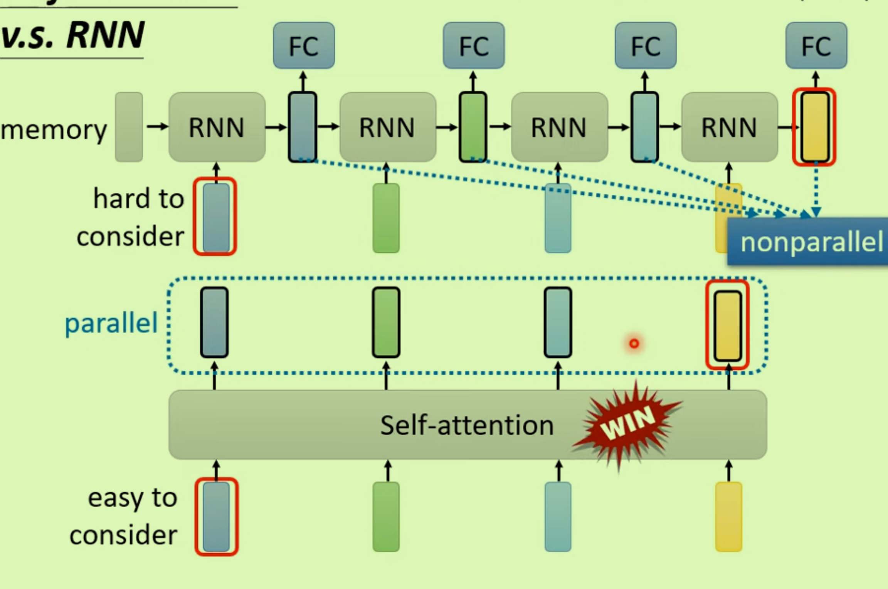

# Self-attention架构

输入：

为了处理不同长度输入的情况——*一个句子就是一排长度不一的向量*；一个声音信号也是一排长度（高度）不一的向量

输出：

 

## 目的

- Self-Attention的核心思想是让模型在处理一个序列的时候能够考虑到序列中的**所有元素**（例如，单词或字符）并计算它们之间的**关联度（attention）**。这是通过计算序列中每个元素对其他所有元素的“注意力得分”来实现的。这些得分决定了在生成每个输出元素时应该给予序列中其他元素多少关注。

- 考虑整个句子，不可能把整个上下文都包进来（输入窗口会很大，导致全连接的过拟合）
- 可以使用多次Self-Attention;通常与Fully Connected联用（前者处理整个句子，后者处理单个向量）

## 机制

### 1、如何得到输出b？

- 根据A1找到句子中与其相关的其他向量（元素之间的关联度阿尔法）
- 如何得到关联度呢？有不同的计算方式，Dot-product：

### 2、得到关联度后，将输入向量转换为新的向量：

- 

### 3、将得到B的整个过程矢量化

- 将输入数据乘上三个不同的W矩阵得到三个特殊矩阵
- 每一个q与k进行矩阵乘法得到**关联度**：

- 将得到的关联度与v相乘得到最终输出：

整个过程中**只有三个W是需要进行学习的**参数。

### Multi-head Self-attention

将qkv三个矩阵再次分类，对同一类进行进行相同的操作。

### 字词在句子中的位置还未确定

给字词a加上e即可确定字词的具体位置：**Positional Encoding**

## 优点

### 与CNN进行比较

CNN是一个简化版的Self-attention（因为感知区域的存在）；当训练集比较大的时候CNN效果会比较好。

### 与RNN比较

Self是平行运算，速度更快，并且不用像RNN那样一直保持着memory，无论多远的两个输入都可以计算关联度。

## 缺点

运算量太大，其变形都叫做xxformer

# Transformer

## SequenceToSequence

输入是一个序列，输出也是一个序列，但是输出序列的长度是由模型自己决定的。

### 解决问题举例

NLP问题其实都是QA问题：

QA问题可以由S2S方法来解决——

多标签分类也可以用S2S方法来解决：一个物品属于多个种类

### 原理

这种分离的架构使得Transformer非常适合处理需要**将输入数据转换为新形式或新语言的任务**，如机器翻译、文本摘要和语音识别等。

#### Encoder

编码器，对输入数据进行一系列的处理；

输入一排向量输出同样长度的一排向量

在`self-attention`的基础上加了`residual`之后，再做layer正则化后成为全连接层的输入；全连接层上再次使用`residual`；何为residual：

#### Decoder(Autoregressive)

解码器，负责生成输出序列（以下图示显示AT）；**输出其实是一个概率的分布**

不断地增加Decoder的输入序列（会把之前自己的输出当做自己的输入）

其中原理：

1、多了Masker Self-Attention(在算第二个位置时不去看其后面的，只看1和2)——*因为Decoder的输入是不断增加的，而不是一次性给出所有*

2、增加开始停止标签：

AT与NAT的比较

AT无法控制输出的长度（除非加上结束标签）；NAT可以控制输出的长度，但需要很多

#### Encoder 与 Decoder之间的联系_Cross attention

q来自于Decoder;kv来自于Encoder

### 如何进行训练

 

还要给出正确答案——Teacher Forcing