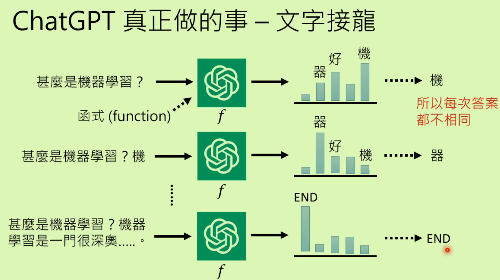
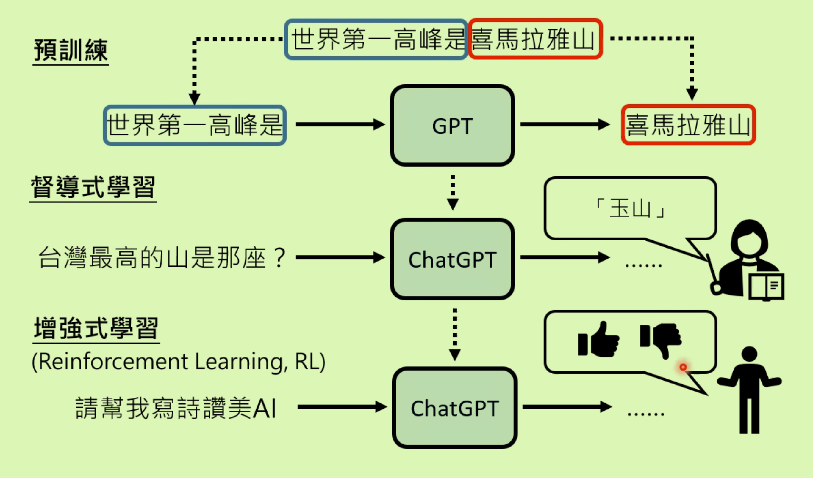
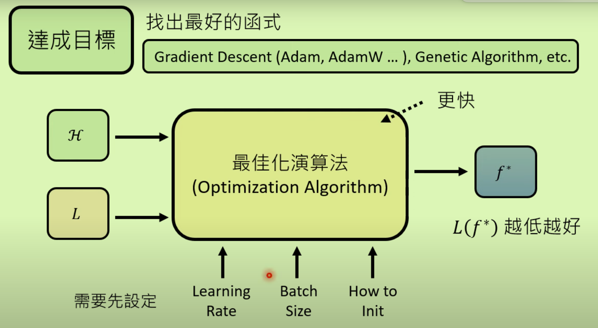

## 对于ChatGPt的误解

1、不是从集合里面去选择答案

2、不是网络上某一篇文章的答案

其实是在做**文字接龙**,从一个几率分布中取样

- 如何产生句子类型的回答呢：**每次其实都只拿到一个输出，但是将这个输出再作为输入循环下去直到遇到终止符。**

- 如何记录历史记录：输入不只当前的问题，还包括当前对话的之前问题

- 训练时需要联网搜寻资料，而测试不能联网。

## 如何被训练出来Pre-Train

**GPT:Generative Pre-trained Transformer**

从前版本的GPT是从网络上的资料学习，进行文字接龙。从GPT到ChatGPT增加了人类老师的监督学习。

**预训练（自监督学习）——微调（Fine-tune）；无痛生成的成对数据——人类老师监督；GPT是基石模型**

### 预训练的作用

 在多种语言上预训练后，只需要教某一个语言的某一个任务（微调），会自动学习其他语言的同样任务。

## 未来

### 精准提出需求Prompting

催眠特定的场景

### 如何更正错误

### 侦测是否由AI生成

### 泄漏密码—反机器学习（遗忘）

## 机器学习简述

实际上就是在找一个能够解决问题的函数。

### 分类、回归

ChatGpt实际上是在做选择题（分类）——要解决的生成式学习问题进行了拆解为多个分类问题（文字接龙）

### 结构化学习/生成式学习

生成有结构的物件（影像、句子）

### 寻找函数三部曲

1、设定范围（候选函数集合**Model**）H

- 类神经网络结构 DeepLearning（CNN，RNN，Transformer）即候选集合
- 或者是决策树等
- **训练资料少的时候，范围画的小**

2、设定标准 L

- 如何挑出一个函数——以**LOSS Function**作为评判标准（标准答案与函数输出之间的差距）
- **根据资料，评判=有标准+假设标准**，即监督学习、无监督学习、强化学习RL等

3、达成目标（找到目标f）

- 最低的Loss的函数（最佳化）
- 梯度下降等算法
- 
- 通常会去手动调这些超参数。