## 何为统计学习

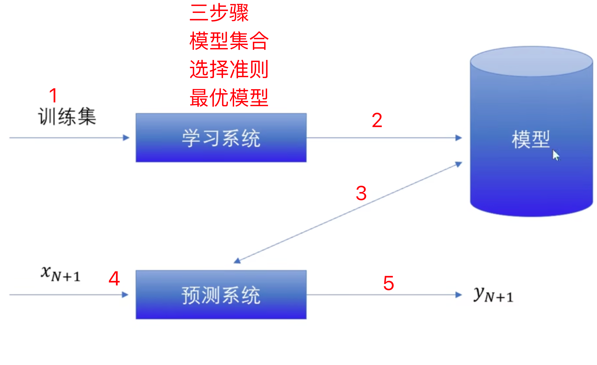

## 监督学习

### 基本概念

### 专有名词

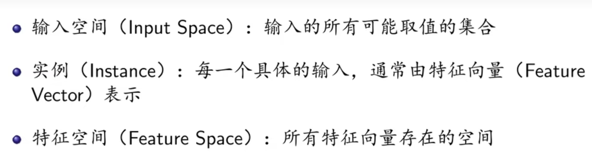

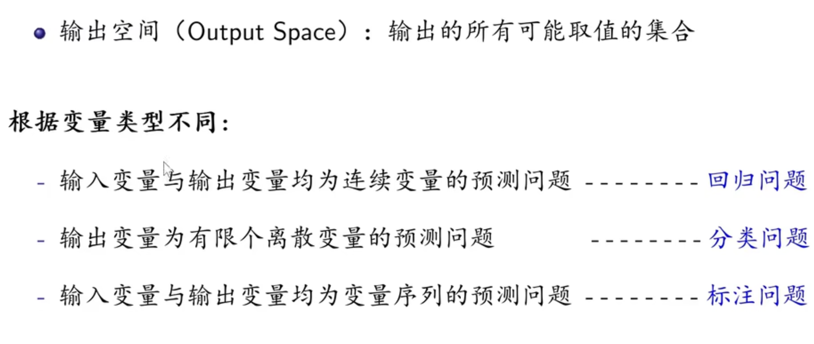

### 符号表示：

- 可以看到小x的下标表示输入的是第几个变量（通俗来讲第几列），上标表示列中的单个元素值。
- **样本成对出现**。

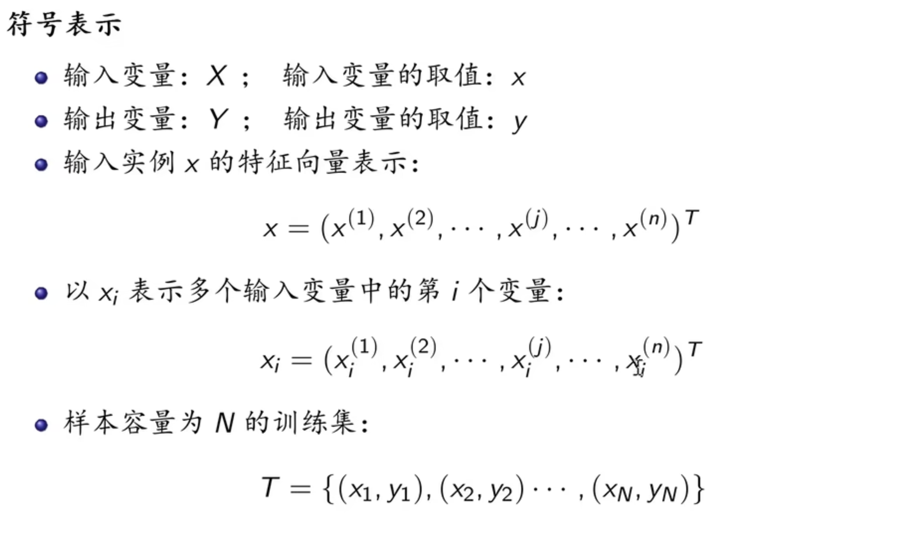

### 学习目的

- 学习**映射关系**，这些映射关系就是不同的模型

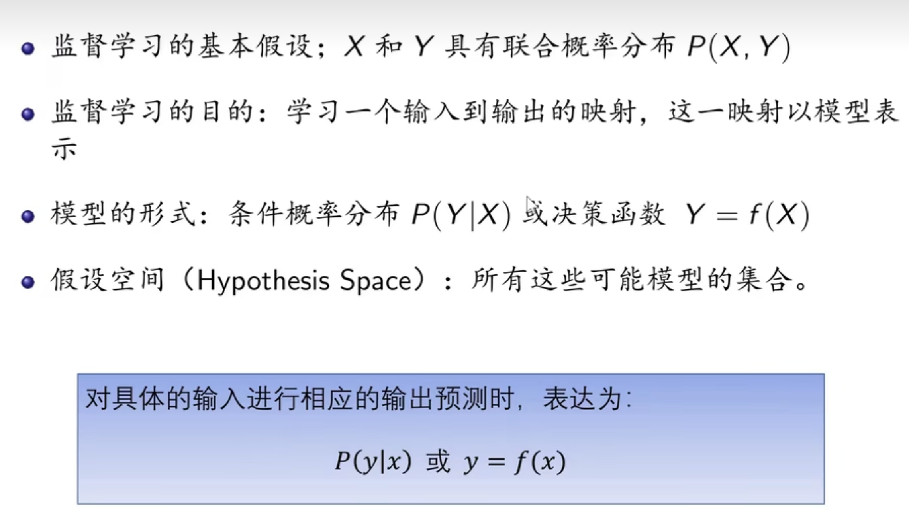

### 监督学习大体过程：

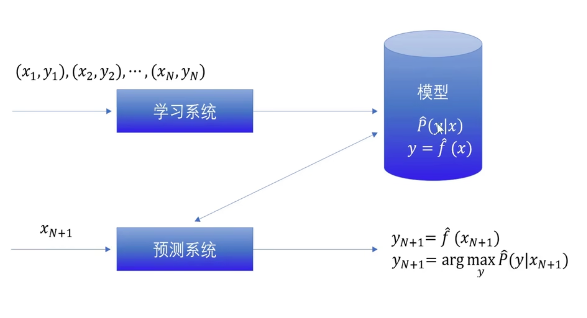

## 无监督学习

### 基本概念

- 不像监督学习那样一个输入对应一个输出，输出是潜在的

### 专有名词

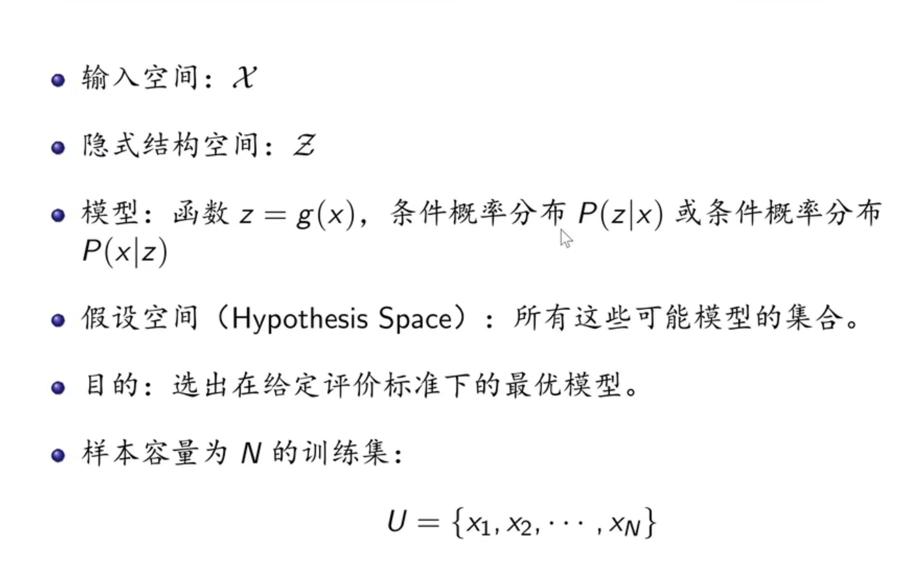

- 这里的Z其实也就是输出，是无监督学习要找的那个隐藏的东西
- 训练集也只包含了x，不是xy的一对组合

## 强化学习

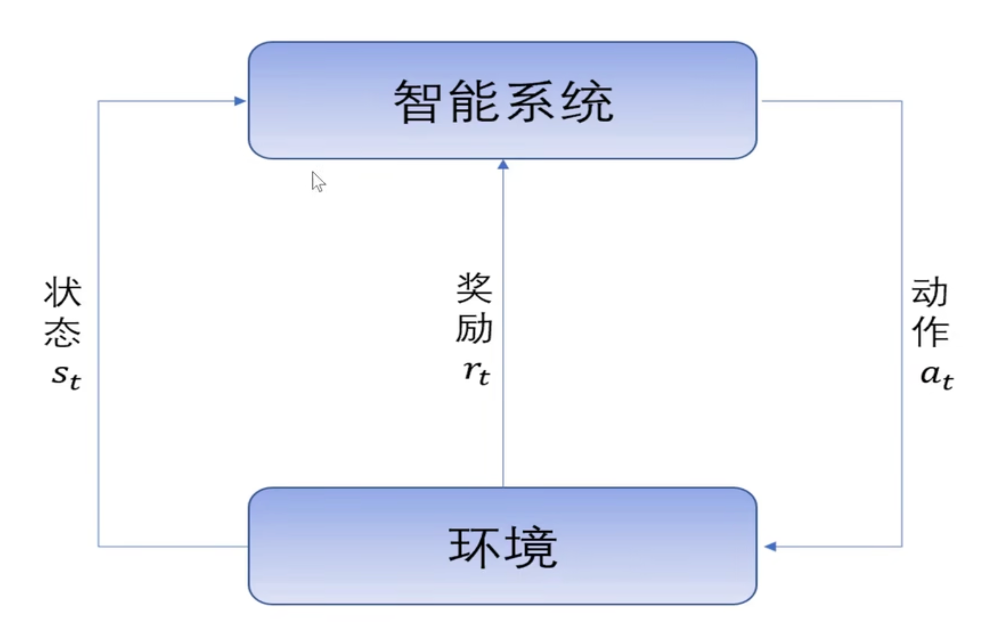

## 统计学习三要素

模型+策略+算法 

### 模型

一种数学表达，各种不同的方程。（不同的方程有不同的假设空间，如线性非线性）

### 策略

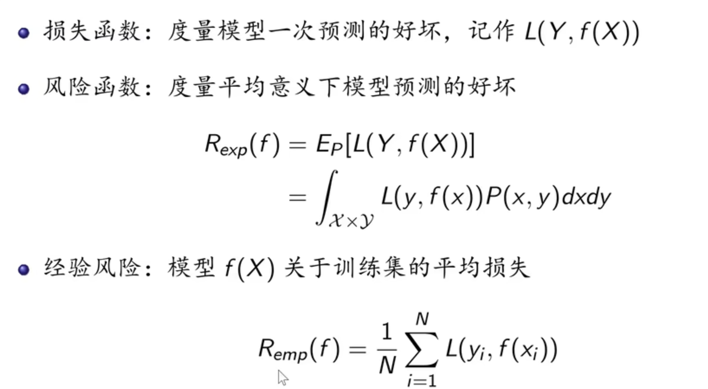

- 从损失函数过渡到经验风险，风险函数就是对损失函数进行了求期望，但是其中的P无法求得，所以对于训练集的数据进行了求经验值——*经验损失只是风险函数的估计值*
- Y是真实值，f是预测值

#### 常见的损失函数

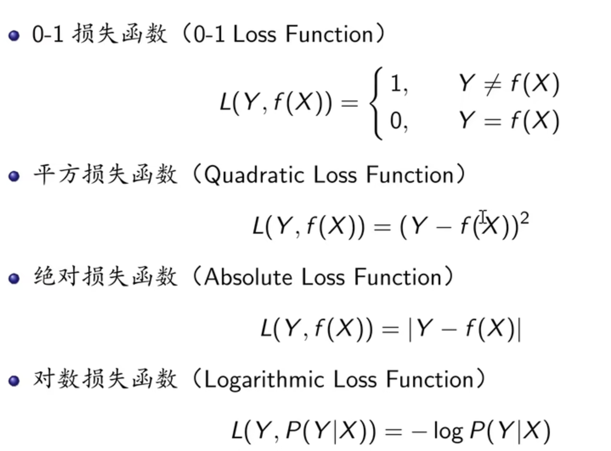

### 算法

它是一套用于训练模型、寻找最优参数的具体步骤或程序。

在监督学习中有梯度下降法

### 对于无监督学习

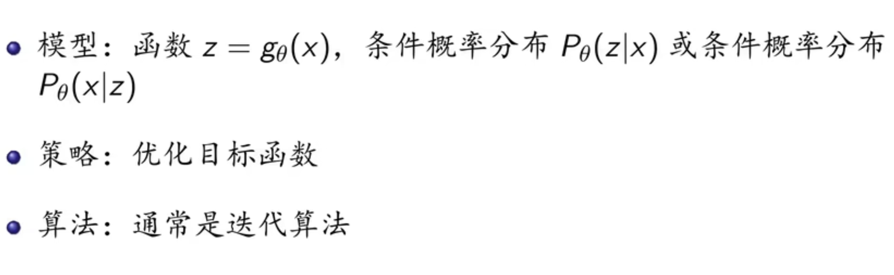

## （以下基于监督学习）

## 模型评估和选择（属于策略部分）

### 误差

- 测试误差用的测试集，训练误差用的训练集，但是刚开始的模型都是由训练集得到的。
- 未知数据vs已知数据

### 过拟合

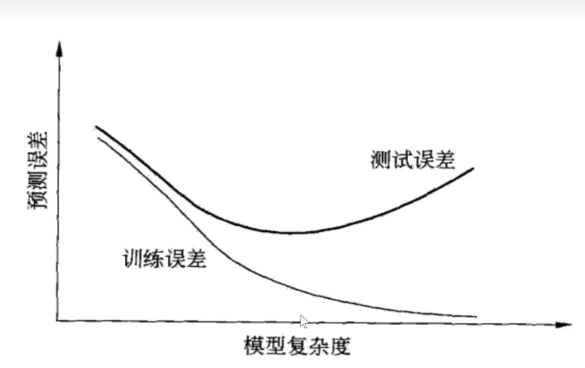

### 正则化处理过拟合

### 交叉验证

重复使用数据，解决数据不足

### 泛化能力

泛化误差上界来确定学习方法的优劣

## 模型的产生

### 生成模型

- 可以反映数据本身的特性

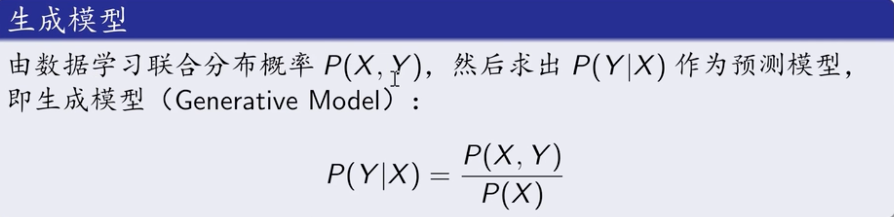

### 判别模型

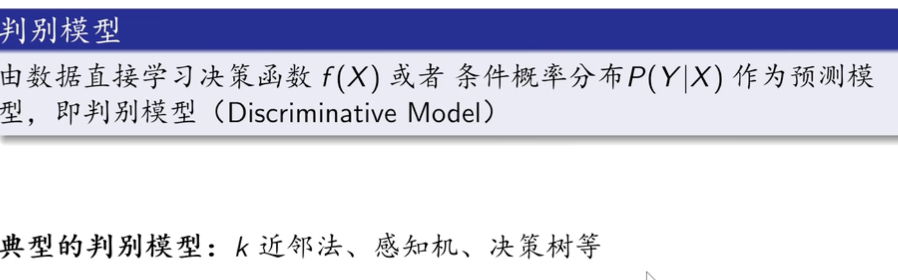

何为决策函数？何为条件概率分布？何为联合概率分布

- 决策函数就是判断是还是不是
- 条件概率分布就是已知某种条件，另一个事件的发生概率是多少。
- 联合概率分布描述了两个或多个随机变量同时发生的概率分布。它涵盖了所有变量的所有可能组合及其对应的概率。（即**联合概率分布会覆盖所有的条件概率分布**）