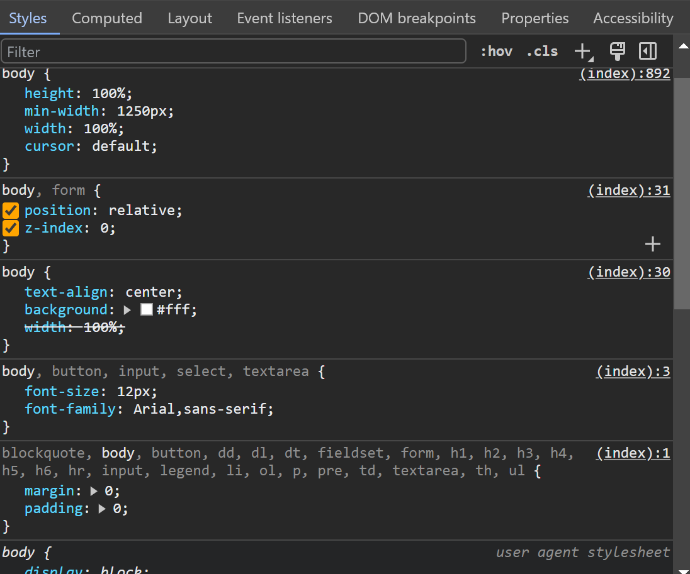
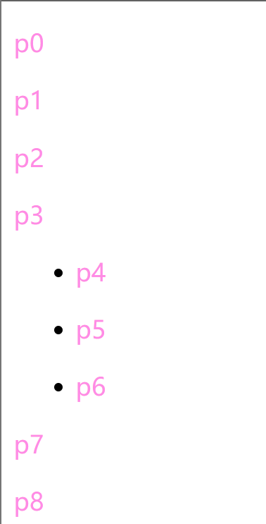
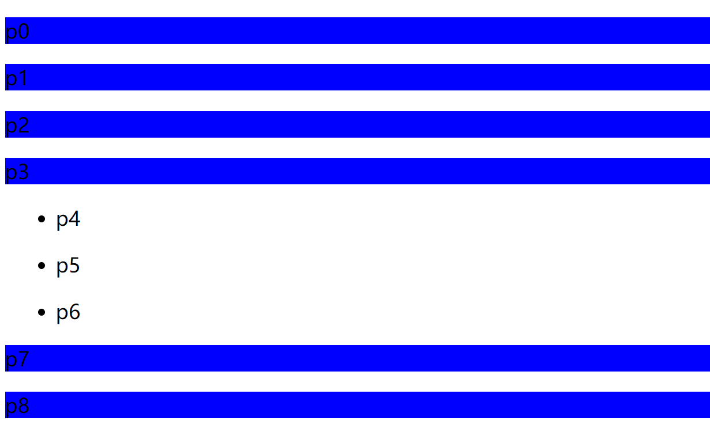
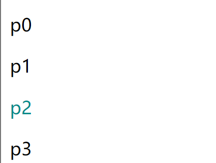
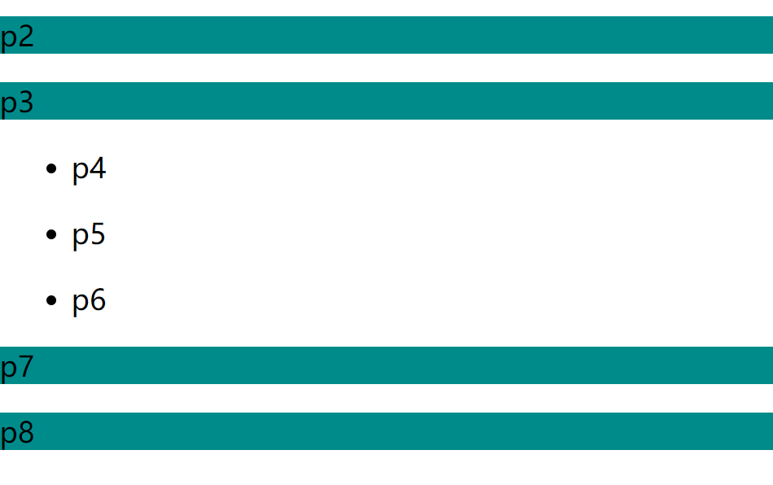
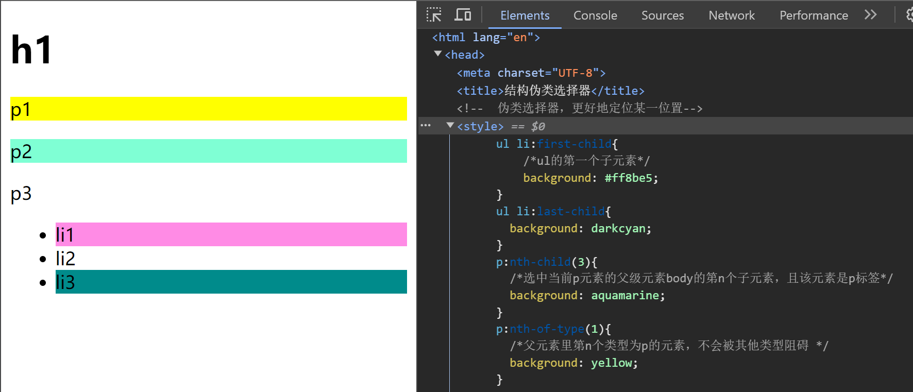
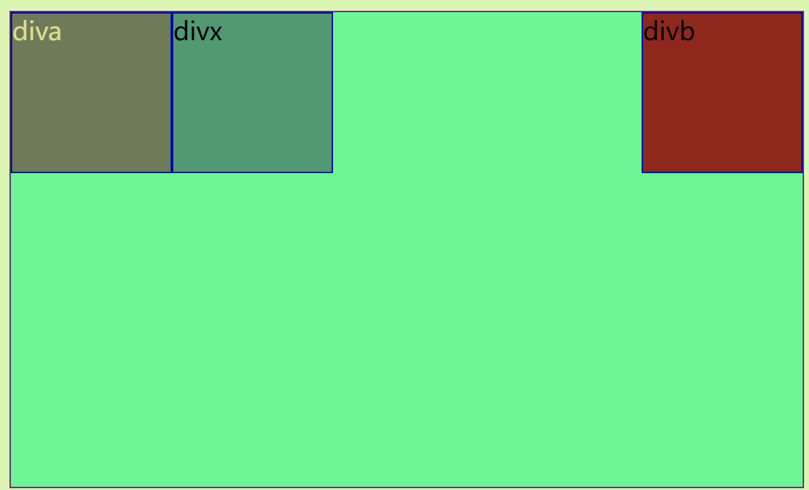
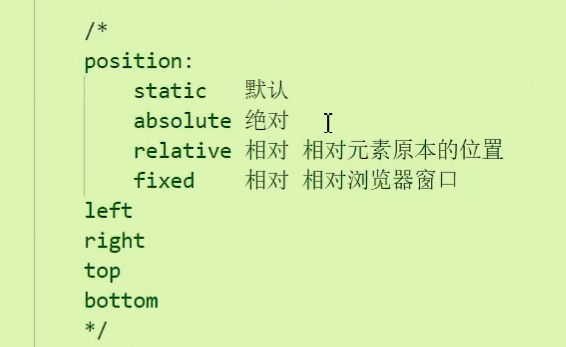
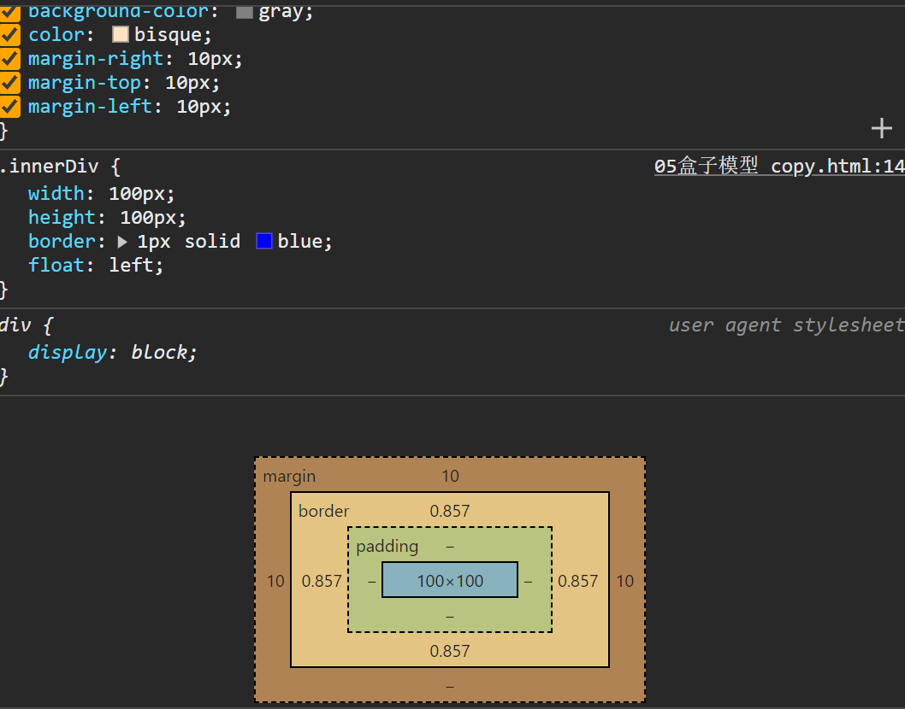
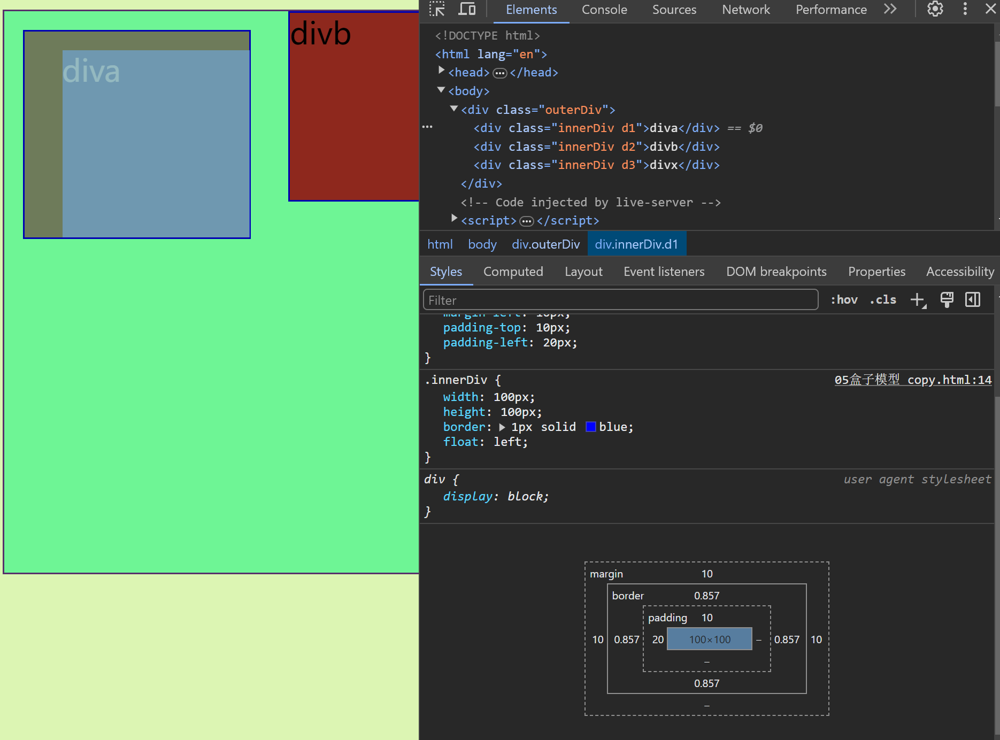

# CSS入门
## 何为CSS
- Cascading Style Sheet 层叠样式表
- CSS作为表现形式出现，（HTML是结构化格式）因为在2.0版本提出的二者分离的观念：  **内容和表现分离**  
- 本入门教程**最重要学习的是选择器**

## 快速入门：
- 一些语法规范：一般css和html文件都是分离的，css有其规范（例如重要的选择器）；二者可以通过link标签进行链接*（外部样式）*
- 分别在html和css中的代码：，如果二者写在一起，css是写在head里面的
```html
<head>
    <meta charset="UTF-8">
    <title>入门练习没有分离</title>

     <!-- style可以编写css的代码，目前是没有分离的
     语法：
        选择器{
          声明1;
          声明2；
        }
        每一个声明最好使用分号结尾
        链接css和html使用link标签，外部引用
     -->
    <link rel="stylesheet" href="css/style.css">
</head>
<body>


<h1>我是标题</h1>

</body>
```
```css
h1{
    color: aquamarine;
}
```
### 四种导入（链接）方式：
- 行内样式、内部样式（在head标签中定义本页面的公共样式）、外部样式（专门写一个css代码，使用link链接）
- 优先级**遵循就近原则**，一般行内样式都是最近的。*后两者看谁在最下面*
- 行内样式复用度低，与HTML代码联合影响文件大小；内部样式只能作用于当前的HTML代码；
```html
<head>
    <meta charset="UTF-8">
    <title>四种导入方式</title>
  <link rel="stylesheet" href="css2.css">
  <!--内部样式 -->
  <style>
    h1{
      color: green;
    }
  </style>

</head>
<body>
<!-- 行内样式，在标签元素中编写一个style属性，编写样式-->
<h1 style="color: blue">我是行内样式</h1>
</body>
```

## 选择器：

- 就是**在网页上如何定位各种元素**
- 语法是`选择器{具体样式设置}`，当然三种选择器前面要加不同符号

### 基本选择器：
1. 标签（元素）选择器：会将所有同名标签进行更改，直接使用标签名即可
2. **类选择器**：多个标签归类，可以复用——*一个元素的class属性值可以有多个值*
3. id选择器：**必须保证全局唯一**，精准定位不影响其他标签，使用#
- 优先级：id》class》标签选择器
```html
<!-- 标签选择器-->
  <style>
    h1{
      color: #ff8be5;
    }
    p{
        font-size: 80px;
    }
  </style>
<!-- 类选择器-->
  <style>
    .aa{
      color: green;
    }
    .bb{
      color: burlywood;
    }

  </style>
</head>
<body>
<h1 class="aa">aa</h1>
<h1 class="bb">bb</h1>
<h1>cc</h1>
<p class="bb">sss</p>
</body>
<!-- id选择器-->
  <style>
    #ji{
      color: #ff8be5;
    }
    #jjL{
      color: blue;
    }
  </style>
</head>
<body>
<h1 id="ji">学java</h1>
<h1 id="jjL">学不会</h1>
<h1 id="jj">再聪明一点</h1>
<h1>记得自我保护</h1>
<p>进厂喽</p>
</body>
```
### 高级选择器：
#### 层次选择器：
- 注意整个HTML的树状层次结构（有的兄弟离得远但结构上依然是兄弟）；目的是选择标签时更加简便快捷
1. 后代选择器：在CSS中的作用是选择*作为某个元素后代的所有指定元素*。这意味着，无论层级深浅，只要是特定父元素内部的元素，它们都会被选中：
2. 子选择器：选择**直接**位于某个元素内部的子元素，而*不考虑更深层的后代元素*：
3. 相邻兄弟：必须相邻在（那个被active的）下面，（p1在代码里被激活了）
4. 通用选择器：对比相邻兄弟选择器更为广泛，在当前激活的标签的下面即可（无需相邻）：

```html
<head>
    <meta charset="UTF-8">
    <title>高级选择器，层次选择</title>
<!--  格式，xxx下面的yy选择器，xxx符号yy-->
  <style>

  /*后代选择器,使用空格隔开 任何在body中的p元素都会被选中*/
      body p{
        color: #ff8be5;
      }
  /*子选择器，使用>符号隔开*/
      body>p{
        background: blue;
      }
  /*相邻兄弟选择器,必须相邻在下面 使用加号*/
  .active + p{
      color: darkcyan;
  }
  /*通用选择器,当前选中元素的向下所有兄弟元素*/

  .active~p{
    background: darkcyan;
  }
  </style>
</head>
<!-- body里面是一个树状结构-->
<body>
<p>p0</p>
<p class="active">p1</p>
<p>p2</p>
<p>p3</p>
<ul>
  <li>
    <p>p4</p>
  </li>
  <li>
    <p>p5</p>
  </li>
  <li>
    <p>p6</p>
  </li>
</ul>
<p>p7</p>
<p>p8</p>
</body>
```

#### 伪类选择器(了解）：
- 概念：它用来选择处于特定状态的元素。伪类可以用来定义元素的特殊状态，比如鼠标悬停时的样式、获得焦点的表单元素、元素的第一个子元素等。伪类选择器在*选择器名称前加冒号（:）来表示。*冒号前面加类名等
- 相应实例：
```html
<head>
    <meta charset="UTF-8">
    <title>结构伪类选择器</title>
<!--  伪类选择器，更好地定位某一位置-->
  <style>

    ul li:first-child{
        /*ul的第一个子元素*/
        background: #ff8be5;
    }
    ul li:last-child{
      background: darkcyan;
    }
    p:nth-child(3){
      /*选中当前p元素的父级元素body的第n个子元素，且该元素是p标签*/
      background: aquamarine;
    }
    p:nth-of-type(1){
      /*父元素里第n个类型为p的元素，不会被其他类型阻碍 */
      background: yellow;
    }
  </style>
</head>
<body>
  <h1>h1</h1>
  <p>p1</p>
  <p>p2</p>
  <p>p3</p>
  <ul>
    <li>li1</li>
    <li>li2</li>
    <li>li3</li>
  </ul>
</body>
```
#### 属性选择器（重要且常用）
- 可以看作是将class 和 id相结合的选择器；用来选择**具有特定属性或属性值的HTML元素**。属性选择器通过方括号（`[]`）来定义，内部包含了要匹配的属性名称和（可选的）值。
- 语法：`元素[属性的正则表达式]{}`
- 正则表达式里面有一些特殊的等号：`*= ^= $=`分别是包含等于，开头等于和结尾等于。
```html
  <style>

    a[id]{
      background: yellow;
    }
    a[id = first]{
      background: green;
    }
    a[class *= links]{
      /*通配等于号*/
      background: #07e910;
    }
  /*  选中href中以http开头的元素*/
    a[href ^= http]{
      /*以xxx开头的等号*/
      background:blueviolet ;
    }
    a[href $= pdf]{
      /*以xxx结尾的等号*/
      background: crimson;
    }
  </style>
```

## 重要样式：

### 浮动样式：

- 元素的样式使元素脱离文档流，即别的元素可以占据他们的位置（以块元素的浮动举例）
- 浮动之后一定不会将文字遮挡；初衷是让多个块元素处于同一行但又不失去块元素宽高等性质

```html
   <style>
        .outerDiv{
            width: 500px;
            height: 300px;
            border: 1px solid rebeccapurple;
            background-color: aquamarine;
        }
        .innerDiv{
            width: 100px;
            height: 100px;
            border: 1px solid blue;
            /* display: inline;inline行内元素 */
        }
        .d1{
            background-color: gray;
            color: bisque;
            float:left;
        }
        .d2{
            background-color: brown;
		   float:right;
        }
        .d3{
            background-color: cadetblue;

        }
    </style>
```



### 布局定位样式：

- 使块元素出现在指定位置，使用`postion`
- 

- 细节：`relative`其他的块元素不会占据原本块元素的位置，而`fixed`会占据

### 盒子模型：

- 即对块元素进行上下左右内外边距的操作，在浏览器中常常显示为这样：

- 中间那个蓝色的100x100的区域是最原始的盒子比如代码里那个`diva`，`padding`是内边距，`border`是加的边框（不会侵占原有的区域），`margin`是外边距
- 注意：**内边距不会向内侵占元素的容量**，只能把边线往外推（注意蓝色区域）：
