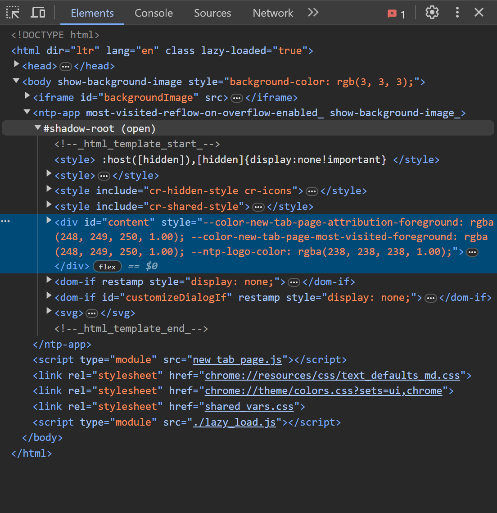
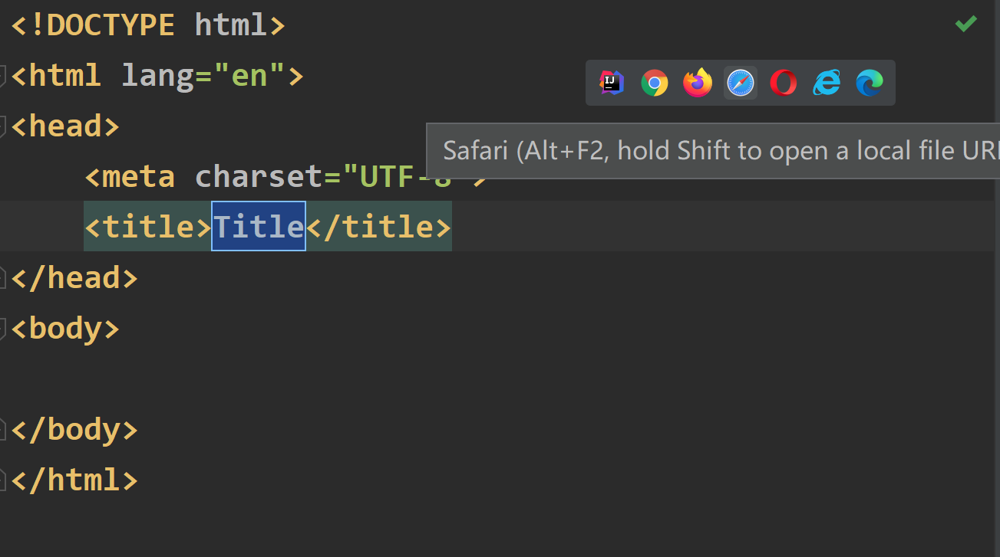
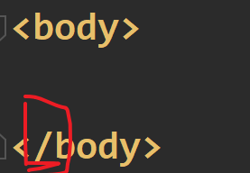
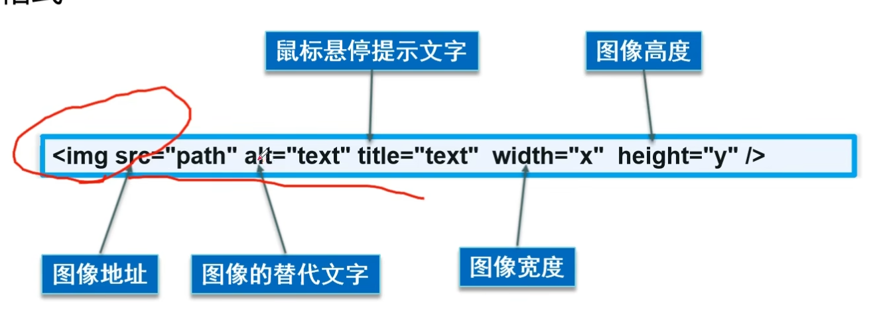
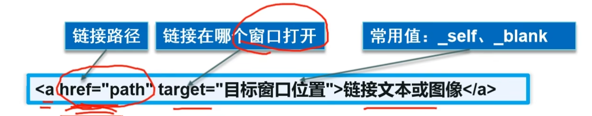
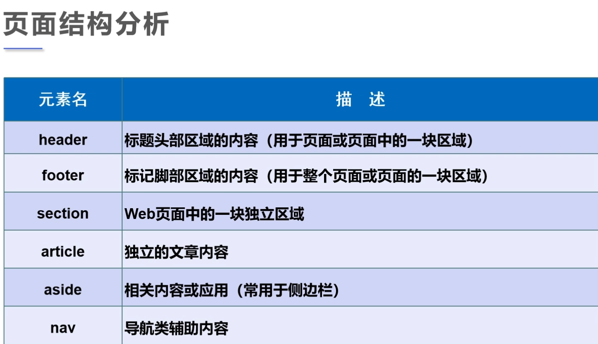
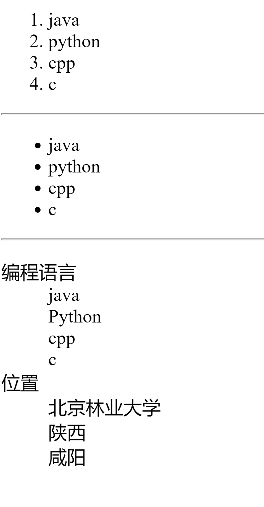
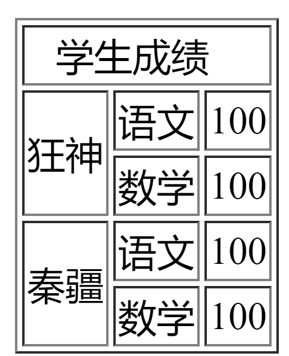

# HTML5教程01
## What is HTML
- Hyper Text Markup Language(超文本标记语言)；由W3C(万维网联盟)管理
- 超文本：文本、视频、图片等等
- 具体浏览器中：
- W3C标准：结构化标准（HTML.XML)、表现标准(CSS)、行为标准(DOM)

### 在IDEA中创建HTML网页
- 新建`HTML file`，右上角会出现可以打开的浏览器：

### HTML的基本结构：
- 标签分类：成对式出现的为*开放标签+闭合标签*，其中/代表着闭合；单个出现的为*自闭和标签*例如`<br/>`
- 举例：
#### 网页基本标签：
- 标题标签`<h1>xxx</h1>`
- 段落标签`<p>xxx</p>`
- 换行标签` <br/>`:与段落标签不同的是，==换行标签的内容通常还是一整段==
- 水平线标签：` <hr/> `:在网页上生成一段水平线
- 字体样式标签：粗体： `<strong>i love u</strong>`
斜体： `<em>i love u</em>`
- 特殊符号标签：例如空格在代码里无论打多少空格都是空一格，需要特殊标签；**格式是**`&xxx;`
```HTML
空&nbsp;&nbsp;&nbsp;&nbsp;格
版权符号 &copy;
```

#### 图像标签：
- img标签并且带上属性：
- 其中==*src和art是必须要有的*==，src推荐使用相对路径，art表示图片加载失败时显示的文字;其他的内容可以自行选择添加
- ` `

#### 链接标签：
- **超链接标签**：可以点击的那些链接，写代码时 a+Tab：
```html
<! --a标签学习
href:必须要填，表示要跳转到哪个页面

target = _blank意味着可以在新的标签页打开,self就在原地打开
-->
<a href="1.MyFirstHTML.html" target="_blank">点击我跳转到页面1</a>
<a href="https://www.google.com" target="_self">点击我跳转到谷歌</a>
<br/>

<! -- 链接可以选择图像（或文本）-->
<a href="1.MyFirstHTML.html">
  
```
-  **锚链接**：设置一个锚标记，然后需要跳转到锚标记。

```html
<! --使用name作为标记名称,虽然没有写href，即没有点击链接-->
<a name="Top">顶部</a>

.....


<a href="#Top">回到顶部</a>
```
- **功能性链接**：邮件链接，qq链接等

```html
<! --功能性链接
邮件链接：mailto
-- >
<a href="mailto:lutao123050104@gmail.com">点击联系我</a>

```
#### 扩充知识：
- 块元素：无论内容多少，只占一行；比如标题标签和段落标签
- 行内元素：一行内不会换行，如粗体斜体等
#### 网页代码具体结构：
- 注释：` <! --xxxx -->`;
- DOCTYPE:告诉浏览器使用什么规范，`<!DOCTYPE html>`(可以删除)
- 

### 列表：
- 分为有序列表、无序列表和自定义列表
- 有序：
```html
<body>
<! --有序列表,order list-->
<ol>
  <li>java</li>
  <li>python</li>
  <li>cpp</li>
  <li>c</li>
</ol>

<hr/>这是分割线
<! --无序列表,注意中间的li是没有变化的-->
<ul>
    <li>java</li>
    <li>python</li>
    <li>cpp</li>
    <li>c</li>

</ul>
<hr/>
<! --自定义列表,dt列表名称，dd列表选项-->
<dl>
    <dt>编程语言</dt>
    <dd>java</dd>
    <dd>Python</dd>
    <dd>cpp</dd>
    <dd>c</dd>

    <dt>位置</dt>
    <dd>北京林业大学</dd>
    <dd>陕西</dd>
    <dd>咸阳</dd>
</dl>
</body>
```
### 表格：
- 举例实现一个表格：
```html
<body>
<! -- 表格table学习
以table起手，border可以设置边框
行 tr
列 td
colspan用来进行跨列，将几列合并成一列
rowspan用来跨行，将几行从上而下合并成几行
-->
<table border="1px">
  <tr>
    <td colspan="3">&nbsp;&nbsp;&nbsp;学生成绩</td>
  </tr>
  <tr>
    <td rowspan="2">狂神</td>
    <td>语文</td>
    <td>100</td>
  </tr>
  <tr>
    <td>数学</td>
    <td>100</td>
  </tr>
  <tr>
    <td rowspan="2">秦疆</td>
    <td>语文</td>
    <td>100</td>
  </tr>
  <tr>
    <td>数学</td>
    <td>100</td>
  </tr>
</table>
</body>
```
### 媒体元素：
```html
<body>
<!--音频和视频
video
audio
controls可以控制视频区域,autoplay可以自动播放
-->
<video src="../Resource/Video/2-2.字符串结束符的那些事儿.ev4" controls autoplay>随便的视频</video>
<audio src="../Resource/audio/不能说的秘密.mp3"controls autoplay>最美的不是下雨天</audio>

</body>
```
### iframe内联框架