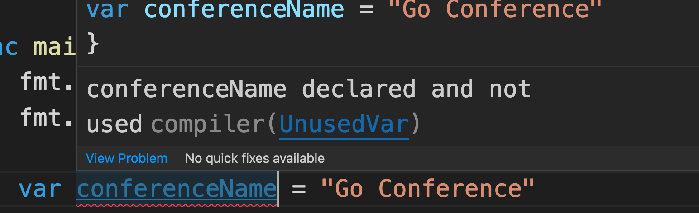

## What Why

### Goal:

Go was designed to run on **multiple cores** and built to support **concurrency(并发)**

Running on scaled,**distributed system and cloud platform**

### Characteristics:

- Using in server platform;Compiled Language;

- Go is organized into the **Packages**,a package is a collection of Go files

## Core

### Module

`go mod init<module path>`creates a new module

### Packages

Go programs are organized into **packages** which are *collections of source files*.

```go
package main

import "fmt" //This is the I/O control package

func main() {
	fmt.Println("Hello world")
}
```

### Rule about var/const



- When you declare a var,Go will notice you that you **must use it,**(This use means apply this var,not just initialize it ) ; As the same using in **import packages**
- But if you use Constants,it won't appear.(**Not allowed to change**)

### Data Type:

Different from Java,Go can imply the datatype based on the value:	

- ` var remainingTickects = 50`

And if you want to define the specific data type:(It's also a little different from Java)

- `var userName string  `Notice that every var has its default value.

If you want to know the type of any var,

- use the `%T` to display it.

For example,you can set the `uint` for any var that just positive.(Pay attention to it,**unint can't minus int**)

A **new way** to initailize a var:

- `userName := "Tom"`The `:=`,this means that a short way to intailize the **local var**,but for *global one*,you can't use it.
- And with using the `:=` you *don't need to declare the type* of the var.Golang will get the type of it.

### Get I/O:

Use the `fmt` package to get the I/O from the user.And in this section,we import a new one:**Pointer.**

Pointer in Golang aslo called a special vairable.

### Arrays & Slices

For **Arrays**,you can just decalre that but not initialize it(It's the normal way we have),such as this:

- `var bookings [50]string`

- The sequence in Go is as same as Java,it means you can't use the var which are not declare yet.

For **Slices**,it is a more dynamic list .We can initialize it without the length,and we can refer the specific area among the arrays.

- `var slice[] string`

### Loop

Different with another languages,Golang just has the only one loop:`for condition {xxx}`,if you want to make *a infinite loop,use no condition.*

- But we can also use `for` to achieve the function of `for each`loop:``
- In that case,we have to use the **'range'**,iterates over the elements for different datastrues.`for index,booking := range bookings{}`(ps,we can use the Filed like the Java's slice to cut the whole string)
- **BlankIdentified（下划线）**:`for _,booking := range bookings`,it ignores a variable you don't want to use and in Golang you should make the unused variable explicit

### Condition if else 

Just as same as the Java,ps,you can combine the condition in swtich parameters.

## Function in Golang

Specially,in Golang,you can return multiple values from a function,and you should make the type of the returning one by one

```go
func CheckTheInformation(firstName string,lastName string,email string,userTickets uint,remainingTickets uint) (bool,bool,bool){
	isValidName := len(firstName) >= 2 && len(lastName) >= 2
	isValidEmail := strings.Contains(email,"@")
	isValidUserTicket := userTickets > 0 && userTickets <= remainingTickets
	return isValidName,isValidEmail,isValidUserTicket
}

isValidName,isValidEmail,isValidUserTicket := CheckTheInformation(firstName,lastName,email,userTickets,remainingTickects)
```

## Package 

### Package Leval variables

Such as the var you decalre in front of the whole JAVA file.(**Package Things**)

- Pay attention,this is not the Global one,you should capitalize it :)

And notice in that way,you can't use the `:=` in this place.(That's a local method to declare vars)

### Among the file

If we ues define the **same package** in two different file,they are in the same package.And the varibales and functions defined out the function can be accessed in all other files(in the same file) 

- Please notice that we should run all the filse you want to run,not just the main.go`go run main.go append.go`
- You can just put the comman method in a common package,and make some another specific packages to handle with the different demands.**Just use the `import`**

#### Export

There are more details you'd know:

- First,you need to import another package you want to use just like this`"booking-app/help" //整个大包名`This former path is something in the `.mod `file
- Then,Use the function in another package,you also need to *explicitly export this function*,**just capitalize the name of the function.** like the `fmt.Println("xxx")`
- You can also export the variables(also capitalize it)

### local-package-Global