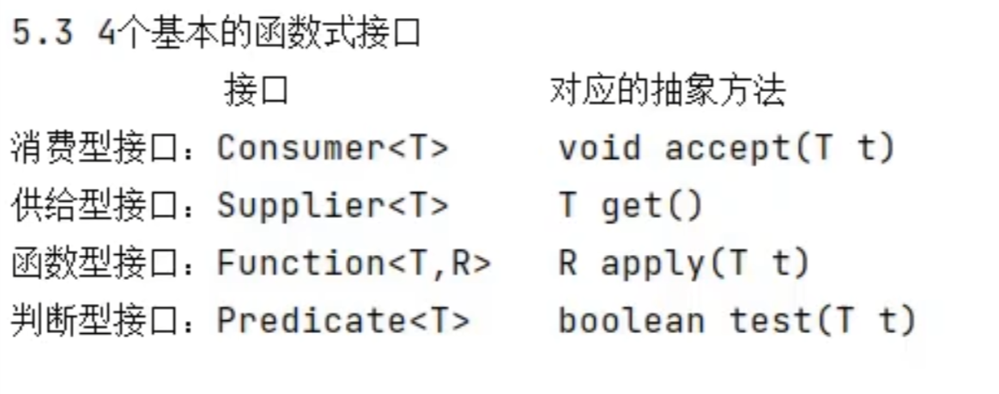
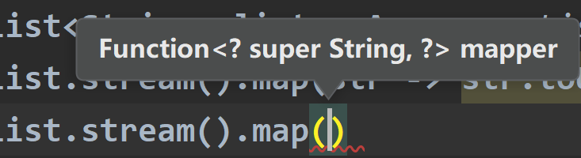
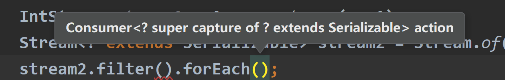

# JDK'sNew C
## JDK8:Lambda
### Lambda作用：
- 提供一种简洁的方式来==实现**只有一个抽象方法**的接口==，这种接口被称为**函数式接口**（Functional Interface）；特别是作用在匿名内部类当中
- lambda表达式作为了接口实例化的**对象**；*等号右边剩下形参列表和方法体，其实就是一个匿名函数* （注意，形参列表和方法体之间有->符号）
### 语法格式：
- -> 箭头用来链接参数和lambda体
1.  无参，无返回值：

```java
Runnable r1 = new Runnable() {
            @Override
            public void run() {
                System.out.println("I love u");
            }
        };

        r1.run();

        System.out.println("********************");
        Runnable r2 = () -> {
            System.out.println("I love u");
        };
```
2. 需要一个参数，无返回值

```java
Consumer<String> con = new Consumer<String>() {
            @Override
            public void accept(String s) {
                System.out.println(s);
            }
        };
        con.accept("xxxx");
        
        Consumer<String> con1 = (String s) ->{
            System.out.println(s);
        };
        con1.accept("xxxxx");
```
3. 数据类型可以省略，因为可以由编译器推断得出

```java
        Consumer<String> con3 = (s) ->{
            System.out.println(s);
        };//因为前面已经有了可以推断出，所以不用声明形参为String
```
4. 如果只有一个参数，参数的小括号可以省略

```java
 Consumer<String> con3 = s ->{
            System.out.println(s);
        };
```
5. 需要两个及以上的参数，有返回值

```java
Comparator<Integer> com1 =(x1,x2) ->{
            return x1.compareTo(x2);
        };
        System.out.println(com1.compare(12,13));
        Comparator<Integer> com2 = (x1,x2) -> x1.comparTo(x2);
```
6. 当lambda体==一条语句时，return与大括号都可以省略掉==

```java
Comparator<Integer> com2 = (x1,x2) -> x1.compareTo(x2);
```
### 四个基本的函数式接口：



## 方法引用：
- 是进一步的lambda表达式，满足一定条件时（如：方法体中必须得只有一条语句），可以使用方法（构造器）引用来代替lambda表达式
- 格式：类（对象） :: 方法名；例如 类 :: 静态方法   对象::实例方法
- 注意最后*使用这个实例化的对象时调用其重写的方法*；==方法引用更关注重写方法的**方法体发生了什么**==
### 情况一对象：
- 对象 :: 实例方法
- 条件：函数式接口中的抽象方法a（外面的方法）与其内部实现时调用的对象的某个方法b的**形参和返回值类型都一致**。可以考虑吧使用方法b对方法a进行一个覆盖和替换。
```java
Supplyer<T> sp = emp :: getName;
```
### 情况二 类静态：
- 类::静态方法
- 与上面几乎相同的条件，只是把对象换成了类，方法换成了静态方法

```java
Function<Double,Long> fun1 = new Function<Double, Long>() {
            @Override
            public Long apply(Double aDouble) {
                return Math.round(aDouble);
            }
        };

        Function<Double,Long> fun2 = Math :: round;
        fun2.apply(2.0);
```
### 情况三  类+实例方法
- 类名::实例方法
- 条件苛刻：抽象方法a与其内部实现时调用的某个方法b的返回值类型相同，a有n个参数，b有n-1个参数。a的第一个参数作为方法b的调用者，后n-1个参数与b的参数类型相同。
- 虽然b是非静态的方法，需要对象调用，但是形式上，写出对象所属的类即可。
```java
BiPredicate<String,String> biPredicate = new BiPredicate<String, String>() {
            @Override
            public boolean test(String s, String s2) {
                return s.equals(s2);
            }
        };
        
        BiPredicate<String,String> biPredicate1 = String::equals;//类名::非静态方法
```
### 构造器引用：

1. 格式：类名::new；
2. 内容：调用了类名中某个确定的构造器，取决于函数式抽象方法的形参列表
3. 举例（无参的）：

```java
Supplier<Employee> sup1 = new Supplier<Employee>(){
	@Override
	public Employee get(){
		return new Employee();
	}
};
//方法引用
Supplier<Employee> sup2 = Employee::new;
//自动会去识别用的类中的那个构造器，因为形参类型已经确定，在泛型括号里面（无参）
```
## StreamApi
### 引入：
- 对于非关系型数据库，我们可以直接在java的数据上做数据的处理（关系数据库如Mysql直接在Mysql数据库那里进行了数据的处理）
- 对比其与集合框架：后者是关注数据的存储，面向内存；前者对于后者存储的数据，进行计算处理，是面向CPU的。
### 注意事项
- Stream**不存储数据**
- 中间操作是==延迟执行==的，等到需要结果时才会去执行
- 一旦某个stream对象调用过终止操作，就不能再进行中间操作了，得新造一个。
- Stream**不会改变源对象（不影响原容器）**，相反会返回一个持有结果的新的stream
### 使用步骤
1. Stream的实例化
2. 一系列的中间操作（*如果没有终止操作，中间操作也不会执行*）
3. 终止操作(一旦要输出了)`forEach()`

#### 实例化：
- 通过集合，使用集合对象.stream()调用

```java
List<Employee> list = EmployeeData.getEmployees();
//返回一个顺序流
Stream<Employee> stream = list.stream();
//返回一个并行流
Stream<Employee> stream1 = list.parallelStream();
```
-  通过数组，使用`Arrays.stream()`调用

```java
Integer[] arr = new Integer[]{1, 2, 3, 4, 5};
        Stream<Integer> stream = Arrays.stream(arr);
        
        int[] arr1 = new int[]{1,2,3};
        IntStream stream1 = Arrays.stream(arr1);
```
-  当数据不再是集合或者数组这样组织起来的时候，使用Stream的of

```java
Stream<? extends Serializable> stream2 = Stream.of(1, 2, 3, 4, 5, "xxx");
```
#### 中间操作：
- **筛选与切片**：注意，`filter`方法所要接收的*参数是一个Predicate类型的函数式接口，而这种函数式接口重写的方法所要返回的是布尔类型*，所以才会有底下方法体进行比较的操作。

```java
//使用filter方法进行过滤(已有的stream对象)
stream.filter(emp -> (emp.getSalary() > 7000))//
//limit操作截断（只呈现前n个数据）
stream.limit(2);
//skip跳过前n个元素
stream.skip(5);
//去重distinct，底层是靠hashcode和equals方法来判断的，所以在类中需要重写
stream.distinct();
```
- **映射**：需要使用`map`方法，接收的抽象方法是apply;可以形象理解，map(左边是原始的东西->右边是你要映射出的东西)
- 

```java
List<String> list = Arrays.asList("aa","bb");
list.stream().map(str -> str.toUpperCase()).forEach(System.out ::println);//变成大写
```

- 排序：

```java
//sorted自然排序（升序）
Integer[] arr = new Integer[]{32,53,532,1,53,2,234}; Arrays.stream(arr).sorted().forEach(System.out::println);
//定制排序sorted（Comparator的lambda表达式）
Arrays.stream(arr).sorted((e1,e2)->e1.compareTo(e2));
```
#### 结束操作：
- **遍历+输出`for each(System.out::println)`**
- 
- 注意：针对集合，从JDK8以后新增了forEach方法`list.forEach(System.out::println)`
- **匹配与查找：**

```java
//allmatch检查是否匹配所有元素,内部接收函数式接口Predicate
list.stream().allmatch(emp -> emp.getAge() > 18).sout;
//anymatch检查至少匹配一个元素
list.stream().anymatch(emp -> emp.getAge() > 18).sout;
//findfirst返回当中的第一个元素

```

- **对流进行再分析：**
```java
//count返回流中的数量
//max(Comparator)返回流中的最大值
```
- **归约**
```java
//reduce(T identity,BinaryOperator b)可以将流中元素结合起来完成一个操作
List<Integer> list = Arrays.asList(1,2,3,4,5,6,7,8,9,10); System.out.println(list.stream().reduce(0, (x1, x2) -> x1 + x2));
//其中binaryOperator是具体这样重写的：
BinaryOperator<Integer> binaryOperator = new BinaryOperator<Integer>() {
            @Override
            public Integer apply(Integer integer, Integer integer2) {
                return null;
            }
 };
```
- **收集**：希望前面对流的操作对源数据产生影响，其实是*将流的结果给到一个新的集合*

```java
//使用collect(Collectors.tolist)
```