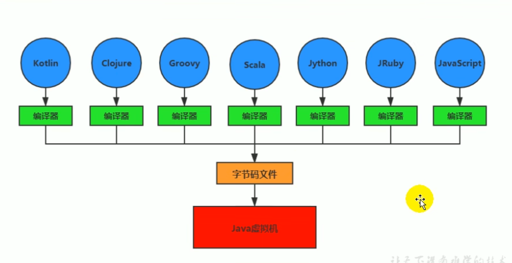
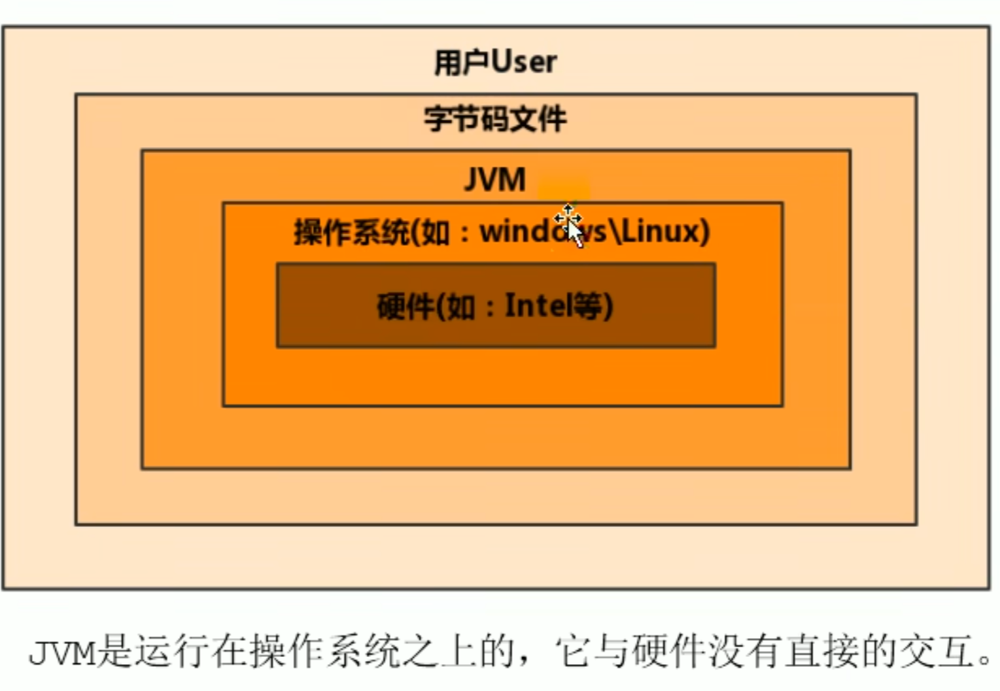
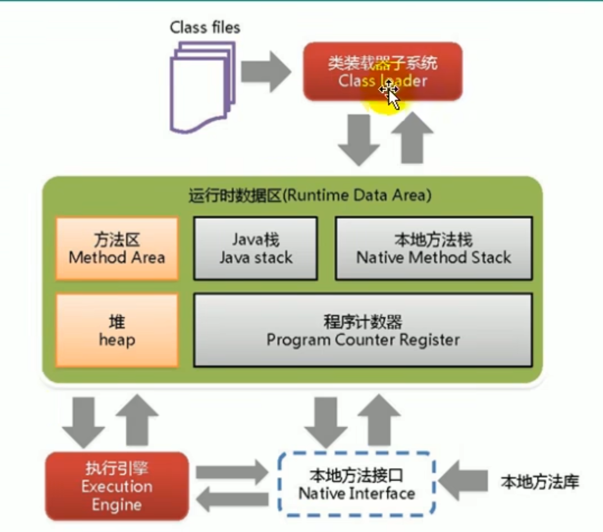
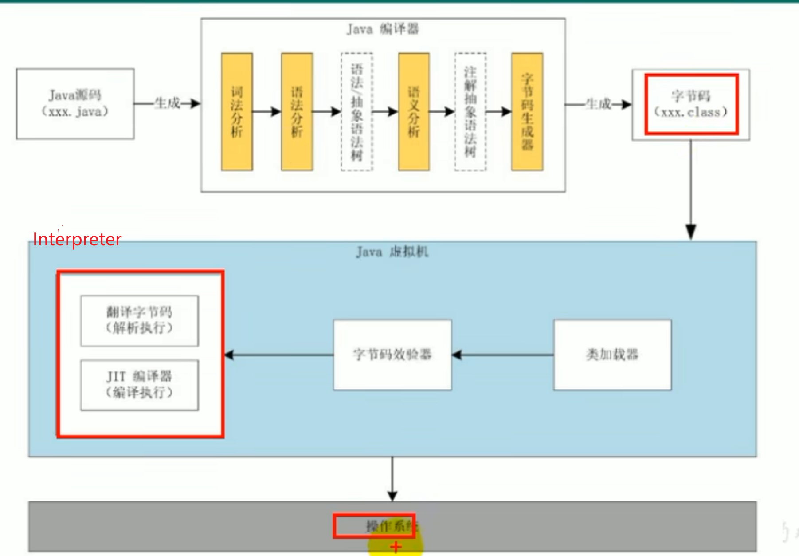
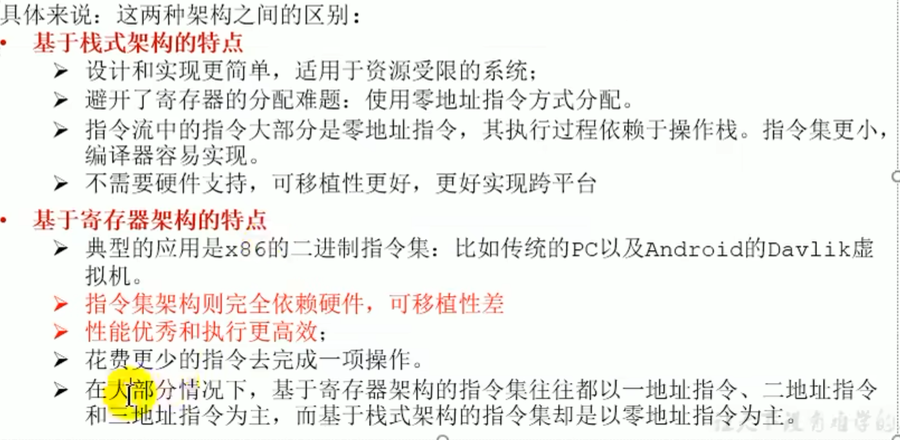
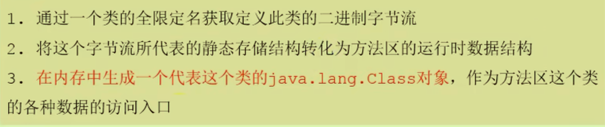

# 01JVM教程第一章
## JVM概述
### 跨语言的平台：
- 只要遵循Java虚拟机的要求，就可以使用JVM来进行运行字节码文件
- 并不要求必须是JAVA编译得到的字节码文件：
- 一次编译，到处运行
### 何为虚拟机：
- 本质上还是一个软件，分为系统虚拟机和程序虚拟机；Ubantu就是系统虚拟机（完全仿真计算机），而JVM就是程序虚拟机（仿真某个程序），运行在操作系统之上。
- 
- 字节码（二进制）》》JVM 》》结果；JDK 》JRE》JVM
- 可以理解为*在JVM之前是“前端”，在JVM之后是“后端”*

### JVM的整体结构：
- 大体上结构：

- Java代码执行流程：执行引擎即下图中红框部分；会有“前后端”的二次编译，第一次编译成字节码文件，第二次编译成机器指令（JIT编译器）

### JVM的架构模型：
- Java编译器**通常都是基于栈的架构模型**
- 基于栈指令更短，但是指令数目更多；基于寄存器的指令更长，但是指令数目少
- 

## JVM生命周期

- 虚拟机的启动（有很多类要加载，最初是创建一个初始类）
- 虚拟机的执行：虚拟机的任务就是执行Java程序——执行一个进程
- 虚拟机的结束

HotSpot\JRocket\J9

### 解释器和JIT

解释器**逐行解释**字节码为机器码。JIT先将字节码编译为机器码再执行。（JIT一般只做用于热点代码）

# 02类加载子系统

## 类加载过程

意为JVM处理`xxx.class`文件的过程（xxx.java文件被编译而来的文件）

### 1、Loading

### 2、Linking

- 验证：所有合法的字节码文件二进制开头都是CA FE BA BE
- 准备：

- 解析：

### 3、Initailizing

