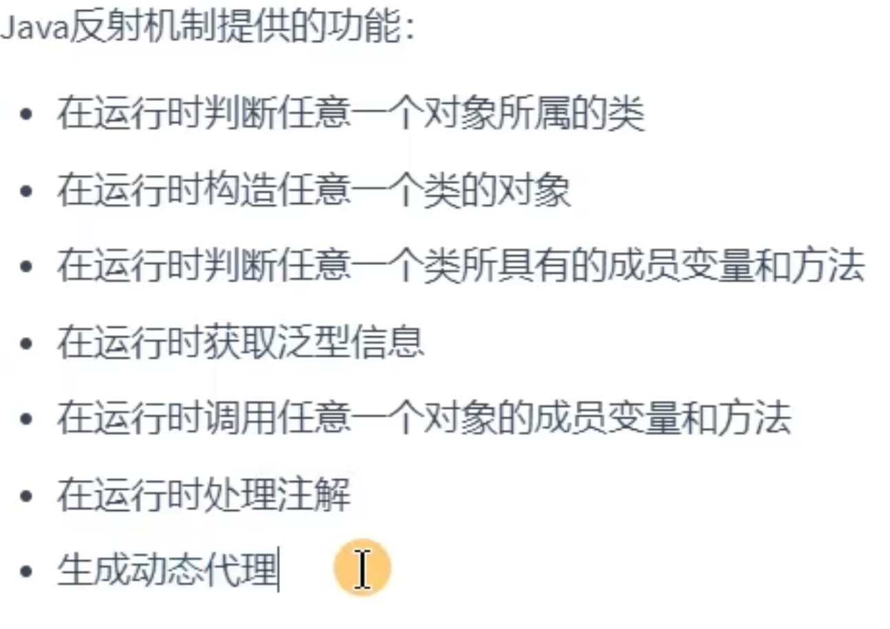
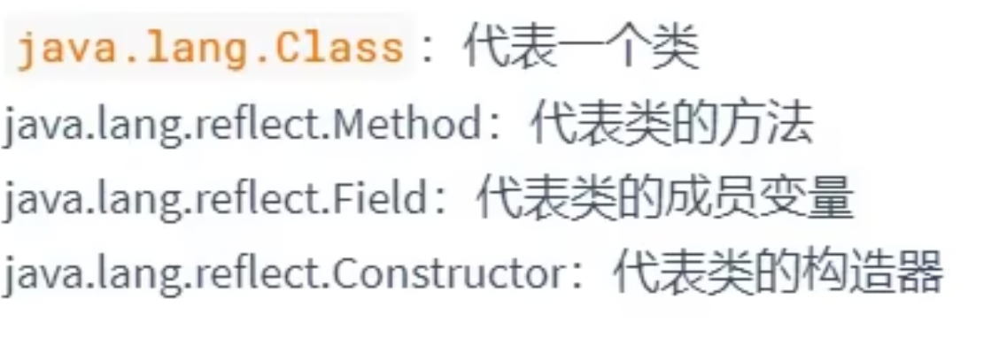

# 反射
##概念
- 动态语言的关键所在，允许在运行期间借助Reflection API获得任何类的内部信息（一种新的造对象，调方法的方式）
- 例如多态时由于编译类型左边（通常都是父类）我们不能直接调用运行类型（实际类型）的属性，所以引出反射，可以动态地识别对象的实际类型。
- ==反射可以绕过多态，直接访问和操作对象的实际类型和数据==。
- 通常使用在**框架**当中（*灵活动态*）
- 封装表示的是是否建议使用、反射体现的是是否能够使用

###作用：



##举例
###基础调用



```java
package com.ltx.reflection.Test;

import org.junit.Test;

import java.lang.reflect.Constructor;
import java.lang.reflect.Field;
import java.lang.reflect.Method;

/**
 * ClassName: ReflectionTest
 * Package:com.ltx.reflection.Test
 * Description:使用反射，可以调用运行时类的任意属性方法，开发中不经常使用反射
 *
 * @author LTX
 * @version 炼气期
 * @Create 2023/10/30 10:58
 */
public class ReflectionTest {
    @Test
    public void test1() throws Exception{
        Class<Person01> clazz = Person01.class;
        Person01 person01 = clazz.newInstance();//Instance只能用空参的构造器

        //反射调属性
        Field age = clazz.getField("age");
        age.set(person01,10);
        System.out.println(age.get(person01));
        //反射调方法
        Method show = clazz.getMethod("show");
        show.invoke(person01);
    }
    //对于类的私有结构，通过反射的方式进行调用
    @Test
    public void test2() throws Exception{
        //私有构造器
        Class<Person01> clazz = Person01.class;
        Constructor<Person01> cons = clazz.getDeclaredConstructor(String.class, int.class);
        cons.setAccessible(true);//设置使得可以访问私有的构造器
        Person01 tom = cons.newInstance("Tom", 12);
        System.out.println(tom);
        //私有属性
        Field name = clazz.getDeclaredField("name");
        name.setAccessible(true);
        name.set(tom,"Jerry");
        System.out.println(name.get(tom));
        //
    }
}

```
##关于Class的理解(反射的源头)

- 可以理解为==类的类==。

###java编译
- 写好的java程序经过编译形成字节码文件，字节码文件经过解释进行运行。在解释过程中其字节码文件(经过类的加载器）在内存中以`xxx.class`的形式存在。（存放在方法区）
- 这些**在内存中的**字节码文件都是Class类的实例：`Class clazz = Person.class`（还有可能是接口）

```java
//得到这些实例：
//1调用运行时类的静态属性：class
        Class clazz = Person01.class;
//2调用运行时类的对象的getclass方法
        Person01 p1 = new Person01();
        Class clazz1 = p1.getClass();

//3调用Class类中的forName方法;最常用
        String name = "com.ltx.reflection.Test.Person01";
        Class<?> clazz2 = Class.forName(name);

//4调用类的加载器
Class<?> clazz3 =ClassLoader.getSystemClassLoader().loadClass("com.ltx.reflection.Test.Person01");
        
```
###类的加载器
- 负责类的加载，应用于每一个类的实例
- 分为两类：（区别在于前者用c构建，后者使用java构建）
	1. BootstrapClassLoader（引导类加载器）:负责加载核心库，所以不能使用java代码获得其实例对象
	2. 继承于ClassLoader的加载器：AppClassLoader\ExtensionClassLoader\用户自定义类加载器（对于同一个类可以加载多个）
- 使用`getClassLoader`可以获得谁加载了此类

####使用类的加载器
- 读取属性文件

```java
 public void test3() throws IOException {
        Properties properties = new Properties();
        //通过类的加载器读到属性文件，默认路径为当前src里面的
        InputStream stream =        ClassLoader.getSystemClassLoader().getResourceAsStream("info1.properties");
        properties.load(stream);
        String name = properties.getProperty("name");
        String number = properties.getProperty("number");
        System.out.println(name + " " + number);
    }
}
```
## 反射的应用
###创建运行时类的对象
- 通过Class的实例的`getInstance`方法，但有两个条件：
	1. 要求运行时类提供空参构造器
	2. 空参构造器的权限要足够
```java
public void test1(){
		Class clazz = Person.class;
		//创建Person类的实例
		Person p1 = (Person) clazz.getInstance();
}
```
- 在新的JDK版本中，调用新的方法：通过Constructor类调用`newInstance（）`（其实是在调用构造器）

###获取运行时类的内部结构：

```java
public void test4(){
  //获得父类
	Class clazz = Class.forName("里面填类名，通常是带有包名");
	Class superClass = clazz.getSuperClass();
	//获得带泛型的父类
	Class clazz = Class.forName("里面填类名，通常是带有包名");
	Class superClass = clazz.getGenericSuperClass();
	//获取运行时类的接口
	Class[] interfaces = clazz.getInterfaces();//注意接口用数组接收，因为接口可能有多个
	//获取所在的包
	Class pack = clazz.getPackage;
	//
}
```
###调用指定的内容：（更重要）
####指定属性：
- 调用指定的属性三步通用步骤
```java
//先获取运行时类的对象:clazz是运行时类，per是其对象
//获取对象的属性：
Field ageField = clazz.getField("age");
//设置属性的值
ageField.set(per,2);//以上操作是基于age为public

//无论权限如何都能取得到：使用getDeclaredField
//1获取运行时类的实例的指定名称的属性：
Field nameField = clazz.getDeclaredField("name");
//2确保属性可以访问
nameField.setAccessible(true);
//3可进行set和get
nameField.set(per,"Tom");
- 注意静态属性要传类名
```
####指定方法

```java
//1调用方法，创造方法实例
Method showNationMethod = clazz.getDeclaredMethod(name:"showNation",String.class,int.class);//这里的参数即为Nation方法中的形参
//2设置权限
showNationMethod.setAccessible(true);
//3方法实例 使用invoke方法，invoke的返回值即为对应方法的返回值。如果原方法为void，则返回值为null
showNationMethod.invoke(per,"CHN",10);
```
####指定构造器
- 注意，既然调用构造器，*刚开始不需要进行实例化对象*。调出构造器后再去实例化对象
```java
//1获取指定参数的构造器
Constructor constructor = clazz.getDeclaredConstructor(String.class,int.class);
//2权限
constructor.setAccessible(true);
//3调用newInstance返回一个运行时类的实例
Person per = (Person) constructor.newInstance("R",10);
```
###获取指定的注解

##框架中用体现动态性
- 其实就是别把类名方法名写死，在使用反射调用运行时类的时候可以让用户自己去选择调用其中的哪些
- 实际上这些参数都是开发时别的地方传过来的，而其余部分如调用方法什么的都是已经写好在框架里面的
1. 返回一个未知类名的对象

```java
//类名为className，调用此方法时传入
public <T> T getInstance(String className) throws Exception{
	Class clazz = Class.forName(className);
	//获得对应运行时类的构造器
	Constructor con = clazz.getDeclaredConstructor();
	con.setAccessible(true);
	
	return (T) con.newInstance();//返回T类型的对象
}
```