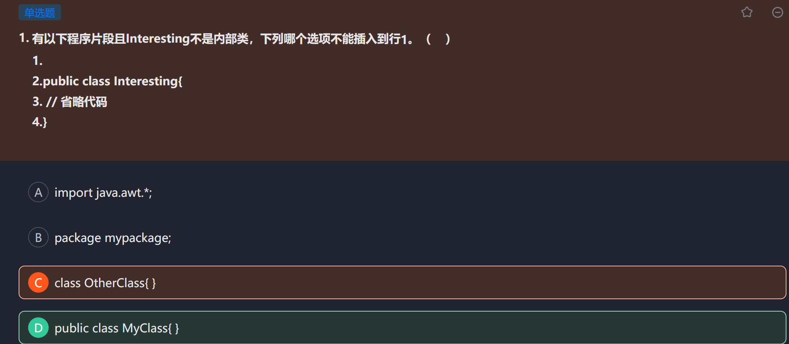
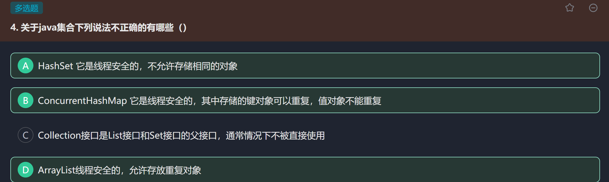
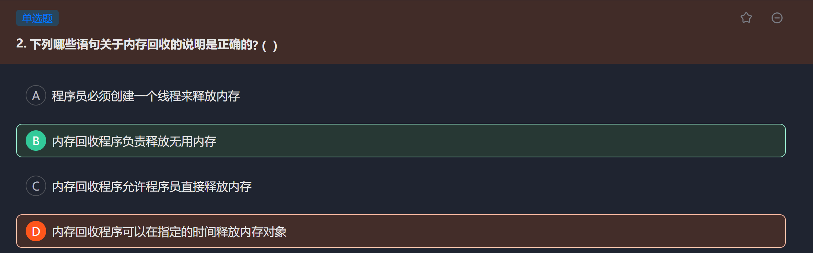
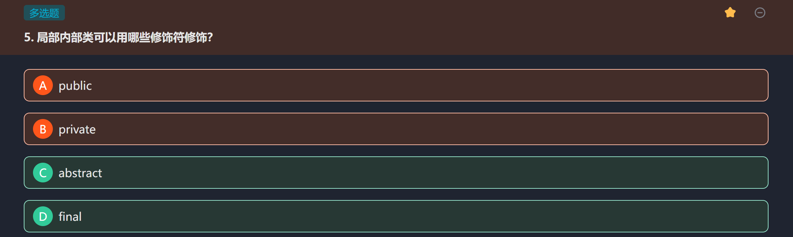

# 牛客测试
## 11.4
### 类的加载顺序
- 观察下面代码的输出结果是什么：（知识点：类的加载顺序，多态的动态绑定）
```java
public class ClassOrderTest1 {
    public static void main(String[] args) {
        Base b = new Base.Sub();
    }
}
class Base{
    private String baseName = "base";
    public Base(){
        callName();
    }
    public void callName(){
        System.out.println(baseName);
    }
    static class Sub extends Base{
        private String baseName = "sub";
        public void callName(){
            System.out.println(baseName);
        }
    }
}
```
- 类的加载顺序：
	1. 先加载父类的静态属性和静态方法，再去加载子类的静态（按照在类中的出现顺序）
	2. 加载父类的实例变量和实例方法。
	3. 这里，==**先加载父类的构造器**==
	4. 再加载子类的实例
	5. 最后加载子类的构造器。
- 动态绑定：它确保了无论对象的声明类型如何，都会执行实际对象类型的覆盖方法；当你调用一个被子类覆盖的方法时，即使这个调用是在父类的构造函数中进行的，实际执行的也是子类的版本。
- 所以本题在使用多态创建对象时，先去加载父类的静态（无），再去加载子类的静态（无）；初始化父类的实例变量即`baseName`，先为null，后赋值为`base`，再去调用父类的构造器，构造器中调用`callName`方法，由于**动态绑定**机制，此时的`callName`方法会去==执行运行时类已经重写==的`callName`方法；但是此时子类的实例变量还未被赋值，依然是默认值null，所以执行此方法时会打印`null`。最后子类的实例变量才被初始化为`sub`。

### 匿名内部类
- 复习格式：	`new 父类构造器名（）| 接口名称{内部类体}`
- 匿名内部类必须继承一个类或者实现某个接口
- 因为匿名，所以内部类体不能有构造器（都没名字怎么去创建呢），也不能有静态（没名字，无法调用）

## 11.5
### 类的基础知识
- 题目要求：

- 由于Java要求一个class程序中只能有一个**外部的public类**，（如果作为内部类可以有很多public）

### 集合的相关知识复习
- 题目要求：

- `Hashset`属于set，set类似**集合**。*不能重复，不保证有序*（所以List可以重复有顺序）

- **基本上我们平常用到的都是非线程安全的集合类**，因为要使线程安全，是要加锁来实现的，势必造成性能降低。如`hashset、hashmap、arraylist、linkedlist、treemap、treeset、stringbulider`等。   像`stringbuhffer、vector、hashtable`这些都是专用于多线程的，再者以`concurrent`（意为：同时发生的）为前缀的集合类大多是线程安全的。

### 释放内存：
- 

- 对于A，Java会自动创建垃圾回收线程；对于C，程序员调用`System.gc()`只是提醒系统释放内存，但JVM不一定回收；对于D，不可以指定时间释放。

### 局部内部类
- 
- 首先得将其与*成员内部类*区分开，前者在方法或代码块中定义，后者在外部类中定义；相关知识点在基础的第四章里