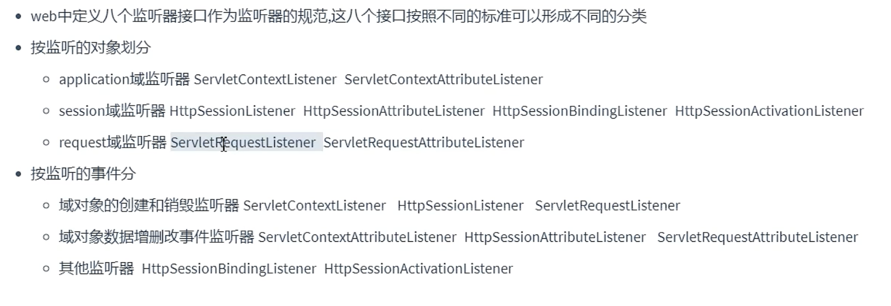

# 会话管理

## Cookie

客户端会话技术，由服务端产生，暂存于浏览器的一小份数据。每次访问服务端都会携带。

### 从服务端角度

创建cookie、发送cookie给客户端

```java
    protected void service(HttpServletRequest req, HttpServletResponse resp) throws ServletException, IOException {
        //创建cookie
        Cookie cookieA = new Cookie("keyA","valueA");
        Cookie cookieB = new Cookie("keyB","valueB");
        //将cookie放入response对象
        resp.addCookie(cookieA);
        resp.addCookie(cookieB);
    }

```


从请求中得到cookie

```java
    protected void service(HttpServletRequest req, HttpServletResponse resp) throws ServletException, IOException {
        //获取请求中携带的cookie
        Cookie[] cookies = req.getCookies();
        if (cookies != null){
            for (Cookie cookie : cookies) {
                System.out.println(cookie.getName()+"-" + cookie.getValue());
            }
        }
    }
}
```

### 时效性

会话级cookie

保存在浏览器内存中，浏览器关闭即消失。

持久级cookie

利用cookie的api设置`cookie.setMaxAge(60*5)`

### 提交路径

访问不同资源携带不同的cookie，使用`setpath`api实现。

## Session

服务器为每个用户开辟一块空间保存信息即Session对象，**每个不同的Session对象代表着不同的会话。**


session的API有`setAttribute`和`getAttribute`等

### 时效性

默认保留30min（两次使用同一session的间隔不超过30min）可以在web.xml中修改

## 三大域对象

### 

`HttpServletRequest->HttpSession->ServletContext`,域对象的最大特点是既能存储又能转发。

一次请求——一次会话（有cookie标识会话）——一次应用（项目重构会重新开启应用）


### 域对象的API

三个域对象通用。


（我有一个疑问同一个包里不同的servlet类到底为什么能够相互通信）

### 域对象存储的数据

- 请求转发时，请求域可以传递数据，存放**本次请求**业务有关的数据
- 会话域一般放本次会话**客户端有关的数据**
- 同一app，不同客户端，应用域可以传递数据：存放本程序应用有关的数据。

```java
    protected void service(HttpServletRequest req, HttpServletResponse resp) throws ServletException, IOException {
        //向请求域存储
        req.setAttribute("request","requestMessage");
        //会话
        HttpSession session = req.getSession();
        session.setAttribute("session","sessionMessage");
        //应用
        ServletContext application = getServletContext();
        application.setAttribute("application","applicationMessage");
    }


    protected void service(HttpServletRequest req, HttpServletResponse resp) throws ServletException, IOException {
        //从三大域中取出数据
        String reqMessage = (String)req.getAttribute("request");
        System.out.println(reqMessage);

        HttpSession session = req.getSession();
        String sessionMessage =  (String)session.getAttribute("session");
        System.out.println(sessionMessage);

        ServletContext application = getServletContext();
        String appMessage = (String) application.getAttribute("application");
        System.out.println(appMessage);
    }

```

# 过滤器

对**请求进行过滤**。

## 使用

### 日志记录过滤器

1、实现Filter接口

- 来自于Servlet下的Filter，小心选择错误。

2、重写过滤方法

其中还包含三个功能

```java
    public void doFilter(ServletRequest servletRequest, ServletResponse servletResponse, FilterChain filterChain) throws IOException, ServletException {
        //到达之前的控制判断代码（可以加一些功能代码）
        System.out.println("loggingFilter before doFilter invoked");
        //放行代码,其中存在着过滤器链
        filterChain.doFilter(servletRequest,servletResponse);
        //响应之前的功能代码
        System.out.println("logging after filterChain.doFilter invoked");

    }
```


3、配置过滤器

在web.xml中配置相关路径信息

```xml
    <filter>
        <filter-name>loggingFilter</filter-name>
        <filter-class>com.ltx.filter.loginFilter</filter-class>
    </filter>
<!--    配置过滤资源规则-->
    <filter-mapping>
        <filter-name>loggingFilter</filter-name>
<!--        url-pattern or servlet name两种过滤规则
            一个mapping中可以同时存在多个过滤规则-->
        <url-pattern>/</url-pattern>
        <servlet-name>servlet1</servlet-name>
    </filter-mapping>
```

## 生命周期

1、构造

2、初始化

3、过滤

4、销毁

## 过滤器链

多个过滤器生成过滤器链，会自动产生。


如何确定多个Filter的**执行顺序**（排列顺序）呢？

- 在web.xml配置过滤器配置信息时，由`filter-mapping`标签来确定。
- 在过滤器本身设置注解`@WebFilter()`时根据Filter的类名顺序（命名）

## 注解方式配置过滤器

```java
@WebFilter(
	filterName = "loggingFilter"
  initParams ={@WebInitParam(name="dateTimePattern",value="yyyy-MM-dd")}
  urlPatterns = {"/servletA","*.html"}
  servletNames = {"servletBName"}
)
```

# 监听器

监听域对象发生的事件，触发相应的代码（**实现相关的监听器接口**即可）



```java
@WebListener
public class MyapplicationListenner implements ServletContextListener, ServletContextAttributeListener {
    @Override
    public void contextInitialized(ServletContextEvent sce) {
        //
        System.out.println(sce.getServletContext().hashCode()+"xxx应用域被初始化");
    }

    @Override
    public void contextDestroyed(ServletContextEvent sce) {
        System.out.println(sce.getServletContext().hashCode()+"xxx应用域被销毁了");
    }

    @Override
    public void attributeAdded(ServletContextAttributeEvent scae) {
        ServletContext application = scae.getServletContext();
        String key = scae.getName();
        Object value = scae.getValue();
        System.out.println(application.hashCode() + "应用域增加了" +key+":" + value);
    }

    @Override
    public void attributeRemoved(ServletContextAttributeEvent scae) {
        //移除了数据
    }

    @Override
    public void attributeReplaced(ServletContextAttributeEvent scae) {
        //替换数据
        ServletContext application = scae.getServletContext();
        String key = scae.getName();
        Object value = scae.getValue();//这里获取的是旧的值
        Object valueNew = application.getAttribute("keyA");
        System.out.println(application.hashCode() + "应用域增加了" +key+":" + value);
    }
}
//并且在xml文件中配置listener标签路径
```

- 注意session的时机是需要自己创建销毁的，应用域项目一旦部署就有，请求一旦发出请求自动就有。
- session在服务器上会有很多，为了不浪费内存，可以将一些session通过IO放入磁盘中，称为钝化（活化）。