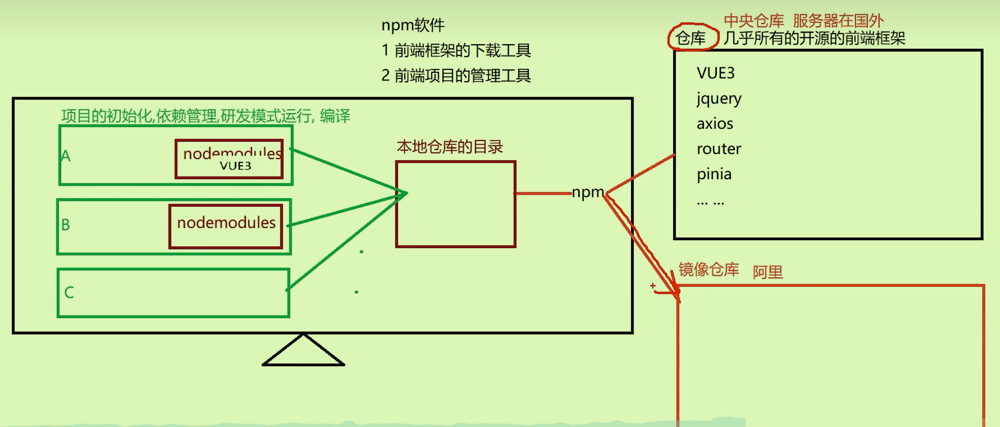
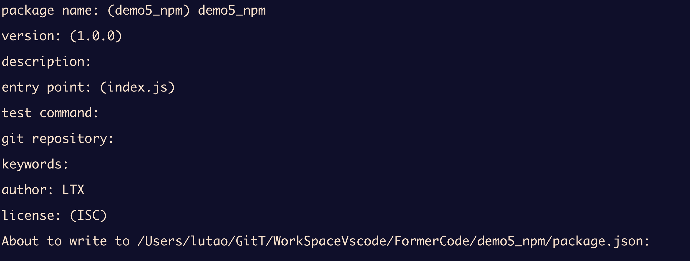
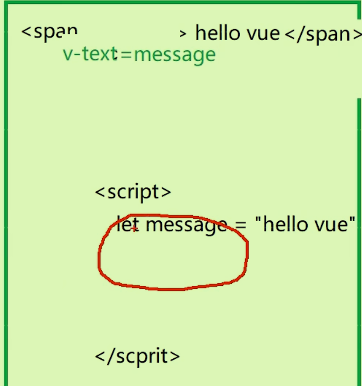
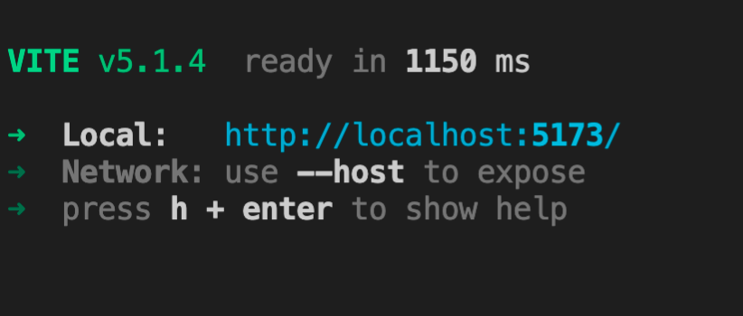
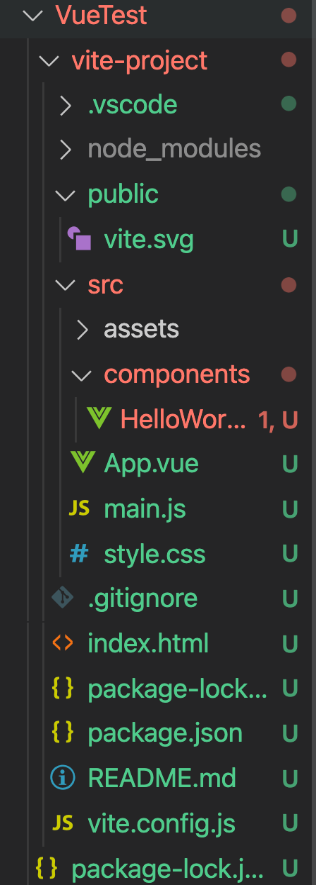
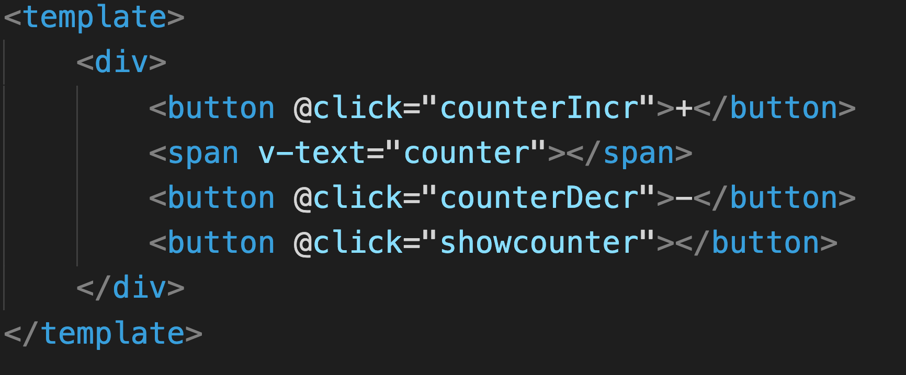

# 前端工程化

后端使用Maven管理的jar文件，无法管理前端框架的文件；原本前后端在一个app中，现在**将二者独立为两个app**即前端工程化。

前后端分离模式

- 开发分离
- 部署分离

## ES6（JavaScript的一个重要版本）

HTML 是网页的骨架，CSS 是网页的皮肤，JavaScript 是网页的肌肉，而ES6则是强化了JavaScript能力的一系列先进技术和语法糖。在前端开发中，这三种技术紧密协作，共同构建出现代的、互动的网页和应用。

### let、const代替var

```html
        //使用let和const来代替var声明变量
        //1 let不能重复声明
        let j = 10
        //2 let有块级作用域，只能在花括号里面访问
        {
            let j = 10
            console.log(j)
        }
        //3 let不会进行预解析变量提升
        console.log(a)
        var a = 10
        console.log(i)
        let i = 10
        //4 let定义的全局变量不会作为window的属性
        var a = 10
        console.log(window.a)

        let b = 10
        //5 let在es6中推荐使用
        //6 const 就是不可修改的let，类似于final修饰的变量
        let a = 10
        a = 20
```


### 模板字符串

解决字符串换行和拼接问题,**使用``和${}符号联用**，可以不用双引号

```html
        let city = '北京'
        let str = `    <ul>
                    <li></li>
                    <li></li>
                    <li>${city}</li>
                    <li></li>
                    <li></li>
                </ul>`
        console.log(str)
```

### 解构表达式

 ```html	
         let arr = [11,22,33,44]
         console.log(arr[0])
         //使用解构表达式取出数组元素
         let[a,b,c,d,e = 10] = arr
         console.log(a,b,c,d,e)
 
         //
         let person= {
             name:"zz",
             age:10
         }
         //使用解构表达式获取对象属性值
         //直接为name,age变量赋值，从person中取；必须同名变量
         let{name,age} = person
         console.log(age,name)
 
         //解构表达式在方法的参数列表应用
         function showArr([a,b,c]){//这里参数直接使用了列表而不是数组arr
             console.log(a,b,c)
         }
         showArr(arr)
 ```

### 箭头函数

与Java中的Lambda表达式类似

```html
    <script>
        let fun1= function(){}
        let fun2 = ()=>{} //使用箭头函数声明函数
        let fun3 = (x) =>{ return x + 1}
        //如果参数列表有且只有一个参数，小括号可以省略
        let fun4 = x =>{return x + 2}
        //如果方法体只有一行代码，花括号也可以省略
        let fun5 = x => console.log(x)
        //如果这行代码只有return则可以连return都可以省略
        let fun6 = x => x + 3

        //箭头函数没有自己的this，其this是外层上下文环境中的this
        let person = {
            name:'张三',
            showName:function (){
                console.log(this.name)
            },
            viewName: ()=>{
                console.log(this.name)
            }
        }
        person.showName()
        

    </script>
```

### rest和spread语法

就是用...来进行特殊处理；

- rest用在形参
- spread用在实参、合并数组、合并对象

```html
    <script>
        //rest解决剩余的参数接收问题:...arr 当作形参使用
        let fun1 = (a,b,c,d,... arr)=>{//在方法体内部arr当作数组使用
            console.log(a,b,c,d)
            console.log(arr)
        }
        fun1(1,2,3,4,5,6,7,8,9)
        
        //spread 展开， rest在实参上使用
        let arr = [1,2,3]
        let fun2 = (a,b,c)=>{
            console.log(a,b,c)
        }
        fun1(...arr)//相当于将arr展开以1,2,3的形式分别赋给参数

        //spread快速合并数组，对象
        let a = [1,2,3]
        let b = [4,5,6]
        let c = [...a,...b]//相当于[1,2,3,4,5,6]

        let person1={name:"张三"}
        let person2={age:"10"}
        let person3={gender:"boy"}
        let person4 = {...person1,...person2,...person3}
    </script>
```

### 对象的创建语法糖

es6更加接近面向对象的语法（语法糖）

```html
    <script>
        class Person{
            name;//使用#代替private，并且完整属性名是#name，而不是单纯的name
            age;
            //getter setter
            get Getname(){
                return this.name
            }
            set Setname(name){
                this.name = name
            }
            //实例方法
            eat(food){
                console.log(`${this.age} 岁的${this.name}`)
            }
            //静态方法
            static sum(a,b){
                return a + b
            }
            //构造器
            constructor(name,age){
                this.name = name;
                this.age = age;
            }
        }
        class Student extends Person{
            score;
            study(){
                console.log(`${this.age}岁的${this.name}正在学习`)
            }
            constructor(name,age,score){
                super(name,age)
                this.score = score
            }
        }

        let person = new person("zz",8)
        person.eat("火锅")
        

    </script>
```

一般在js里面用的不多。

### 对象的深拷贝和浅拷贝

```html
let arr2 = arr//浅拷贝,只拷贝地址
//深拷贝，可以使用解构表达式
let person2 = {...person}
//使用json转换
let person2 = JSON.parse(JSON.stringify(person))//先转换为字符串再转为对象。
```

### 模块化处理

ES6无论何种方式导出，导出的都是一个对象;最好只使用其中一个导出方法。

- 分别导出:需要导入的代码中需要导出的前面加上export，在最后使用导入代码的代码中使用import

  - ```html
    import * as  m1 from './07导出.js'
    ```

- 全部导出：代码的最后再使用export`export {PI,sum,Person}`,导入时仍然import或者使用**解构表达式**`import {PI as pi,sum,Person} from './module.js'`这样在使用的时候不用加m1.

- 默认导出：默认导出在一个js中只能有一个`export default sum`；导入时`import default as add from './module.js' `

## Nodejs

### Nodejs简介

原本要在浏览器中执行html文件然后html文件引入js文件才可以执行js代码。

js代码可以运行在nodejs中，并且具有操作磁盘文件的IO能力，还有不同操作系统的可移植性；js从客户端的脚本语言演化为可以运行在服务器和客户端的全栈语言。

是否安装成功：

```bash
node -v
npm -v
```

命令行使用`node app.js`来执行js代码。

### npm简介设置

管理Node.js包，类似于后端的Maven。

框架是针对特定问题的一套固定方案（软件的半成品）；前端框架是集成的css,js文件

- npm可以下载并管理前端框架（有一个仓库集合了开源的前端框架）
- 管理框架时不仅有本地公共全局仓库，还有单一项目的框架仓库，为了防止相互干扰。（类似于python的依赖）
- 

#### npm设置

设置仓库镜像源：` npm config set registry https://registry.npmmirror.com`；如果下载依赖时卡则换回原本仓库。

检查当前镜像源：`npm config get registry`

设置本地全局仓库路径：`npm config set prefix /Users/lutao/GlobalFormerModules`

### NPM常用命令

#### 项目初始化

`npm init`,出现如下页面：

生成了一个package.json文件（初始配置信息）类似于Maven中的pom.xml文件。

#### 安装下载依赖

`npm install 包名 (版本号)`

使用nmp.js.com网站查询相关依赖信息

`npm install `如果不指定包名，会根据package.json中的依赖信息下载(因为存在删除情况)，在开发时为了不传输太大的源代码，可以只传输package.json文件，拿到本地后再下载相关依赖。

#### 卸载依赖

`npm uninstall 依赖名称`

#### 查看依赖

`npm ls`就是列出所有的依赖

## Vue3

### 简介

渐进式Js框架，高效开发用户界面；

- 因为框架中代码过多，故不需要一次性拿来。

- 用什么功能加什么功能（渐进）

vue中存在DOM树的绑定，绑定的**数据**发生变化对应的**页面元素**绑定也会变化。响应式声明式编程。

- 但凡页面元素动态变化，将其绑定数据

### Vite

前端npm依赖下载，vite管理项目，二者合作类似Maven。 不需要提前准备工程目录。

#### 创建vite工程

`npm create vite@latest`在命令行创建一个vite工程，然后选择vue以及javascript作为项目语言。

命令行运行vite，`npm run xx`xx得看package.json中的script脚本里定义了什么。

- 例如`npm run dev`会出现：
- 点击链接后出现：

#### JS与Ts选择问题

使用TS后，JS语法更像Java语法。

### 项目结构



- `public`公共资源，`html`文件，图像
- `src`源代码目录：`aasets`存放静态资源（图片字体）；`components`存放组件相关文件；`router`
- `index.html`
- `package.json`配置信息
- `vite.config.js`vite插件的配置信息。

#### SFC（重要）Single-File Component

单文件组件

- 多个页面上重复的部分可以将其单独作为一个**组件**；某个页面想用的时候将组件引入即可；最后使用不同的组件来拼凑页面。
- 传统上使用多文件组件 ：html,css,js文件*多文件相互合作*形成组件
- VUE3框架使用`.vue`文件管理组件：`style`标签定义css样式；`script`标签定义脚本；`template`定义html代码，**集合在一个文件中**;`.vue`文件可以互相导入（在script标签中导入）

#### vue项目如何管理组件

`.vue`文件可以互相导入（在script标签中导入）；引入的*别名*可以当做*标签名*来使用

举例子：`index.html`中引入`main.js文件`，`main.js`文件导入`App.vue`组件，组件中又可以导入不同的其他组件。

#### CSS样式导入方式

- 直接在VUE文件的`style`标签中
- 在源文件下声明一个`style`文件夹，想用的时候导入：在js代码中导入或者style中导入
- 如果想要在所有的.vue文件中导入，在main.js中导入

#### 响应式数据

- 在Script标签中操作需要使用`ref`的响应式操作,要将属性当做对象，使用.value操作
- 在Template标签中操作`ref`时，不用.value
- 