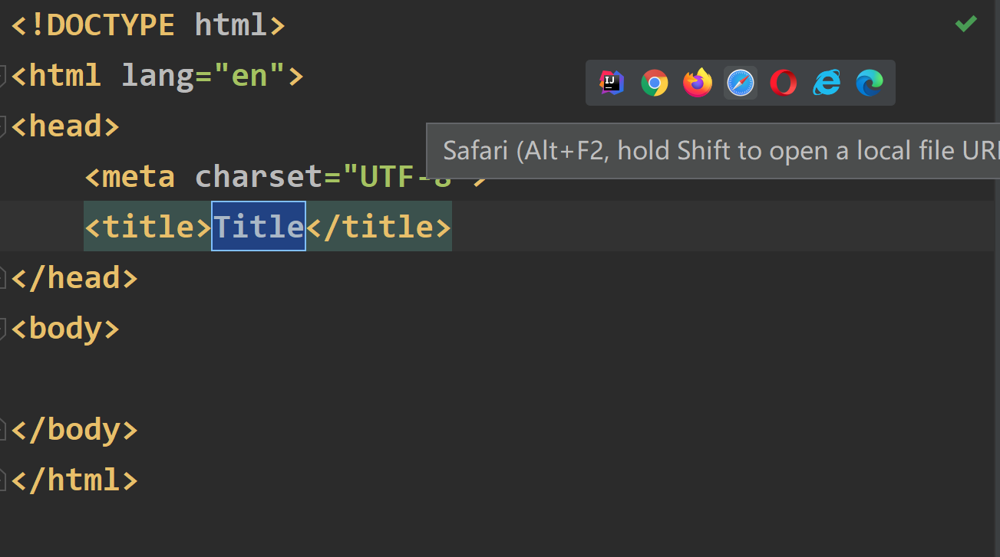
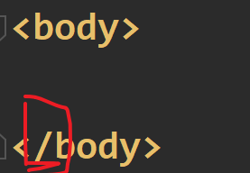
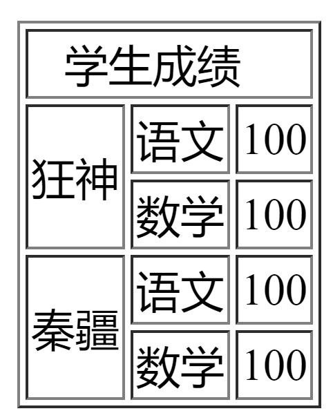

# HTML5教程01
## What is HTML
- Hyper Text Markup Language(超文本标记语言)；由W3C(万维网联盟)管理
- 超文本：文本、视频、图片等等
- 具体浏览器中：
- W3C标准：结构化标准（HTML.XML)、表现标准(CSS)、行为标准(DOM)

### 在IDEA中创建HTML网页
- 新建`HTML file`，右上角会出现可以打开的浏览器：

### 1 HTML的基本结构：
- 标签分类：成对式出现的为*开放标签+闭合标签*，其中/代表着闭合；单个出现的为*自闭和标签*例如`<br/>`
- 举例：
- *出现一对尖括号就必定是标签；属性是用来设置标签的特征；文本是双标签之间的文字；元素就是带有前三者全部的标签*
#### 1 HTML基本标签：
##### 结构标签：

- 文档声明：` <!DOCTYPE html>`;HTML5这样设置

- 根标签：所有的内容都得保证在其之间`<html> </html>`
- 一级子标签1：`<head> </head>`：不直接展示在主体上但是很重要：字符集、引入方式、标题等等 
- 一级子标签2`<body> </body>` ：页面主体里展示的主要内容

##### 基本标签
- 标题标签`<h1>xxx</h1>`
- 段落标签`<p>xxx</p>`：可以理解为作文中的一大段
- 换行标签` <br/>`:与段落标签不同的是，==换行标签的内容通常还是一整段==；break中断，起新的一行
- 水平线标签：` <hr/> `:在网页上生成一段水平线；horizontle rule的缩写
- 字体样式标签：粗体： `<strong>i love u</strong>`
斜体： `<em>i love u</em>`
- 特殊符号标签：例如空格在代码里无论打多少空格都是空一格，需要特殊标签；**格式是**`&xxx;`
```HTML
空&nbsp;&nbsp;&nbsp;&nbsp;格
版权符号 &copy;
```

#### 2 图像标签：
- img标签并且带上属性：
- 其中==*src和art是必须要有的*==，src推荐使用相对路径，art表示**图片加载失败时显示的文字**;其他的内容可以自行选择添加
- ` `
- 

#### 3 链接标签：
- **超链接标签**：可以点击的那些链接，写代码时 a+Tab：
- 完整的URL链接路径记得带`https`
- href里面可以用相对或者绝对路径，其中相对路径中`./`表示当前路径，相对于当前资源所在为出发点。
```html
<! --a标签学习
href:必须要填，表示要跳转到哪个页面

target = _blank意味着可以在新的标签页打开,self就在原地打开
-->
<a href="1.MyFirstHTML.html" target="_blank">点击我跳转到页面1</a>
<a href="https://www.google.com" target="_self">点击我跳转到谷歌</a>
<br/>

<! -- 链接可以选择图像（或文本）-->
<a href="1.MyFirstHTML.html">
  
```
-  **锚链接**：设置一个锚标记，然后需要跳转到锚标记。

```html
<! --使用name作为标记名称,虽然没有写href，即没有点击链接-->
<a name="Top">顶部</a>

.....


<a href="#Top">回到顶部</a>
```
- **功能性链接**：邮件链接，qq链接等

```html
<! --功能性链接
邮件链接：mailto
-- >
<a href="mailto:lutao123050104@gmail.com">点击联系我</a>

```
#### 扩充知识：
- 块元素：无论内容多少，只占一行；比如标题标签和段落标签
- 行内元素：一行内不会换行，如粗体斜体等
#### 4 网页代码具体结构：
- 注释：` <! --xxxx -->`;
- DOCTYPE:告诉浏览器使用什么规范，`<!DOCTYPE html>`(可以删除)
- 
#### 5 标签的注意事项：
- 标签可以嵌套但不能交叉嵌套
- 属性必须有值，且必须加引号
### 2 列表：
- 分为有序列表、无序列表和自定义列表：`order list unorder list `(双）列表里面的列表项为`li`(双);同理，这些列表可以互相嵌套
- 有序：
```html
<body>
<! --有序列表,order list-->
<ol>
  <li>java</li>
  <li>python</li>
  <li>cpp</li>
  <li>c</li>
</ol>

<hr/>这是分割线
<! --无序列表,注意中间的li是没有变化的-->
<ul>
    <li>java</li>
    <li>python</li>
    <li>cpp</li>
    <li>c</li>

</ul>
<hr/>
<! --自定义列表,dt列表名称，dd列表选项-->
<dl>
    <dt>编程语言</dt>
    <dd>java</dd>
    <dd>Python</dd>
    <dd>cpp</dd>
    <dd>c</dd>

    <dt>位置</dt>
    <dd>北京林业大学</dd>
    <dd>陕西</dd>
    <dd>咸阳</dd>
</dl>
</body>
```
### 3 表格：

- 表头表体表尾可以不写；但是如果不写的话，浏览器会为所有的tr加上tbody
- 快捷方式：一个tr行内一次生成多个表格时，可以使用`tr > td * n`＋回车来完成；甚至tr后面也可以*n

- 举例实现一个表格：
```html
<body>
<! -- 表格table学习
以table起手，border可以设置边框
表格中的一行 tr
表格中的一列 td
colspan用来进行跨列，将几列合并成一列
rowspan用来跨行，将几行从上而下合并成几行
-->
<table border="1px">
  <tr>
    <td colspan="3">&nbsp;&nbsp;&nbsp;学生成绩</td>
  </tr>
  <tr>
    <td rowspan="2">狂神</td>
    <td>语文</td>
    <td>100</td>
  </tr>
  <tr>
    <td>数学</td>
    <td>100</td>
  </tr>
  <tr>
    <td rowspan="2">秦疆</td>
    <td>语文</td>
    <td>100</td>
  </tr>
  <tr>
    <td>数学</td>
    <td>100</td>
  </tr>
</table>
</body>
```
### 4 媒体元素：
```html
<body>
<!--音频和视频
video
audio
controls可以控制视频区域,autoplay可以自动播放
-->
<video src="../Resource/Video/2-2.字符串结束符的那些事儿.ev4" controls autoplay>随便的视频</video>
<audio src="../Resource/audio/不能说的秘密.mp3"controls autoplay>最美的不是下雨天</audio>

</body>
```
### 5 iframe内联框架

- 在一个网站中嵌入另外一个网站： 
- 这与a标签（超链接）是不同的，内联框架是在父页面中出现其他页面（src）；而超链接是跳转到另外的页面。
- ==`<a>` 标签是将用户从当前页面带到一个新的位置，而 `<iframe>` 是在当前页面中直接显示另一个页面的内容。==
- 

```html
<body>
<!-- iframe
src:地址
w-h:宽度高度
name
-->

<!-- <iframe src="//player.bilibili.com/player.html?aid=55631961&bvid=BV1x4411V75C&cid=97257967&p=11"
        scrolling="no" border="0" frameborder="no" framespacing="0" allowfullscreen="true"> </iframe>
-->
<iframe src="" name="hello" frameborder="0" width="900px"height="900px"></iframe>
<a href="https://github.com/LTXWorld/LTXNote"target="hello">点击跳转</a> 
    <!-- name:这样当点击这个链接时，链接的URL会在指定的<iframe>中打开，而不是在当前页面或新标签页中打开 -->
</body>
```

- `name`属性定义了一个名称，用于标识这个`<iframe>`。这个名称可以被用作目标(target);*与`<a>`标签连用可以点击超链接但在本页面指定的框架中打开*

### 6 表单操作（Input）
- `<form>`，注意将表单的具体内容写在两个form之间
- action:提交位置，表单提交可以到网站或者请求处理地址；method:提交方式，*get可以在url中看到提交的名称和密码 键值对（但高效），post方式看不见，但可以传输大文件。*
- 两个提交方式：get的地址栏长度有限制并且只能提交文本数据（二进制文件就不行）；post的数据单独打包
- 注意，**对这些表单的基本控件都要为其加名称，加name**——因为GET提交时原理是键值对，我们需要一个KEY即name
- 
- 
```html
<body>

<h1>注册</h1>

<!-- 表单form
action:提交位置，表单提交可以到网站或者请求处理地址
method:提交方式，只有post get
二者之间的差异：
get可以在url中看到提交的名称和密码（但高效），post方式看不见
post也可以传输大文件。
-->
<form action="1.MyFirstHTML.html" method="get">
  <p>Name: <input type="text" name="username"></p>
  <!--密码框的type要注意-->
  <p>Password <input type="password" name="password"></p>

  <p><input type="submit">
    <input type="reset">
  </p>
</form>
<!-- 文本输入框 -->

</body>
```

####  1 文本框标签
- 其中`input`标签也很重要，创建出的文本框。其中的属性有如下几个：但还有其他的如下面的` file,email`等等
- 还有`readonly disable`等属性，前者只读，后者提交时不携带（与隐藏域hidden区分开）
- 

```html
  <!-- 文本输入框，
  value 默认初始值
  maxlength 最长能写几个字符
  size 文本框的长度
  -->  
  <p>Name: <input type="text" name="username" value="111" maxlength="10" size="30"></p>
  <!--密码框的type要注意-->
  <p>
      Password <input type="password" name="password">
  </p>
  <!-- 单选框标签
  input type = radio
  value :单选框的值
  name:表示组，组一样时只能选一个
  -->
  <p>性别：
      <input type="radio" value="boy"name="sex"/>男
      <input type="radio" value="girl"name="sex"/>女
  </p>
  <!-- 多选框
	input type = checkbox
  -->
  <p>
      <input type="checkbox"value="sleep"name="hobby">睡觉
      <input type="checkbox"value="chat"name="hobby">聊天
      <input type="checkbox"value="play"name="hobby">打搅
  </p>
  <!-- 按钮
  button普通按钮
  image图片按钮，点击后可以达到提交的效果
  submit提交按钮
  reset重置按钮
  -->
  <p>按钮
      <input type="button" name="buton1"value="点击变长">
      <input type="image"src="../Resource/image/iu.jpg.webp">
  </p>
  <p><input type="submit">
    <input type="reset">
  </p>
```
#### 2 列表框和文本域

- 下拉框，文本域，文件域
- 

```html
  <p>下拉框select
      <select name="列表名称" id="">
          <option value="选项的值">中国</option>
          <option value="选项的值">日本</option>
          <option value="选项的值" selected>美国</option><!--selected默认选择，上面的单选框是checked-->
          <option value="选项的值">香港</option>
      </select>
  </p>
  <!-- 文本域(多行文本框)
  textarea
  cols,rows
  -->
  <p>反馈
      <textarea name="textarea"  cols="50" rows="10">文本内容，HTML5快速入门</textarea>

  </p>
  <!-- 文件域

   -->
   <p>
       <input type="file"name="files">
       <input type="button" value="上传"name="upload">
   </p>
```
#### 3 input邮箱滑块等操作：
- 
```html
   <!-- 邮件标签
   email以是否有@符号确定
   -->
   <p>邮箱
       <input type="email"name="email">
   </p>
    <p>URL
        <input type="url"name="url">
    </p> 
    <!--数字验证
    -->
    <p>数字验证
        <input type="number" name="number"max="100"min="0"step="10">
    </p>
    <!--滑块
    -->
    <p>滑块调节(音量)
        <input type="range" name="Voice" min="0"max="100"step="1">
    </p>
    <!--搜索框
    -->
    <p>搜索框
        <input type="search"name="search">
    </p>
```
### 7 简单的表单验证：
- 原因：表单验证是网页和网站设计中的一个关键环节，它对于确保用户提交的数据符合预期格式和值至关重要；并且能够减少服务器的负载：即你传过来的数据服务器不是都要，而是要做判断。
- 相关操作举例：`placeholder`提示信息；`required`表示元素不能为空；`pattern`正则表达式（相关的正则表达式需要时去查阅即可）

### 8 使用VSCODE编写前端代码
#### 执行代码：
- 在右下角通过live server插件直接可以执行代码并且在对应的浏览器中打开。
- live server可以做到实时更新，即不用断开虚拟连接（*注意先保存*）

### 9 页面布局设置：

将页面变成一块一块的去布置

- 块元素：`div`：独占一行
- 行内元素：`span`:不会独占一行，**行内的很多css样式不会生效**
- 通常是二者联用，`div`先控制一大块，然后对行内的某些元素进行`span`的特殊处理。
- `div` 和 `span` 的主要区别在于它们在 HTML 文档中的默认行为和用途——`div` 是用于布局的块级元素，而 `span` 是用于文本级样式应用的内联元素。

### 10 特殊字符

- 查阅w3文档里的*实体和符号*
- `&`为转义字符的开始标志