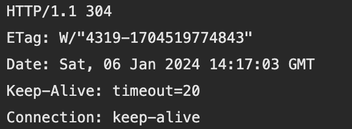
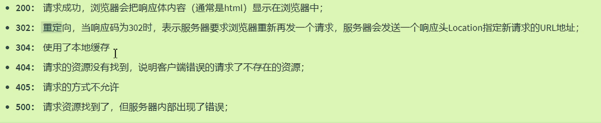

# HTTP

## 报文格式：

### 请求报文

请求报文：**行+头+体**,以对demo项目中的register进行访问举例：

请求行：方式Get/Post、资源路径、协议

```html
GET /demo01-web01/register.html HTTP/1.1
```

- Get/Post有什么区别：Post会隐藏数据在请求体当中。

请求头：有各种详细信息

```html
Accept: text/html,application/xhtml+xml,application/xml;q=0.9,image/avif,image/webp,image/apng,*/*;q=0.8,application/signed-exchange;v=b3;q=0.7
Accept-Encoding: gzip, deflate, br
Accept-Language: zh-CN,zh;q=0.9,en-US;q=0.8,en;q=0.7
Cache-Control: max-age=0
Connection: keep-alive
Cookie: _ga=GA1.1.2021580528.1690790745; csrftoken=ZUDUoePQ6ad2JxsvJu4kXK2tZLjjVUfPu4uCUGWMQP2Tyy9x8UdfR2bNNEcEHqcy; _ga_Z4KXEBY4VP=GS1.1.1690790744.1.1.1690790760.44.0.0; Idea-5ad904ba=f989c98b-90a4-4c4c-a506-98744431b310
Host: localhost:8080
If-Modified-Since: Sat, 06 Jan 2024 05:42:54 GMT
If-None-Match: W/"4319-1704519774843"
Sec-Fetch-Dest: document
Sec-Fetch-Mode: navigate
Sec-Fetch-Site: none
Sec-Fetch-User: ?1
Upgrade-Insecure-Requests: 1
User-Agent: Mozilla/5.0 (Macintosh; Intel Mac OS X 10_15_7) AppleWebKit/537.36 (KHTML, like Gecko) Chrome/120.0.0.0 Safari/537.36
sec-ch-ua: "Not_A Brand";v="8", "Chromium";v="120", "Google Chrome";v="120"
sec-ch-ua-mobile: ?0
```

### 响应报文



行+头+体

- 响应协议，状态码，状态描述

- 注意keep-alive长连接，时效为20。
- `Content Length`方便客户端进行校验。`Content type`MIME类型，告诉客户端响应体数据是何种数据

### 响应状态码：



500服务器后端代码问题。