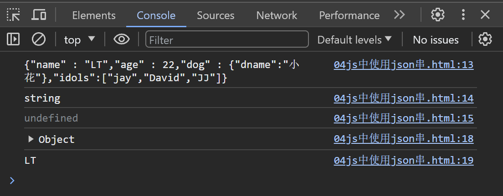

# JS入门01

## 简介：

- JS是一个脚本语言，无需编译，可以直接解释执行
- 基于对象，可以创建对象，有类和对象的概念；但没有三大特点，本质上不是面向对象。
- 弱类型语言，声明变量时不强制要求类型，可以接收任何类型
- 事件驱动：代码的执行在于我们的行为，而不在于web服务器
- 跨平台，只要符合EXCMA规定即可。

##  基本操作：
###  引入js：
####  引入方式：
1. 内嵌式：一般将js脚本写在head双标签中，以`script`双标签为起始

```html
    <script>
        // 1.js如何声明方法（function） 2. 方法如何和单击按钮行为绑定（使用属性）
        
        function superise(){
            alert("hello!!! superise!!!")
        }
    </script>

    <button class="btn1" onclick="superise()">
        点我有惊喜
    </button>
```


2. 引入外部脚本：使用一对`script`标签引入外部的脚本；注：外部的脚本在编写时不需要使用双标签，且双标签之间最好不要放多余字符

```html
<script src="js/button.js" type="text/javascript">
```
- 将方法写在外部脚本当中：
```js
function superise(){
    alert("hello!!! superise!!!")
}
```
注意：一对`script`标签用内部或者外部脚本即可，不能两个脚本交叉着使用

## js基本的数据类型：

- js与mysql很像，都是弱类型语言，使用`var`声明即可；赋值时才会确定数据类型
- ps：代码结束可以不要分号（当然后端写肯定要加）

### 常见数据类型：

- 几乎与java一样，多的是`function`类型
- 命名未赋值：值与类型都是`undefined`
- 当值为null时，类型为`Object`值为null

### var声明变量的语法特征

- 可重复声明，甚至声明不同类型
- 区分大小写

### 运算符：

- 如果`x / 0`不会报错，而是返回Infinity;如果`x % 0`返回的是Nan
- `==`关系等于规则跟mysql很像，如果两端数据类型不一致，会先尝试将两个数据转换为number再对比；但是特点：`===`这个符号进行比较时是直接比较的

## 流程控制：

### 分支结构：

- 几乎一样，有如下特点：
- `prompt`方法与JAVA里的scanner一样**接受输入**;`document.write()`向浏览器页面上面**打印东西**
- ` if`分支不仅可以放入布尔类型变量（JAVA里只能），非空字符串会判断为true，非0number判断为true

### 循环结构：

- 不同点在于增强for循环：js中for each循环不用冒号而用`in`,而前面的代替值代表着索引，而不像JAVA里面那样的真实值

```html
 <script>
        var arry =["bei","shang","guang"]
        document.write("<url>")
        for(var index in arry){
            document.write("<li>" + arry[index] + "<li>")
        }
        document.write("<url>")
 </script>
```

### 函数声明的方式：

- `function 函数名（）{ }`
-  `var 函数名（）{ }`
- 不需要返回值类型，没有void，如果有东西要返回，直接return就行
- 调用方法时，实参和形参数量可以不一致（最好不要少）；甚至函数可以作为参数传递给另一个函数

## JS对象的创建

### 方式一：

` new Object()`

- 没有属性直接.属性赋值即可（比java更简单直接）

```html
    <script>
        var person = new Object()
        person.name = "张三"
        person.age = "18"
        person.eat = function(food){
            console.log(this.age + "岁" + this.name + "eat" + food)
        }

        console.log(person.name)
        person.eat("火锅")
    </script>
```


### 方式二：

` {属性名：属性值，函数名：function（）{ } ，.....}`

```html
        var person = {
            name : "lisi",
            age : 10,
            eat:function(food){
                console.log("hotpot")
            }
        }
        person.eat("火锅")
```

## JSON格式：

### 应用场景：

- 客户端（前端）使用对象存储数据，服务器（后端）也使用对象存储数据，但二者肯定有所不同，不能直接交互，所以中间产物JSON格式应运而生。
- 前后端都先转为JSON串，再去发送。
- *数据通常都是由属性携带的*，所以在JSON里面只研究属性不研究方法

### 语法格式（前端）：

```html
var personStr = '{"属性名"：属性值,....} '
```

- **属性名**必须用**双引号**包裹，整个**JSON字符串被单引号**包裹
- 属性可以为字符串，对象，数组etc
- 使用JSON的内置方法进行转换：parse和stringify

```html
    <script>
        /*
            var personStr = ' {"属性名"：属性值,"属性名":{ }}  '
        */
        //这是一个json格式的字符串
        var personStr = '{"name" : "LT","age" : 22,"dog" : {"dname":"小花"},"idols":["jay","David","JJ"]} '
        console.log(personStr)
        console.log(typeof personStr)
        console.log(personStr.name)//目前字符串还不是对象，所以不能这样.
        //转换为对象
        var person = JSON.parse(personStr)
        console.log(person)
        console.log(person.name)
        //再转回字符串
        var personStr2 = JSON.stringify(person)
    </script>
```



### 语法格式（后端）：

- 通常使用第三方库来完成转换，这里我们使用到了jackson

```java
    @Test
    public void writeJSON() throws JsonProcessingException {
        //实例化person对象,将其转化为JSON串
        Dog dog = new Dog("kat");
        Person person = new Person("lt", 22, dog);
        //转换
        ObjectMapper objectMapper = new ObjectMapper();
        String personStr = objectMapper.writeValueAsString(person);
        System.out.println(personStr);
    }
    @Test
    public void readJSON() throws JsonProcessingException {
        String personStr = "{\"name\":\"lt\",\"age\":22,\"dog\":{\"name\":\"kat\"}}";
        ObjectMapper objectMapper = new ObjectMapper();
        //转换为对象，注意参数
        Person person = objectMapper.readValue(personStr, Person.class);
        System.out.println(person);
    }
```

- 可以不仅转换对象，还能转换Map、List、Array等为JSON串

## JS常见对象（基础的不需要new的）

### 数组（类似于java中的集合）

#### 创建方式：

- 数组中的数据类型可以不一致；可以随意给数组某个位置上赋值；

```html
    <script>
        var arr1 = ["hhh",11,false]
        var arr2 = new Array(10)
        var arr = new Array()
        arr[0] = "zhangsan"
        arr[5] = 10
        arr[9] = true
        console.log(arr)
        console.log(arr.length)
    </script>
```

#### 其下API

```html
<script>
        var arrAll = arr.concat(arr1)
        //移除并返回最后一个元素
        var res = arrAll.pop()
        //从尾端增加元素并返回长度
        arrAll.push(false)
        //查找对应的下标并返回
        var index = arrAll.indexOf(10)
        //翻转
        arrAll.reverse()
        console.log(arrAll)
        //转换为字符串,并用某分隔符
        console.log(arrAll.join("-"))
</script>
```

### 其他对象

- 其他对象下的对应API可以去看对应的API文档，或者菜鸟教程。

#### Boolean对象

#### Date对象

```html
<script>
        var bool = new Boolean(0)
        console.log(bool.valueOf())
        //日期
        var date = new Date()
        date.setMonth(11)
        console.log(date)
        console.log(date.getFullYear())
        console.log(date.getMonth())
</script>
```


#### Math对象

#### Number对象

- 原始数值的包装对象
