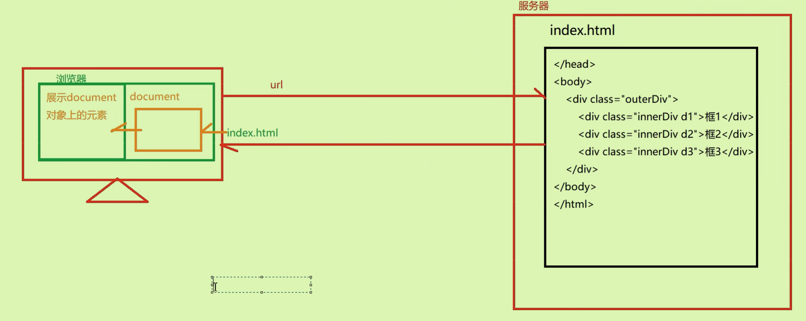
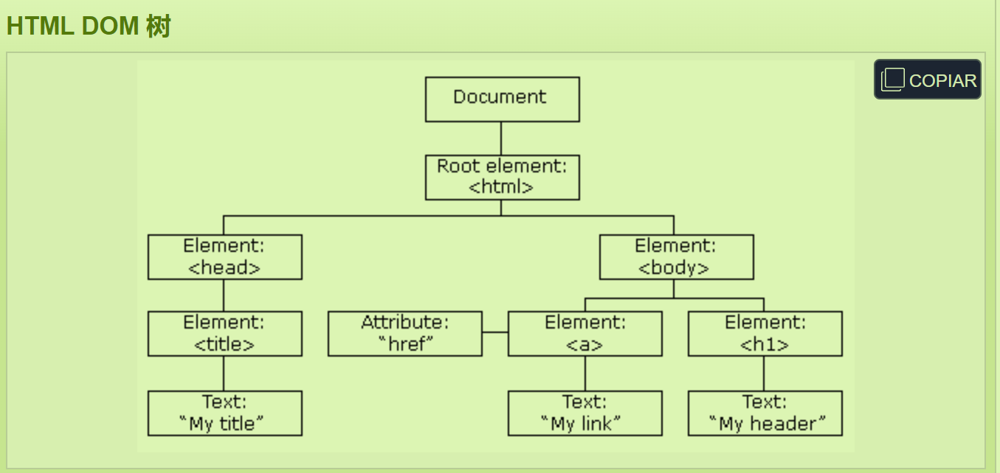

# JS入门02 事件、

## 事件

### 概念：

- **事件即行为**，可以由浏览器发生，也可以由用户发生。
- 当行为发生时，可设置自动调用使JS代码运行。称为**事件发生**；行为是一定可以发生的，但是事件需要行为和代码的绑定
- *一个事件可以同时绑定多个函数；一个元素可以绑定多个事件*

### 常见的事件

#### 鼠标事件：


```html
    <script>
        function fun1(){
            console.log("xxx")
        }
        function fun2(){
           console.log("xxx2")
        }
        function fun3(){
            alert("双击")
        }
        /*
        进行事件的绑定
            通过元素属性绑定
            通过DOM编程绑定
        */
    </script>
<body>
    <input type="button" value="按钮"
            onclick="fun1(),fun2()"
            ondblclick="fun3()"
    >
</body>
```


#### 键盘事件

- 典型的两个键盘按下和抬起：`onkeydown onkeyup`

#### 表单事件

- 一部分是表单内部的，一部分是表单整体的操作（如表单的提交）


```html
    <script>
        function testFocus(){
            console.log("获得焦点,光标在晃动")
        }
        function testBlur(){
            console.log("失去焦点,光标不在晃动")
        }
        // 只有内容真的改变并失去焦点后内容改变才会执行
        function testChange(){
            console.log("表单内容发生改变")
        }
        function testChange2(){
            console.log("表单选项发生改变")
        }
        function testSubmit(){
            alert("表单发生了提交")
            // 有机会在这里阻止表单提交
            var flag = confirm("提交表单吗？")
            if(!flag){
                event.preventDefault()//组织组件的默认行为
            }
        }
    </script>

<body>
    <!-- 表单事件 -->
    <form action="" method="">
        用户名：<input type="text" name = "username" 
        onfocus="testFocus()"
        onblur="testBlur()"
        onchange = "testChange()"
        ><br>
        登陆账号<input type="text" name="logoinName"><br>
        选择籍贯
            <select name="" id="" onchange="testChange2()" onsubmit="testSubmit()">
                <option value="city1">北京</option>
                <option value="city2">上海</option>
                <option value="city3">广州</option>
            </select>
        <input type="submit" value="注册">
        <input type="reset" value="清空">
    </form>
</body>
```

- 注意，真正发生了提交的是整个表单，也就是在`form`那里
- ps：弹窗的三种方式`alert()、prompt()、confirm()`信息提示框，输入框

## BOM编程：

### Window对象：

## Window 对象

- 所有浏览器都支持 window 对象。它表示浏览器窗口。

- 所有 JavaScript 全局对象、函数以及变量均自动成为 window 对象的成员

### 常见API

- Screen、Location、History、Navigator、alert弹窗

## DOM编程：

### 概念：

- 管理**浏览器页面上的元素变化**的编程
- 
- 服务器端是不能由我们直接更改的，我们能更改的是**document对象**，从而改变浏览器展示的元素

### Document对象结构（逻辑上）：

- 

- DOM树上的结点类型分为三种：Element（标签）、Attribute（属性）、Text（文本）

DOM编程三步走：

- 获得DOM树（即Document对象）
- 从Document对象中获取元素
	- 直接获取
	- 间接获取
- 对元素进行操作
	- 属性
	- 样式
	- 文本
	- 增删

### 相关的API

#### 2获取相应元素

- 直接获取元素：

```sql
var el1 = document.getElementById("username")
var els = document.getElementsByTagName("input")
var el2 = document.getElementsByName("aaa")
```

- 间接获取

```sql
			//先获取父元素，从父元素身上拿子元素
            var div01 = document.getElementById("divFather")
            //获取所有子元素、第一个、最后一个
            var Childrens = div01.children
            var fistchild = div01.firstElementChild
            var lastchild = div01.lastElementChild
            
             //通过子元素获取父元素
            var pinput = document.getElementById("password")
            var pElement = pinput.parentElement
            //获取兄弟元素
            var pElement2 = pinput.previousElementSibling
            var pElement3 = pinput.nextElementSibling
```

#### 3对元素进行操作

- 操作属性：元素.属性名=" "
- 操作样式：元素.style.样式名 = " "
- 操作文本：使用innerText和innerHTML

```sql
            var email = document.getElementById("email")
            //操作属性
            email.value = "hi"
            email.type = "button"
            //操作样式
            email.style.color = "blue"
            email.style.borderRadius = "5px"//注意在css样式中是单横线，在JS中使用驼峰式
            //操作文本，一个识别文本，一个识别html代码
            email.innerText
            email.innerHTML = "<h1>hello<h1>"
```

## 案例开发：

