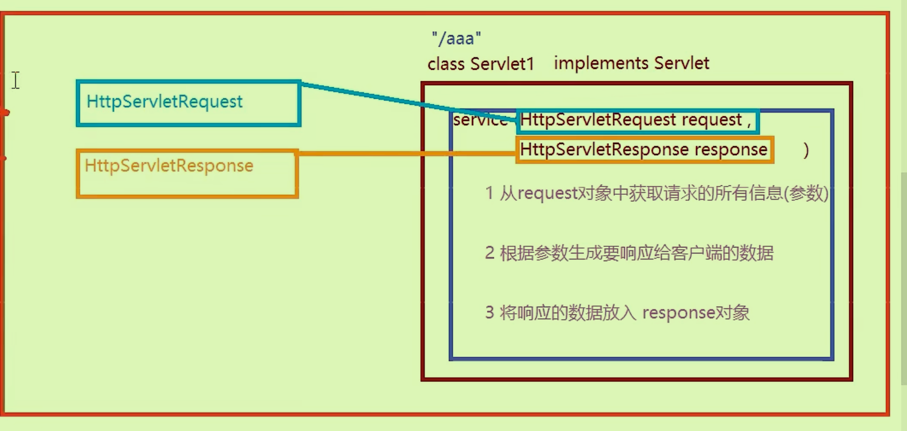
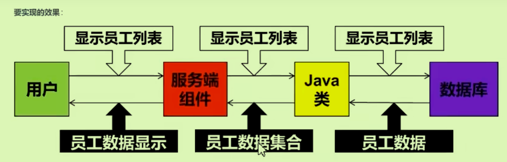
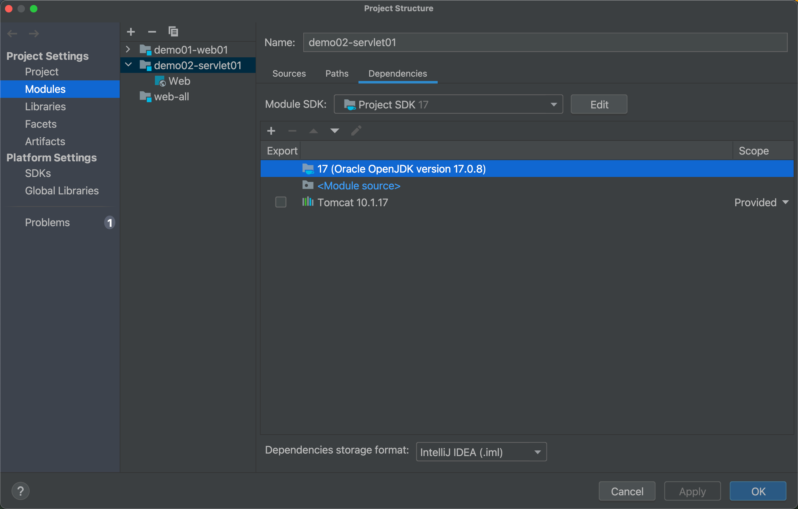
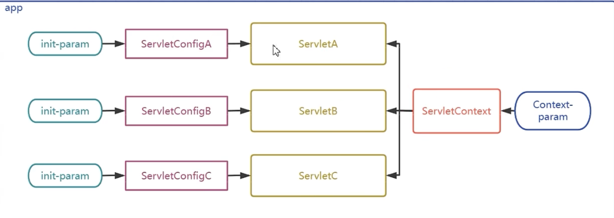
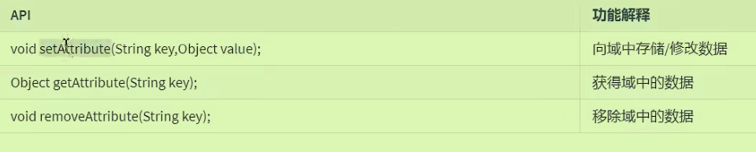
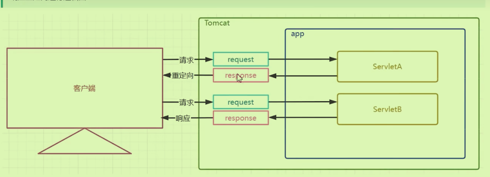

# Servlet

## 1 动静态资源：

无需程序运行时需要代码运行才能生成的资源，**在程序运行之前就写好的**如html css js img；反之则为动态资源，**程序运行前无法确定的**，如Servlet

- 动态资源在请求和响应时每次响应的都是Java代码即时运行后产生的结果。
- **Servlet技术标准可以作为Java代码接受用户的请求。**
- 必须在Web项目中开发在Tomcat容器中进行。

## 2 Servlet运行流程：

- Tomcat接收到请求报文时，将其转换为**HttpServeletRequest对象**，包含请求的所有信息。
- 同时创建Response对象，未来会转换成响应报文。
- 根据请求中的资源路径找到对应的servlet，将其servlet实例化，调用其中的service方法。**将上面两个对象传入方法中**
- 引用传递

Servlet作用主要是承前启后，

所以到底什么是Servlet：是用Java编写的**服务端程序**，扩展服务器的功能——**处理来自客户端的请求并产生响应**

## 3 Servlet开发流程

### 创建Javaweb项目，将Tomcat添加为项目依赖



### 重写service方法

```java
public class UserServlet extends HttpServlet {
    @Override
    protected void service(HttpServletRequest req, HttpServletResponse resp) throws ServletException, IOException {
        super.service(req, resp);
    }
}
```

### 在service方法中，定义业务代码

```java
protected void service(HttpServletRequest request, HttpServletResponse response) throws ServletException, IOException {
        //从客户端传来的Request对象中获得信息
        String username = request.getParameter("username");//根据参数名获取参数值，可能在url或者请求体中
        //处理业务代码
        String info = "YES";
        if ("atguigu".equals(username)){
            info = "NO";
        }
        //将响应的数据放入Response对象中
        PrintWriter writer = response.getWriter();//该方法返回的向响应体中打印字符的打印流
        writer.write(info);
    }
```


### 在web.xml中配置Servlet请求映射路径

```html
    <!--
        1配置servlet类，并起一个别名
        class是全路径，进行实例化，根据全路径反射创建对象调用Service方法
        name是用于关联请求的映射路径
        2使用mapping映射别名和路径
    -->
    <servlet>
        <servlet-name>userServlet</servlet-name>
        <servlet-class>com.ltx.servelet.UserServlet</servlet-class>
    </servlet>

    <servlet-mapping>
        <servlet-name>userServlet</servlet-name>
        <url-pattern>/userServlet</url-pattern>
    </servlet-mapping>
```

- 注意pattern里的路径对应的是`index.html`中的action
- 运行时建议以Debug模式运行，并且可能存在8080端口被占用的情况，需要查看进程并kill掉
- `sudo lsof -i :8080 sudo kill -9 PID`

### 注解方式配置Servlet映射路径

在java工程的类之前`@WebServlet("/s1")`，**配置上下文路径**即可。

## 4 额外问题

### Jar

继承的servlet并不是IDEA所内置的，我们在**添加Tomcat依赖**时会自动导入对应api-jar包。不用自己创建lib导入响应jar包（Tomcat中没有的jar包才需要自己导入）

### Content-Type响应头

决定了返回的数据类型：`response.setHeader("Content-Type","text/html");`

### Pattern映射路径作用

- 通过localhost定位服务器，通过8080定位tomcat，（tomcat会向外暴露webapps）

- 会由web.xml中的pattern字段（也是url后面的字段）找到servlet-name，定位到对应的servlet-class通过反射获得字节码，最后获取servlet对象。
- **一个name可以对应多个pattern,不同的servlet不能拥有相同的pattern；但可以对应多个mapping标签。**

#### 精确匹配

`<url-pattern>/s1</url-pattern>`

#### 模糊匹配

/意味着匹配全部, 不包含jsp文件；/*匹配全部，包含jsp文件。

*在哪里哪里就是模糊的。

#### 关闭进程

`sudo lsof -i :8080` `sudo kill -9 xxxx`

## 5 生命周期：

作为开发者只需要在service方法中进行编写java代码，其对象的创建和销毁都由Tomcat完成。

### 四个过程：

- 实例化（构造器）1
- 初始化 init必须调用无参的 1
- 接受处理请求 service 多次
- 销毁对象 destory 1

**Servlet是单例的**，成员变量在*多个线程栈中共享*，不支持在service方法中修改成员变量，否则引发**线程安全问题。**

实例化顺序，在注解方式的参数配置`loadOnStartup = xx`

**静态资源由defaultServlet进行加载。**

## 6 Servlet接口继承结构：

顶级的Servlet接口—GenericServlet—HttpServlet

顶级：

```java
public interface Servlet {
    void init(ServletConfig var1) throws ServletException;

    ServletConfig getServletConfig();

    void service(ServletRequest var1, ServletResponse var2) throws ServletException, IOException;

    String getServletInfo();

    void destroy();
}
```

Generic：侧重除了service方法以外的其他基础方法的处理

Http：

`public abstract class HttpServlet extends GenericServlet`侧重Service方法的处理

```java
    public void service(ServletRequest req, ServletResponse res) throws ServletException, IOException {
        HttpServletRequest request;
        HttpServletResponse response;
        try {
            request = (HttpServletRequest)req;
            response = (HttpServletResponse)res;//参数的父转子的处理
        } catch (ClassCastException var6) {
            throw new ServletException(lStrings.getString("http.non_http"));
        }
			//调用重载的service方法，会调用doGet和doPost方法
        this.service(request, response);
    }
```

- 如果在自己的Java代码中不重写service方法，就会走Httpservlet自带的service方法，转而去调用doGet\doPost方法。
- 后续使用了SpringMVC框架后，无需继承HttpServlet，处理请求的方法也会变化。

## 7 ServletConfig对象

每个Servlet对象都会实例化一个唯一的ServletConfig，作为其属性存在。

注解中使用urlPatterns,和initParams

## 8ServletContext:

  为所有的Servlet提供公共的配置参数：故单例，接口下**只有一个Context对象**

##  Context重要API

### GetRealPath

获得一个指向项目部署位置下的某个文件的在具体电脑上的磁盘真实路径

```java
 String path = servletContext.getRealPath("upload");//获取此项目部署位置下的某个文件的磁盘真是路径，动态路径没有写死

```

### GetContextPath

获取项目的上下文路径(访问路径），动态获取(涉及到后端的绝对路径)

```java
 String path = servletContext.getRealPath("upload");//获取此项目部署位置下的某个文件的磁盘真是路径，动态路径没有写死

```

### 域对象API

不同的Servlet进行数据的传递时，可以将数据放在域对象里进行传递。最大的域对象是ServletContext(也是**应用域**)



## 9请求和响应对应的API

### 请求

注意，get方式也可以有请求体，不只是post方式可以有。

```java
        //获取键值对,key=value无论是post还是get
        String username = req.getParameter("username");
        System.out.println(username);
        System.out.println(req.getParameter("userPwd"));
        //根据参数名获得多个参数值
        String[] hobbies = req.getParameterValues("hobby");
        System.out.println(Arrays.toString(hobbies));

        //返回所有参数的map集合,不论是单值还是多值
        Map<String, String[]> parameterMap = req.getParameterMap();
        //获取请求体中的非键值对，读取字符输入流
        BufferedReader reader = req.getReader();
        //读取二进制字节流，读文件
        ServletInputStream inputStream = req.getInputStream();
```

### 响应：

```java
        //响应行状态码
        resp.setStatus(404);
        //响应头
        resp.setHeader("aaa","valuea");
        resp.setHeader("Content-Type","text/html");
        resp.setContentType("text/html");
        resp.setContentLength(1500);
        //响应体
        PrintWriter writer = resp.getWriter();
        writer.write(123);
```

## 10请求转发响应重定向

间接访问资源方式：


### 请求转发：

内部行为(屏蔽客户端）客户端地址栏不变，客户端只发一个请求（只有一对req、resp对象）；req和resp的参数、数据都可以传递地拿到；既可以转发给servlet动态资源，也可以转发给静态页面或者是WEB-INF资源实现跳转；**不能转发给项目外的资源**

```java
   A: protected void service(HttpServletRequest req, HttpServletResponse resp) throws ServletException, IOException {
        System.out.println("servletA执行了");
        //请求转发给B
        //1获得转发对象
        RequestDispatcher servletB = req.getRequestDispatcher("servletB");
        //2转发请求req和resp对象
        servletB.forward(req,resp);
    }
```

### 响应重定向：



特点：

- 通过response对象完成，在服务端提示下的**客户端的行为**（客户端又发了一次请求）
- 客户端的地址栏发生变化
- 客户端产生多次请求，请求的参数不能自动传递
- 目标资源不能是WEB-INF下的资源，可以重定向到外部的web资源

优先采用重定向来完成页面跳转。

## 11处理问题

### 乱码问题

文件的编码和客户端的解码字符不同，会导致字符乱码 

- IDEA默认使用UTF-8进行编码
- Get请求时，Tomcat服 务器端解码默认使用的是UTF-8，如果客户端发出的表单请求使用的是其他字符可能出现乱码。（可以在配置中单独设置**urlencoding**）
- Post请求可能也会出现乱码，但是不同于Get的urlencoding，因为url里面不再有参数（post特点）; 可以先设置请求体中的字符集解码方式：`req.setCharacterEncoding("")`
- 响应乱码问题：响应体使用UTF-8进行编码，客户端的解码发生乱码，设置响应体：`resp.setCharacterEncoding("GBK")`,但是最好**告诉客户端使用指定的字符集进行解码**，设置响应头:`resp.setContentType("text/html;charset=UTF-8")`

### 路径问题

相对路径

- 注意，在包下使用.表示路径；在目录directory下使用/表示路径；相对路径以当前所在路径为出发点，不以/开头，但可以用./和../；规则：**在当前资源所在路径之后拼接目标资源的路径，接着发送请求找目标资源。**
- 要时刻注意*当前资源的所在路径*（得看浏览器具体**url**），所以在写相对路径时要注意*不能只看磁盘目录结构*

绝对路径

- 不同项目中固定的出发点不一致——绝对路径要*补充项目上下文*（但是此路径可以改变）
- 从8080端口出发；
- 可以在head里面加一个`<base href='/xxx/'>`，将前面没有修饰的相对路径自动补充，变为绝对路径

注意，访问web文件夹下的资源路径里*为什么没有web*，是因为`web`通常是Web应用程序的根目录，在部署到服务器（如Tomcat）后，它会成为URL路径的隐含起始点。