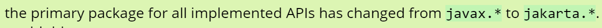

# XML

## 基本语法

- 可扩展标记语言，基本语法都是标签。（对Java来说用作配置文件）

- 根标签只能有一个
- 第一行永远都是配置信息
- xml有约束：dtd、schema约束（约束会自动）

```xml
<?xml version="1.0" encoding="UTF-8"?>
<web-app xmlns="http://xmlns.jcp.org/xml/ns/javaee"
         xmlns:xsi="http://www.w3.org/2001/XMLSchema-instance"
         xsi:schemaLocation="http://xmlns.jcp.org/xml/ns/javaee http://xmlns.jcp.org/xml/ns/javaee/web-app_4_0.xsd"
         version="4.0">
</web-app>
```

- 上方是java内部的schema约束。
- 下方是三端的标签。

```xml
<?xml version="1.0" encoding="UTF-8" ?>
<!--
根标签只有一个
-->
<jdbc>
    <dev>
        <username>root</username>
        <password>root</password>
        <dirver>com.mysql.cj.jdbc.Driver</dirver>
        <url>jdbc:mysql://localhost:3306/atguigu</url>
    </dev>
    <test>
        <username>xxx</username>
        <password>14</password>
        <dirver>com.mysql.cj.jdbc.Driver</dirver>
        <url>jdbc:mysql://localhost:3306/atguigu</url>
    </test>
    <former>
        <username>lisi</username>
        <password>353252</password>
        <dirver>com.mysql.cj.jdbc.Driver</dirver>
        <url>jdbc:mysql://localhost:3306/atguigu</url>
    </former>
</jdbc>
```

## 解析技术DOM4j

### 使用步骤：

java代码解析XML文件：导入dom4j.jar包，调用其中的API。具体步骤如下代码所示。

```java
@Test
    public void testRead() throws Exception{
        //读取jdbc.xml配置文件，获得document对象
        SAXReader saxReader = new SAXReader();
        //通过类加载器获得指向字节码根路径下的指定文件的输入流
        InputStream resourceAsStream = TestDom4j.class.getClassLoader().getResourceAsStream("jdbc.xml");
        Document document = saxReader.read(resourceAsStream);
        //从对象上获得配置文件的信息
        Element rootElement = document.getRootElement();
        System.out.println(rootElement.getName());
        //获取子元素
        List<Element> elements = rootElement.elements();
        for (Element element : elements) {
            System.out.println("\t"+element.getName());
            //获取属性
            Attribute id = element.attribute("id");
            System.out.println(id.getName() +"=" +id.getValue());
            //继续获取子元素的子元素,缩进的层次感
            List<Element> eles = element.elements();
            for (Element ele : eles) {
                System.out.println(ele.getName()+"="+ele.getText());
            }
        }
    }
```


# Tomcat10

## 何为Tomcat

服务器软件专门运行WEB软件，APP等。

服务器——JRE——服务器软件（Tomcat）——APP 

注意，Tomcat10的在8，9上无法运行：不同的版本需要的JRE也不一样。

## 运行Tomcat

在macos下，终端

`catalina.sh start`后台运行；`catalina.sh stop`结束运行。（需要配置环境变量）

在windows下，终端

`startup.bat`启动（需要配置环境变量）

**在IDEA中：**


## 目录解释：

- bin：命令目录

- conf：配置文件
- lib：存放各种jar包
- webapps：**部署web项目内容** 
- logs：日志（注意日志会逐渐累积）

### 对于webapps项目名称

在网页上访问web项目：`http://ipaddress:8080/examples/index.html`其中的examples代表着**项目的上下文路径（访问路径）**；而webapps里的examples代表着项目的部署目录；**二者可以不同。**

### webapp的标准结构：


