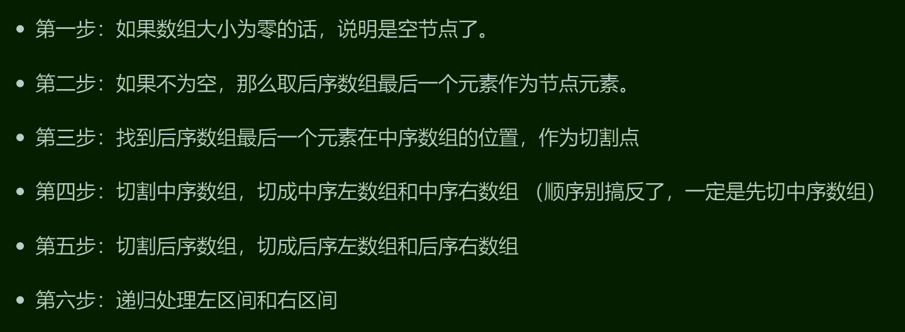

# 106中序后序构造二叉树

## 题目要求

给定两个整数数组 `inorder` 和 `postorder` ，其中 `inorder` 是二叉树的中序遍历， `postorder` 是同一棵树的后序遍历，请你构造并返回这颗 *二叉树* 。

## 第一想法

考研题中的中序与其他两序可以唯一确定一棵二叉树，过程我都有点忘了。

- 先从后序的最后找根结点，拿着这个根节点去中序里分割左右子树。
- 看分割出的左右子树去后续里面进行左右分割
- 对于分割出的结果再使用上述两个步骤去继续

## 题解

完整构建步骤如下：（多了一步健壮性判断）



## 代码实现

```java
class Solution {
    public TreeNode buildTree(int[] inorder, int[] postorder) {
        if (inorder.length == 0 || postorder.length == 0) return null;
        return buildHelper(inorder,0,inorder.length,postorder,0,postorder.length);
    }
    private TreeNode buildHelper(int[] inorder,int inorderStart,int inorderEnd,int[] postorder,int postStart,int postEnd){
        if (postStart == postEnd){
            return null;
        }
        //从后序找根
        int rootVal = postorder[postEnd - 1];
        TreeNode root = new TreeNode(rootVal);
        //找到的根在中序中的位置
        int middleIndex;
        for(middleIndex = inorderStart;middleIndex < inorderEnd;middleIndex ++){
            if (inorder[middleIndex] == rootVal){
                break;//找到了
            }
        }
        //如何去后序分割是难点（因为没有明确的分割点），但是中序分割后的结果与后序必须长度一致
        int leftInorderStart = inorderStart;
        int leftInorderEnd = middleIndex;
        int rightInorderStart = middleIndex + 1;
        int rightInorderEnd = inorderEnd;//分割为了左右两半
        //去后序里分割，保持左开右闭原则。
        int leftPostorderStart = postStart;
        int leftPostorderEnd = postStart + (middleIndex - inorderStart);//对于后序左右中，右边也是好定的，定好左边就剩下右了
        int rightPostorderStart = leftPostorderEnd;
        int rightPostorderEnd = postEnd - 1;
        //分割完后去进行子树的递归
        root.left = buildHelper(inorder,leftInorderStart,leftInorderEnd,postorder,leftPostorderStart,leftPostorderEnd);
        root.right = buildHelper(inorder,rightInorderStart,rightInorderEnd,postorder,rightPostorderStart,rightPostorderEnd);

        return root;//最终将根传出，这是整个链条的头部，可以获得整棵树
    }
}
```

- 在确定后序（或者前序）的左右区间时，可以发现**长度一致都在后序中应用**，因为只要定了左，剩下的区间就是右边了（当然后序要去掉最后的根）
- 因为递归和引用传递的缘故，在写区间的范围时不要写确定的值。
- 全程保证区间的判断规则一致性，我们这里采用了左闭右开原则。

# 105前序后序构造二叉树

## 题目要求

根据一棵树的前序遍历与中序遍历构造二叉树。

注意: 你可以假设树中没有重复的元素。

## 第一想法

将上面代码的顺序更改。

- 先去前序的开头找到根，利用这个根在中序中分割
- 分割完成后利用长度一致来分割前序
- 进行左右递归，得到当前根结点的左右结点。

## 题解：

- 几乎同上，注意其中保持左闭右开的原则。

## 代码实现

```java
class Solution {
    public TreeNode buildTree(int[] preorder, int[] inorder) {
        if (preorder.length == 0 || inorder.length == 0) return null;
        return buildHelper(preorder,0,preorder.length,inorder,0,inorder.length);//注意左闭右开区间
    }
    private TreeNode buildHelper(int[] preorder,int preStart,int preEnd,int[] inorder,int inStart,int inEnd){
        if (preStart == preEnd) return null;
        //
//        int midValue = preorder[0];
        int midValue = preorder[preStart];//这里不要用0，因为数组是引用全局都在改变，每次递归都要来到当前开头而不是数组的开头
        TreeNode root = new TreeNode(midValue);
        //找到中序中的位置
        int middleIndex;
        for (middleIndex = inStart; middleIndex < inEnd; middleIndex ++){
            if (inorder[middleIndex] == midValue){
                break;
            }
        }
        //准备去分割前序序列
        int leftInorderStart = inStart;
        int leftInorderEnd = middleIndex;
        int rightInorderStart = middleIndex + 1;
        int rightInorderEnd = inEnd;
        //分割前序序列
        int leftPreorderStart = preStart + 1;
        int leftPreorderEnd = preStart + 1 + middleIndex - inStart;//上面的起始位置+中序左区间的长度
        int rightPreorderStart = leftPreorderEnd;//可以这样写吗，答案里是跟上一行一样
        int rightPreorderEnd = preEnd;//对于前序来说右边的区间是好定的，因为中左右，定下左就剩下右了
        //
        root.left = buildHelper(preorder,leftPreorderStart,leftPreorderEnd,inorder,leftInorderStart,leftInorderEnd);
        root.right = buildHelper(preorder,rightPreorderStart,rightPreorderEnd,inorder,rightInorderStart,rightInorderEnd);

        return root;
    }
}
```

