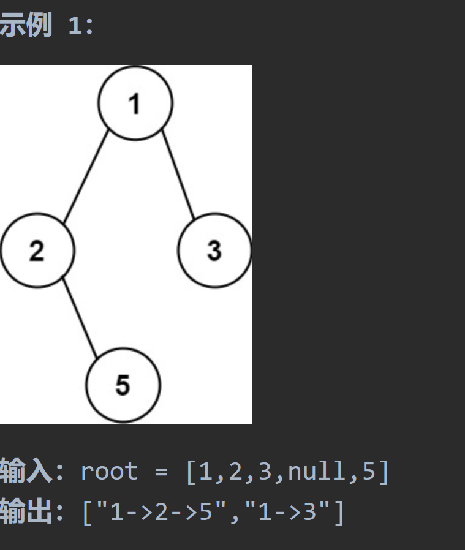

# 257二叉树的所有路径

## 题目要求：

给你一个二叉树的根节点 `root` ，按 **任意顺序** ，返回所有从根节点到叶子节点的路径。



## 第一想法

- 先想了想层序遍历，好像不太行；如果是递归那肯定是前序遍历；
- 这个输出结果还要加上->，以及要填充这个结果列表。
- 具体怎么解决没有想法。

## 题解

使用前序遍历，中-左-右；

### 核心：

到底为什么会有回溯，两种方法到底区别在哪——就是**`path`传参问题**

- 方法一传参传的是`String`类型，是一个不可变类型，这就造成了在递归时的局部独立性
- 方法二传参传的是`List<String>`，是一个可变类型，**传递的实际上是一个引用**，无论你怎样递归，其值都是一直在改变的，因为引用只指向了一个地方。

### 不体现回溯：

1. **独立的递归调用**：在每次递归调用中，都会创建一个新的字符串副本来表示当前路径。这保证了每个节点的路径是独立的，不会互相影响。
2. **无需显式恢复**：当递归从叶子节点返回到父节点时，由于每次递归都使用了新的字符串副本，因此不需要显式地恢复之前的路径状态。每个节点的路径状态是由其在递归树中的位置自然决定的

### 体现回溯：

- **传递引用**：当你传递一个对象（如列表、数组、或任何非基本类型）到一个方法时，你实际上传递的是对该对象的引用。这意味着在方法内对该对象的任何修改都会影响原始对象。
- **不创建副本**：由于传递的是引用，所以在递归调用过程中，并不会为 `paths` 列表创建新的副本。相反，每次递归调用 `traversal` 时，都是在操作同一个 `paths` 列表对象。

## 代码一（不直接体现回溯）

```java
class Solution {
    public List<String> binaryTreePaths(TreeNode root) {
        List<String> paths = new ArrayList<>();
        if (root != null){
            constructPaths(root,"",paths);
        }
        return paths;
    }

    /**
     * 构建所要求的路径
     * @param root 当前根结点
     * @param path 当前路径
     * @param paths 结果路径列表
     */
    private void constructPaths(TreeNode root, String path, List<String> paths){
        if (root != null){//中
            path += Integer.toString(root.val);
            //遇到叶子结点了
            if (root.left == null && root.right == null){
                paths.add(path);
            }else {
                path += "->";//继续向下探索
                constructPaths(root.left,path,paths);//左
                /**
                 * 这样一个递归的过程就实现了回溯，对于每一次递归而言path是局部变量
                 * 当其回溯过来时，例如现在的path状态还是一开始进入左边之前的状态
                 * 递归真的很奇妙。
                 */
                constructPaths(root.right,path,paths);//右
            }
        }
    }
}
```

## 代码二：（体现回溯）

```java
class Solution {
    public List<String> binaryTreePaths(TreeNode root) {
        ArrayList<String> result = new ArrayList<>();
        if (root == null) return result;
        List<Integer> paths = new ArrayList<>();
        traversal(root,paths,result);
        return result;
    }

    private void traversal(TreeNode root, List<Integer> paths, List<String> result){
        paths.add(root.val);//中
        //只记录到叶子结点处
        if (root.left == null && root.right == null){
            //拼接字符串
            StringBuilder sb = new StringBuilder();
            for (int i = 0; i < paths.size() - 1; i++) {//为什么-1，因为最后一个结点后面不用加连接符
                sb.append(paths.get(i)).append("->");//可以连用append
            }
            sb.append(paths.get(paths.size() - 1));//将最后一个结点加入进来
            result.add(sb.toString());
            return;
        }
        //左右
        if (root.left != null){
            traversal(root.left,paths,result);
            paths.remove(paths.size() - 1);//回溯，去掉当前最后一个元素（即叶子结点）回到上一次探索到的位置
        }
        if (root.right != null){
            traversal(root.right,paths,result);
            paths.remove(paths.size() - 1);
        }
        //最后实现了前序递归
    }
}
```

