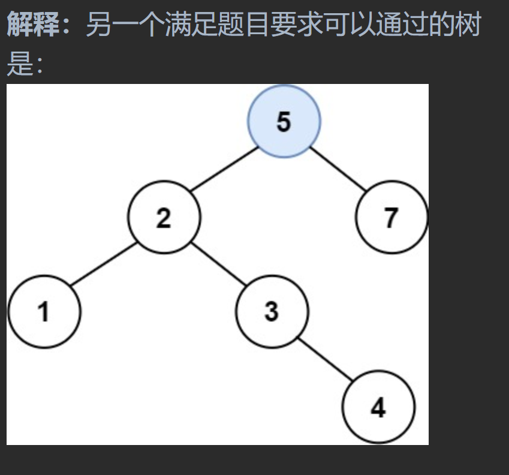

# 700二叉搜索树中的搜索

## 题目要求

给定二叉搜索树（BST）的根节点 `root` 和一个整数值 `val`。

你需要在 BST 中找到节点值等于 `val` 的节点。 返回以该节点为根的子树。 如果节点不存在，则返回 `null`


## 第一想法

利用二叉搜索树的特性，直接层序迭代暴力解决

递归如何写呢？

## 题解

### 迭代

```java
class Solution {
    public TreeNode searchBST(TreeNode root, int val) {
        /**
         * 二叉搜索树的特点是整棵树的左右孩子都要满足左小右大或者左大右小的原则。
         * 在找这个值的时候每次与根去比较就知道该往左还是该往右走
         * 递归还是迭代？，迭代模拟试试
         */
        Deque<TreeNode> deque = new ArrayDeque<>();
        deque.offer(root);
        while (! deque.isEmpty()){
            TreeNode node = deque.poll();
            if (node.val == val){
                return node;
            }else if (node.val < val){
                if (node.right != null) deque.offer(node.right);
                else return null;
            }else {
                if (node.left != null) deque.offer(node.left);
                else return null;
            }
        }
        return null;
    }
}
```

- 这样写太暴力了，代码也比较冗余，能否有一个更为简洁的写法——冗余的原因是使用了辅助队列，其实根据二叉搜索树的特点，可以不需要队列进行迭代。

```java
class Solution {
    public TreeNode searchBST(TreeNode root, int val) {
        //
        while (root != null){
            if (val < root.val) root = root.left;
            else if (val > root.val) root = root.right;
            else return root;
        }
        return null;
    }
}
```


### 递归

- 在递归时不必拘泥于怎样前中后序，更应该考虑的是二叉搜索树的特点。

```java
class Solution {
    public TreeNode searchBST(TreeNode root, int val) {
       //递归如何写
        if (root == null || root.val == val){
            return root;//这算是递归的结束条件吗？
        }
        //进行递归，这里不必拘泥与怎么样遍历
        if (root.val > val){
            return searchBST(root.left, val);
        }else {
            return searchBST(root.right, val);
        }
    }
}
```

# 98验证二叉搜索树

## 题目要求

判断给出的树是否为二叉搜索树

## 第一想法

层序遍历对于每一层的根结点判断？

## 题解

利用二叉搜索树的特点：**中序遍历出的结果是有序的**。

### 方法一：转为数组比较

```java
class Solution {
    private List<Integer> list = new ArrayList<>();
    public boolean isValidBST(TreeNode root) {
        /**
         * 中序遍历过程得到的序列是一个有序递增序列
         * 使用列表来记录结点判断其是否递增
         */
        list.clear();
        traverse(root);
        for (int i = 1; i < list.size(); i++) {
            if (list.get(i) <= list.get(i - 1)) return false;
        }
        return true;
    }
    private void traverse(TreeNode root){
        //其实这样对于每一个结点来说都是左中右这样的遍历方式,所以时间复杂度上去了。
        if (root == null) return;
        traverse(root.left);//左
        list.add(root.val);//中
        traverse(root.right);//右
    }
}
```

- 时刻保持着中序遍历的节奏；
- 时间复杂度高

### 方法二：递归遍历时比较I

- 这个方法比较难理解:使用了一个**max结点来记录上一次**中序遍历到的结点，为了保证中序的递增性，故要求max结点的值一定小于root（当前）结点的值。

```java
class Solution {
    private TreeNode max;//max代表着上一次遍历到的结点
    public boolean isValidBST(TreeNode root) {
        /**
         * 在递归的过程中直接比较
         */
        if (root == null) return true;//递归终止条件，空树也是二叉搜索树
        //对左子树进行判断
        boolean left = isValidBST(root.left);
        if (! left){
            return false;//如果直接写return left，那么后面的代码永远得不到执行。
        }
        if (max != null && root.val <= max.val) return false;//root代表着当前结点，当前结点要大于上一次结点
        max = root;
        //右
        boolean right = isValidBST(root.right);
//        if (! right){
//            return false;
//        }
        return right;//不是不如左边，而是最后是整个方法需要一个返回值且中序最后就是右边。
    }
}
```

- 注意对左右子树判断时的写法，前者不能直接`return left`,后者不能进行条件判断，因为右子树判断同时也是整个过程的最终。

### 方法二：递归遍历时比较II

- 上面的方法其实是为了避免此方法中申请的最大值不够小(还是上一次遍历得到的值）。
- 简单的中序遍历递归：

```java
class Solution {
    private long prev = Long.MIN_VALUE;//用来记录上一次遍历到的值
    public boolean isValidBST(TreeNode root) {
        if (root == null) return true;
        if (! isValidBST(root.left)) return false;
        if (root.val <= prev) return false;
        prev = root.val;
        return isValidBST(root.right);
    }
}
```

### 方法三：迭代

```java
class Solution {
    public boolean isValidBST(TreeNode root) {
        /**
         * 使用栈模拟中序递归过程，一路向左，然后中右处理每一个结点。都要保证有序性
         */
        if (root == null) return true;
        Stack<TreeNode> stack = new Stack<>();
        TreeNode pre = null;//记录上一次遍历到的结点
        while (root != null || ! stack.isEmpty()){
            while (root != null){
                stack.push(root);
                root = root.left;//将左边全部入栈
            }
            //中，处理
            TreeNode node = stack.pop();
            if (pre != null && node.val <= pre.val) return false;
            pre = node;
            //对当前结点node的右孩子进行处理
            root = node.right;
        }
        return true;
    }
}
```


# 530二叉搜索树中最小绝对差

## 题目要求：

给你一个二叉搜索树的根节点 `root` ，返回 **树中任意两不同节点值之间的最小差值** 。

差值是一个正数，其数值等于两值之差的绝对值。

## 第一想法：

- 转换为数组求？
- 他求的是任意结点之间诶；这道题目跟二叉搜索树有什么关系吗？

## 题解：

本题的唯一核心点，为什么跟二叉搜索树有关：我们知道，中序遍历下二叉搜索树为有序递增序列，**对于一个递增序列，最小差值只会出现在相邻结点之间**，不会出现在不相邻结点，因为A、B和C（其中A < B < C），B与A的差值和C与B的差值都不会大于C与A的差值

### 方法一：递归

- 中序遍历对于中的处理中找到相邻的最小差值。

```java
class Solution {
    private TreeNode prev;
    private int minValue = Integer.MAX_VALUE;
    public int getMinimumDifference(TreeNode root) {
        inorder(root);
        return minValue;
    }
    private void inorder(TreeNode root){
        if (root == null) return;
        inorder(root.left);
        //中，处理
        if (prev != null){
            minValue = Math.min(minValue,root.val - prev.val);
        }
        prev = root;//更新上一个结点
        inorder(root.right);
    }
}
```

### 方法二：迭代

普通中序栈迭代，其实跟二叉树的中序遍历迭代相同只是在处理结点时增添了特定的题目条件。

```java
class Solution {
    private TreeNode pre;
    Stack<TreeNode> stack;
    public int getMinimumDifference(TreeNode root) {
        //可以复习一下二叉树的第一节。
        if (root == null) return 0;
        stack = new Stack<>();
        TreeNode cur = root;//使用栈迭代就要设置工作指针指向当前结点
        int result = Integer.MAX_VALUE;
        while (cur != null || ! stack.isEmpty()){
            if (cur != null){
                //一路向左
                stack.push(cur);
                cur = cur.left;
            }else {//向左完后得回来处理中右
                cur = stack.pop();
                if (pre != null){
                    result = Math.min(result,cur.val - pre.val);
                }
                pre = cur;
                cur = cur.right;//右
            }
        }
        return result;
    }
}
```

# 501二叉搜索树中的众数

## 题目要求：

给你一个含重复值的二叉搜索树（BST）的根节点 `root` ，找出并返回 BST 中的所有 [众数](https://baike.baidu.com/item/众数/44796)（即，出现频率最高的元素）。

## 第一想法

- 本题烦人的点在于众数不止一个，且函数返回值类型为数组类型
- 还是利用搜索树的中序有序？左中右这样去遍历，在中时进行条件的判断，如果上一个遍历的结点与当前相等？
- 众数在中序下只能是连着一起相等，至少两个；每次出现相等都要记录其频率？然后后面再遇到相等的去比较频率？最关键的是你得暂时记录这次相等的值吧，该怎么记录呢？

## 题解：

1. 关于暂时记录值与当前频率问题，可以使用哈希表

2. 确实如第一想法里第二条所说，我们比较前一个与当前即可，可以暂时将某个众数放入结果集当中；当他不是众数时再更新最大频率将其拿出结果集即可。

### 代码一：中序递归条件判断

- 同530一样，设置了prev来比较前后两次；有点不同的是**这道题先设置了prev为空，为了记录第一次的频率**。

```java
class Solution {
    private TreeNode prev = null;
    private int maxCount = 0;
    private int currentcount = 0;
    private List<Integer> result = new ArrayList<>();
    public int[] findMode(TreeNode root) {
        prev = null;
        maxCount = 0;
        currentcount = 0;//这里两次赋值是因为良好的编码习惯，其实赋值相同并不影响。
        result.clear();
        searchMode(root);
        //转换为数组输出
        int[] resultI = new int[result.size()];
        for (int i = 0; i < result.size(); i++) {
            resultI[i] = result.get(i);
        }
        return resultI;
    }
    private void searchMode(TreeNode cur){
        if (cur == null) return;
        //进行中序遍历
        searchMode(cur.left);
        //中，进行处理,三种情况，后两种多见
        if (prev == null){
            currentcount =1;//意味着第一个结点，还没有前一个结点
        }else if (prev.val == cur.val){
            currentcount ++;
        }else {
            currentcount = 1;//只记录这一次的当前频率
        }
        //将当前计数值与最大计数值比较
        if (currentcount == maxCount){
            result.add(cur.val);
        }
        if (currentcount > maxCount){
            maxCount = currentcount;
            result.clear();//清空之前的众数
            result.add(cur.val);
        }
        prev = cur;//千万别少了这重要的一步。
        //
        searchMode(cur.right);
    }
}
```

### 代码二:迭代

- 迭代的大体过程同530，在中右处理时加入题目自身逻辑即可。
- 注意最后将列表转换为数组的操作，*先将其流化，再将list流转变为int流（转变过程中用到了方法引用）最后将int流数组化*。

```java
class Solution {
    public int[] findMode(TreeNode root) {
        TreeNode prev = null;
        Stack<TreeNode> stack = new Stack<TreeNode>();
        List<Integer> result = new ArrayList<>();
        int maxCount = 0;
        int count = 0;
        TreeNode cur = root;
        while (cur != null || !stack.isEmpty()){
            //先一路向左
            if (cur != null){
                stack.push(cur);
                cur = cur.left;
            }else {//对中间结点进行操作
                cur = stack.pop();
                if (prev == null || prev.val != cur.val){
                    count = 1;
                }else {
                    count ++;
                }
                //
                if (count == maxCount){
                    result.add(cur.val);
                }else if (count > maxCount){
                    maxCount = count;
                    result.clear();
                    result.add(cur.val);
                }//if语句可以不写else的吗
                prev = cur;
                cur = cur.right;
            }
        }
        //最后将list列表转换为int数组,intvalue使用了方法引用更加简洁
        return result.stream().mapToInt(Integer::intValue).toArray();
    }
}
```

- 哦原来if条件判断即使后面有`else if`也可以最后不写`else`的啊，只要所有情况已经覆盖完了。

# 235二叉搜索树的最近公共祖先

## 题目要求

给定一个二叉搜索树, 找到该树中两个指定节点的最近公共祖先。


## 第一想法：

与普通二叉树有何不同，不知道该如何利用二叉搜索树的性质。

## 题解：

二叉搜索树与普通树不同的地方在于，其具有方向性（有序），所以普通树需要回溯，二叉搜索树不需要。

它只需要去找区间即可，**在pq的区间内的第一个结点即最近公共祖先**（从上往下看）；如果不在区间内？

- 不在区间内就看其大于这个区间（去左边找），小于这个区间（去右边找）
- 一旦在区间即找到，需要**立即返回**。

### 代码一：递归

*不分前中后序，因为对中间结点没有特殊处理*（只有返回）

```java
class Solution {
    public TreeNode lowestCommonAncestor(TreeNode root, TreeNode p, TreeNode q) {
        //递归结束条件
        if (root == null) return null;
        return LCAHelper(root,p,q);
    }
    private TreeNode LCAHelper(TreeNode cur,TreeNode p,TreeNode q){
        if (cur == null) return cur;
        //
        if (cur.val > p.val && cur.val > q.val){
            //在区间的右边了，需要往左走
            TreeNode left = LCAHelper(cur.left,p,q);
            if (left != null) return left;//一旦找到立即返回结果
        }
        //
        if(cur.val < p.val && cur.val < q.val){
            TreeNode right = LCAHelper(cur.right,p,q);
            if (right != null) return right;
        }
        //在这两种情况之外就是在区间里了，即满足条件
        return cur;
    }
}
```

### 代码二：迭代

由于不分顺序，所以原本迭代法队列和栈是模拟前中后序的，现在也不需要了，直接进行迭代即可。

```java
class Solution {
    public TreeNode lowestCommonAncestor(TreeNode root, TreeNode p, TreeNode q) {
        if (root == null) return root;
        while (true){
            if (root.val > p.val && root.val > q.val){
                root = root.left;
            }else if (root.val < p.val && root.val < q.val){
                root = root.right;
            }else {
                break;
            }
        }
        return root;
    }
}
```

# 701二叉搜索树的插入操作

## 题目要求

给定二叉搜索树（BST）的根节点 `root` 和要插入树中的值 `value` ，将值插入二叉搜索树。 返回插入后二叉搜索树的根节点。 输入数据 **保证** ，新值和原始二叉搜索树中的任意节点值都不同




## 第一想法

考研的知识点吧，从根节点进来，先比较大小，大的往右边走；再继续比较大小；我怎么记得还要变换一下？对好像要换根什么的旋转？

## 题解：

还是以解题为主线出发，可以不用更改树的结构，简单地插入进去即可。

- 迭代法也是可以实现的，必须**记录当前操作结点的父节点**，才可以完成插入操作。（所以需要一个辅助结点）
- 递归法注意递归返回值作为左右孩子直接接住，而最后返回的root是整个树的索引。

### 代码一递归

```java
class Solution {
    public TreeNode insertIntoBST(TreeNode root, int val) {
        //迭代好像有点难以实施，因为要不停的比较大小，所以还是递归吧
        if (root == null) return new TreeNode(val);
        if (root.val < val) root.right = insertIntoBST(root.right,val);
        if (root.val > val) root.left = insertIntoBST(root.left,val);
        return root;//最后返回的root是整颗树的一个引用
    }
}
```

### 代码二：迭代

需要保存当前结点的父节点为了进行插入操作，有点像链表的插入了。

```java
class Solution {
    public TreeNode insertIntoBST(TreeNode root, int val) {
        if (root == null) return new TreeNode(val);
        //其实就是找到合适的空结点去插入
        TreeNode prev = root;//保存当前结点的父节点
        TreeNode cur = root;//工作指针
        while (cur != null){
            prev = cur;//保存
            if (cur.val > val){
                cur = cur.left;
            }else if (cur.val < val){
                cur = cur.right;
            }
        }
        //一旦出了这个while循环意味着cur走到了空结点要准备插入新节点了,这时刚刚保存的空结点的父节点就起到作用了
        if (prev.val > val){
            prev.left = new TreeNode(val);
        }else if (prev.val < val){
            prev.right = new TreeNode(val);
        }

        return root;
    }
}
```

# 450二叉搜索树的删除

## 题目要求：

给定一个二叉搜索树的根节点 **root** 和一个值 **key**，删除二叉搜索树中的 **key** 对应的节点，并保证二叉搜索树的性质不变。返回二叉搜索树（有可能被更新）的根节点的引用。

一般来说，删除节点可分为两个步骤：

1. 首先找到需要删除的节点；
2. 如果找到了，删除它。
3. 

## 第一想法

考研时应该做过相关的理论题目，情况比较复杂。（但不是要rr旋转的那种，那是平衡二叉树AVL树）

分情况：

- 如果此时删除的结点既有左子树又有右子树，用**右子树的最小结点**替换（可以保证换后仍满足条件）或者**左子树的最大结点**
- 如果删除结点只有一个孩子，将子节点提升到其位置
- 如果删除的为叶子节点，删就删了。

怎么写呢，对于前两种情况。需要用到三种遍历方式吗？

## 题解：

分情况就是想法中的三种情况，无需三种遍历方式（我发现二叉搜索树的部分题目只需要跟着题目条件走递归就行了）

如何写：不断地去进行条件判断以及递归，递归的过程都是引用传递。大体过程就是：先去左右递归寻找值匹配的，如果找到了进入三种情况比较。

- 在找右子树的最小节点时思路也很巧妙：首先一路向左找到值，然后**替换掉值**，无需替换结点，最后去删除最小值所在结点即可。

```java
class Solution {
    public TreeNode deleteNode(TreeNode root, int key) {
        if(root == null) return null;
        //先去左右寻找
        if (key < root.val){
            root.left = deleteNode(root.left,key);
        }else if (key > root.val){
            root.right = deleteNode(root.right,key);
        }else {
            //找到要删除的结点了
            //情况一：叶子结点
            if (root.left == null && root.right == null){
                root = null;
            }
            else if (root.left == null){
                //只有右子树
                root = root.right;
            }
            else if (root.right == null){
                root = root.left;
            }
            else {
                //既有左子树又有右子树，去找右子树的最小结点
                TreeNode minnode = findMinNode(root.right);
                root.val = minnode.val;
                //更换掉值后要删除最小结点
                root.right = deleteNode(root.right,root.val);//用right来接收删除后的右子树
            }
        }
        return root;
    }

    /**
     * 找到二叉搜索树某子树的最小结点
     * @param node 当前搜索树的根节点
     * @return
     */
    private TreeNode findMinNode (TreeNode node){
        while (node.left != null){
            node = node.left;
        }
        return node;
    }
}
```

# 669修剪二叉搜索树

## 题目要求：

给你二叉搜索树的根节点 `root` ，同时给定最小边界`low` 和最大边界 `high`。通过修剪二叉搜索树，使得所有节点的值在`[low, high]`中。修剪树 **不应该** 改变保留在树中的元素的相对结构 (即，如果没有被移除，原有的父代子代关系都应当保留)。 可以证明，存在 **唯一的答案** 。

所以结果应当返回修剪好的二叉搜索树的新的根节点。注意，根节点可能会根据给定的边界发生改变


## 第一想法：

- 这个左右边界，如果右边界小于等于根，那就得从根开始全部往左边去看，

- 所以如果不考虑太极端的因素，我可以假设左边界是在左子树上的，右边界在右子树上的，左右遍历（递归？）找到low和high所在的结点（应该是最接近low和high的结点，因为还有可能没有直接等于的；

- 删除结点也是一个难关，还要保持元素的相对结构，在这种二叉树中删除结点往往与链表相似，都需要记录删除结点的父节点。比如删除0就得让3的left直接指向2；所以删的时候得判断当前结点是否还有子树
- 如何体现搜索树呢，在去找左右的过程中吗？

## 题解：

递归虐我千百遍，后面还有更难的怎么办？

```java
class Solution {
    public TreeNode trimBST(TreeNode root, int low, int high) {
        //其实不用思考那么多的情况
        if (root == null) return root;//递归结束条件
        //直接从当前结点值进行分析,由搜索树的性质决定走向
        if (root.val < low){
            //如果当前根结点的值比下界还要小，那么至少左子树不用管了，要对右子树再进行处理
            TreeNode right = trimBST(root.right,low,high);
            return right;
        }else if (root.val > high){
            //如果当前根比上届都要大了，就不管右边的了，去判断左边
            TreeNode left = trimBST(root.left,low,high);
            return left;
        }
        //出了这两个条件，那么当前根结点就在范围之内了，但我们也不能保证它的左右都在范围之内，所以都要去判断
        root.left = trimBST(root.left,low,high);
        root.right = trimBST(root.right,low,high);//这里不用return是因为当前结点是满足条件的，递归处理左右就行了。

        return root;
    }
}
```

