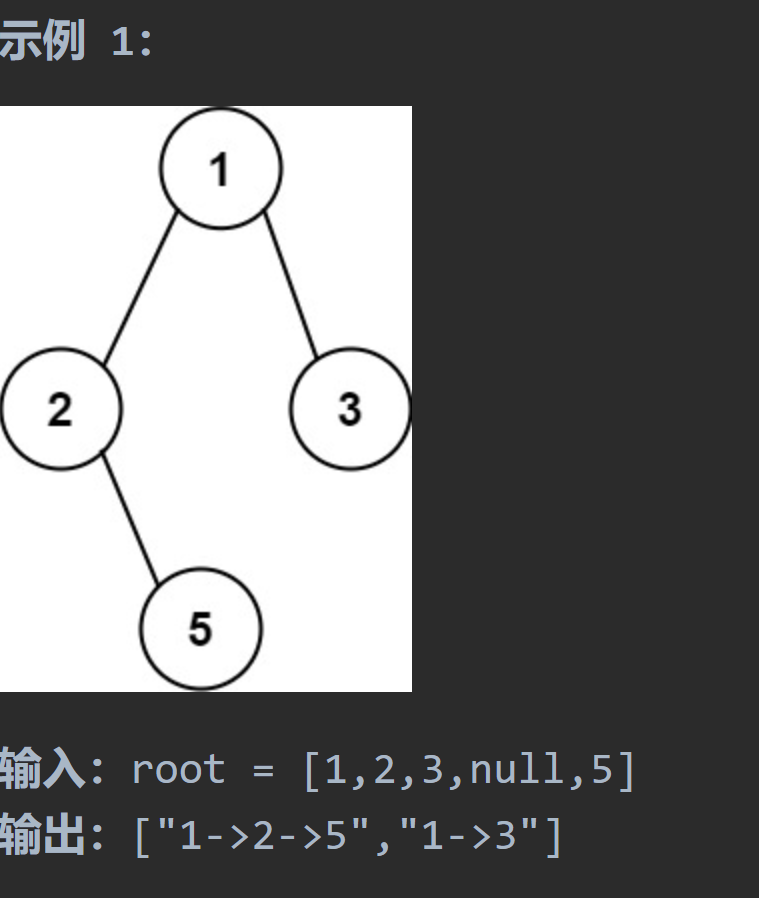
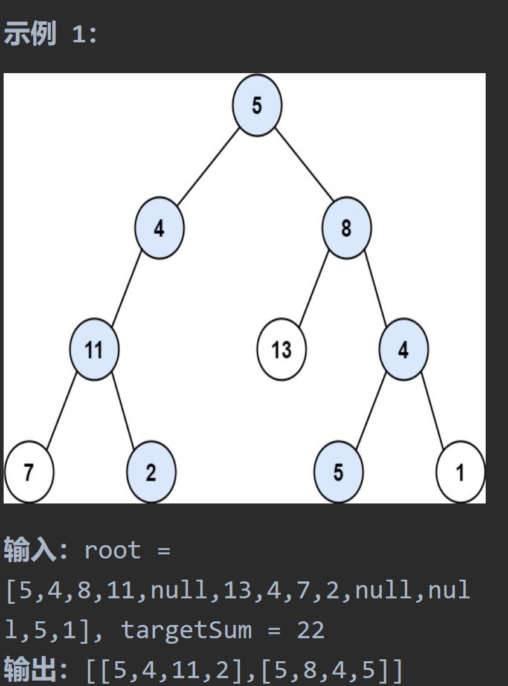

# 257二叉树的所有路径

## 题目要求：

给你一个二叉树的根节点 `root` ，按 **任意顺序** ，返回所有从根节点到叶子节点的路径。



## 第一想法

- 先想了想层序遍历，好像不太行；如果是递归那肯定是前序遍历；
- 这个输出结果还要加上->，以及要填充这个结果列表。
- 具体怎么解决没有想法。

## 题解

使用前序遍历，中-左-右；

### 核心：

到底为什么会有回溯，两种方法到底区别在哪——就是**`path`传参问题**

- 方法一传参传的是`String`类型，是一个不可变类型，这就造成了在递归时的局部独立性
- 方法二传参传的是`List<String>`，是一个可变类型，**传递的实际上是一个引用**，无论你怎样递归，其值都是一直在改变的，因为引用只指向了一个地方。

### 不体现回溯：（String）

1. **独立的递归调用**：在每次递归调用中，都会创建一个新的字符串副本来表示当前路径。这保证了每个节点的路径是独立的，不会互相影响。
2. **无需显式恢复**：当递归从叶子节点返回到父节点时，由于每次递归都使用了新的字符串副本，因此不需要显式地恢复之前的路径状态。每个节点的路径状态是由其在递归树中的位置自然决定的

### 体现回溯：

- **传递引用**：当你传递一个对象（如列表、数组、或任何非基本类型）到一个方法时，你实际上传递的是对该对象的引用。这意味着在方法内对该对象的任何修改都会影响原始对象。
- **不创建副本**：由于传递的是引用，所以在递归调用过程中，并不会为 `paths` 列表创建新的副本。相反，每次递归调用 `traversal` 时，都是在操作同一个 `paths` 列表对象。

## 代码一（不直接体现回溯）

```java
class Solution {
    public List<String> binaryTreePaths(TreeNode root) {
        List<String> paths = new ArrayList<>();
        if (root != null){
            constructPaths(root,"",paths);
        }
        return paths;
    }

    /**
     * 构建所要求的路径
     * @param root 当前根结点
     * @param path 当前路径
     * @param paths 结果路径列表
     */
    private void constructPaths(TreeNode root, String path, List<String> paths){
        if (root != null){//中
            path += Integer.toString(root.val);
            //遇到叶子结点了
            if (root.left == null && root.right == null){
                paths.add(path);
            }else {
                path += "->";//继续向下探索
                constructPaths(root.left,path,paths);//左
                /**
                 * 这样一个递归的过程就实现了回溯，对于每一次递归而言path是局部变量
                 * 当其回溯过来时，例如现在的path状态还是一开始进入左边之前的状态
                 * 递归真的很奇妙。
                 */
                constructPaths(root.right,path,paths);//右
            }
        }
    }
}
```

## 代码二：（体现回溯）

```java
class Solution {
    public List<String> binaryTreePaths(TreeNode root) {
        ArrayList<String> result = new ArrayList<>();
        if (root == null) return result;
        List<Integer> paths = new ArrayList<>();
        traversal(root,paths,result);
        return result;
    }

    private void traversal(TreeNode root, List<Integer> paths, List<String> result){
        paths.add(root.val);//中
        //只记录到叶子结点处
        if (root.left == null && root.right == null){
            //拼接字符串
            StringBuilder sb = new StringBuilder();
            for (int i = 0; i < paths.size() - 1; i++) {//为什么-1，因为最后一个结点后面不用加连接符
                sb.append(paths.get(i)).append("->");//可以连用append
            }
            sb.append(paths.get(paths.size() - 1));//将最后一个结点加入进来
            result.add(sb.toString());
            return;
        }
        //左右
        if (root.left != null){
            traversal(root.left,paths,result);
            paths.remove(paths.size() - 1);//回溯，去掉当前最后一个元素（即叶子结点）回到上一次探索到的位置
        }
        if (root.right != null){
            traversal(root.right,paths,result);
            paths.remove(paths.size() - 1);
        }
        //最后实现了前序递归
    }
}
```

# 112路径总和

## 题目要求

给定一个二叉树和一个目标和，判断该树中是否存在根节点到叶子节点的路径，这条路径上所有节点值相加等于目标和。

## 第一想法

- 与所有路径有相似之处但不多，可以在前者身上修改，比如加入一个求和的变量？

- 是否还需要像上面那样记录路径（转为字符串那样）

## 题解

### 递归：（前序遍历）

- 确定参数和返回值类型：根，计数器；其中计数器可以由题目所给的参数完成，可以将此参数进行递减
- 递归终止条件：如果找到叶子结点且满足条件返回true
- 单层递归逻辑：对于左右子树也进行如此判断，一旦返回为true，整个函数也要返回true

通过Java的特性：值传递，也很好地解决了回溯问题。`targetSum`对于每个递归调用都是值传递，只表现当前的值，一旦退出递归就会回到父节点的状态（并没有发生改变）

### 迭代：

- 使用两个队列，一个保存结点，一个保存当前总和。其他逻辑与之前操作一样。

## 代码解决

### 递归

```java
class Solution {
    public boolean hasPathSum(TreeNode root, int targetSum) {
        /**
         * 在二叉树的所有路径的基础上加一点判断？
         */
        if (root == null) return false;
        targetSum -= root.val;
        if (root.left == null && root.right == null){
            return targetSum == 0;
        }
        if (root.left != null){
            boolean left = hasPathSum(root.left,targetSum);
            if (left) return true;//左边找到正确的路径了
        }
        if (root.right != null){
            boolean right = hasPathSum(root.right,targetSum);
            if (right) return true;
        }

        return false;
    }
}
```

### 迭代(两个队列)

```java
class Solution {
    public boolean hasPathSum(TreeNode root, int targetSum) {
        //迭代法使用两个队列（栈）存储当前路径（结点）和当前的总和也比较直观
        if (root == null) return false;
        Deque<TreeNode> nodeDeque = new ArrayDeque<>();
        Deque<Integer> sumDeque = new ArrayDeque<>();

        nodeDeque.offer(root);
        sumDeque.offer(root.val);
        while (! nodeDeque.isEmpty()){
            int len = nodeDeque.size();
            while (len -- > 0){
                TreeNode currentNode = nodeDeque.poll();
                int currentSum = sumDeque.poll();
                if (currentNode.left == null && currentNode.right == null && currentSum == targetSum){
                    return true;
                }
                if (currentNode.left != null){
                    nodeDeque.offer(currentNode.left);
                    sumDeque.offer(currentSum + currentNode.left.val);
                }
                if (currentNode.right != null){
                    nodeDeque.offer(currentNode.right);
                    sumDeque.offer(currentSum + currentNode.right.val);
                }
            }
        }
        return false;
    }
}
```

# 113路径总和II

## 题目要求：

给你二叉树的根节点 `root` 和一个整数目标和 `targetSum` ，找出所有 **从根节点到叶子节点** 路径总和等于给定目标和的路径。



## 第一想法

这道题算是将257和112结合在一起了，先想想怎么做吧。

## 题解

- 最好使用有回溯的方法，可以更加清晰。
- 在257回溯的基础上加上一个目标值参数，且将回溯逻辑更简洁地写在了左右递归之后。
- 关于回溯的代码如果判断左右之后没有额外操作可以只写在最后一句；如果有额外操作，就在各自左右探索结束之后加入一句回溯。

## 代码解决

```java
class Solution {
    public List<List<Integer>> pathSum(TreeNode root, int targetSum) {
        List<List<Integer>> paths = new ArrayList<>();
        findPaths(root,targetSum,new ArrayList<Integer>(),paths);
        return paths;
    }

    /**
     * 返回的是路径，函数的返回值类型为null，（void）
     * @param node 对象，引用传递
     * @param targetSum 值传递
     * @param currentPath 当前路径：引用传递，一直在变化
     * @param paths 结果路径：引用传递
     */
    private void findPaths(TreeNode node, int targetSum, List<Integer> currentPath, List<List<Integer>> paths){
        if (node == null) return;
        currentPath.add(node.val);
        //
        if (node.left == null && node.right == null && targetSum == node.val){
            paths.add(new ArrayList<Integer>(currentPath));//因为currentPath是引用传递，值一直在变化所以需要新建一个列表传入paths
        }else {
            findPaths(node.left,targetSum - node.val,currentPath, paths);
            findPaths(node.right,targetSum - node.val, currentPath, paths);
        }
        //走到这里证明左右都没找到想要的路径,需要对当前路径进行回溯
        currentPath.remove(currentPath.size() - 1);
    }
}
```

# 递归时值传递引用传递

## 值传递：

**基本数据类型（如 `int`, `float`, `char`, `boolean` 等）**：

- **创建副本**：基本数据类型在递归（或任何函数调用）中总是传递值的副本。对这些副本的任何修改都不会影响原始数据。

**`String` 和其他不可变对象**：

- **看似创建副本，实际不是**：`String` 和其他不可变对象（如 `Integer`, `Long`）在 Java 中是特殊的，因为它们是不可变的。每次你看似修改它们时，实际上是创建了一个新的对象。在递归调用中，即使传递了这些对象的引用，由于它们的不可变性，所有的修改都会导致新对象的创建

## 引用传递：

**对象和数组**：

- **不创建副本**：对象（包括数组）的引用被传递。实际上传递的是对象引用的副本，而不是对象本身的副本。这意味着在递归调用中对对象的修改会影响原始对象

**集合类型（如 `List`, `Set`, `Map` 等）**：

- **不创建副本**：集合类型在递归调用中传递的是它们的引用的副本。这意味着在递归过程中对集合的任何修改都会反映到原始集合上
