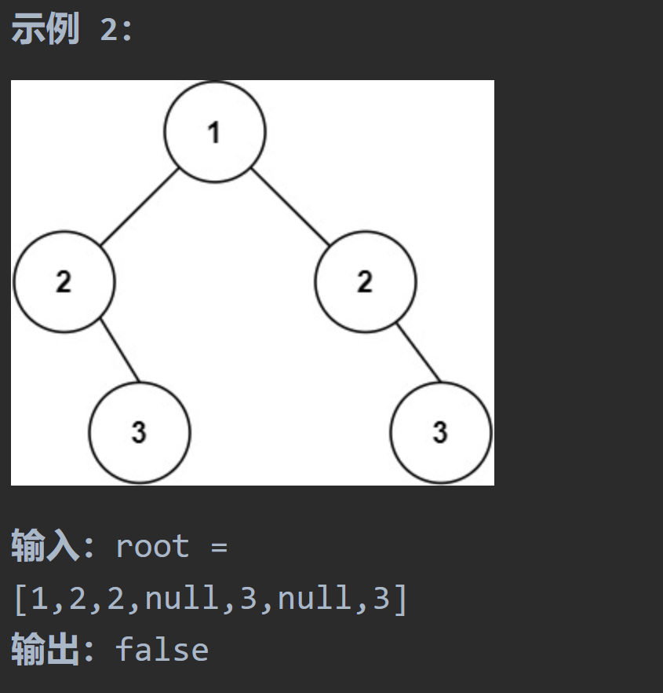

# 226 翻转二叉树

##  题目要求：

##  第一想法：

没想法，蠢的一。

##  题解：
交换每个子树的根节点的左右孩子即可。三种解法，也代表着不同的遍历方式。二叉树的题目，如何遍历很重要。
###  递归：
最好使用前序或者后序遍历，中的作用在于交换左右，左右作用递归。
不建议使用中序，因为他会把刚刚交换好的左子树在中时交换到右边去。
注意这里的交换是指针的交换，并不是单纯的节点交换。

```java
class Solution {
    public TreeNode invertTree(TreeNode root) {
        //递归法，前序 中左右
        if (root == null) return null;
        swapNode(root);
        invertTree(root.left);
        invertTree(root.right);
        return root;
    }
    public void swapNode(TreeNode root){
        TreeNode temp = null;
        temp = root.left;
        root.left = root.right;
        root.right = temp;
    }
}
```
### 迭代法：
注意为什么最后返回root——在这个问题中，栈实际上没有修改原始根节点。相反，它只是用来帮助我们按正确的顺序处理所有节点。因此，在最后返回结果时，我们仍然返回原始根节点。
```c++
class Solution {
public:
    TreeNode* invertTree(TreeNode* root) {
        if(root == NULL) return root;
        stack<TreeNode*> stack;
        stack.push(root);
        while(! stack.empty())
        {
            //中
            TreeNode* node = stack.top();
            stack.pop();
            swap(node->left,node->right);
            //左右
            if(node->right) stack.push(node->right);
            if(node->left) stack.push(node->left);
        }
        return root;//结果其实都是pop出去的，但是最后root是怎么更改的呢？
    }
};
```

###  层序遍历法：
遍历到每一层时对于层节点去交换其左右子树。
注意刚开始的条件与前两者有些不同之处。要先入队。

```java
class Solution {
    public TreeNode invertTree(TreeNode root) {
        //层序遍历
        if (root == null) return null;
        ArrayDeque<TreeNode> deque = new ArrayDeque<>();
        deque.offer(root);
        while (! deque.isEmpty()){
            int size = deque.size();
            while (size -- > 0){
                TreeNode node = deque.poll();
                swapNode(node);
                if (node.left != null) deque.offer(node.left);
                if (node.right != null) deque.offer(node.right);
            }
        }
        return root;
    }
    public void swapNode(TreeNode root){
        TreeNode temp = null;
        temp = root.left;
        root.left = root.right;
        root.right = temp;
    }
}
```

# 101对称二叉树
##  题目要求：



```html
输入：root = [1,2,2,3,4,4,3]
输出：true
```
##  第一想法：
没想法，蠢的一。
##  题解：

### 本质：

- 比较左右子树的外侧和内侧，对于某个父节点，要比较其兄弟结点的子节点与自己的子节点，并且外侧内侧去比较。

####  递归法：
- 首先，这道题的本质是确定根节点的左右子树是否是可以相互翻转的，那怎么判断呢？
- 要把子树分为内侧和外侧，外侧的值去比较，内侧的值去比较，只有都相同才可以。
- 那么本题使用什么遍历方法呢？由于要递归，我们本质是去比较某个根节点的内外侧，所以必须得先把左右孩子都判断完，**故左右中后序遍历是必须且唯一的顺序**
- 在每次判读前我们还要做健壮性的判断，比如一边为空一边不为空，那一定是不对称的。

代码中的`left right`其实代表的是**两边子树此时的外侧和内侧，而不是某个单一节点的左右孩子。**

```java
class Solution {
    public boolean isSymmetric(TreeNode root) {
        //递归法，每次比较的顺序是外侧、内侧，所以总体上看是左右中的一个遍历方式
        return compare(root.left,root.right);
    }

    /**
     *
     * @param left 子树a的左边（外侧）
     * @param right 子树b的右边（外侧）
     * @return
     */
    private boolean compare(TreeNode left,TreeNode right){
        //写出所有情况
        if (left == null && right != null){
            return false;
        }
        if (left != null && right == null){
            return false;
        }
        if (left == null && right == null){
            return true;
        }
        if (left.val != right.val){
            return false;
        }
        //进行递归
        boolean compareOutside = compare(left.left,right.right);//这里就可以明显看出在递归谁
        boolean compareInside = compare(left.right,right.left);
        return compareOutside && compareInside;
    }
}
```

####  迭代法（伪）
- 实际上跟层序迭代没什么关系了，用队列或者栈来成对比较外侧与内侧。
- 注意这个队列的底层声明使用了LinkedList，因为**`ArrayDeque`底层不允许将NULL入队。**

```java
class Solution {
    public boolean isSymmetric(TreeNode root) {
        //如果不递归，使用栈或者队列进行条件的判断
        Deque<TreeNode> deque = new LinkedList<>();
        deque.offer(root.left);
        deque.offer(root.right);
        while (! deque.isEmpty()){
            TreeNode leftNode = deque.poll();
            TreeNode rightNode = deque.poll();
            if (leftNode == null && rightNode == null){
                continue;//continue会到哪里？会直接回到while循环再次循环（因为这是都为空的情况）
            }
            //三个不满足的条件
            if (leftNode == null && rightNode != null){
                return false;
            }
            if (leftNode != null && rightNode == null){
                return false;
            }
            if (leftNode.val != rightNode.val){
                return false;
            }
            //能走到这里证明都不为空且值相等,对后续的结点继续入队处理，注意处理的顺序
            //并且注意在入队之前需要进行健壮性判断，否则ArrayDeque会空指针异常
            deque.offer(leftNode.left);
            deque.offer(rightNode.right);
            deque.offer(leftNode.right);
            deque.offer(rightNode.left);
        }
        return true;
    }
}
```

# 100 相同二叉树

## 题目要求

## 题解

## 代码一：递归

```java
class Solution {
    public boolean isSameTree(TreeNode p, TreeNode q) {
        //使用递归法
        if (p == null && q == null){
            return true;
        }
        if (p == null || q == null || p.val != q.val){
            return false;
        }
        return isSameTree(p.left,q.left) && isSameTree(p.right,q.right);
    }
}
```

## 代码二：迭代队列

```java
class Solution{
    public boolean isSameTree(TreeNode p, TreeNode q){
        //迭代方法
        Deque<TreeNode> deque = new LinkedList<>();
        deque.offer(p);
        deque.offer(q);
        while(! deque.isEmpty()){
            TreeNode node1 = deque.poll();
            TreeNode node2 = deque.poll();
            if(node1 == null && node2 == null){
                continue;
            }
            if(node1 == null || node2 == null || node1.val != node2.val){
                return false;
            }
            deque.offer(node1.left);
            deque.offer(node2.left);
            deque.offer(node1.right);
            deque.offer(node2.right);
        }
        return true;
    }
}
```

# 572另一棵树的子树

## 题目要求：

## 题解：

## 代码一：递归

```java
class Solution{
    public boolean isSubTree(TreeNode root,TreeNode subRoot){
        if(root == null){
            return subRoot == null;
        }
        if(isSameTree(root,subRoot)){
            return true;
        }
        return isSubTree(root.left,subRoot) || isSubTree(root.right,subRoot);
    }
    private boolean isSameTree(TreeNode p,TreeNode q){
        if(p == null && q == null) return true;
       	if(p == null || q == null || p.val != q.val){
            return false;
        }
        return isSameTree(p.left,q.left) && isSameTree(p.right,q.right);
    }
}
```


## 代码二：迭代

```java
class Solution {
    public boolean isSubtree(TreeNode root, TreeNode subRoot) {
        /**
         * 使用队列时只需要将root树的结点放入去比较就行了
         */
        Deque<TreeNode> deque = new LinkedList<>();
        deque.offer(root);
        while (! deque.isEmpty()){
            TreeNode node = deque.poll();
            if (node == null){
                continue;
            }
            if (isSameTree(node,subRoot)){
                return true;
            }
            deque.offer(root.left);
            deque.offer(root.right);
        }
        return false;
    }
    private boolean isSameTree(TreeNode p,TreeNode q){
        Deque<TreeNode> deque = new LinkedList<>();
        deque.offer(p);
        deque.offer(q);
        while (! deque.isEmpty()){
            TreeNode node1 = deque.poll();
            TreeNode node2 = deque.poll();
            if (node1 == null && node2 == null) {
                continue;
            }
            if (node1 == null || node2 == null || node1.val != node2.val){
                return false;
            }
            deque.offer(node1.left);
            deque.offer(node2.left);
            deque.offer(node1.right);
            deque.offer(node2.right);
        }
        return true;
    }
}
```

