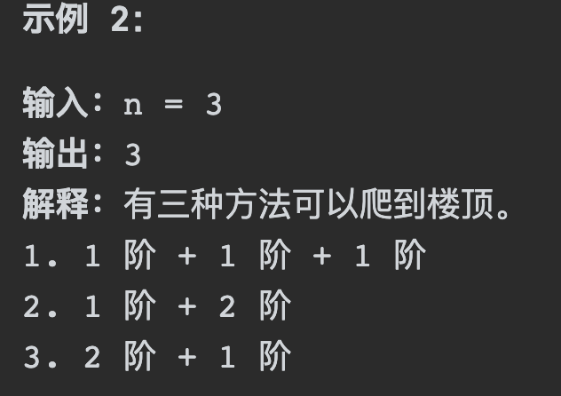
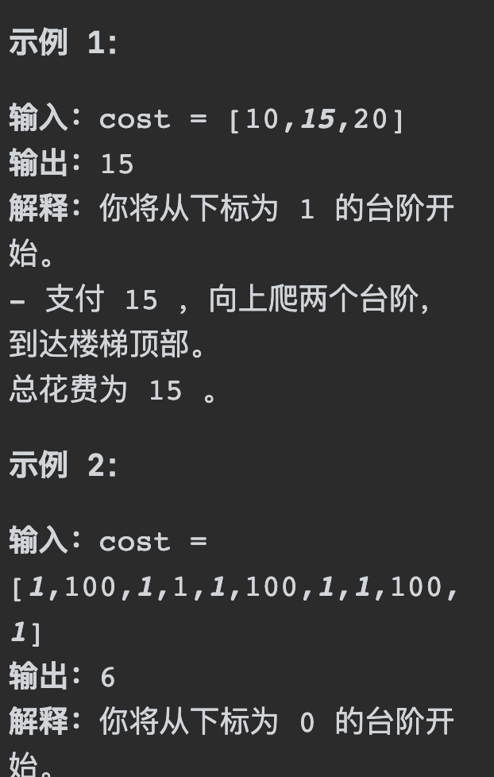
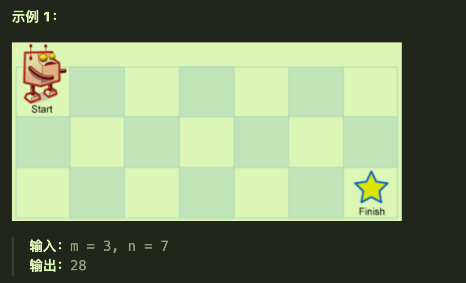
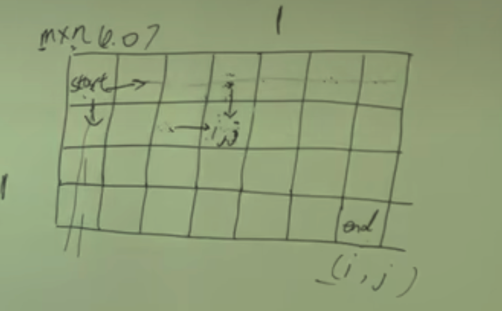
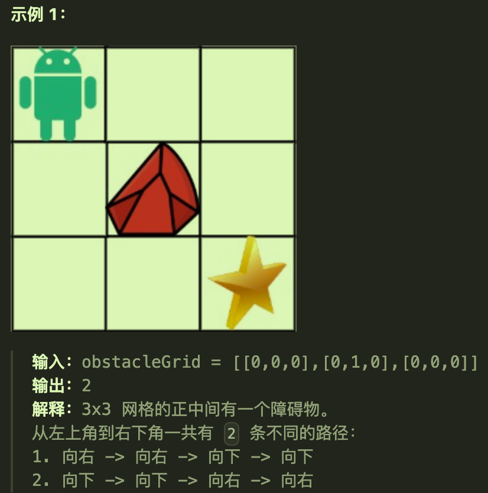
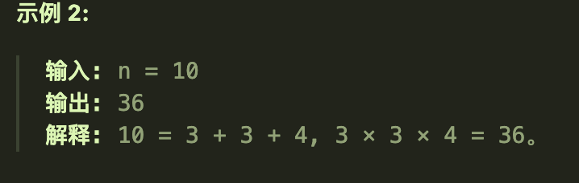

# 509斐波那契数列

## 题目要求

**斐波那契数** （通常用 `F(n)` 表示）形成的序列称为 **斐波那契数列** 。该数列由 `0` 和 `1` 开始，后面的每一项数字都是前面两项数字的和。也就是：

```rust
F(0) = 0，F(1) = 1
F(n) = F(n - 1) + F(n - 2)，其中 n > 1
```

给定 `n` ，请计算 `F(n)` 。

## 第一想法

五部曲:

1. 确定dp数组以及下标的含义
	- 啥是dp数组啊？
2. 确定递推公式
	- 递推公式题目已经给出了F(n) = F(n-1) + F(n-2) n > 1
3. dp数组如何初始化
	- 题目已经给出了初始化，F(0) = 0，F(1) = 1
4. 确定遍历顺序
	- dp数组都不知道是啥，还遍历顺序呢
5. 举例推导dp数组

## 题解
五部曲:

1. 确定dp数组以及下标的含义
	- 在本题中dp数组用来记录下标为i的位置上F（i）的值
	- 数组的长度为n+1
2. 确定递推公式
	- 题目已经给出
3. dp数组如何初始化
	- 已经给定0和1
4. 确定遍历顺序
	- 由于递推公式的缘故，一定从前往后遍历（我们需要前面的数据）
5. 举例推导dp数组
	- 最后如果没有AC，可以debug打印出结果看与预期是否一致。

### 代码实现1迭代

```java
class Solution {
    public int fib(int n) {
      //注意健壮性判断
        if (n<=1) return n;
        int[] dp = new int[n + 1];//使用dp记录当前位置的F值
      //初始化
        dp[0] = 0;
        dp[1] = 1;
      //从前向后遍历
        for (int i = 2; i < dp.length; i++) {
            dp[i] = dp[i-1] + dp[i-2];
        }
        return dp[n];
    }
}
```


### 代码实现2递归

递归的时空复杂度较高。具体呢？

```java
class Solution {
    public int fib(int n) {
        if (n <= 1) return n;
        return fib(n-1) + fib(n-2);
    }
}
```

# 70爬楼梯

## 题目要求

假设你正在爬楼梯。需要 `n` 阶你才能到达楼顶。

每次你可以爬 `1` 或 `2` 个台阶。你有多少种不同的方法可以爬到楼顶呢？

1 <= n <= 45



## 第一想法

五部曲:

1. 确定dp数组以及下标的含义
	- dp数组记录当前位置在第几个台阶
	- 下标i标记当前位置，从0开始
2. 确定递推公式
	- 可以爬1个或者2个，那如何递推呢？
	- 
3. dp数组如何初始化
	- 
4. 确定遍历顺序
	- 一定是从前往后遍历
5. 举例推导dp数组


## 题解
五部曲:

1. 确定dp数组以及下标的含义
	- 爬到第i层有dp[i]种方法
2. 确定递推公式
	- dp[i] = dp[i-1] + dp[i-2]
	- **第i层需要的方法数=第i-1层向上跳一层+第i-2层向上跳两层**
3. dp数组如何初始化
	- 注意n从1开始，所以初始化不用关心0；
	- dp[1] = 1,dp[2] = 2;
4. 确定遍历顺序
	- 从前往后
5. 举例推导dp数组

### 问题：

为什么递推公式里“第i-2层向上跳两层”不能i-2向上连续跳一层呢，而是直接跳两层？

- 是不是因为连续跳一层已经到了第i-1层，被覆盖掉了？（确实是被覆盖掉了）

那么dp[i-1]和dp[i-2]的方法不会相互重叠吗？
- 从第i-1层爬一步到第i层的所有可能方法（这里的每一种方法都是独特的，**因为它们的最后一步都是从第i-1层到第i层**）
- 从第i-2层直接爬两步到第i层的所有可能方法（这里的每一种方法也是独特的，**因为它们的最后一步是跨过了第i-1层直接到达第i层**）

### 代码实现

```java
class Solution {
    public int climbStairs(int n) {
        if (n <= 1) return n;
        int[] dp = new int[n + 1];
        dp[1] = 1;
        dp[2] = 2;
        for (int i = 3; i < dp.length; i++) {
            dp[i] = dp[i-1] + dp[i-2];
        }
        return dp[n];
    }
}
```

## 拓展背包楼梯

一步一个台阶，两个台阶，三个台阶，直到 m个台阶，有多少种方法爬到n阶楼顶。

# 746使用最小花费爬楼梯

## 题目要求

给你一个整数数组 `cost` ，其中 `cost[i]` 是从楼梯第 `i` 个台阶向上爬需要支付的费用。一旦你支付此费用，即可选择向上爬一个或者两个台阶。

你可以选择从下标为 `0` 或下标为 `1` 的台阶开始爬楼梯。

请你计算并返回达到楼梯顶部的最低花费。

```rust
2 <= cost.length <= 1000
0 <= cost[i] <= 999
```



## 第一想法
五部曲:

1. 确定dp数组以及下标的含义
	- dp数组表示到达当前位置的最低花费，下标表示楼梯位置从0开始表示
2. 确定递推公式
	- 这有什么递推的？感觉有点像贪心啊，到达当前位置需要前几个位置的信息吗？确实需要，否则不知道是最低花费。
	- `dp[i] = dp[i-1] + cost[i-1]` or `dp[i] = dp[i-2] + cost[i-2]`;在这两个dp[i]中找一个最小的作为dp[i]?
	- 如果得到了到达各个位置的最低花费，要注意的是并不是每个位置我们都需要到达的，可以跳着走，最后所求的也是总的最低消费，怎么判断跳着走呢？
3. dp数组如何初始化
	- dp[0] = ? dp[1] = ?
	- 感觉这里初始化蛮重要的，因为题目还有一个条件是可以从0开始也可以从1开始。所以我认为`dp[0] = 0, dp[1] = 0`,因为我们一开始就可以无条件地站在01位置上，不需要费用
4. 确定遍历顺序
	- 一定是从前往后遍历
5. 举例推导dp数组
	- 以示例1为例，构建的dp数组形式为[0,0,10,15]；可以发现题目还有一个点是爬到楼顶，这个楼顶并不是数组的最后一个元素，而是最后一个元素的下一个，所以我构建的dp数组长度+1，并且本题最后求的就是这个dp数组的最后一个数，从前向后遍历我们可以得到最后一个数。

## 题解（为什么要动态规划）

按照第一想法，我们居然ac了，不可思议。

```java
class Solution {
    public int minCostClimbingStairs(int[] cost) {
        //dp数组用来记录到达当前位置所用的最小花费
        int[] dp = new int[cost.length + 1];
        //初始化dp数组
        dp[0] = 0;
        dp[1] = 0;
        //遍历并填充dp数组
        for (int i = 2; i < dp.length; i++) {
            dp[i] = Math.min(dp[i-1] + cost[i-1], dp[i-2] + cost[i-2]);
        }
        //最后将dp数组的最后一位返回即顶峰所需花费
        return dp[dp.length-1];
    }
}
```

但是我有一个问题，我怎么样能够看到这道题就想到动态规划呢？如果题目并没有告诉我使用动态规划呢？

1. **最优子结构**：问题的最优解包含其子问题的最优解。换句话说，问题可以通过组合子问题的解来解决。
2. **重叠子问题**：在解决问题的过程中，相同的子问题会多次出现。

- 最优子结构：最低花费；重叠子问题：不断使用了前面的i-1和i-2
- 它可以通过存储已计算过的子问题的解（通常在数组中）来避免重复计算，从而提高效率。

# 62不同路径

## 题目要求

一个机器人位于一个 `m x n` 网格的左上角 （起始点在下图中标记为 “Start” ）。

机器人每次只能向下或者向右移动一步。机器人试图达到网格的右下角（在下图中标记为 “Finish” ）。

问总共有多少条不同的路径



## 第一想法

五部曲：

1、 确定DP数组及下标的含义

- 首先这是在一个二维的空间里，我觉得这次的dp数组也要变成二维的了。`dp[i][j]`
- dp数组代表着当前位置是否已经被走过，如果走过的话标记为1，如果没走标记为0
- 不对，这个路径跟每个走过的位置还是很不一样的。

2、确定递推公式

- 这还有递推公式吗？

3、DP数组如何进行初始化

4、确定遍历顺序

5、打印结果验证DP数组

## 题解

1、dp数组含义

- `dp[i][j]`确实需要一个二维数组，但是dp数组应该表示**从起始位置到达某个位置（例如ij）的不同路径条数**
- 这个ij可以是二维矩阵中的任意位置

2、递推

- 在确定递推公式时，根据题目条件机器人每次只能向下或者向右移动一步，我们可以来看任意位置的正上方和正左方
- 跟爬楼梯很像，都是前面的路径数再走一步就到终点。`dp[i][j]=dp[i-1][j] + dp[i][j-1]`

3、初始化

- 
- 要到达ij，最上面一行和最左边一层都应该进行初始化（因为每一个格子都是靠上方和左边推导过来的）；由于只能右下走，所以对这两层进行**初始化为1**

4、遍历顺序

- 两个方向，从上往下遍历；从左往右遍历
- 所以使用双层for循环，先固定行填充列，最后将剩下的空白格全部填充（不断填充才可以到达终点）

5、验证

### 代码实现

```java
class Solution {
    public int uniquePaths(int m, int n){
        //先确定dp数组，再对其进行初始化
        int[][] dp = new int[m][n];

        for (int i = 0; i < m; i++) {
            dp[i][0] = 1;
        }
        for (int i = 0; i < n; i++) {
            dp[0][i] = 1;
        }
        //确定遍历顺序，使用递推公式
        for (int i = 1; i < m; i++) {
            for (int j = 1; j < n; j++) {
                dp[i][j] = dp[i-1][j] + dp[i][j-1];//对剩下的空格子进行填充，固定行先填充列
            }
        }
        return dp[m-1][n-1];
    }
}
```

# 63不同路径II

## 题目要求

一个机器人位于一个 `m x n` 网格的左上角 （起始点在下图中标记为 “Start” ）。

机器人每次只能向下或者向右移动一步。机器人试图达到网格的右下角（在下图中标记为 “Finish”）。

现在考虑网格中有障碍物。那么从左上角到右下角将会有多少条不同的路径？

网格中的障碍物和空位置分别用 `1` 和 `0` 来表示。



- `m == obstacleGrid.length`
- `n == obstacleGrid[i].length`
- `1 <= m, n <= 100`
- `obstacleGrid[i][j]` 为 `0` 或 `1`

## 第一想法

与上一道题不同的地方在于有了障碍物，并且限定了位置上的数字不是1就是0.那么最重要的dp数组的含义会变化吗？仍然是到达某个位置的路径数吗？

我觉得仍然是，以示例1为例，走到终点得看其上面和左边，其上面和左边也要看自己的上左，但是都碰到了障碍物，所以对于障碍物的处理：在遍历工程中如果遇到数组的值为1，将其位置上的dp数组设置为0（无法到达）

## 题解

与62的不同还有一点被我忽略了，即初始化可能存在的问题（上次我们将左边和上边全部初始化为1了，但是如果存在障碍在这两条初始化路上呢？所以在初始化需要增加条件。

五部曲：

1、确定dp数组及i下标的含义

- `dp[i][j]`代表着到达某个位置上路径总数

2、递推公式

- `dp[i][j]=dp[i-1][j]+dp[i][j-1]`

3、初始化dp数组

- 初始化需要注意的地方上面已经提到

4、确定遍历方式

- 肯定是双层for循环，先列遍历后行遍历

5、验证dp结果

### 代码实现

```java
    public int uniquePathsWithObstacles(int[][] obstacleGrid) {
        int m = obstacleGrid.length;
        int n = obstacleGrid[0].length;//先记录行列值
        int[][] dp = new int[m][n];
        //健壮性判断
        if (obstacleGrid[0][0] == 1 || obstacleGrid[m-1][n-1] == 1) return 0;
        //初始化,注意防止其中包含障碍
        for (int i = 0; i < m && obstacleGrid[i][0] == 0; i++) {
            dp[i][0] = 1;
        }
        for (int i = 0; i < n && obstacleGrid[0][i] == 0; i++) {
            dp[0][i] = 1;
        }
        //进行遍历，如果遇到障碍置其dp为0
        for (int i = 1; i < m; i++) {
            for (int j = 1; j < n; j++) {
              //善于使用三元运算符处理if只判断一种条件的情况，只有一对if-else
                dp[i][j] = (obstacleGrid[i][j] == 0) ? dp[i-1][j] + dp[i][j-1] : 0;
            }
        }
        return dp[m-1][n-1];
    }

```

# 343整数拆分

## 题目要求

给定一个正整数 `n` ，将其拆分为 `k` 个 **正整数** 的和（ `k >= 2` ），并使这些整数的乘积最大化。

返回 *你可以获得的最大乘积* 。



- `2 <= n <= 58`

## 第一想法

直观地想一下，分出来的这几个数最好比较接近，这样或许乘起来乘积最大。但是有点无从下手啊，分出来的数各自是多少、以及拆分为k个数，这个k该如何确定。

我们来试试动态规划五部曲。

1、确定dp数组及下标含义

- 说实话没有思路，设置为当前乘积？下标i的含义呢？意味着k个数？
- 到底该如何拆分呢？

2、递推公式

 

## 题解

动态规划五部曲：

1、dp数组

- dp[i]代表着数字i的最大乘积

2、递推公式

- 我们对数字i进行拆分，**第一个数可以先定住（从1-i）剩下的数可以再进行拆分**即`dp[i] =j * (i-j) or dp[i] = j * dp[i-j]`;
- 为什么不去拆前面那个定住的j呢，因为就算去拆了也会重复，我们是从1-i这样去定的第一个数，你再来拆这个j总会与前面发生重复。

3、初始化

- `dp[0] = 0, dp[1] = 0 dp[2] =1`;其实只能从2开始

4、确定递推顺序

- 根据递推公式，递推顺序也只能从前往后遍历

5、打印结果验证

### 代码实现

```java
    public int integerBreak(int n){
        //初始化dp数组
        int[] dp = new int[n+1];
        dp[2] = 1;
        //遍历
        for (int i = 3; i < n+1; i++) {
            for (int j = 1; j < i; j++) {//内层循环相当于对数字i进行拆分，先定j再拆后面的
                dp[i] = Math.max(Math.max(j * (i-j), j * dp[i-j]),dp[i]);//一个是拆成两个数，一个是继续拆第二个数，产生更多的数
            }
        }
        return dp[n];
    }

```

- 其中还可以优化，在内层for循环中可以写成`j <= i-j`因为后面再拆分会与前面的结果重复（但是我真的有点难以想到这一点的优化过程）

# 96不同的二叉搜索树

