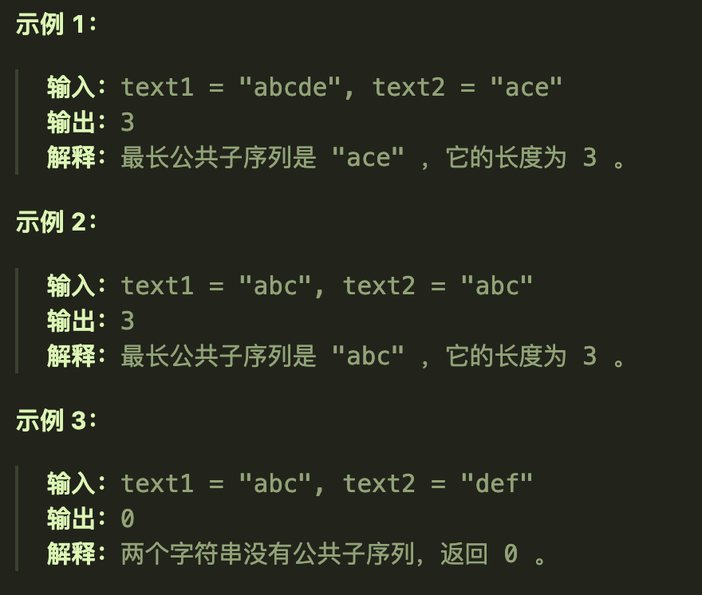

# 300最长递增子序列
## 题目要求

给你一个整数数组 `nums` ，找到其中最长严格递增子序列的长度。

**子序列** 是由数组派生而来的序列，删除（或不删除）数组中的元素而不改变其余元素的顺序。例如，`[3,6,2,7]` 是数组 `[0,3,1,6,2,2,7]` 的子序列。


**提示：**

- `1 <= nums.length <= 2500`
- `-104 <= nums[i] <= 104`

## 第一想法

子序列并不要求连续而只是要求递增，可以隔着进行选择，这个跟动态规划有什么关系吗？这种题目会有一个怎样的dp数组来表示什么样的含义呢？某个下标起始位置上的最长递增子序列吗？这样的序列会根据之后元素的顺序来确定？

## 题解

本题的实质是对于某个位置不断地与其前面的位置去比较，不断地比较从而推导出最大值。

### 五部曲

1、确定dp数组及其含义

- `dp[i]`代表着**以位置i为结尾**的元素最长的递增子序列

2、确定递推公式

- `if(nums[i] > nums[j]) dp[i] = max(dp[j] + 1, dp[i])`j在i之前，故位置i结尾的最长子序列不断地从前面的位置推出——**j从0到i-1各个位置的最长升序子序列 + 1 的最大值。**
- **注意这里不是要dp[i] 与 dp[j] + 1进行比较，而是我们要取dp[j] + 1的最大值**。

3、确定初始化

- `dp[i] = 1`
- 注意，这里的初始化需要将每个位置都初始化为1，因为最起码本身元素算是一个长度。

4、确定遍历顺序

- 本题需要双层for循环，最外面的一层用来遍历每个位置i，内层的for循环用来遍历每个位置i前面的元素，从0到i-1的各个元素。

5、打印dp数组

- 最终的结果也发生了变化，不再是最后一个元素，因为dp数组的含义是以i为结尾的元素，所以我们需要在所有的dp数组值中找到一个最大值。
- 这个最大值可以在双层for循环中嵌入去寻找。

### 代码实现

```java
class Solution {
    public int lengthOfLIS(int[] nums) {
      //先进行代码健壮性判断
        if(nums.length == 1){
            return 1;
        }
        //初始化dp数组
        int len = nums.length;
        int[] dp = new int[len];
        for(int i=0; i < len; i ++){
            dp[i] = 1;
        }
        int max = 0;
        //进行遍历
        for (int i = 1; i < len; i++) {
            for (int j = 0; j < i; j++) {
                if (nums[i] > nums[j]){
                    dp[i] = Math.max(dp[j] + 1, dp[i]);//注意这里其实是在比较每个dp[j]+1
                }
                max = Math.max(max,dp[i]);
            }
        }
        return max;
    }
}
```

# 1143最长公共子序列

## 题目要求

给定两个字符串 `text1` 和 `text2`，返回这两个字符串的最长 **公共子序列** 的长度。如果不存在 **公共子序列** ，返回 `0` 。

一个字符串的 **子序列** 是指这样一个新的字符串：它是由原字符串在不改变字符的相对顺序的情况下删除某些字符（也可以不删除任何字符）后组成的新字符串。

- 例如，`"ace"` 是 `"abcde"` 的子序列，但 `"aec"` 不是 `"abcde"` 的子序列。

两个字符串的 **公共子序列** 是这两个字符串所共同拥有的子序列。



## 第一想法

这么看这道题目是718和300的结合体，前者告诉我们如何比较两个数组中的序列，后者告诉我们如何处理不连续的子序列——一个是使用二维dp数组来保存状态，另一个是使用双层for循环来比较前面所有的位置（对于连续问题就只需要比较前一个位置）

那么这道字符串的题目该如何融合，算是结合+字符串。

- dp数组还是表示以i-1,j-1结尾的元素公共子序列的长度最大值吗？
- 这样的话我们不需要只依靠前面一个位置上的元素是否相同（即`dp[i-1] == dp[j-1]`这个条件来确定）
- 所以这个条件该改为什么呢？我觉得综合下来应该对内层for循环进行更改，改为j<i

## 题解

连续公共问题不能够继承长度，而**不连续问题可以继承长度**。

每道题的dp数组的含义都不一样，大体的方向倒是一致的。

### 五部曲

1、确定dp数组的含义

- `dp[i][j]`代表着nums1中从[0,i-1]，nums2中从[0,j-1]中最长公共子序列的长度
- 本题的定义为范围而不是单单以i-1为结尾（多了从0开始）因为不连续问题要的是序列，可以继承长度

2、确定递推公式

- `if(text1[i-1] == text2[j-1]){dp[i][j] = dp[i-1][j-1] + 1}`
- `else{dp[i][j] = max(dp[i-1][j], dp[i][j-1])}`
- 依然是去比较前一个位置上的元素，但是如果不相同的话，会有两种情况：`abcde ace`从第三个开始比较时，可以进行`abc ac or ab ace`进行比较。
- 看看text1[0, i - 2]与text2[0, j - 1]的最长公共子序列 和 text1[0, i - 1]与text2[0, j - 2]的最长公共子序列，取最大的

3、初始化dp数组

- 同理，初始化为0

4、确定遍历顺序

- 从前向后遍历

### 代码实现

```java
				//将字符串改为字符数组，方便操作。
        char[] chars1 = text1.toCharArray();
        char[] chars2 = text2.toCharArray();
        //
        int len1 = chars1.length;
        int len2 = chars2.length;
        //初始化dp数组为0
        int[][] dp = new int[len1 + 1][len2 + 1];
        //遍历两个数组
        for (int i = 1; i <= len1; i++) {
            for (int j = 1; j <= len2; j++) {
                if (chars1[i-1] == chars2[j-1]){
                    dp[i][j] = dp[i-1][j-1] + 1;
                }else {
                    dp[i][j] = Math.max(dp[i-1][j], dp[i][j-1]);
                }
            }
        }
        return dp[len1][len2];
```


# 1035不相交的线