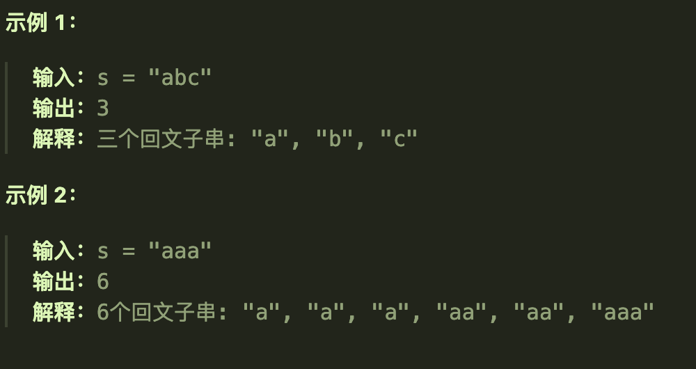
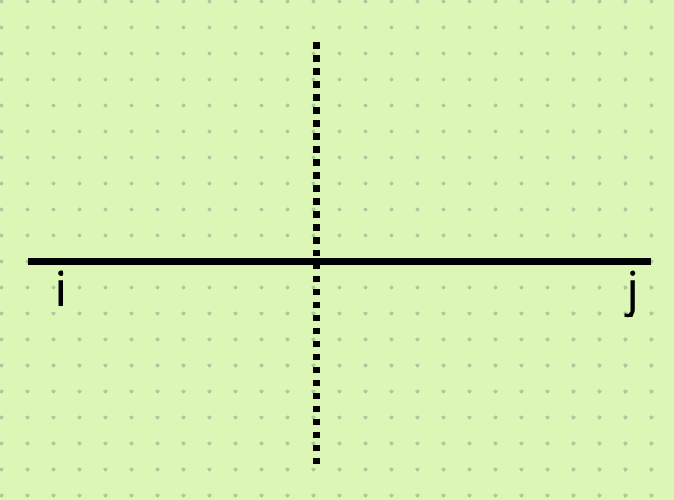
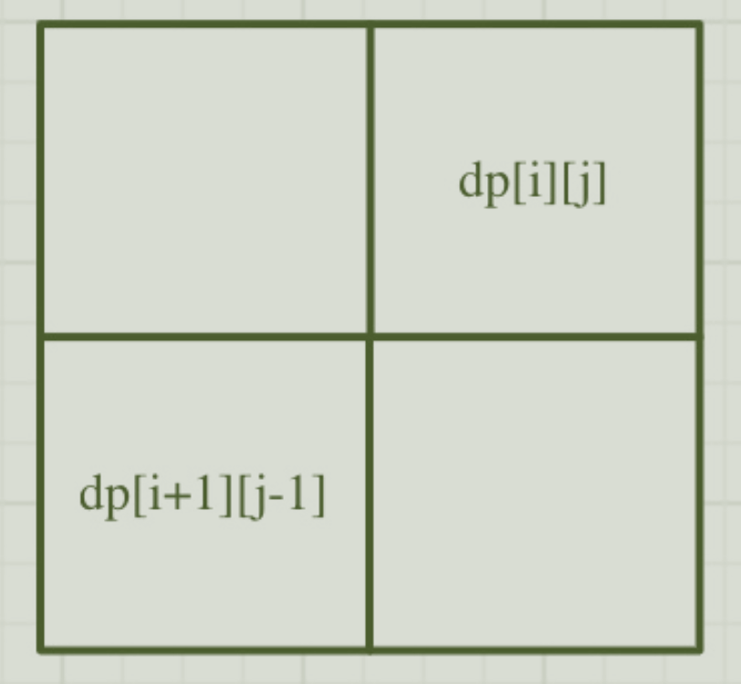
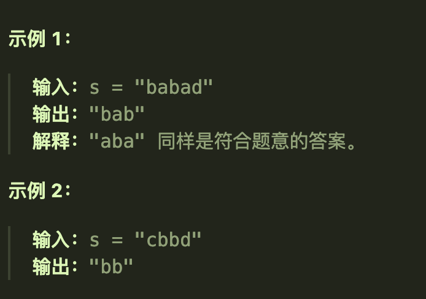
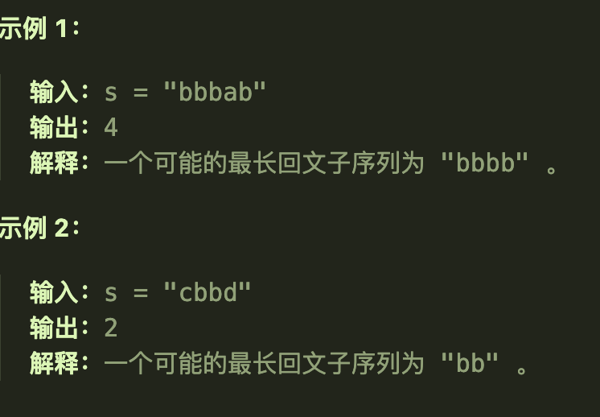

# 647回文子串

## 题目要求

给你一个字符串 `s` ，请你统计并返回这个字符串中 **回文子串** 的数目。

**回文字符串** 是正着读和倒过来读一样的字符串。

**子字符串** 是字符串中的由连续字符组成的一个序列。

具有不同开始位置或结束位置的子串，即使是由相同的字符组成，也会被视作不同的子串。



- `1 <= s.length <= 1000`
- `s` 由小写英文字母组成

## 第一想法

之前处理回文串的方法是？如果有相应的算法得封装为一个方法？但是本题的特殊条件是*具有不同开始位置或者结束位置的子串，也是不同的子串*。

如果是动态规划，dp数组的含义是以i为结尾的子串中的回文子串数目？并且也是一个连续问题，不能继承跨越的状态？

## 题解

### 本质

利用回文串的性质：**中心对称**

所以dp数组的定义需要利用这个性质，从两边进行扩展（如果ij之间的子串是回文串，那么ij相等时其扩展的串也是回文串，不断地向两边扩展）

### 五部曲

1、确定dp数组的含义

- `dp[i][j]`代表着下标范围在[i,j]的子串是否为回文串，故次dp数组是一个布尔类型的数组

2、确定递推公式

- `if(s[i] == s[j]){if(j-i<=1) dp[i][j] = true; else if(dp[i+1][j-1]) {dp[i][j] = true}} `这时要分情况讨论，不仅仅要判断里面的子串是否为回文串；如果ij为同一位置或者相邻，那么`dp[i][j]`一定是true，如果之间有距离才是我们定义中的形状。
- 注意本题dp数组不直接表征数目，所以需要额外设置变量来记录回文子串的结果数

3、初始化dp数组

- `dp[i][j] = false`，空串肯定没有回文子串。

4、确定遍历顺序

- 遍历顺序需要看dp数组如何递推，

- 所以i需要从下往上遍历，j需要从左往右进行遍历。

### 代码实现

```java
class Solution {
    public int countSubstrings(String s) {
        int len = s.length();
        boolean[][] dp = new boolean[len][len];
        int result = 0;//用于计数
        for (int i = len-1; i >= 0; i--) {
            for (int j = i; j < len; j++) {
                if (s.charAt(i) == s.charAt(j)){
                    if (j-i <= 1){//ij相等或者相邻
                        dp[i][j] = true;
                        result ++;
                    }else if (dp[i+1][j-1]){//ij之间存在子串判断是否子串是回文串
                        dp[i][j] = true;
                        result ++;
                    }
                }
            }
        }
        return result;
    }
}
```

# 5最长回文子串

## 题目要求

给你一个字符串 `s`，找到 `s` 中最长的回文子串。

如果字符串的反序与原始字符串相同，则该字符串称为回文字符串。



## 第一想法

上面一题找的是回文子串的数目，本题所求的是最长的回文子串，那每次判断是否是回文子串的时候进行长度比较就行了？这个长度就是j-i+1。

注意本题的返回类型为String，即要返回一个字符串，所以找到最长的之后，确定ij的位置将这个范围里的字符串输出。（使用substring方法）

试着在上一道题的基础上修改一下代码。

## 题解

注意保存初始位置，使用substring来截取所需子串。

```java
class Solution {
    public String longestPalindrome(String s) {
        int len = s.length();
        boolean[][] dp = new boolean[len][len];
        //声明最大长度以及开始位置，结束位置可以由二者推出
        int maxLen = 0;
        int startIndex = 0;
        //
        for (int i = len-1; i >= 0; i--) {
            for (int j = i; j < len; j++) {
                if (s.charAt(i) == s.charAt(j)){
                    if (j-i <= 1){
                        dp[i][j] = true;
                        if (j-i+1 > maxLen){
                            maxLen = j - i + 1;
                            startIndex = i;
                        }
                    }else if (dp[i+1][j-1]){
                        dp[i][j] = true;
                        if (j-i+1 > maxLen){
                            maxLen = j - i + 1;
                            startIndex = i;
                        }
                    }
                }
            }
        }
        return s.substring(startIndex,startIndex+maxLen);
    }
}
```


# 516最长回文子序列

## 题目要求

给你一个字符串 `s` ，找出其中最长的回文子序列，并返回该序列的长度。

子序列定义为：不改变剩余字符顺序的情况下，删除某些字符或者不删除任何字符形成的一个序列。



- `1 <= s.length <= 1000`
- `s` 仅由小写英文字母组成

## 题解

与回文子串不同的是，子序列问题可以不连续。两端的是ij，加入观察是否可以扩展最长回文子序列的长度。

### 五部曲

1、确定dp数组的含义

- `dp[i][j]`是[i,j]范围内的最长回文子序列的长度

2、确定递推公式

- `if(s[i] == s[j]) {dp[i][j] =dp[i+1][j-1] + 2} `，如果相同，就把两个都加进来作为回文子序列。
- `else{dp[i][j] = max(dp[i+1][j],dp[i][j-1])}`如果不相同，那就看加入哪一个能够达到最长回文子序列。

3、初始化dp数组

- `dp[0][0] = 0 `
- **当ij相同时，意味着同一个位置故`dp[i][j] = 1`**

4、确定遍历顺序

- 从前往后遍历,从下往上遍历。

### 代码实现

```java
class Solution {
    public int longestPalindromeSubseq(String s) {
        int len = s.length();
        int[][] dp = new int[len][len];
        for (int i = 0; i < len; i++) {
            dp[i][i] = 1;
        }
        //
        for (int i = len-1; i >= 0; i--) {
            for (int j = i+1; j < len; j++) {//这里与前面的不同，j从i后面开始
                if (s.charAt(i) == s.charAt(j)){
                    dp[i][j] = dp[i+1][j-1] + 2;
                }else {
                    dp[i][j] = Math.max(dp[i+1][j], dp[i][j-1]);
                }
            }
        }
        return dp[0][len-1];//注意最后的返回结果，全范围内的最长回文子序列
    }
}
```


# 