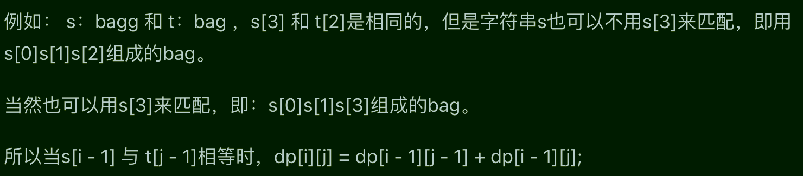

# 392判断子序列

## 题目要求

给定字符串 **s** 和 **t** ，判断 **s** 是否为 **t** 的子序列。

字符串的一个子序列是原始字符串删除一些（也可以不删除）字符而不改变剩余字符相对位置形成的新字符串。（例如，`"ace"`是`"abcde"`的一个子序列，而`"aec"`不是）。

**进阶：**

如果有大量输入的 S，称作 S1, S2, ... , Sk 其中 k >= 10亿，你需要依次检查它们是否为 T 的子序列。在这种情况下，你会怎样改变代码？


- `0 <= s.length <= 100`
- `0 <= t.length <= 10^4`
- 两个字符串都只由小写字符组成。

## 第一想法

这种子串问题很像之前做过的不连续问题中判断是否为子串，但是这道题是否需要动态规划呢？要表征两个字符串，其实就是两个数组（将字符串转换为字符数组），需要一个二维的dp数组？想不出来该如何解决。

## 题解

### 本质

其实还是最长公共子序列问题（T1143），只要两个字符串的最长子序列长度=s的字符串的长度即可证明s是t的子串。

但是两题还是有区别，在于递推公式中：本题已经明确s是否是t的子序列，即s一定是比t短的，所以在不相等的情况下，我们需要去删除t中的元素而不是s中的元素；T1143中并没有明确谁是谁的子序列，所以在两个字符串中都要进行删除（倒退）

### 五部曲

1、确定dp数组的含义

- `dp[i][j]`代表以i-1为结尾的，以j-1为结尾的元素的相同子序列长度
- i用来遍历子串s，j用来遍历长串t

2、确定递推公式

- `if(s[i-1]=t[j-1])  {dp[i][j] = dp[i-1][j-1]+1} else {dp[i][j] = dp[i][j-1]}`
- 原因如上所示。

3、确定初始化

- `dp[i][0] = 0 dp[0][j] = 0`其余位置也可以设为0，因为会进行覆盖。

4、确定遍历顺序

- 从前往后进行遍历

5、打印dp数组

### 代码实现

```java
    public boolean isSubsequence392(String s, String t){
        char[] chars1 = s.toCharArray();
        char[] chars2 = t.toCharArray();
        int len1 = chars1.length;
        int len2 = chars2.length;
        //
        int[][] dp = new int[len1 + 1][len2 + 1];
        //
        for (int i = 1; i <= len1; i++) {
            for (int j = 1; j <= len2; j++) {
                if (chars1[i-1] == chars2[j-1]){
                    dp[i][j] = dp[i-1][j-1] + 1;
                }else {
                    dp[i][j] = dp[i][j-1];
                }
            }
        }
        if (dp[len1][len2] == len1){
            return true;
        }
        return false;
    }

```

# 115不同的子序列

## 题目要求

给你两个字符串 `s` 和 `t` ，统计并返回在 `s` 的 **子序列** 中 `t` 出现的个数，结果需要对 10的九次方+ 7 取模。


- `1 <= s.length, t.length <= 1000`
- `s` 和 `t` 由英文字母组成

## 第一想法

先不管后面的什么取模，以及条件中的英文字母（只要相等不就行了吗？），这还是一个子序列问题，并且明确t是s的子序列，即t要比s短。

上一题所求的是最长公共子序列长度，本题不要求最长，只要求子序列的出现次数（还是一个不连续子序列）但是本题我还是不能想出dp数组的含义。

## 题解

### 本质

这类子序列问题核心在于子序列的定义：*原始字符串删除一些（也可以不删除）字符而不改变剩余字符相对位置形成的新字符串*，所以核心的操作是对长的字符串进行**模拟删除操作**来不断尝试。

本题的dp数组也很难想到，递推公式也是。

### 五部曲

1、dp数组含义

- `dp[i][j] `在s中以i-1为结尾的子序列中出现以j-1为结尾的t的个数

2、确定递推公式（难点）

- `if(s[i-1] == t[i-1]) dp[i][j] = dp[i-1][j-1] + dp[i-1][j]`为什么是加法，前者是考虑使用相等处的元素进行匹配，直接去堆叠前面的子状态；后者是不使用相等处的元素进行匹配，模拟删除长串中的元素：
- `else{dp[i][j] = dp[i-1][j]}`不相等就往前找，这里体现模拟删除操作，因为子串的缘故，删除只在长串中进行。

3、dp数组初始化（要紧跟dp数组的定义）


- `dp[i][0]`表示子串为空字符串的个数，长串中删除所有的元素，空字符串个数为1，故初始为1
- `dp[0][j]`表示长串为空串，所以为0
- `dp[0][0]`表示二者都是空串，所以为1

4、确定遍历顺序

- 从上到下，从左到右。

### 代码实现

```java
public int numDistance(String s, String t){
        int len1 = s.length();
        int len2 = t.length();
        int[][] dp = new int[len1 + 1][len2 + 1];
        //初始化,虽然只有一条语句，但其实有三个初始化1，0，1
        for (int i = 0; i < len1 + 1; i++) {
            dp[i][0] = 1;
        }
//        dp[0][0] = 1;
        for (int i = 1; i <= len1; i++) {
            for (int j = 1; j <= len2; j++) {
                if (s.charAt(i-1) == t.charAt(j-1)){
                    dp[i][j] = dp[i-1][j-1] + dp[i-1][j];
                }else {
                    dp[i][j] = dp[i-1][j];
                }
            }
        }
        return dp[len1][len2];
    }
```

# 583两个字符串的删除操作

## 题目要求

给定两个单词 `word1` 和 `word2` ，返回使得 `word1` 和 `word2` **相同**所需的**最小步数**。

**每步** 可以删除任意一个字符串中的一个字符。


## 第一想法

不得不感叹，题目顺序设置的很贴心，上面的题目虽然在找子序列，但感觉本质还是对于长串的删除，模拟删除操作来匹配子串。但是这道题目并没有子串长串之分，就是两个地位相等的字符串，二者都能够删除（之前子串相当于是固定的）

那么dp数组又该如何呢？表示所需的最小步数？（删除好像不只能从前往后，还可以从后往前，任意位置上删除）

## 题解

### 本质

其实就是模拟删除操作，把所有的情况列出来去进行状态转移就行了。

### 五部曲

1、确定dp数组含义

- `dp[i][j]`是以i-1为结尾的word1，以j-1为结尾的word2成为相同所需的最小步数

2、确定递推公式

- `if(word1[i] == word2[j]) dp[i][j]= dp[i-1][j-1]`如果末尾元素相同的话，*相当于不需要进行操作*
- `else{dp[i][j] = min(dp[i-1][j]+1,dp[i][j-1]+1,dp[i-1][j-1]+2)}`不相同的话，在1中删一个，2中删一个和一起删一个中找到最小值。（其实一起删和前面两个删一个是一样的）

3、初始化dp数组

- `dp[i][0] = i dp[0][j] =j`紧扣dp数组的定义

4、确定遍历顺序

- 从前往后遍历

### 代码实现

```java
class Solution {
    public int minDistance(String word1, String word2) {
        int len1 = word1.length();
        int len2 = word2.length();
        //
        int[][] dp = new int[len1 + 1][len2 + 1];
        for (int i = 0; i <= len1; i++) {
            dp[i][0] = i;
        }
        for (int j = 0; j <= len2; j++) {
            dp[0][j] = j;
        }
        //
        for (int i = 1; i <= len1; i++) {
            for (int j = 1; j <= len2; j++) {
                if (word1.charAt(i-1) == word2.charAt(j-1)){
                    dp[i][j] = dp[i-1][j-1];
                }else {
                    dp[i][j] = Math.min(dp[i-1][j]+1,Math.min(dp[i][j-1]+1,dp[i-1][j-1]+2));
                }
            }
        }
        return dp[len1][len2];
    }
}
```


# 72编辑距离

## 题目要求

给你两个单词 `word1` 和 `word2`， *请返回将 `word1` 转换成 `word2` 所使用的最少操作数* 。

你可以对一个单词进行如下三种操作：

- 插入一个字符
- 删除一个字符
- 替换一个字符


- `0 <= word1.length, word2.length <= 500`
- `word1` 和 `word2` 由小写英文字母组成

## 第一想法

最终，多了两个操作，替换和插入；删除倒是已经训练地适应了。那么替换和插入怎么操作呢？还好本题只操作一个字符串，另外一个字符串是定死的。

但是本题dp数组含义还是变成末尾为i的元素所需的最少操作数吗？还是很抓瞎啊。

## 题解

 其实就是对替换和增加两个操作的理解：

- **增加和删除操作其实是同一个操作**，不会影响最后的操作数（1删除一个元素=2增加一个元素）
- 替换操作最终目的是将对应位置的元素换成一样的，所以相当于一样的时候的次数+1

还有要注意两个单词都可以操作；其他的操作与前面几道题目几乎一样。

### 五部曲

1、确定dp数组含义

- `dp[i][j]`表示1中以i-1为结尾的，2中以j-1为结尾的最近编辑距离。

2、确定递推公式

- `if(word1[i]==word2[j]) dp[i][j]= dp[i-1][j-1]`如果元素相同，就不需要做编辑操作
- `else{dp[i][j] = min(dp[i-1][j-1]+1, dp[i-1][j]+1,dp[i][j-1]+1)}`,分别代表了替换，删除1中的，和删除2中的元素。
- 本题其实并不是定死某一个单词，**两个单词都可以操作，不会影响最后的结果**。

3、初始化dp数组

- `dp[i][0] = i`从长度为i的字符串变成空字符串需要删除i次，即编辑距离为i
- `dp[0][j] = j`同理
- `dp[0][0] = 0`

4、确定遍历顺序

- 从前向后遍历

### 代码实现

```java
class Solution {
    public int minDistance(String word1, String word2) {
        int len1 = word1.length();
        int len2 = word2.length();
        int[][] dp = new int[len1 + 1][len2 + 1];
        for (int i = 0; i <= len1; i++) {
            dp[i][0] = i;
        }
        for (int j = 0; j <= len2; j++) {
            dp[0][j] = j;
        }
        //
        for (int i = 1; i <= len1; i++) {
            for (int j = 1; j <= len2; j++) {
                if (word1.charAt(i-1) == word2.charAt(j-1)){
                    dp[i][j] = dp[i-1][j-1];
                }else {
                    dp[i][j] = Math.min(dp[i-1][j]+1,Math.min(dp[i][j-1]+1,dp[i-1][j-1]+1));
                }
            }
        }
        return dp[len1][len2];
    }
}
```

