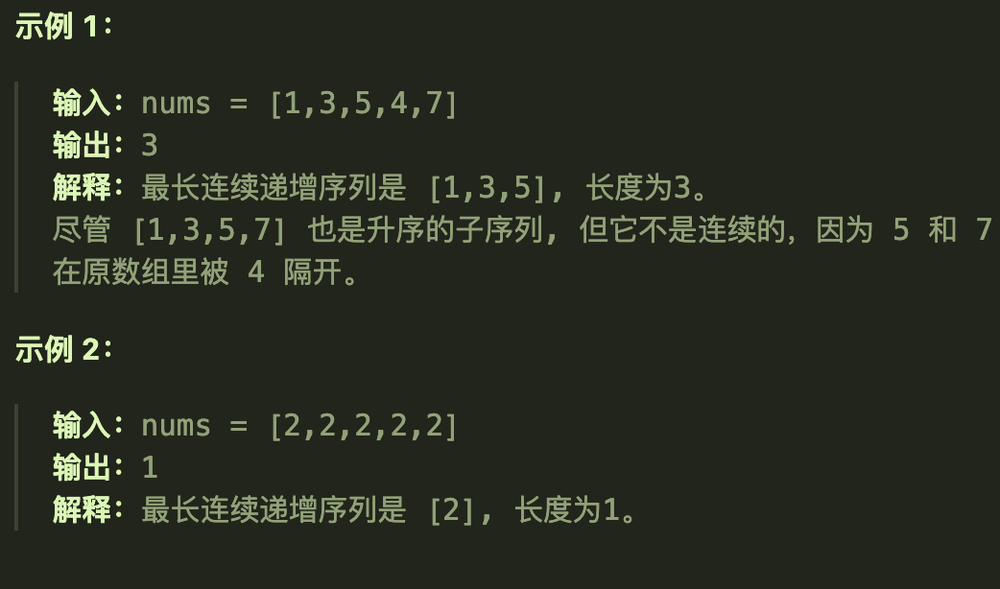
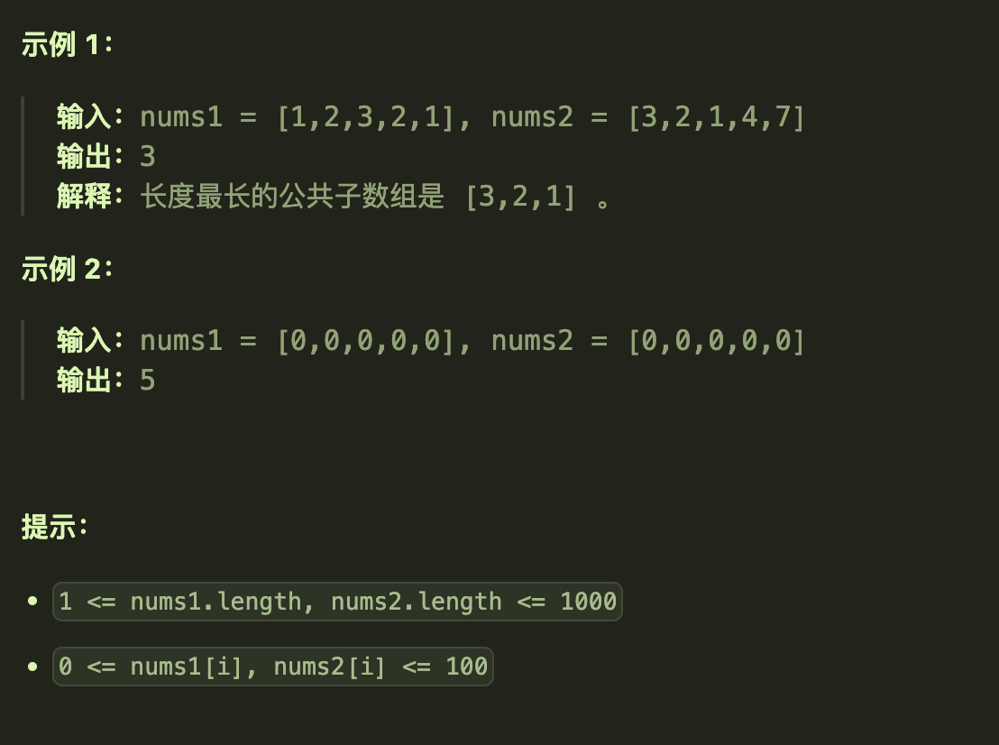

# 674最长连续递增序列

## 题目要求

给定一个未经排序的整数数组，找到最长且 **连续递增的子序列**，并返回该序列的长度。

**连续递增的子序列** 可以由两个下标 `l` 和 `r`（`l < r`）确定，如果对于每个 `l <= i < r`，都有 `nums[i] < nums[i + 1]` ，那么子序列 `[nums[l], nums[l + 1], ..., nums[r - 1], nums[r]]` 就是连续递增子序列。



## 第一想法

本题与300最长递增子序列的区别是T300可以进行不连续选择，本题必须要求连续，但是上一题没有任何对于连续的要求，所以本题需要加什么特殊条件？

## 题解

不连续最长子序列第i位置的状态与前面所有位置上的元素都有关；而连续最长子序列第i位置上的状态只与前一个位置上的元素有关，这是两题最大的区别所在。

### 五部曲

`dp[i]`代表着以位置i元素为结尾的最长连续递增序列。

将五部曲中的递推公式进行更改即可，`if(nums[i] > nums[i-1] ) dp[i] = dp[i-1] + 1`；遍历顺序也不再需要双层for循环，因为只需要比较前一个位置。

### 代码实现

```java
class Solution {
    public int findLengthOfLCIS(int[] nums) {
        if (nums.length == 1) return 1;
        int len = nums.length;
        int[] dp = new int[len];
        for (int i = 0; i < len; i++) {
            dp[i] = 1;
        }
        int max = 0;
        //
        for (int i = 1; i < len; i++) {
            if (nums[i] > nums[i-1]){
                dp[i] = dp[i-1] + 1;
            }
            max = Math.max(max,dp[i]);
        }
        return max;
    }
}
```


# 718最长重复子数组

## 题目要求

给两个整数数组 `nums1` 和 `nums2` ，返回 *两个数组中 **公共的** 、长度最长的子数组的长度* 。



## 第一想法

现在有两个数组了，该如何处理呢？dp数组的含义是否发生变化？表示以i结尾的子数组在另外一个数组中的公共的、长度最长的子数组的长度吗？

其次子数组其实是连续的，只需要看前一个位置上的元素，那要保证公共或许该两个数组一起来遍历？

## 题解

两个数组作比较，所以dp数组的含义更加丰富，但是第一时间确实比较难以想到具体该如何定义。

### 五部曲

1、确定dp数组的含义

- `dp[i][j]`代表着两个数组中**以i-1，j-1为结尾**的公共长度最长的子数组的长度
- 这里为什么不是以i，j结尾，为了后续的初始化过程更加简单（可以理解为虚拟头结点）

2、确定递推公式

- `if(nums[i-1] == nums[j-1]) {dp[i][j] = dp[i-1][j-1]+1}`
- 意味着如果在两个数组中找到了结尾相同的两个数，想要得到以他们为结尾的公共子数组最大长度就得往前找（结尾）；体现了状态的转移和子问题的重叠。

3、初始化

- `dp[i][0] dp[0][j]`是二维数组最外面的一层，根据dp数组的定义很明显是无意义的（-1）这也是上面为什么说类似于虚拟头结点。
- 所以我们将其定义为0，其他位置也定义为0（都是由上一个位置推出来的，与01背包开始的二维做法很像）

4、确定遍历顺序

- 虽然在递推公式中我们可以发现是从后往前找状态转移，但是我们得先去找结尾相同的两个数，所以遍历顺序还是从前向后遍历
- 并且需要双层for循环，因为是二维dp数组。

5、打印dp数组

### 代码实现

```java
class Solution {
    public int findLength(int[] nums1, int[] nums2) {
        int len1 = nums1.length;
        int len2 = nums2.length;
      //注意这里dp数组的初始化长度为len+1,这是由dp数组的定义造成的。
        int[][] dp = new int[len1 + 1][len2 + 1];
        int MaxResult = 0;
        //初始化其实都是0
        //遍历时注意dp数组的含义，所以范围从1-len可以等于长度
        for (int i = 1; i <= len1; i++) {
            for (int j = 1; j <= len2; j++) {
                if (nums1[i-1] == nums2[j-1]){
                    dp[i][j] = dp[i-1][j-1] + 1;
                }
                MaxResult = Math.max(MaxResult, dp[i][j]);//最大值不一定是最后的元素为结尾的
            }
        }
        return MaxResult;
    }
}
```


# 53最大子序和