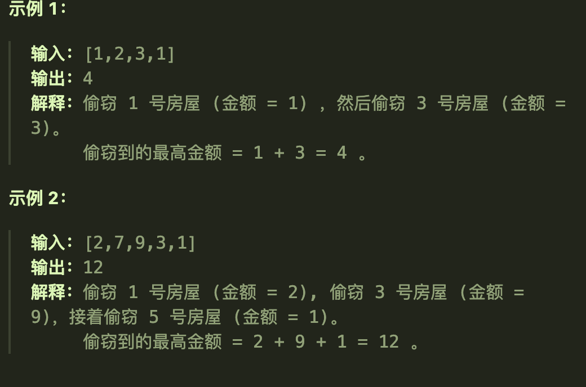
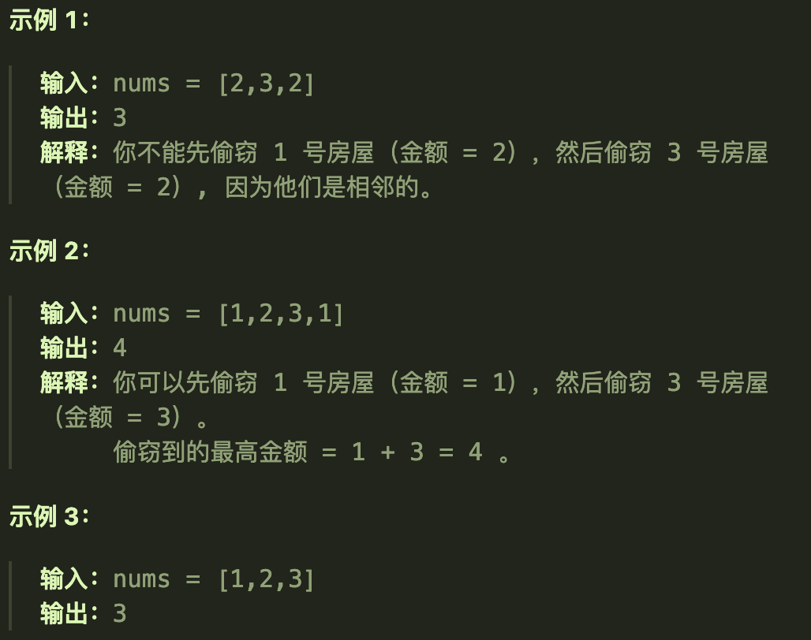
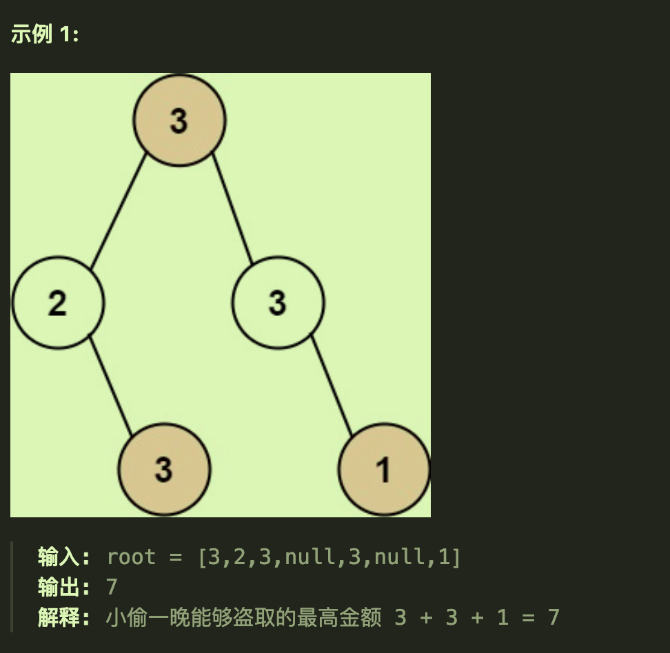

# 198打家劫舍

## 题目要求

你是一个专业的小偷，计划偷窃沿街的房屋。每间房内都藏有一定的现金，影响你偷窃的唯一制约因素就是相邻的房屋装有相互连通的防盗系统，**如果两间相邻的房屋在同一晚上被小偷闯入，系统会自动报警**。

给定一个代表每个房屋存放金额的非负整数数组，计算你 **不触动警报装置的情况下** ，一夜之内能够偷窃到的最高金额。



- `1 <= nums.length <= 100`
- `0 <= nums[i] <= 400`

## 第一想法

首先看到限制条件下的最值，往动态规划那里去想。但是否能够转换为一个背包问题呢？看似给出了所有的商品，但是所求的好像是在限制条件下的最大价值，背包的容量好像并没有指明。

动态规划问题一定存在着状态转移，即递推公式，那么本题有没有什么递推公式呢？感觉递推公式还是差不多，都是没加入某个商品之前的价值与加入之后的价值取最大值，只是多一个限制条件，即不能连续取商品。

## 题解

### 本质

还是一道动态规划的题目，但不是背包问题，核心在于状态转移方程——重叠的子问题从何而来：**某个位置上的商品是否要取是由前两个位置的状态推断而来的。**决定因素是第i个房间取不取

- 如果取第i个商品，那么前一个一定不能取，就得看前两个的状态
- 如果不取第i个商品，那么前一个是可以取（可以但不一定取）
- 取二者条件中的最大值作为第i个商品处的**累计最大价值**

### 五部曲

1、确定dp数组及其含义

- `dp[i]`表示第i个商品（i从0开始）处的最大价值

2、确定递推公式

- 由题目本质可得，`dp[i] = max(dp[i-2] + nums[i], dp[i-1])`由取与不取两种情况决定

3、初始化dp数组

- 根据递推公式可知，我们至少需要知道两个状态，所以需要初始化dp[0],dp[1]
- `dp[0] = nums[0],dp[1] = max(dp[0],nums[1])`

4、确定遍历顺序

- 相比背包问题就要简单一些，只需要一层循环从前往后遍历。

5、打印dp数组

- 最后返回的是dp[nums.length()-1]，因为考虑到最后一个商品就可以了。

### 代码实现

```java
    public int rob(int[] nums) {
        //健壮性判断
        if (nums.length == 0 || nums == null) return 0;
        if (nums.length == 1) return nums[0];

        int[] dp = new int[nums.length];
        //
        dp[0] = nums[0];
        dp[1] = Math.max(dp[0],nums[1]);
        //
        for (int i = 2; i < nums.length; i++) {
            dp[i] = Math.max(nums[i] + dp[i-2], dp[i-1]);//注意这里并不是真的要取i-1，而是i-1代表着其前面所累积的最大金额
        }
        return dp[nums.length-1];
    }
```


# 213打家劫舍II

## 题目要求

你是一个专业的小偷，计划偷窃沿街的房屋，每间房内都藏有一定的现金。这个地方所有的房屋都 **围成一圈** ，这意味着第一个房屋和最后一个房屋是紧挨着的。同时，相邻的房屋装有相互连通的防盗系统，**如果两间相邻的房屋在同一晚上被小偷闯入，系统会自动报警** 。

给定一个代表每个房屋存放金额的非负整数数组，计算你 **在不触动警报装置的情况下** ，今晚能够偷窃到的最高金额。



**提示：**

- `1 <= nums.length <= 100`
- `0 <= nums[i] <= 1000`

## 第一想法

比上一道题多了一个环形的条件，即第一个商品和最后一个商品他们相互受限，我觉得就是在这两个位置上多了限制条件，其余位置并没有受到影响。

那么如果整体逻辑不变，dp[0]的初始化还是nums[0]吗？我觉得还是，因为dp[0]意味着只有第0个元素时的价值。这个限制条件是不是就得放在最后一个位置上，当走到最后时不仅得看前两个位置，还要看最开始的位置，所以递推公式只在最后一个元素上发生变化？

但是如果只在代码的最后位置进行条件判断（第0个元素是否被取，如果被取就不能取最后元素），这不一定会得到最大值，因为如果最后一个值很大呢？我可以选择不取第0个元素。所以这样会破坏整体的逻辑判断。

这种成环的题目是否要在中间加一个虚假的空的辅助元素？

## 题解

### 本质

打家劫舍的本质是选取范围而不是选取某个特定的元素(这与dp数组的含义密切相关)，即我最后选择的范围是[i,j]但是并不代表我一定要选择i或者j位置上的元素。

这道题目我们可以**分情况讨论来破解环形**，将环形问题转化为了两个独立的、无限制的线性问题，*同时确保所有的元素组合都能被考虑到。*

- 1 不包含首尾元素情况
- 2 不包含尾元素的情况
- 3 不包含首元素的情况

其中情况23是包括了情况1的，所以只需要来看情况23；而情况23实际上破除了本题环形的条件，只是变换了数组长度的一个普通的线性打家劫舍问题罢了。

最后在情况23中找到一个最大值即可。

### 五部曲

与普通的打家劫舍大差不差，直接看代码吧。

### 代码实现

将线性打家劫舍单独作为一个方法用于反复调用。

```java
    public int rob(int[] nums){
        if (nums.length == 0) return 0;
        if (nums.length == 1) return nums[0];
        //分为两种情况
        int result1 = robAction(nums, 0, nums.length - 2);//要第0个元素
        int result2 = robAction(nums,1,nums.length - 1);//要最后一个元素
        return Math.max(result1,result2);
    }
    //将线性打家劫舍单独解耦成一个方法
    int robAction(int[] nums, int start, int end){
        if (start == end) return nums[start];
        int[] dp = new int[nums.length];
        dp[start] = nums[start];
        dp[start + 1] = Math.max(nums[start], nums[start + 1]);
        for (int i = start + 2; i <= end; i++) {
            dp[i] = Math.max(dp[i - 2] + nums[i], dp[i - 1]);
        }
        return dp[end];
    }
```


# 337打家劫舍III

##  题目要求

小偷又发现了一个新的可行窃的地区。这个地区只有一个入口，我们称之为 `root` 。

除了 `root` 之外，每栋房子有且只有一个“父“房子与之相连。一番侦察之后，聪明的小偷意识到“这个地方的所有房屋的排列类似于一棵二叉树”。 如果 **两个直接相连的房子在同一天晚上被打劫** ，房屋将自动报警。

给定二叉树的 `root` 。返回 ***在不触动警报的情况下** ，小偷能够盗取的最高金额* 。



**提示：**


- 树的节点数在 `[1, 104]` 范围内
- `0 <= Node.val <= 104`

## 第一想法

这次的条件不再是环形，而是直接变成了二叉树，还有一个条件是不能连续选取（父子）所以如何破解二叉树的条件使其变为普通的线性打家劫舍呢？

如果从根开始我们将二叉树分为左右两条路？即使他是左孩子右孩子的模式，我们仍然以层序遍历的方式去遍历（但要从中间分开）我觉得这样分组以及遍历就能将其变为两个线性的打家劫舍，并且不能取父子就是线性打家劫舍中的不能连续选取。

但是可以连续选取同一个父结点的左右孩子，还是与普通的线性有差别。所以还是要从二叉树的一些操作出发...

## 题解

### 本质

首先，本题需要在二叉树的限制下完成，不能如我所想那样分割开。

**树形dp**：本题需要用到二叉树的递归处理，所以动态规划五部曲包含在递归三部曲当中。

### 五部曲+三部曲

动态规划的引入避免了重复计算。

1、确定dp数组的含义

- `dp[0]表示不偷该节点所得的最大金钱，dp[1]表示偷该节点得到的最大金钱`
- 本题的dp数组是一个长度为2的数组，仅仅这样一个数组就可以记录所有节点的状态吗？
- 递归过程为每个节点都保存了这样的一个dp数组

A、确定递归的参数和返回值

- 返回值就是一个长度为2的数组，用来表征**不偷或者偷所得到的金钱**，注意dp[0]表示不偷，dp[1]表示偷
- 参数就是某个当前结点

B、确定终止条件

- 如果遇到空节点就可以停止遍历，返回一个长度为2的[0,0]数组

2、确定递推公式

- 本题的状态转移对于当前结点来说是要根据其左右孩子的状态的

  - 如果偷当前结点，左右孩子就不能偷：`value1 = cur.val + left[0] + right[0]`
  - 如果不偷当前结点，左右孩子就可以偷（但不是一定要偷）：`max(left[0],left[1]) + max(right[0],right[1])`
  - 这个`left\right`数组来自于后序遍历递归调用函数所返回的长度为2的数组

C、确定遍历顺序

- 根据这样一个递推公式我们发现需要**左右中后序遍历**才可以知道当前结点的左右孩子状态。

3、dp数组的初始化

- 由于dp数组记录着当前某结点的偷与不偷的最大值，所以无需初始化，每一次调用函数递归时都会填充记录的。
- 就是函数的返回值。

### 代码实现

```java
    public int rob(TreeNode root){
        int[] dp = robTree(root);
        return Math.max(dp[0], dp[1]);
    }

    /**
     * 递归处理当前结点
     * @param cur 传入当前结点
     * @return 返回当前结点的dp数组
     */
    private int[] robTree(TreeNode cur){
        if (cur == null) return new int[2];//递归的终止条件
        //左右中后序遍历
        int[] left = robTree(cur.left);
        int[] right = robTree(cur.right);
        //中
        int value1 = cur.val + left[0] + right[0];//偷

        int value2 = Math.max(left[0], left[1]) + Math.max(right[0], right[1]);//不偷

        //最后返回的就是动态规划中的dp数组
        return new int[]{value2,value1};
    }
```

