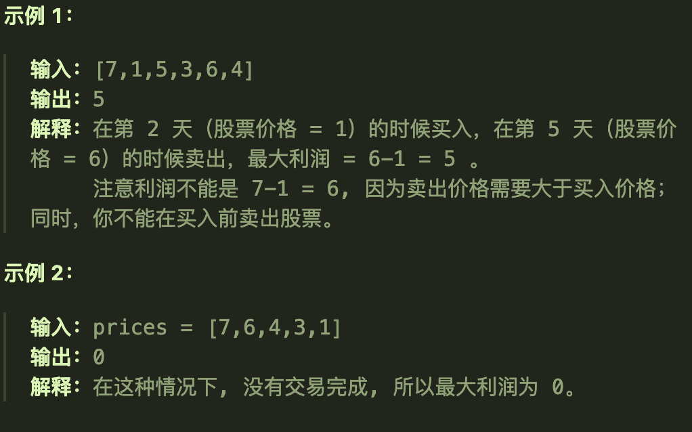
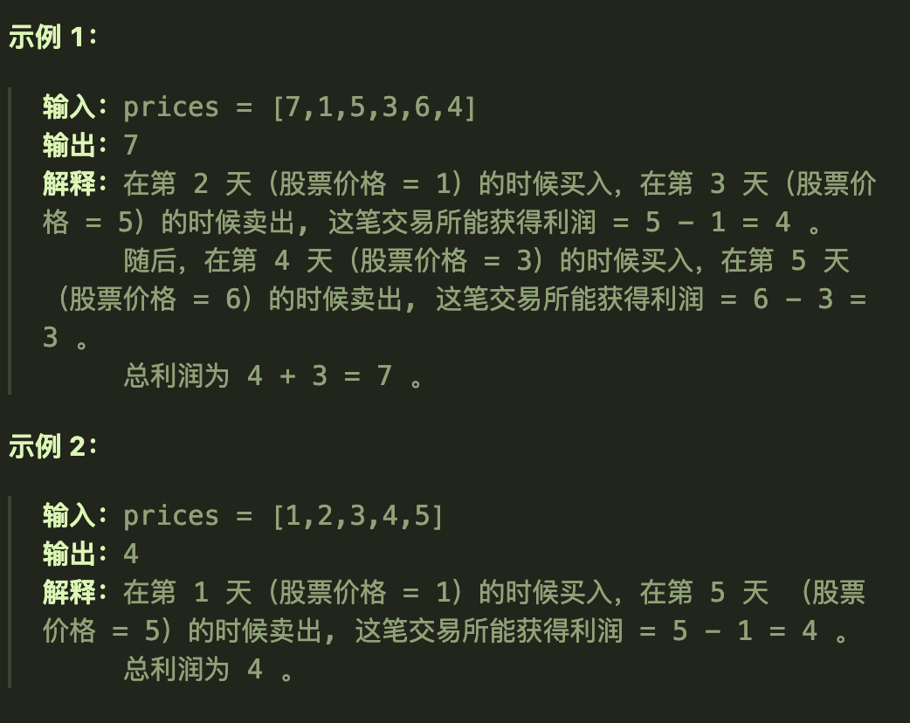
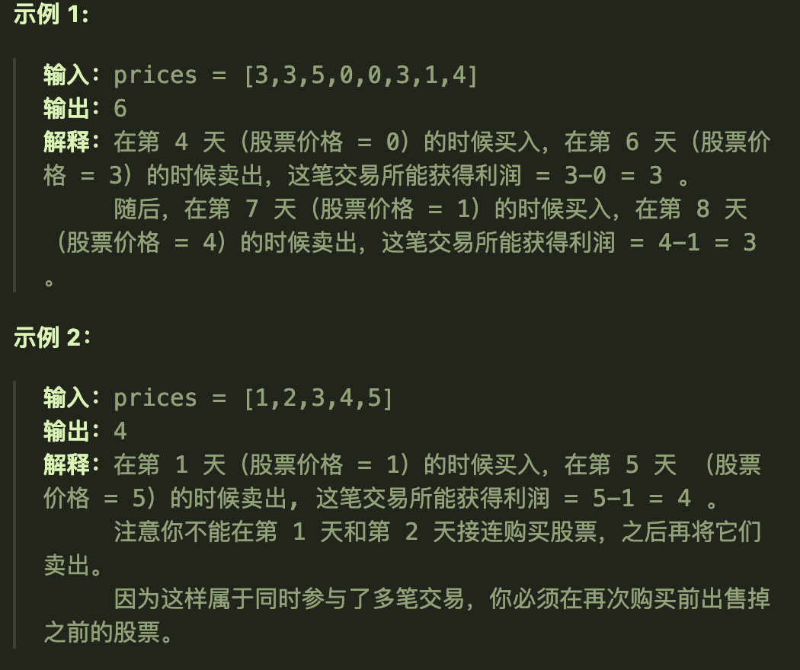
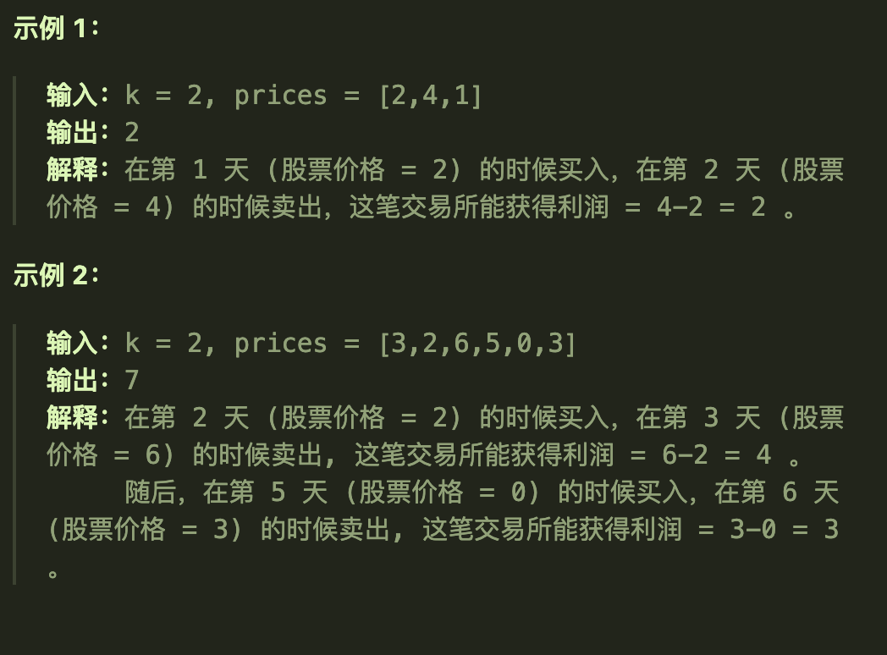
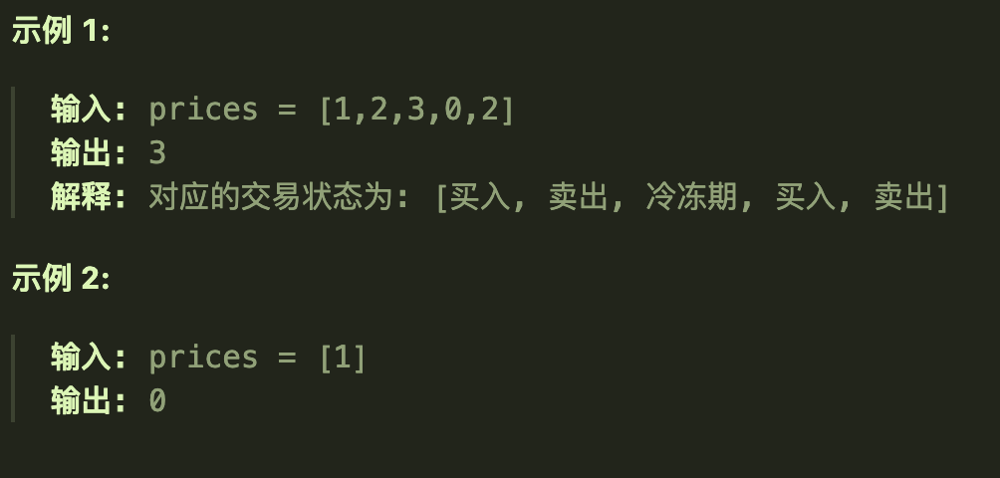
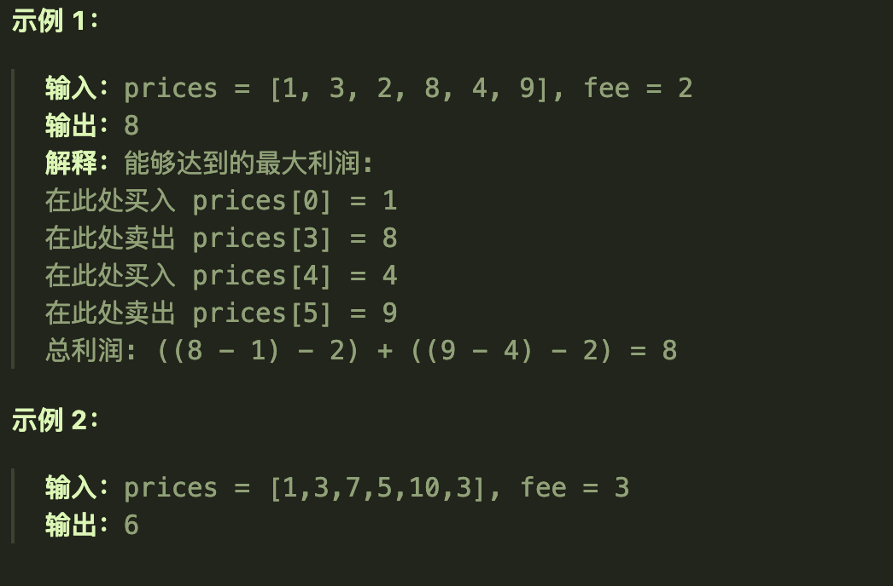

# 121买卖股票的最佳时机（一次）

## 题目要求

给定一个数组 `prices` ，它的第 `i` 个元素 `prices[i]` 表示一支给定股票第 `i` 天的价格。

你只能选择 **某一天** 买入这只股票，并选择在 **未来的某一个不同的日子** 卖出该股票。设计一个算法来计算你所能获取的最大利润。

返回你可以从这笔交易中获取的最大利润。如果你不能获取任何利润，返回 `0` 。



## 第一想法

最大利润，最值问题与动态规划有关；有相关的重叠子问题吗？

如果数组是递减的，那一定无法获取任何利润；其实就是要找一个最大差值（注意减的顺序）但是我想不到怎么弄

## 题解

使用动态规划五部曲,但是股票问题的dp数组又有变化

### 五部曲

1、确定dp数组及其下标的含义

- 使用一个二维的dp数组来表征每个位置上的*状态*：**当前手里的最多金钱**，第一个维度是位置下标，第二个维度是0和1

- `dp[i][0]`表示**位置i持有股票时手里的最多金钱**；`dp[i][1]`表示**位置i未持有股票时手里的最多金钱**
- 注意，持有并不代表着买入，只是一个持有的状态（可能表征着之前某一天就买入了）

2、确定递推公式

- 状态转移方程，每一天的位置状态是靠着前面几天的状态来推出的（重叠子问题）
- `dp[i][0] = max(dp[i-1][0], -prices[i])`在前一天也持有和前一天未有而在今天买入这两个状态中取最大值。（注意dp数组表示的是手里的最大现金，所以是减法）注意，**本题只能买卖一次，所以直接就是负的prices[i]，证明前面几天都是没有买过的**
- `dp[i][1] = max(dp[i-1][1], dp[i-1][0] + prices[i])`在前一天未持有股票（今天仍然未持有股票）和在今天卖出股票（卖出后就是未持有股票了）两种状态中取最大值

3、初始化dp数组

- `dp[0][0] = -prices[0]`持有第0个位置上的股票时手里最多的金钱注意是负的
- `dp[0][1] = 0`未持有意味着一开始未持股，自然手里的最大金钱是0

4、确定遍历顺序

- 一定是从前往后遍历
- 最终返回的一定是**最后一天未持有股票的时候手里的最大金额**。

### 代码实现

```java
    public int maxProfit(int[] prices) {
        //初始化dp数组
        int[][] dp = new int[prices.length][2];
        dp[0][0] = - prices[0];
        dp[0][1] = 0;
        //遍历元素，状态转移
        for (int i = 0; i < prices.length; i++) {
//            dp[i][0] = Math.max(dp[i-1][0], dp[i-1][1] - prices[i]);//注意只能买一次，所以这里如果这时买入手里的金钱没有之前的未买入
            dp[i][0] = Math.max(dp[i-1][0], - prices[i]);//在这一天买入了，之前一定是没有买入的，所以没有那个dp[i-1][1]
            dp[i][1] = Math.max(dp[i-1][1], dp[i-1][0] + prices[i]);
        }
        return dp[prices.length - 1][1];
    }
```


# 122买卖股票的最佳时机III（多次）

## 题目要求

给你一个整数数组 `prices` ，其中 `prices[i]` 表示某支股票第 `i` 天的价格。

在每一天，你可以决定是否购买和/或出售股票。你在任何时候 **最多** 只能持有 **一股** 股票。你也可以先购买，然后在 **同一天** 出售。

返回 *你能获得的 **最大** 利润* 。



## 第一想法

每一天都可以买卖股票，可以买卖多次，所以相对于121题的状态转移方程要发生变化。如果还是以同一个dp数组来看，递推公式如何变化：

- `dp[i][0] = max(dp[i-1][0], dp[i-1][1]-prices[i])`
- `dp[i][1] = max(dp[i-1][1], dp[i-1][0] + prices[i])`

## 题解

### 代码实现

```java
    public int maxProfit(int[] prices){
        int[][] dp = new int[prices.length][2];
        dp[0][0] = - prices[0];
        dp[0][1] = 0;
        //
        for (int i = 1; i < prices.length; i++) {
            dp[i][0] = Math.max(dp[i-1][0], dp[i-1][1] - prices[i]);
            dp[i][1] = Math.max(dp[i-1][1], dp[i-1][0] + prices[i]);
        }
        return dp[prices.length-1][1];
    }
```


# 123买卖股票的最佳时机III（最多两次）

## 题目要求

给定一个数组，它的第 `i` 个元素是一支给定的股票在第 `i` 天的价格。

设计一个算法来计算你所能获取的最大利润。你最多可以完成 **两笔** 交易。

**注意：**你不能同时参与多笔交易（你必须在再次购买前出售掉之前的股票）。



**提示：**

- `1 <= prices.length <= 105`
- `0 <= prices[i] <= 105`

## 第一想法

这道题多了两个限制条件，一个是只能买卖两次，一个是同时只能持有一个股票，所以是否需要一个属性来标志此时手里的股票个数或者说在这一点之前的已买卖次数？

并且如果还是以`dp[i][0]`来看的话，递推公式中手上的最大金额仍然是之前持有股票的最大金额吗？我感觉不能确定此时的金额仍然对整体而言最大啊，因为我们有两个买卖过程？（感觉还是一样的吧，因为dp数组就是保存着最大金额状态）

## 题解

对于上面的疑问，我们需要对dp数组进行扩充，即**dp数组不再只表示两种状态**，根据本题dp数组需要保存五种不同的状态。

### 五部曲

1、dp数组的含义以及下标

- `dp[i][0]`代表不进行任何操作；`dp[i][1]`代表第一次持有（买入）；`dp[i][2]`代表第一次不持有（卖出）;`dp[i][3]`代表第二次持有；`dp[i][4]`代表着第二次不持有(都是此时手中的最大金额)

2、确定递推公式

- `dp[i][0] = 0`不操作手中的钱为0
- `dp[i][1] = max(dp[i-1][1], dp[i-1][0] - prices[i])`之前就是第一次买入的状态、或者不操作时当天买入
- `dp[i][2] = max(dp[i-1][1] + prices[i], dp[i-1][2])`
- `dp[i][3] = max(dp[i-1][3], dp[i-1][2]-prices[i])`
- `dp[i][4] = max(dp[i-1][4], dp[i-1][3] + prices[i])`后面的递推公式都是一个道理，可以发现都是依靠前面的状态推出的

3、初始化

- 初始化有一点难以理解：不进行任何操作为0，第一次买入`dp[0][1] = -prices[i]`；第一次不持有：在同一天买卖故`dp[0][2] = 0`；第二次持有也是同一天已经买卖过一次了，然后再买入，`dp[0][3] = -prices[i]`；最后不持有还是0

4、确定遍历顺序

- 从小到大遍历

### 代码解决

```java
    public int maxProfit(int[] prices){
        int[][] dp = new int[prices.length][5];
        dp[0][0] = 0;
        dp[0][1] = -prices[0];
        dp[0][2] = 0;
        dp[0][3] = -prices[0];
        dp[0][4] = 0;//但是这几个等于0的可以不用写因为原本声明时就是0
        //
        for (int i = 1; i < prices.length; i++) {
            dp[i][0] = 0;
            dp[i][1] = Math.max(dp[i-1][1], dp[i][0] - prices[i]);
            dp[i][2] = Math.max(dp[i-1][2], dp[i-1][1] + prices[i]);
            dp[i][3] = Math.max(dp[i-1][3], dp[i-1][2] - prices[i]);
            dp[i][4] = Math.max(dp[i-1][4], dp[i-1][3] + prices[i]);
        }
        return dp[prices.length - 1][4];
    }
```

# 188买卖股票的最佳时机IV（最多k次）

## 题目要求

给你一个整数数组 `prices` 和一个整数 `k` ，其中 `prices[i]` 是某支给定的股票在第 `i` 天的价格。

设计一个算法来计算你所能获取的最大利润。你最多可以完成 `k` 笔交易。也就是说，你最多可以买 `k` 次，卖 `k` 次。

**注意：**你不能同时参与多笔交易（你必须在再次购买前出售掉之前的股票）。



**提示：**

- `1 <= k <= 100`
- `1 <= prices.length <= 1000`
- `0 <= prices[i] <= 1000`

## 第一想法

从最多两次到最多k次，那么dp数组所表示的状态就不再仅仅是第二次，第一次持有，未持有股票了；那也不能把k次全部列出来吧。

如果初始化就是每次持有的时候手中金额为负的价格，但是遍历中的递推公式呢？其实也都是有规律可循的，一方面等于前一天的本状态，另一方面是前一天的上一个状态加或者减掉当天价格。那么可以有一个总的递推公式吗？

可以发现，第二维度上除了0不操作状态以外，偶数就是买入股票（持有），奇数就是卖出股票（未持有）

## 题解

普遍化买卖股票最佳时机问题，即多次买卖：dp数组就是一个正常的二维数组，初始化时进行有规律的初始化。

### 五部曲

1、确定dp数组的含义

- `dp[i][j]`表示第i天手中的最大金额，j：奇数表示持有股票，偶数表示不持有股票，0代表不操作

2、确定递推公式

- `dp[i][奇数j] = max(dp[i-1][j], dp[i-1][j-1] - prices[i])`
- `dp[i][偶数j] = max(dp[i-1][j], dp[i-1][j-1] + prices[i])`
- 都是根据上一个状态来推断的

3、dp数组初始化

- 可以发现规律，j为奇数时初始化为`-prices[0]`

4、确定遍历顺序

- 从前向后遍历

### 代码实现

```java
class Solution {
    public int maxProfit(int k, int[] prices){
        int[][] dp = new int[prices.length][2 * k + 1];
        //初始化
        for (int i = 1; i < 2*k; i+=2) {
            dp[0][i] = -prices[0];
        }
        //遍历,注意正常的二维数组一定是双层for循环遍历
        for (int i = 1; i < prices.length; i++) {
            for (int j = 1; j < 2*k; j+=2) {
                dp[i][j] = Math.max(dp[i-1][j], dp[i-1][j-1] - prices[i]);//j为奇数时
                dp[i][j+1] = Math.max(dp[i-1][j+1], dp[i-1][j] + prices[i]);//j为偶数时
            }
        }
        return dp[prices.length-1][2*k];
    }
```


# 309最佳买卖股票时机含冷冻期（多次，有冷冻期）

## 题目要求

给定一个整数数组`prices`，其中第 `prices[i]` 表示第 `*i*` 天的股票价格 。

设计一个算法计算出最大利润。在满足以下约束条件下，你可以尽可能地完成更多的交易（多次买卖一支股票）:

- 卖出股票后，你无法在第二天买入股票 (即冷冻期为 1 天)。

**注意：**你不能同时参与多笔交易（你必须在再次购买前出售掉之前的股票）。



**提示：**

- `1 <= prices.length <= 5000`
- `0 <= prices[i] <= 1000`

## 第一想法

相较于上一题（已经是很普遍的做法）又多了一个限制条件，卖出股票之后的下一个位置是冷冻期，冷冻期代表着手里的金额不会发生变化，即跳过这个位置，那么dp数组的状态会多吗？还是在遍历的时候遇到卖出股票的情况if条件判断一下然后再调整呢？

`dp[i][j]`表示着对于第i个位置上的股票的不同状态，奇数代表持有股票，偶数代表不持有股票；那么卖出会发生在哪里呢？发生在持有股票时在当天卖出，也就是j为奇数的情况可能会发生卖出，那么代码会发生什么变化呢？是i直接往后+1还是j？

## 题解

多了冷冻期，dp所代表的状态就更加复杂（但为什么有多次不是再用奇偶性呢？）
- 因为问题的状态转移不再直接依赖于交易次数，而是依赖于每一天的特定状态

### 五部曲

1、dp数组的含义及其下标

- `dp[i][0]`代表持有股票；`dp[i][1]`代表保持卖出股票的状态（冷冻期之后一直没买）；`dp[i][2]`代表恰好在今天卖出股票；`dp[i][3]`代表冷冻期
- 12这两个状态就是**冷冻期后前的两个状态**，以往没有冷冻期的时候总会合并为未持有股票的状态。

2、确定递推公式
- `dp[i][0] = max(dp[i-1][0], max(dp[i-1][1] - prices[i], dp[i][3] - prices[i]))`
- `dp[i][1] = max(dp[i-1][1], dp[i-1][3])`
- `dp[i][2] = dp[i-1][0] + prices[i]`注意，冷冻期后手里已经没有股票了
- `dp[i][3] = dp[i-1][2]`冷冻期时手里的金额就是前面恰好卖出股票

3、初始化dp数组
- `dp[0][0] = -prices[i]`;`dp[0][1] = 0`;`dp[0][2] = 0`;`dp[0][3] = 0`
- 在一些看似不合法的初始化状态我们可以放入上面的递推公式中去推导;或者同一天进行买卖即可推出。

4、确定遍历顺序
- 一定是从前向后遍历

### 代码实现

```java
    public int maxProfit(int[] prices){
        int len = prices.length;
        if (prices == null || len < 2){
            return 0;
        }
        int[][] dp = new int[len][4];//一共四个状态，持有，保持卖出，当天卖出，冷冻期
        dp[0][0] = -prices[0];//其他状态初始化都为0
        //
        for (int i = 1; i < len; i++) {
            dp[i][0] = Math.max(dp[i-1][0],Math.max(dp[i-1][1] - prices[i], dp[i-1][3] - prices[i]));
            dp[i][1] = Math.max(dp[i-1][1], dp[i-1][3]);
            dp[i][2] = dp[i-1][0] + prices[i];
            dp[i][3] = dp[i-1][2];
        }
        //返回三个手中没有股票的状态
        return Math.max(dp[len-1][3], Math.max(dp[len-1][1], dp[len-1][2]));
    }
```


# 714买卖股票的最佳时机含手续费（多次，每次手续费）

## 题目要求

给定一个整数数组 `prices`，其中 `prices[i]`表示第 `i` 天的股票价格 ；整数 `fee` 代表了交易股票的手续费用。

你可以无限次地完成交易，但是你每笔交易都需要付手续费。如果你已经购买了一个股票，在卖出它之前你就不能再继续购买股票了。

返回获得利润的最大值。

**注意：**这里的一笔交易指买入持有并卖出股票的整个过程，每笔交易你只需要为支付一次手续费。



**提示：**

- `1 <= prices.length <= 5 * 104`
- `1 <= prices[i] < 5 * 104`
- `0 <= fee < 5 * 104`

## 第一想法

这次没有冷冻期了，反而是多了手续费，那么就是在每次卖出的时候多扣一笔钱即可。所以dp数组表征状态会发生什么变化吗？持有股票，未持有股票？还是持有股票，保持未持有股票的状态，当天卖出股票（在这一步上面扣钱）？感觉没有必要。

## 题解

与122题多次买卖几乎一样，只需要在每次卖出的时候扣除费用即可。在这里我还注意到122与188都是可以多次买卖，二者的区别在于188限制了次数k次，而122则对于次数没有进行限制。所以188题使用了奇偶性以及双层for循环遍历，题目更为复杂。

### 五部曲

1、确定dp数组

- `dp[i][0]`表示第i天持有股票时的最大金额；`dp[i][1]`表示第i天未持有股票时最大金额

2、确定递推公式

- `dp[i][0] = max(dp[i-1][0], dp[i-1][1] - prices[i])`
- `dp[i][1] = max(dp[i-1][1], dp[i-1][0] + prices[i] - fee)`

3、初始化

- `dp[0][0] = -prices[i]`
- `dp[0][1] = 0`,其余都是0

4、确定遍历顺序

- 从前向后遍历

5、打印dp数组

- 最后返回的是最后一天未持有股票时的最大金额。

### 代码实现

```java
```

