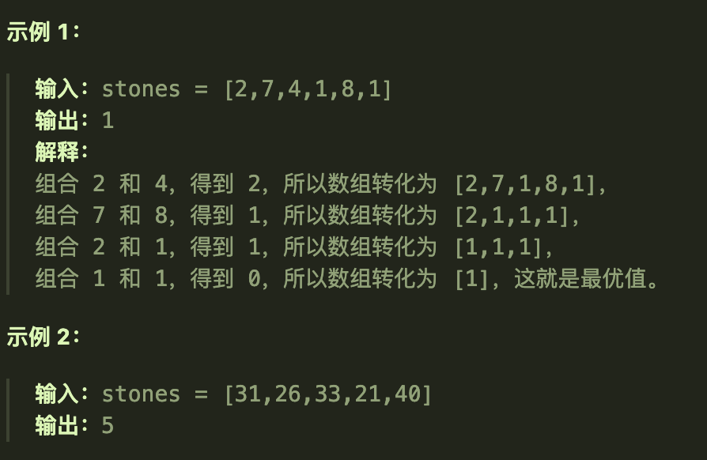
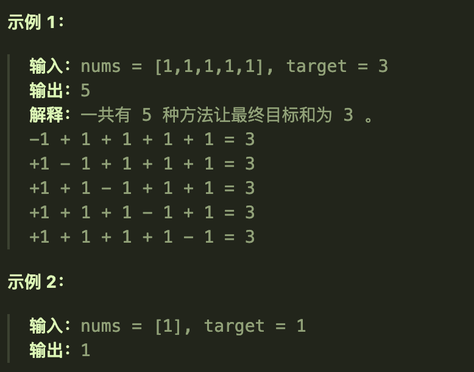
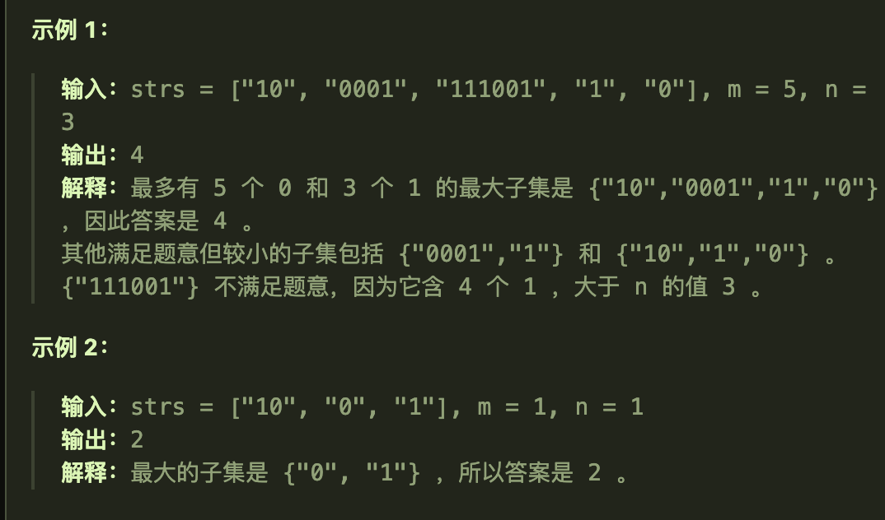

## 01背包的原理（二维dp数组）

### 题目要求

有n件物品和一个最多能背重量为w 的背包。第i件物品的重量是weight[i]，得到的价值是value[i] 。**每件物品只能用一次**，求解将哪些物品装入背包里物品价值总和最大。

### 思路

使用了一个二维数组来同时控制物品类型和背包的容量。

五部曲

1、确定dp数组及其下标i的含义

- `dp[i][j]`代表着**第i个物品，此时背包容量为j**，*此时所代表的最大价值*。

2、确定递推公式

- 某个ij位置上的元素状态取决于两个情况：
  - 不放物品i：`dp[i-1][j]`即上一个物品所对应的最大价值
  - 放物品i：`dp[i-1][j-weight[i]]+value[i]`前一段是没有放物品i之前的状态，注意因为我们最终还是要放物品i的，所以重量j要发生变化；后一段是放入了物品i的状态，即加上i所对应的价值
- 故递推公式为`dp[i][j] = max(dp[i-1][j],dp[i-1][j-weight[i]]+value[i])`

3、初始化dp数组

- 

- 根据递推公式可以发现某个位置上的dp值是由其正上方和左上方元素推导而来，所以我们需要初始化的是第一行和第一列
- 第一列肯定是初始化为0了，第一行根据物品0的情况具体分析：如果物品0的重量大于j，那么初始化为0；如果物品0的重量小于j，那么初始化为物品0的重量。
- 其他位置的初始化其实没有要求，还是同样的原因，递推的规律。

4、确定遍历顺序

- 先遍历行还是先遍历列；由于某个位置上的dp值是由其正上方和左上方元素推导而来，所以行列谁先遍历是一样的（与基础题目中左方和上方推导不一样）

5、打印dp数组

### 代码实现

```java
    public static void testWeightBagProblem(int[] weight, int[] value, int bagSize){
        int goods = weight.length;
        int[][] dp = new int[goods][bagSize + 1];//行数是物品的数量（与物品的重量数组长度一致）列数是背包的容量从0开始
        //初始化
        for (int j = weight[0]; j <= bagSize; j++) {//这里取巧了，因为原本整个dp数组值都是0，我们其实只需要初始化第一行
            dp[0][j] = value[0];//初始化第一行的元素，并且从第0个的重量下标的位置开始初始化（从背包容量合适的位置开始）
        }
        //先遍历行，再遍历列；i代表的是物品是哪一个，j代表着此时背包的容量
        for (int i = 1; i < goods; i++) {
            for (int j = 1; j <= bagSize; j++) {
                if (j < weight[i]){
                    //此时背包的容量不足以装下物品i
                    dp[i][j] = dp[i-1][j];
                }else {
                    //此时可以放下物品i，但是可以选择不放，也可以选择放，在这之间我们要选择一个最大值
                    dp[i][j] = Math.max(dp[i-1][j],dp[i-1][j-weight[i]] + value[i]);
                }
            }
        }
        //将dp数组打印出就可以看到不同情况下的最大价值
        for (int[] ints : dp) {
            System.out.println(Arrays.toString(ints));//将每一行打印出
        }
    }
```

## 01背包（一维dp数组）

### 滚动数组

将二维降为一维数组

- 由于递推公式的特殊性，当前位置只需要自己的上一行的状态，所以可以将二维数组压缩成一维数组——每次都将上一行的状态复制到下一行从而来求当前位置的dp值
- `dp[j]`故可以将i省去了，只留下背包容量j（因为一维数组了）

### 五部曲

1、确定dp数组及其下标含义

-  `dp[j]`此时容量为j的背包的最大价值
- 这里*并不是彻底不用i了*，后面的遍历还要用到i

2、确定递推公式

- `dp[j] = max(dp[j],dp[j-weight[i]]+value[i])`
- 其中第一段dp[j]是从上一层复制过来的，即上一次的最大价值；第二段是放入物品i后的最大价值

3、初始化

- `dp[0] = 0`;后面位置上的值也应该初始为0，因为根据递推公式每个位置上的初始值会影响最终的结果

4、确定遍历顺序

- 双层for循环，先遍历物品后遍历背包容量
- 注意，遍历背包容量时遍历顺序是从后往前遍历（倒序遍历），为了保证物品i只使用了一次；
- 

5、打印dp数组进行验证

###  代码实现

```java
    public static void testWeightBagProblem(int[] weight,int[] value,int bagSize){
        int wLen = weight.length;
        //声明一维的dp数组
        int[] dp = new int[bagSize + 1];
        //遍历来填充dp数组
        for (int i = 0; i < wLen; i++) {
            for (int j = bagWeight; j >= weight[i]; j--) {
                dp[j] = Math.max(dp[j],dp[j-weight[i]] + value[i]);
            }
        }
        //
        for (int i : dp) {
            System.out.println(i + " ");
        }
    }
```

## 416分割等和子集

## 题目要求

给你一个 **只包含正整数** 的 **非空** 数组 `nums` 。请你判断是否可以将这个数组分割成两个子集，使得两个子集的元素和相等。


## 第一想法

这道题与01背包问题有什么关系吗？先入为主的来讲，一定是一个二维的dp数组。

dp数组的含义应该是什么呢？真的没有任何的思路啊。

## 题解

### 本质

本道题如何转换为01背包问题：本质上所求的是数组中是否可以组成两组和为`sum/2`的组，这里找到`sum/2`总和这个关键点十分重要。

所以转换为**商品是nums数组中的元素，商品的重量即元素值，商品的价值也是元素值；背包的重量是`sum/2 = target`**

背包如果恰好装满，意味着找到了一组符合条件的数；并且元素值也只能使用一次，所以也符合01背包的要求。

### 五部曲（使用一维）

1、确定dp数组的含义及其下标的含义

- `dp[j]`代表着此时重量为j的背包所装有的最大价值
- 如何证明找到了，即此时的背包容量达到了target，此时的背包内元素价值也达到了target，即`dp[target] == target`的时候——目标值==所找到的元素值之和。（这个只能算是找到一组符合条件的吧，其实不是，原因见我最后的总结）

2、确定递推公式

- `dp[j] = max(dp[j],dp[j-weight[i]] + value[i])`
- 对于本题而言，商品的重量和价值是相同的，都是元素值
- 故`dp[j] = max(dp[j],dp[j-nums[i]]+nums[i])`

3、dp数组的初始化

- 与一维01背包相同，`dp[0] = 0`

4、遍历顺序

- 先遍历物品i，再逆序地遍历背包j

5、打印dp数组验证结果

### 代码实现

```java
    public boolean canPartition(int[] nums){
        //对本题中有特别需要的变量进行声明
        int sum = 0;
        for (int i = 0; i < nums.length; i++) {
            sum += nums[i];
        }
        if (sum % 2 != 0) return false;//如果总和为奇数，那根本就不需要分割了
        int target = sum / 2;
        //声明dp数组，并进行初始化
        int[] dp = new int[target + 1];
        for (int i = 0; i < nums.length; i++) {//遍历物品
            for (int j = target; j >= nums[i]; j--) {//遍历背包容量,从后往前
                dp[j] = Math.max(dp[j],dp[j-nums[i]]+nums[i]);
            }
        }
        //这里其实是自己没有理解的地方，具体到这道题里面来说该如何解释呢
        if (dp[target] == target) return true;//背包容量为target时，最大价值也为target
        return false;
    }

```


再回到本题的题目描述，跳出01背包的嵌入，dp数组的实际意义是什么呢？

- `dp[j]`:在不超过 `j` 的容量限制下，数组中元素可以达到的最大总和。

回答代码中我自己的最后问题：

- **这是因为如果一个子集能达到 `target`，那么剩余的元素自然形成了另一个和为 `target` 的子集。**

# 1049最后一块石头的重量II

## 题目要求

有一堆石头，用整数数组 `stones` 表示。其中 `stones[i]` 表示第 `i` 块石头的重量。

每一回合，从中选出**任意两块石头**，然后将它们一起粉碎。假设石头的重量分别为 `x` 和 `y`，且 `x <= y`。那么粉碎的可能结果如下：

- 如果 `x == y`，那么两块石头都会被完全粉碎；
- 如果 `x != y`，那么重量为 `x` 的石头将会完全粉碎，而重量为 `y` 的石头新重量为 `y-x`。

最后，**最多只会剩下一块** 石头。返回此石头 **最小的可能重量** 。如果没有石头剩下，就返回 `0`。



- `1 <= stones.length <= 30`
- `1 <= stones[i] <= 100`

## 第一想法

看示例的意思，虽然是每次任选，但我们最好还是选取重量最接近的两块石头，（也不一定啊，刚开始也没选2和1），总之这是一个不断转换数组的过程，如何套到01背包问题上呢？谁来做商品的重量，谁来做商品的价值，谁来做背包的容量？

## 题解

### 本质

本题的本质是：将每次两两粉碎转换为**分成两堆去粉碎**，两堆的重量要尽可能地达到总重量的一半（又回到了上一题的感觉），所以转换为01背包问题就是我们要从石头重量数组中尽可能地去找到石头来填满sum/2重量的背包，这样剩下的重量即使没有达到sum/2（因为没填满）二者也是差距最小的重量和，最后两堆重量相减即为这一堆石头的最小重量之差。

更加抽象化的理解是：动态规划在寻找一种方式，尽可能使得最终剩下的石头（即两堆的重量差）最小。这种方法忽略了粉碎石头的具体顺序，只关注在所有可能的分割方式中找到最优的一种。

### 五部曲

1、确定dp数组的含义及其下标

- `dp[j]`代表着当前重量为j的背包所能装的最大价值（最大重量，因为本题商品的重量与价值相同）

2、确定递推公式

- `dp[j] = max(dp[j], dp[j - stones[i]]+stones[i])`

3、初始化

- 0

4、遍历方式

- 先遍历商品，再遍历背包容量

5、打印dp数组

### 代码实现

```java
public int lastStoneWeightII(int[] stones) {
        //
        int sum = 0;
        for (int i = 0; i < stones.length; i++) {
            sum += stones[i];
        }
        //
        int target = sum / 2;
        int[] dp = new int[target + 1];
        //
        for (int i = 0; i < stones.length; i++) {
            for (int j = target; j >= stones[i]; j--) {
                dp[j] = Math.max(dp[j], dp[j-stones[i]] + stones[i]);
            }
        }
        return sum - dp[target] - dp[target];//前面一段是另外一堆所能达到的最大价值，后面是这一堆的最大价值
    }
```

# 494目标和

## 题目要求

给你一个非负整数数组 `nums` 和一个整数 `target` 。

向数组中的每个整数前添加 `'+'` 或 `'-'` ，然后串联起所有整数，可以构造一个 **表达式** ：

- 例如，`nums = [2, 1]` ，可以在 `2` 之前添加 `'+'` ，在 `1` 之前添加 `'-'` ，然后串联起来得到表达式 `"+2-1"` 。

返回可以通过上述方法构造的、运算结果等于 `target` 的不同 **表达式** 的数目。



## 第一想法

如果套到01背包：每个值只能使用一次所以01；背包的容量应该是最后的目标值，商品的重量和价值还是相同的，不过这回有了正负之分，一个商品的重量既可以是正的也可以是负的；

但是01背包系列问题所求的是一个最大价值，即一个最优解；上面两道题一个是是否能分成两堆，一个是分成两堆之后的剩余其实也是在最优解的基础上去延伸出来的东西，那么本题所求的是有多少种装背包的方法，我们可以设置一个计数器来记录每一次成功的方法，如何判断成功呢？

- 首先每一个元素都要用到。
- 其次就得看看五部曲中特别是dp数组的含义了。

## 题解

### 本质

本题的本质上还是分成两堆，一堆作为正数集合，一堆作为负数集合；`left + right = sum,left - right = target`最终可以得到`left = (sum+target) / 2`

所以本题最后的目的在于去找这个left大小的背包，看装满这个背包一共有多少种方法。套到01背包问题里，left就是背包容量，是可以确定的值；商品的重量和价值就是元素值。

### 五部曲

1、确定dp数组的含义

- `dp[j]`代表着当前背包容量为j时，有**多少种方法可以装满这个背包**

2、确定递推公式

- 这次的递推公式跟以往不同，这次需要求的是多少种方法，而不是背包所能装的最大价值。
- 进行举例：j为5时，如果当前`nums[i]`为1的话，还有`dp[5-1]`种方法可以塞满为5的背包（*因为dp[4]的含义是背包容量为4时还有x种方法来装满背包*）；同理`nums[i]=2`，还有`dp[5-2]`三种方法可以塞满为5的背包，最后`dp[5]=dp[0]+dp[1]+dp[2]+dp[3]+dp[4]`
- 故递推公式为`dp[j] += dp[j-nums[i]]`；形象地理解为：假设当前背包里已经有一个商品了（nums[i]），还能有多少种方法将其填满

3、初始化dp数组

- 这次也不能简单地将数组初始化为0，`dp[0] = 1`，举个例子当nums=[0],target=0时，背包容量为0时，也有一种方法装满这个背包。或者再举个例子nums=[0,0,0]target=0时，如果dp[0] = 0，那么根据递推公式结果一直会是0，无法累加起来。
- 其他位置上的值同样设置为0，因为递推公式中会不断地覆盖。

4、确定遍历顺序

- 依然是先遍历商品后遍历背包容量

5、打印dp数组

### 代码实现

```java
    public int findTargetSumWays(int[] nums, int target) {
        int sum = 0;
        for (int i = 0; i < nums.length; i++) {
            sum += nums[i];
        }
        if (target < 0 && sum < -target) return 0;
        if ((target + sum) % 2 != 0) return 0;//背包容量必须是整除得到的，如果没有整除那一定得不到target
        int bagSize = (target + sum) / 2;
        if (bagSize < 0) bagSize = - bagSize;//这里还要保证背包容量必须是正数，因为后面的遍历
        //
        int[] dp = new int[bagSize + 1];
        //
        dp[0] = 1;
        for (int i = 0; i < nums.length; i++) {
            for (int j = bagSize; j >= nums[i]; j--) {
                dp[j] += dp[j - nums[i]];
            }
        }
        return dp[bagSize];
    }

```

# 474一和零

## 题目要求

给你一个二进制字符串数组 `strs` 和两个整数 `m` 和 `n` 。

请你找出并返回 `strs` 的最大子集的长度，该子集中 **最多** 有 `m` 个 `0` 和 `n` 个 `1` 。

如果 `x` 的所有元素也是 `y` 的元素，集合 `x` 是集合 `y` 的 **子集** 。



## 第一想法

本道题也跟上面不太一样，因为只能用一次所以还是01背包的问题，数值数组换成了字符串数组，每一个字符串即代表着一个商品，这个商品的重量和价值目前我觉得价值也不再是一个单一的数值，而是本商品有几个1和几个0，然后背包的容量也不再是单一的，应该是1的数量作为一个背包，0的数量作为一个背包。最后在满足两个背包都尽量装满的前提下的总的商品数量。

但是两个背包的话要一起去使用商品，会不会导致混乱。还是说还是一个背包，只是里面设置两个属性。其他的处理就没有思路了。

## 题解

### 本质

确实背包的容量不再是一个一维，所以我们需要将dp数组也随之提升至二维；最终所求还是这样一个二维容量的背包最多能装多少个商品。

### 五部曲

1、确定dp数组的含义

- `dp[i][j] `代表着当前背包有i个0，j个1，已经装的商品数量

2、确定递推公式

- 类比原始的01背包问题，`dp[i][j] = max(dp[i][j],dp[i-zeroNum][j-oneNum]+1)`即不放该商品和放了该商品之后取一个最大值
- 注意这里最大值是商品的数量而不是原始问题中的价值，所以我们+1而不是+value，其中的zeroNum和oneNum是当前商品的01个数，所以我们在代码中每遇到一个字符串也要先记录当前字符串的01个数

3、dp数组的初始化

- `dp[0][0] = 0`，其他位置上也是0，因为递推公式里面的与自己比较。

4、确定遍历顺序

- 先遍历字符串，再遍历背包（**即01两个维度进行嵌套遍历，并且从后往前遍历**）

5、打印dp数组

### 代码实现

```java
class Solution {
    public int findMaxForm(String[] strs, int m, int n){
        int[][] dp = new int[m + 1][n + 1];
        int zeroNum, oneNum;
        for (String str : strs) {//先遍历商品
            oneNum = 0;
            zeroNum = 0;
            for (char c : str.toCharArray()) {//讲过每个单独的字符串转为一个个的字符
                if (c == '0'){
                    zeroNum ++;
                }else {
                    oneNum ++;
                }
            }
            //再遍历背包，两个维度并且倒序遍历,初始化为背包的容量
            for (int i = m; i >= zeroNum; i--) {
                for (int j = n; j >= oneNum; j--) {
                    dp[i][j] = Math.max(dp[i][j],dp[i - zeroNum][j - oneNum] + 1);
                }
            }
        }
        return dp[m][n];
    }
}
```

