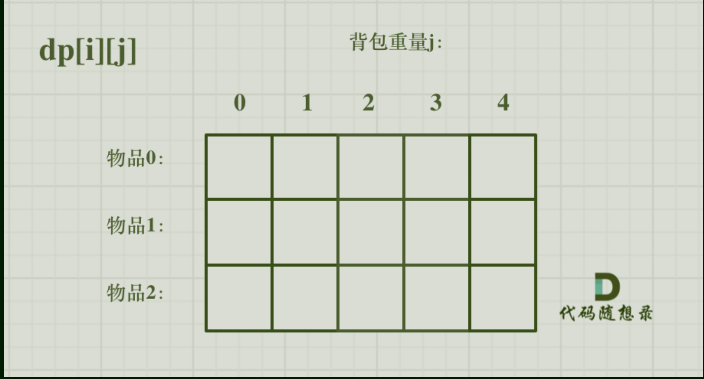
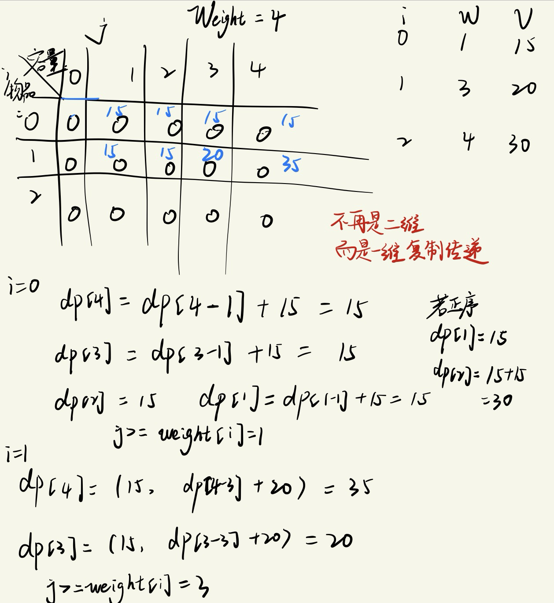
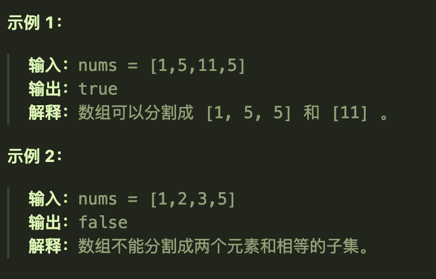

## 01背包的原理（二维dp数组）

### 题目要求

有n件物品和一个最多能背重量为w 的背包。第i件物品的重量是weight[i]，得到的价值是value[i] 。**每件物品只能用一次**，求解将哪些物品装入背包里物品价值总和最大。

### 思路

使用了一个二维数组来同时控制物品类型和背包的容量。

五部曲

1、确定dp数组及其下标i的含义

- `dp[i][j]`代表着**第i个物品，此时背包容量为j**，*此时所代表的最大价值*。

2、确定递推公式

- 某个ij位置上的元素状态取决于两个情况：
  - 不放物品i：`dp[i-1][j]`即上一个物品所对应的最大价值
  - 放物品i：`dp[i-1][j-weight[i]]+value[i]`前一段是没有放物品i之前的状态，注意因为我们最终还是要放物品i的，所以重量j要发生变化；后一段是放入了物品i的状态，即加上i所对应的价值
- 故递推公式为`dp[i][j] = max(dp[i-1][j],dp[i-1][j-weight[i]]+value[i])`

3、初始化dp数组

- 

- 根据递推公式可以发现某个位置上的dp值是由其正上方和左上方元素推导而来，所以我们需要初始化的是第一行和第一列
- 第一列肯定是初始化为0了，第一行根据物品0的情况具体分析：如果物品0的重量大于j，那么初始化为0；如果物品0的重量小于j，那么初始化为物品0的重量。
- 其他位置的初始化其实没有要求，还是同样的原因，递推的规律。

4、确定遍历顺序

- 先遍历行还是先遍历列；由于某个位置上的dp值是由其正上方和左上方元素推导而来，所以行列谁先遍历是一样的（与基础题目中左方和上方推导不一样）

5、打印dp数组

### 代码实现

```java
    public static void testWeightBagProblem(int[] weight, int[] value, int bagSize){
        int goods = weight.length;
        int[][] dp = new int[goods][bagSize + 1];//行数是物品的数量（与物品的重量数组长度一致）列数是背包的容量从0开始
        //初始化
        for (int j = weight[0]; j <= bagSize; j++) {//这里取巧了，因为原本整个dp数组值都是0，我们其实只需要初始化第一行
            dp[0][j] = value[0];//初始化第一行的元素，并且从第0个的重量下标的位置开始初始化（从背包容量合适的位置开始）
        }
        //先遍历行，再遍历列；i代表的是物品是哪一个，j代表着此时背包的容量
        for (int i = 1; i < goods; i++) {
            for (int j = 1; j <= bagSize; j++) {
                if (j < weight[i]){
                    //此时背包的容量不足以装下物品i
                    dp[i][j] = dp[i-1][j];
                }else {
                    //此时可以放下物品i，但是可以选择不放，也可以选择放，在这之间我们要选择一个最大值
                    dp[i][j] = Math.max(dp[i-1][j],dp[i-1][j-weight[i]] + value[i]);
                }
            }
        }
        //将dp数组打印出就可以看到不同情况下的最大价值
        for (int[] ints : dp) {
            System.out.println(Arrays.toString(ints));//将每一行打印出
        }
    }
```

## 01背包（一维dp数组）

### 滚动数组

将二维降为一维数组

- 由于递推公式的特殊性，当前位置只需要自己的上一行的状态，所以可以将二维数组压缩成一维数组——每次都将上一行的状态复制到下一行从而来求当前位置的dp值
- `dp[j]`故可以将i省去了，只留下背包容量j（因为一维数组了）

### 五部曲

1、确定dp数组及其下标含义

-  `dp[j]`此时容量为j的背包的最大价值
- 这里*并不是彻底不用i了*，后面的遍历还要用到i

2、确定递推公式

- `dp[j] = max(dp[j],dp[j-weight[i]]+value[i])`
- 其中第一段dp[j]是从上一层复制过来的，即上一次的最大价值；第二段是放入物品i后的最大价值

3、初始化

- `dp[0] = 0`;后面位置上的值也应该初始为0，因为根据递推公式每个位置上的初始值会影响最终的结果

4、确定遍历顺序

- 双层for循环，先遍历物品后遍历背包容量
- 注意，遍历背包容量时遍历顺序是从后往前遍历（倒序遍历），为了保证物品i只使用了一次；
- 

5、打印dp数组进行验证

###  代码实现

```java
    public static void testWeightBagProblem(int[] weight,int[] value,int bagSize){
        int wLen = weight.length;
        //声明一维的dp数组
        int[] dp = new int[bagSize + 1];
        //遍历来填充dp数组
        for (int i = 0; i < wLen; i++) {
            for (int j = bagWeight; j >= weight[i]; j--) {
                dp[j] = Math.max(dp[j],dp[j-weight[i]] + value[i]);
            }
        }
        //
        for (int i : dp) {
            System.out.println(i + " ");
        }
    }
```

## 416分割等和子集

## 题目要求

给你一个 **只包含正整数** 的 **非空** 数组 `nums` 。请你判断是否可以将这个数组分割成两个子集，使得两个子集的元素和相等。



## 第一想法

这道题与01背包问题有什么关系吗？先入为主的来讲，一定是一个二维的dp数组。

dp数组的含义应该是什么呢？真的没有任何的思路啊。

## 题解

### 本质

本道题如何转换为01背包问题：本质上所求的是数组中是否可以组成两组和为`sum/2`的组，这里找到`sum/2`总和这个关键点十分重要。

所以转换为**商品是nums数组中的元素，商品的重量即元素值，商品的价值也是元素值；背包的重量是`sum/2 = target`**

背包如果恰好装满，意味着找到了一组符合条件的数；并且元素值也只能使用一次，所以也符合01背包的要求。

### 五部曲（使用一维）

1、确定dp数组的含义及其下标的含义

- `dp[j]`代表着此时重量为j的背包所装有的最大价值
- 如何证明找到了，即此时的背包容量达到了target，此时的背包内元素价值也达到了target，即`dp[target] == target`的时候——目标值==所找到的元素值之和。（这个只能算是找到一组符合条件的吧，其实不是，原因见我最后的总结）

2、确定递推公式

- `dp[j] = max(dp[j],dp[j-weight[i]] + value[i])`
- 对于本题而言，商品的重量和价值是相同的，都是元素值
- 故`dp[j] = max(dp[j],dp[j-nums[i]]+nums[i])`

3、dp数组的初始化

- 与一维01背包相同，`dp[0] = 0`

4、遍历顺序

- 先遍历物品i，再逆序地遍历背包j

5、打印dp数组验证结果

### 代码实现

```java
    public boolean canPartition(int[] nums){
        //对本题中有特别需要的变量进行声明
        int sum = 0;
        for (int i = 0; i < nums.length; i++) {
            sum += nums[i];
        }
        if (sum % 2 != 0) return false;//如果总和为奇数，那根本就不需要分割了
        int target = sum / 2;
        //声明dp数组，并进行初始化
        int[] dp = new int[target + 1];
        for (int i = 0; i < nums.length; i++) {//遍历物品
            for (int j = target; j >= nums[i]; j--) {//遍历背包容量,从后往前
                dp[j] = Math.max(dp[j],dp[j-nums[i]]+nums[i]);
            }
        }
        //这里其实是自己没有理解的地方，具体到这道题里面来说该如何解释呢
        if (dp[target] == target) return true;//背包容量为target时，最大价值也为target
        return false;
    }

```


再回到本题的题目描述，跳出01背包的嵌入，dp数组的实际意义是什么呢？

- `dp[j]`:在不超过 `j` 的容量限制下，数组中元素可以达到的最大总和。

回答代码中我自己的最后问题：

- **这是因为如果一个子集能达到 `target`，那么剩余的元素自然形成了另一个和为 `target` 的子集。**

# 1049最后一块石头的重量II


