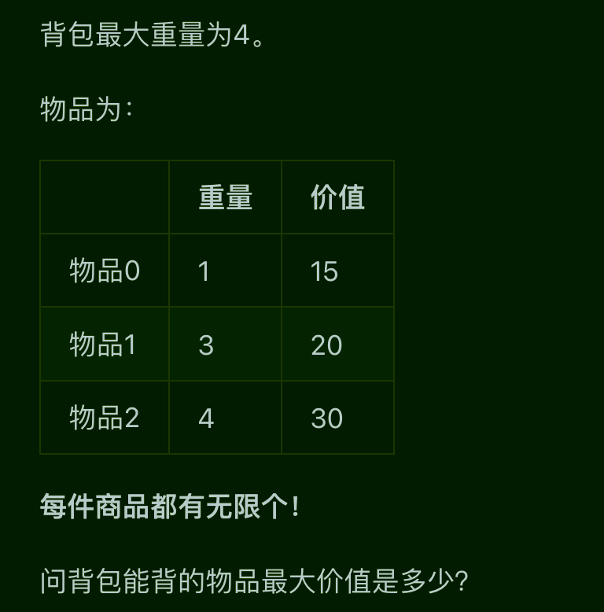
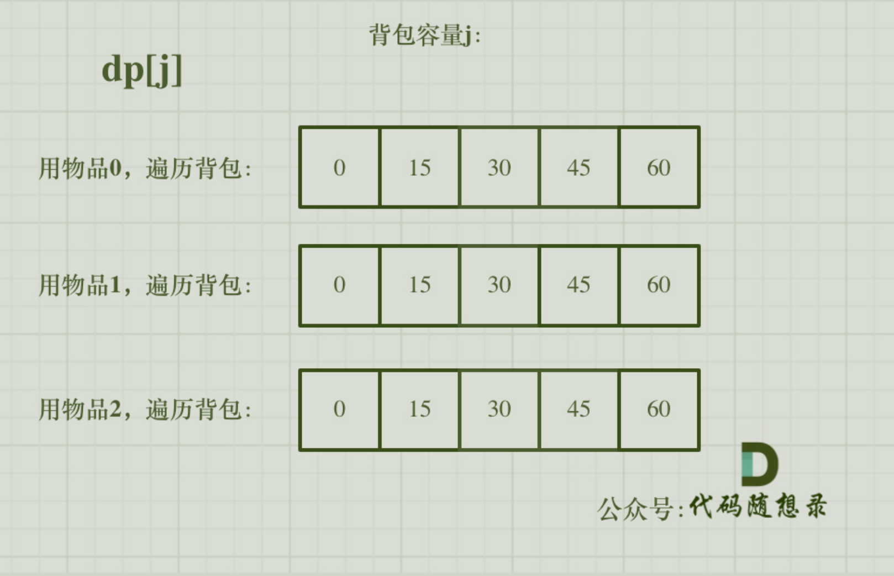
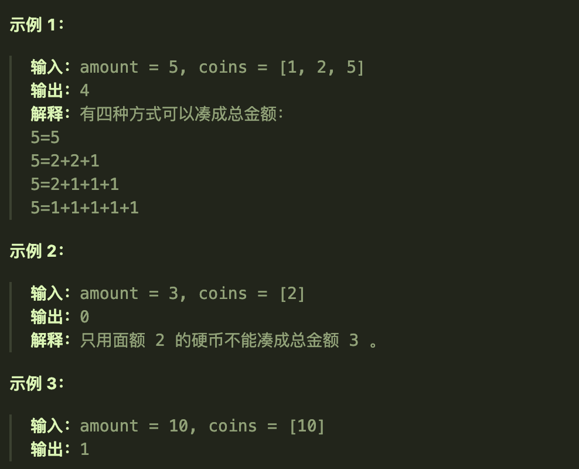
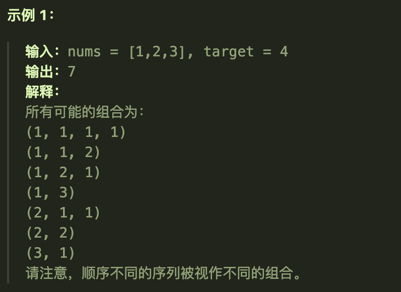
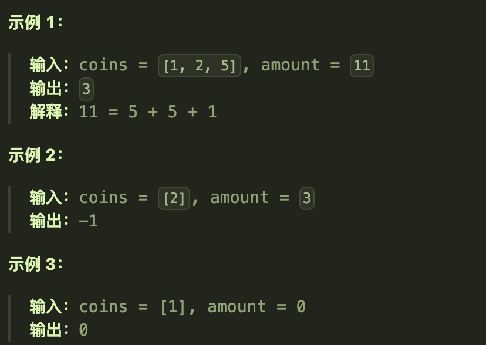
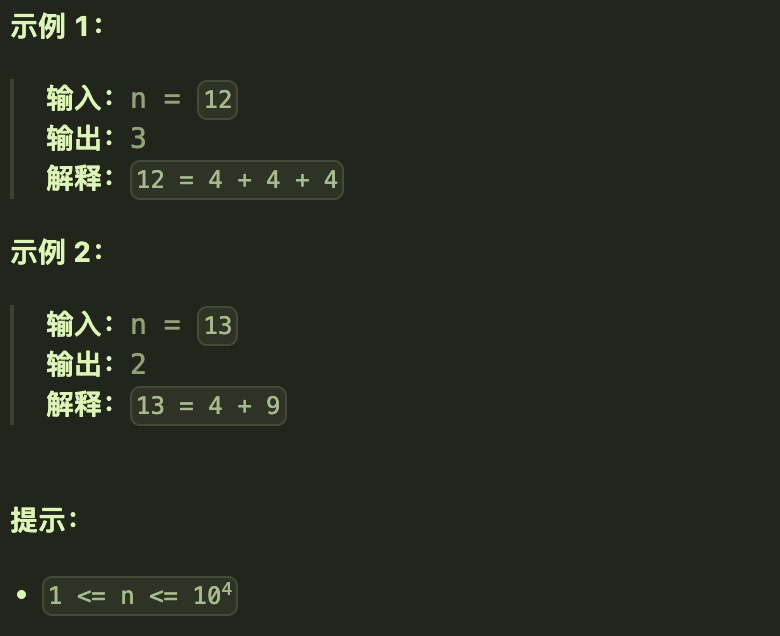
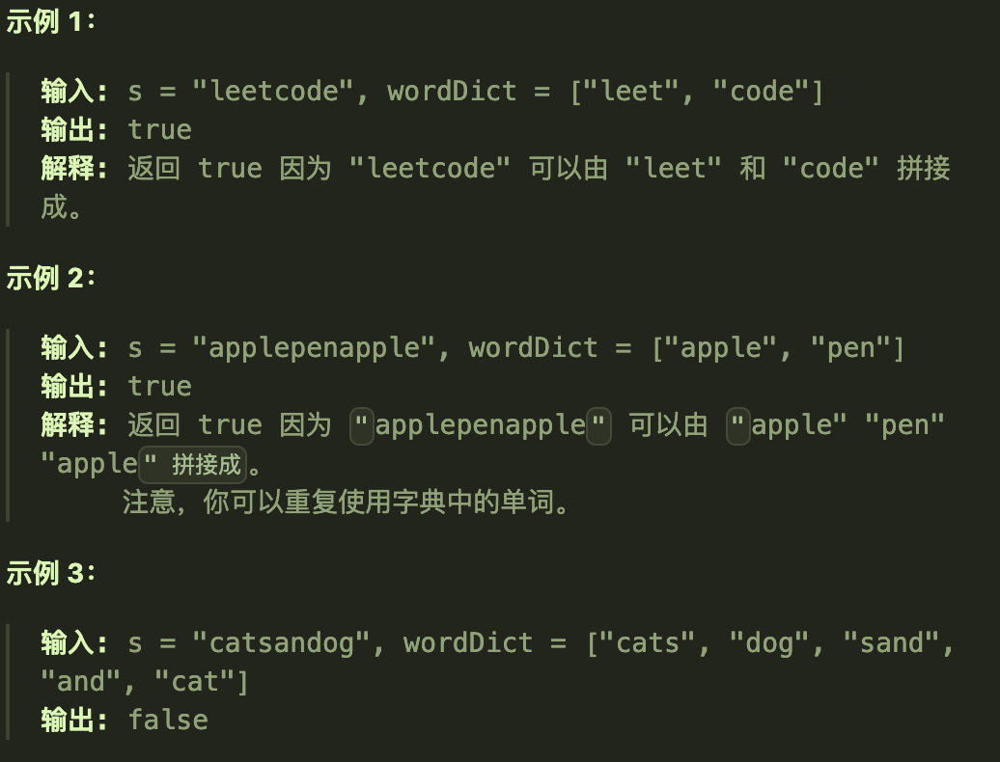
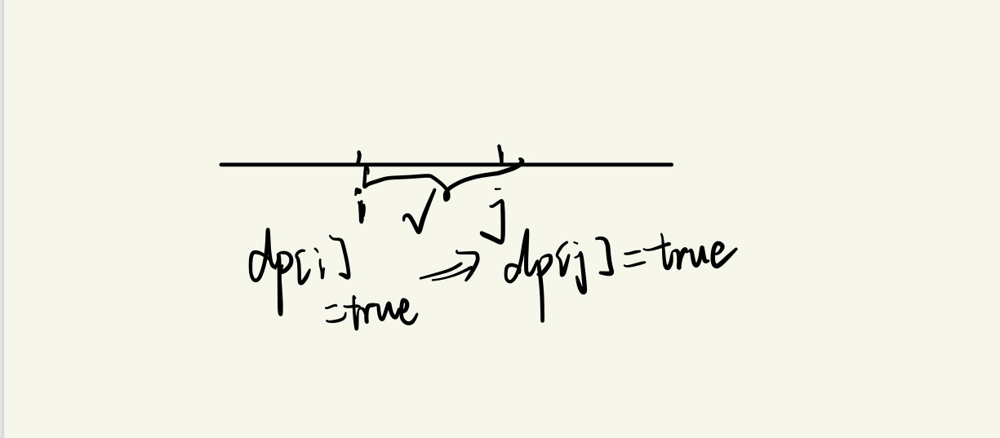

# 完全背包理论

## 题目要求

有N件物品和一个最多能背重量为W的背包。第i件物品的重量是weight[i]，得到的价值是value[i] 。**每件物品都有无限个（也就是可以放入背包多次）**，求解将哪些物品装入背包里物品价值总和最大。

- 与01背包不同的地方是一个商品可以无限次的使用
- 

## 题解

### 遍历顺序

01背包和完全背包唯一不同就是体现在遍历顺序上；

```java
// 先遍历物品，再遍历背包
for(int i = 0; i < weight.size(); i++) { // 遍历物品
    for(int j = weight[i]; j <= bagWeight ; j++) { // 遍历背包容量
        dp[j] = max(dp[j], dp[j - weight[i]] + value[i]);
    }
}
```



### 遍历循环顺序

**在完全背包中，对于一维dp数组来说，其实两个for循环嵌套顺序是无所谓的！**

- 因为dp[j] 是根据 下标j之前所对应的dp[j]计算出来的。 只要保证下标j之前的dp[j]都是经过计算的就可以了。

```java
// 先遍历背包，再遍历物品
for(int j = 0; j <= bagWeight; j++) { // 遍历背包容量
    for(int i = 0; i < weight.size(); i++) { // 遍历物品
        if (j - weight[i] >= 0) dp[j] = max(dp[j], dp[j - weight[i]] + value[i]);
    }
}
```

# 518零钱兑换II（疑惑）

## 题目要求

给你一个整数数组 `coins` 表示不同面额的硬币，另给一个整数 `amount` 表示总金额。

请你计算并返回可以凑成总金额的硬币组合数。如果任何硬币组合都无法凑出总金额，返回 `0` 。

假设每一种面额的硬币有无限个。 

题目数据保证结果符合 32 位带符号整数。



- `1 <= coins.length <= 300`
- `1 <= coins[i] <= 5000`
- `coins` 中的所有值 **互不相同**
- `0 <= amount <= 5000`

## 第一想法

本题首先所求的是装满某个背包一共有多少种方法，与01背包中的494目标和题目所求相同，不同的在于本题是完全背包问题，每一个元素都可以重复使用（但注意元素并没有重复出现）

在有多少种方法的题目中，重要的是递推公式，`dp[j] += dp[j-nums[i]]`

## 题解

本题在想法中的两点并不是关键问题，**关键在于所求的是组合数而不是排列数——这会影响之后的遍历顺序。**

- 组合数意味着元素之间不需要有顺序，如2、2、1和2、1、2是同一个组合；而如果是排列数就是两种不同的排列了。
- 而这会影响之后的遍历顺序（原因很重要）

五部曲

1、确定dp数组的含义

- `dp[j]`代表着背包容量为j时有x种方法可以填充满此背包

2、确定递推公式

- `dp[j] += dp[j-coins[i]]`

3、初始化

- 在494目标和中我们已经强调初始化dp[0] = 1，否则后面无法进行累加

4、确定遍历顺序

- 原本完全背包是可以调换商品和背包的遍历顺序的，但是本题不能调换
- 原因是**如果先遍历背包容量，再遍历物品则会造成重复添加的情况**。（具体内部原因我没想明白）

5、打印dp数组

- 打印dp数组确实可以发现先背包的方式所得的结果不对。
- 如果先遍历背包后遍历物品，那么外层循环先固定背包大小j，然后在大小为j的背包中循环遍历添加物品，然后在下次外层循环背包大小变为j+1，此时仍要执行内层循环遍历添加物品，也就会出现在上一轮外层循环中添加coins【2】的基础上还能再添加coins【1】的情况，那么就有了coins【1】在coins【2】之后的情况了。既出现了[1,2]，又出现了[2,1]

### 代码实现

```java
class Solution {
    public int change(int amount, int[] coins) {
        int[] dp =  new int[amount + 1];
        dp[0] = 1;
        //先遍历商品，再遍历背包才可以避免出现排列
        for(int i = 0; i < coins.length; i ++){
            for(int j = coins[i]; j <= amount; j ++){
                dp[j] += dp[j-coins[i]];
            }
        }
        return dp[amount];
    }
}
```

# 377组合总和IV

## 题目要求

给你一个由 **不同** 整数组成的数组 `nums` ，和一个目标整数 `target` 。请你从 `nums` 中找出并返回总和为 `target` 的元素组合的个数。

题目数据保证答案符合 32 位整数范围。



**提示：**

- `1 <= nums.length <= 200`
- `1 <= nums[i] <= 1000`
- `nums` 中的所有元素 **互不相同**
- `1 <= target <= 1000`

## 第一想法

首先所求的是排列数，与上一道题恰好相反，会关注选出商品的顺序。且本题还是一个求出可能得排列（组合）数的问题，是否还能够使用以前的递推公式？

那么如何套到完全背包问题当中呢？target作为背包的总容量。两周没有做题了，都忘得差不多了，直接题解。

## 题解

### 本质

两个题目的核心区别在于有无顺序的要求，在上一道题目中我们也知道了要求顺序时得先遍历物品再遍历背包，所以在这里我们先记结论吧，期待二刷的时候我们能够真正想清楚：

- **不要求顺序时（组合数）**，先遍历物品，再遍历背包。
- **要求顺序时（排列数）**，*先遍历背包，再遍历物品*。（因为如果先遍历物品，物品之间就会自动产生递增的顺序，而我们其实想要的是既有递增，又有递减或者其他的顺序，所以必须先遍历背包，再遍历物品，这样才能保证包含所有的可能情况）

### 五部曲

1、确定dp数组的含义

- `dp[j]`表示着背包容量为j的时候有x种方法可以填满背包

2、确定递推公式

- `dp[j] += dp[j-nums[i]]`

3、初始化dp数组

- 初始化为1

4、确定遍历顺序

- 由于不要求顺序，遍历顺序是先遍历背包容量再遍历商品，尽可能地先满足背包的容量。

### 代码实现

```java
public int combinationSum4(int[] nums, int target) {
        //
        int[] dp = new int[target + 1];
        dp[0] = 1;
  			//这里的遍历顺序很重要，先遍历背包容量再遍历商品，但是递推公式是一样的。
        for (int j = 0; j <= target; j++) {
            for (int i = 0; i < nums.length; i++) {
                if (j >= nums[i]) dp[j] += dp[j - nums[i]];
            }
        }
        return dp[target];
    }
```


# 322零钱兑换

## 题目要求

给你一个整数数组 `coins` ，表示不同面额的硬币；以及一个整数 `amount` ，表示总金额。

计算并返回可以凑成总金额所需的 **最少的硬币个数** 。如果没有任何一种硬币组合能组成总金额，返回 `-1` 。

你可以认为每种硬币的数量是无限的。



## 第一想法

本题与上面两题问法不一样，所求的是所需的最少商品数量，所以递推公式一定会发生变化，至于遍历顺序，暂时先以先遍历商品再遍历容量。

其实是否可以看做之前题目那么多种组合数里面选一个长度最小的？得到之前的dp数组之后，去遍历找到长度最小的是不是也可以？其实不行，我们之前返回的是`dp[amount]`，意味着只有这个下标处的dp数组代表着结果——这个结果是我们通过独特的递推公式推来的。

想不到这个递推公式。

## 题解

### 本质

首先，如何想到递推公式：最本能的尝试是`dp[j]`代表着背包容量为j的时候所需最少的商品数量，那么这时就应该往前推（这是我没有想到的）——当没有放入nums[i]时，dp[j-nums[i]],放入了之后dp[j]= dp[j-nums[i]] + 1；所以要求最少的数量就得去看每次放入之后的dp[j]是否为最少——`dp[j] = min(dp[j],dp[j-nums[i]] + 1)`

其次，关于遍历顺序的问题，因为本题没有要求放入的顺序，只要求最少的个数，所以无论怎么放都可以（不在乎顺序）。故遍历顺序不论是先商品再背包还是先背包后商品都可以。我们这里还是选择最传统的先商品后背包。

### 五部曲

1、确定dp数组含义

- `dp[j]`背包容量为j时所需要的最少硬币数目

2、确定递推公式

- `dp[j] = Min(dp[j],dp[j-coins[i]] + 1)`

3、确定初始化

- 全部初始化为最大值，因为要去比较最小值。
- 但是需要初始化dp[0] = 0，要符合题目要求。

4、确定遍历顺序

- 均可

### 代码实现

```java
public int coinChange(int[] coins, int amount) {
        int max = Integer.MAX_VALUE;
        int[] dp = new int[amount + 1];
        //
//        for (int i : dp) {
//            i = max;
//        }
        //注意这两个for循环的区别。
        for (int i = 0; i < dp.length; i++) {
            dp[i] = max;
        }
        dp[0] = 0;
        for (int i = 0; i < coins.length; i++) {
            for (int j = coins[i]; j <= amount; j++) {
                //这里的条件判断没有想到
                if (dp[j-coins[i]] != max){
                    dp[j] = Math.min(dp[j],dp[j - coins[i]] + 1);
                }
            }
        }
        return dp[amount] == max ? -1 : dp[amount];
    }
```

- 注意，**增强for循环是值传递**，改变其值时只会改变副本而不会改变原始值，所以不能用增强for循环来进行数组值的改变。
- 代码中的一些条件判断的地方也需要多注意

# 279完全平方数

## 题目要求

给你一个整数 `n` ，返回 *和为 `n` 的完全平方数的最少数量* 。

**完全平方数** 是一个整数，其值等于另一个整数的平方；换句话说，其值等于一个整数自乘的积。例如，`1`、`4`、`9` 和 `16` 都是完全平方数，而 `3` 和 `11` 不是。



## 第一想法

首先我猜需要一个方法来判断某个数是否为完全平方数：

- 可以整除2,3,5,7这几个数其中之一的就是完全平方数，当然1是例外。

其次如何套用到背包问题当中去呢？所求的是**所需的最少数量**，本题商品其实是没有明确给出的，只告诉你商品是完全平方数；背包容量是给定的n。

## 题解

### 本质

本题其实就在于完全平方数这个条件，因为题目没有给定明确的商品（像其他题目那样的数组）所以我陷入了迷茫，但是完全平方数这个商品可以自己造出来啊——i从1开始遍历，每次所取的商品重量（价值）都是i*i就行。即每次都取一个完全平方数。

其他与上一道题目几乎完全一样，都是求最少数量。

### 五部曲

1、确定dp数组的含义

- `dp[j]`表示背包容量为j时当前用的最少得完全平方数的个数

2、确定递推公式

- 所求的是最少个数，所以`dp[j] = min(dp[j],dp[j-i*i] + 1)`；注意这里的nums[i]改为了i*i

3、初始化

- 同上，所求最小值所以先将全部值初始化为Max，但dp[0] = 0

4、确定遍历顺序

- 因为完全背包且没有要求组合数还是排列数，所以遍历顺序无关紧要

### 代码实现

```java
    public int numSquares(int n){
        int[] dp = new int[n + 1];
        int max = Integer.MAX_VALUE;
        for (int i = 0; i < dp.length; i++) {
            dp[i] = max;
        }
        dp[0] = 0;
        //注意遍历商品时条件是i*i 
        for (int i = 1; i*i <= n; i++) {
            for (int j = i*i; j <= n; j++) {
                dp[j] = Math.min(dp[j],dp[j - i*i] + 1);//即每个商品都是i*i，不是以前的nums[i]了。
            }
        }
        return dp[n];
    }
```

- 注意，本题完全平方数是一定可以组成的，因为有1的存在。

# 139单词拆分

## 题目要求

给你一个字符串 `s` 和一个字符串列表 `wordDict` 作为字典。如果可以利用字典中出现的一个或多个单词拼接出 `s` 则返回 `true`。

**注意：**不要求字典中出现的单词全部都使用，并且字典中的单词可以重复使用。



**提示：**

- `1 <= s.length <= 300`
- `1 <= wordDict.length <= 1000`
- `1 <= wordDict[i].length <= 20`
- `s` 和 `wordDict[i]` 仅由小写英文字母组成
- `wordDict` 中的所有字符串 **互不相同**

## 第一想法

字符串可以由字典中的单词拼接而成，字典中的单词最少一个字符组成；这次所求的是能否拼接成功而不是所需的最少次数，如果当做背包问题来看的话，背包的容量是所给的字符串，商品的价值即字典单词本身。但是后续如何处理dp数组以及其他细节（如字典单词的顺序）我想不出来了。

## 题解

### 本质

1、如何判断一个题目是不是动态规划问题，这是我做了这么多题目急切想要知道或者总结的东西。

- 看下来发现题目中总会存在**重叠的子问题**，即递推公式的存在。（状态转移方程）
- 有明确的基准情况（初始化）
- 常用于求最值优化，出现“最”

2、转换为完全背包后，dp数组和递推公式都是解题的关键所在，当然本题的遍历顺序也很重要。

### 五部曲

1、确定dp数组及其含义

- `dp[j]`代表着长度为j的字符串是否能由字典中的单词构成（true代表可以）
- 故dp数组是一个boolean类型的数组

2、确定递推公式

- 这一步很重要，`dp[j]`是否为true由他前面的部分来保证，当dp[i]=true,且i-j这一段可以由字典单词构成时，dp[j]才可以为true
- 
- `if(wordDict.contains(s.substring(i,j) && dp[i]) dp[j] = true;`

3、初始化

- dp[0] = true，否则上面的递推公式一直为false
- 其他部分设置为默认的false

4、确定遍历顺序

- 本题很明显对结果的顺序是有要求的（可以给字典单词标记顺序佐证），所以完全背包要求顺序时，遍历顺序应该先遍历背包，再遍历物品，涵盖所有顺序的可能情况。

5、打印dp数组验证

### 代码实现

```java
class Solution {
    public boolean wordBreak(String s, List<String> wordDict){
        //为什么要将list转换为hashset呢？因为List使用contains时效率为n，而哈希表的效率为1，快速查找是否存在
        HashSet<String> set = new HashSet<>(wordDict);
        boolean[] dp = new boolean[s.length() + 1];
        dp[0] = true;
        //要求顺序，先遍历背包再遍历物品，注意从下标为1开始遍历，背包容量从1开始的
        for (int j = 1; j <= s.length(); j++) {
            for (int i = 0; i < j && !dp[j]; i++) {//这里注意物品的上限在j处，因为我们遍历物品时其实是在找一个[i,j]的段是否满足
                if (set.contains(s.substring(i,j)) && dp[i]) dp[j] = true;
            }
        }
        return dp[s.length()];
    }
```

- 其中有一些关于字符串的操作，熟练度不够。
- 第二层for循环看似在遍历物品，实际上还是在字符串（即背包）上面操作，从当前长度的字符串截取[i,j]的一段来看是否在字典字符中出现过。
- 其中的`!dp[j]`意味着只需要找到一种满足当前j长度条件的分割方式

# 多重背包理论基础
