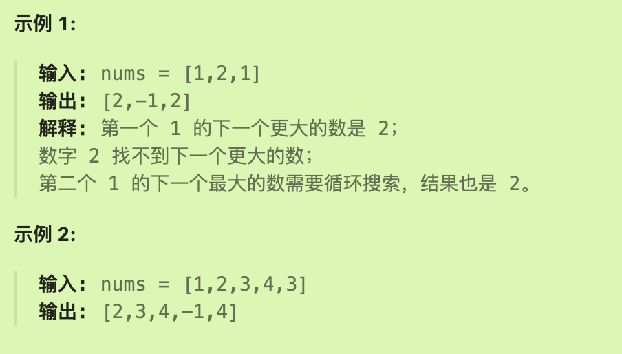
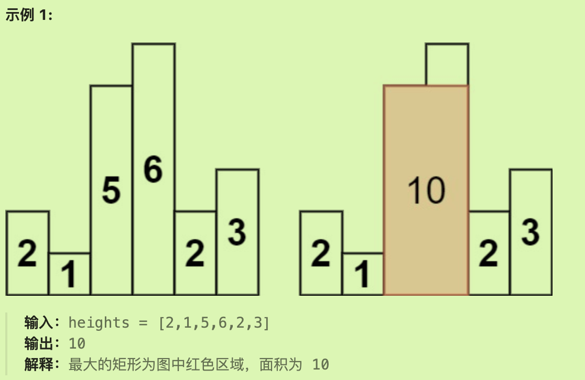

# 739每日温度

## 题目要求

给定一个整数数组 `temperatures` ，表示每天的温度，返回一个数组 `answer` ，其中 `answer[i]` 是指对于第 `i` 天，下一个更高温度出现在几天后。如果气温在这之后都不会升高，请在该位置用 `0` 来代替。


- `1 <= temperatures.length <= 105`
- `30 <= temperatures[i] <= 100`

## 第一想法

暴力法来看，遍历温度数组，看后一个的数是否大于前面一个数，如果大于，前面数对应位置的结果位置置为1。（哦不对，天数不是紧邻地去看的，原来是好几天）如果小于的话继续往后比较，并且还要计数？但是如果移动到了后面的位置，被扫过的温度不就不能再去比较了？（否则每次往后开始遍历的时候还要设置一个变量来保存起始的位置？

直接去做很复杂，所以要使用单调栈？一个堆栈，按照温度数组顺序入栈，如果当前入栈元素大于栈顶元素，栈底元素出栈（这想的很美好，但是栈底元素怎么出栈啊），对应位置置为当前栈中元素数量；如果当前元素小于栈顶元素，就正常入栈；还是不对，如何处理71，69这些栈中的元素。

## 题解

### 本质

单调栈用来处理找元素左右第一个大于或者小于它的元素，并且最关键的是判断该栈是单调递增还是递减。

单调栈的作用是**存放之前遍历过的元素**。（这也解决了想法中的如何处理71,69这些遍历过的元素）

### 解决

根据题目条件，所求为天数（其实也是数组元素下标之间的距离），所以**将数组元素的下标放入栈中**，并且保证栈中顺序为递增，用以保证找到大于的元素。

每次比较都是在与栈顶元素比较：

- 如果小于，将比较元素继续入栈即可（可以做到存放之前遍历过的元素这一功能）
- 如果等于，同样放入。
- 如果大于，将栈顶元素出栈，将结果数组对应位置（栈顶元素即为下标）设置为下标之差；并且再继续与栈内元素（新的栈顶）去比较，如果还大于重复上述操作，如果不大于入栈即可。

### 代码实现

```java
class Solution {
    public int[] dailyTemperatures(int[] temperatures) {
        int len = temperatures.length;
        int[] result = new int[len];//声明结果数组
        //声明单调栈,单调栈中保存原数组的下标
        Deque<Integer> stack = new LinkedList<>();
        stack.push(0);//将下标0入栈
        //开始遍历温度数组
        for (int i = 1; i < len; i++) {
            if (temperatures[i] <= temperatures[stack.peek()]){
                stack.push(i);
            }else {
                while (!stack.isEmpty() && temperatures[i] > temperatures[stack.peek()]){
                    //保证栈不为空并且现在的比较元素大于栈顶元素
                    result[stack.peek()] = i - stack.peek();//栈顶元素即需要赋值的下标位置，因为找到了第一个大于它的元素（的下标）
                    stack.pop();
                }
                stack.push(i);//如果不大于（或者栈已经为空了）需要将当前元素入栈，别忘记这一步。
            }
        }
        return result;
    }
}
```

# 496下一个更大元素I

## 题目要求

`nums1` 中数字 `x` 的 **下一个更大元素** 是指 `x` 在 `nums2` 中对应位置 **右侧** 的 **第一个** 比 `x` 大的元素。

给你两个 **没有重复元素** 的数组 `nums1` 和 `nums2` ，下标从 **0** 开始计数，其中`nums1` 是 `nums2` 的子集。

对于每个 `0 <= i < nums1.length` ，找出满足 `nums1[i] == nums2[j]` 的下标 `j` ，并且在 `nums2` 确定 `nums2[j]` 的 **下一个更大元素** 。如果不存在下一个更大元素，那么本次查询的答案是 `-1` 。

返回一个长度为 `nums1.length` 的数组 `ans` 作为答案，满足 `ans[i]` 是如上所述的 **下一个更大元素** 。


## 第一想法

在上一道题目的身上套了一层皮，但是最终结果如果成功返回的是元素值本身，而不是元素之间的距离；如果还在单调栈中保存下标，最终结果中直接返回nums2[比较元素的下标]

所以将上面的单调栈方法封装为一个方法？但是又有所不同，可能不用遍历完整个nums2数组；每次都是找到一个待处理元素，将其放入栈中再去遍历2使用单调栈——即从特定元素开始寻找下一个更大的元素而不是每次都从头开始。

## 题解

反向思考一下，可以先在nums2中寻找到每一个元素的下一个更大元素（无需更改之前的单调栈代码），*对于nums2中的每一个元素找完后看看nums1中是否有相同的元素*，如果有相同的元素就要收集刚才的结果到结果集中

这时还有一个关键点是如何在nums1中从元素值找到对应下标（这与往常相反）——因为最终的结果集长度是根据nums1决定的，所以可以使用哈希表来反向映射nums1中的元素-下标关系。

### 代码实现

```java
class Solution {
    public int[] nextGreaterElement(int[] nums1, int[] nums2) {
        int len1 = nums1.length;
        int len2 = nums2.length;
        //声明结果数组与单调栈
        int[] result = new int[len1];
        Arrays.fill(result,-1);//根据题意初始化为-1
        //
        Deque<Integer> stack = new LinkedList<>();
        stack.push(0);
        //声明哈希表来保存nums1的反向映射关系
        HashMap<Integer, Integer> map = new HashMap<>();
        for (int i = 0; i < len1; i++) {
            map.put(nums1[i],i);//key(值）-value（下标）
        }
        //
        for (int i = 1; i < len2; i++) {
            if (nums2[i] <= nums2[stack.peek()]){
                stack.push(i);
            }else {
                while (!stack.isEmpty() && nums2[i] > nums2[stack.peek()]){
                    //如果此时2中的某个元素与1中相同（符合题意）
                    if (map.containsKey(nums2[stack.peek()])){
                        Integer index = map.get(nums2[stack.peek()]);
                        result[index] = nums2[i];//将2中下一个大的数填充结果数组
                    }
                    stack.pop();
                }
                stack.push(i);
            }
        }
        return result;
    }
}
```

# 503下一个更大元素II

## 题目要求

给定一个循环数组 `nums` （ `nums[nums.length - 1]` 的下一个元素是 `nums[0]` ），返回 *`nums` 中每个元素的 **下一个更大元素*** 。

数字 `x` 的 **下一个更大的元素** 是按数组遍历顺序，这个数字之后的第一个比它更大的数，这意味着你应该循环地搜索它的下一个更大的数。如果不存在，则输出 `-1` 。



- `1 <= nums.length <= 104`
- `-109 <= nums[i] <= 109`

## 第一想法

又是一道套皮题目，唯一不同的是多了一个环形，其实不只是最后一个元素要环形，因为要找的是下一个更大的数，这个环形对每一个元素都有影响。如何处理这个环形呢？我记得之前有一道题目也是这样。

声明的结果数组与原数组长度一致，单调栈依然是递增，保存的是元素下标，但是如果环形之后还是递增吗？

怎么感觉是光对最后一个元素去操作就行了，因为按照往常，最后一个元素如果没有下一个最大（不会像这样成环绕回来），那么它将和上一个比较大的元素保存在栈中，然后对应位置上都是-1。现在我觉得可以直接将栈底的元素作为最后一个元素的值。（但这是否忽略了一些前面的元素的下一个更大是自己的前一个元素这种情况？）

所以，对于仍然压在栈中还未出栈的元素，还要进行额外的操作——可以确定的是栈底的元素一定是当前最大的元素，所以拿它去填充未出栈元素即可。（试着写一写）

## 题解

我的思路卡在了如何给剩下元素赋值为栈底元素（无法同时取到栈底元素同时获取其他元素位置）

### 方法一

在原数组的基础上在后面加上一个相同的新数组，使用单调栈解决之后将整个数组截取一半即可。

### 方法二

使用**取模**拟成环（转圈）过程。其实本题也就是*转了一圈*。

```java
for(int i=0; i < numsSize() * 2; i++){
  i % numsSize;//模拟了转圈过程，即使i大于了numsSize也会绕回来，其实就是对方法一的简化。
}
```

### 代码实现

```java
class Solution {
    public int[] nextGreaterElements(int[] nums) {
        int len = nums.length;
        int[] result = new int[len];
        Arrays.fill(result,-1);
        if (len == 1){
            return result;
        }
        //
        Deque<Integer> stack = new LinkedList<>();
        stack.push(0);
        //将每一个下标位置都改成i%len，即代表了在一圈中的每个位置。
        for (int i = 1; i < 2*len; i++) {
            if (nums[i%len] <= nums[stack.peek()]){
                stack.push(i%len);
            }else {
                while (!stack.isEmpty() && nums[i%len] > nums[stack.peek()]){
                    result[stack.peek()] = nums[i%len];
                    stack.pop();
                }
                stack.push(i%len);
            }
        }
        return result;
    }
}
```

总结一下单调递增栈的模版，可以精简为以下版本，不用if判断，直接开始while循环;并且这样可以省去前面的先入栈步骤。

### 单调栈模版

```java
    public int[] nextGreaterElements(int[] nums) {
        int len = nums.length;
        int[] result = new int[len];
        Arrays.fill(result,-1);
        //
        Deque<Integer> stack = new LinkedList<>();
				//
        for (int i = 0; i < len; i++) {
          while(!stack.isempty() && nums[i] > nums[stack.peek()]){
            result[stack.peek()] = nums[i];
            stack.pop();
          }
          stack.push(i);
        }
        return result;
    }
```

# 42接雨水

## 题目要求

给定 `n` 个非负整数表示每个宽度为 `1` 的柱子的高度图，计算按此排列的柱子，下雨之后能接多少雨水。


- `n == height.length`
- `1 <= n <= 2 * 104`
- `0 <= height[i] <= 105`

## 第一想法

接的雨水的数量其实就是这个方块的面积，就是长*高；其中长就是两个不为0的柱子之间的距离（也就是下标之间的差距），高就是二者元素值之间的差距；但是不能简单地这样认为，因为两个元素值之间的还会掺杂其他元素，会占据方块位置影响雨水的面积。

哈哈想不出来咋做了。

## 题解

### 使用单调栈

 核心就是三个柱子来计算可以接的雨水面积，这三个柱子从中间向两边分别是：底部基础元素，基础元素右边第一个大于它的元素，基础元素左边第一个大于（最靠近）它的元素。

右边元素单调栈比较栈顶即可获得，左边元素在右边比较完出栈之后，剩下的元素即为左边元素。（单调递增栈的特性）

计算雨水面积：左右两边的元素取较低者-基础元素结果作为高，宽即左右两边元素的距离-1

可以发现这个方法的逻辑是**横向去计算**整个数组的。


### 代码实现

```java
class Solution {
    public int trap(int[] height) {
        int len = height.length;
        if (len <= 2) return 0;
        //
        Stack<Integer> stack = new Stack<>();
        stack.push(0);
        //
        int sumResult = 0;
        //
        for (int i = 1; i < len; i++) {
            if (height[i] <= height[stack.peek()]){
                stack.push(i);//即使相等的也让他进栈，因为后期高度相减为0无需加入到结果中。
            }else {
                while (! stack.isEmpty() && height[i] > height[stack.peek()]){
                    //当遇到栈顶比自己小的即mid，同时也将其出栈了。
                    int mid = stack.pop();
                    if (! stack.isEmpty()){//注意这里需要判断栈是否为空，如果为空代表着没有左边的元素了。
                        int left = stack.peek();//这里无需弹出左边元素，等着在while循环里继续比较就行。
                        int h = Math.min(height[left], height[i]) - height[mid];
                        int w = i - left - 1;
                        int square = h * w;//获得可接雨水的面积（横向操作）
                        if (square > 0) sumResult += square;
                    }
                }
                stack.push(i);
            }
        }
        return sumResult;
    }
}
```

# 84柱状图中的最大矩形

## 题目要求

给定 *n* 个非负整数，用来表示柱状图中各个柱子的高度。每个柱子彼此相邻，且宽度为 1 。

求在该柱状图中，能够勾勒出来的矩形的最大面积。




## 第一想法

和接雨水的形状很类似，所求的最大矩形面积可以由某个柱体自己组成，可以由几个柱体一起组成（一起组成的时候要看他们中间的最低者组成高，宽就看有几个一起组成）

如果仿照接雨水那道题目，是否要每次看三个柱体？每次拿几个元素作为一组来组成一个矩形面积我觉得是比较棘手的问题。（如果每两个去组合加上每次组合时与自己比较记录最大值，倒是有些过于简略了）

但是这道题需要用到单调栈吗？

## 题解

当然需要单调栈，不过本题是单调递减栈（并不是所存的值单调递减，而是比较元素的规则决定了所存值对应元素在栈中单调递减）

### 本质

本题核心是**以每一个柱体为基准作为高**，去左右找第一个小于它的柱体，以此来确定宽（能够从基准延伸到左右小于的两侧。这样得到了高和宽最终得到矩形的面积。

所以最终与接雨水一样，都是三个元素的合作，而找到最小的自然是使用单调递减栈。

#### 注意

为了处理特殊情况，需要在数组的两侧添加一个0，一方面防止元素递减入栈后没有进行比较，另一方面防止比较时只有两个元素（所以在栈底放一个0，由于递减栈的缘故，这个0不会出去）

### 代码实现

```java
class Solution {
    public int largestRectangleArea(int[] heights) {
        int len = heights.length;
        //对数组进行填充0
        int[] newHeights = new int[len + 2];
        int newLen = newHeights.length;
        newHeights[0] = 0;
        newHeights[newLen-1] = 0;
        //先往两侧填充0，再将中间的数填充好
        for (int i = 0; i < len; i++) {
            newHeights[i+1] = heights[i];
        }
        heights = newHeights;//直接夺舍了？
        //
        Stack<Integer> stack = new Stack<>();
        stack.push(0);
        int result = 0;//结果
        //
        for (int i = 1; i < newLen; i++) {
            if (heights[i] >= heights[stack.peek()]){
                //单调递减栈
                stack.push(i);
            }else {
                while (!stack.isEmpty() && heights[i] < heights[stack.peek()]){
                    //找到了右边第一个小的
                    int mid = stack.peek();
                    stack.pop();
                    //左边第一个小的在栈中，右边第一个小的即当前遍历到的元素
                    int left = stack.peek();
                    int right = i;
                    int w = right - left - 1;
                    int h = heights[mid];
                    result = Math.max(result, w * h);
                }
                stack.push(i);
            }
        }
        return result;
    }
}
```

