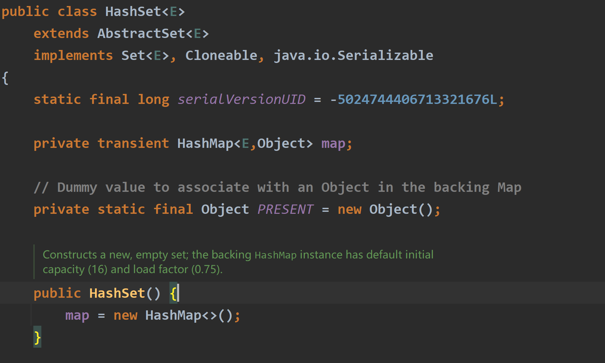
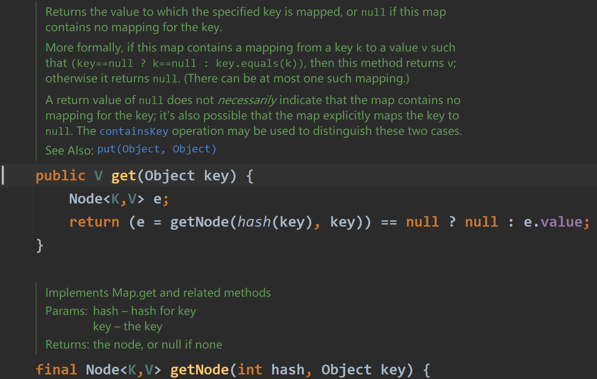
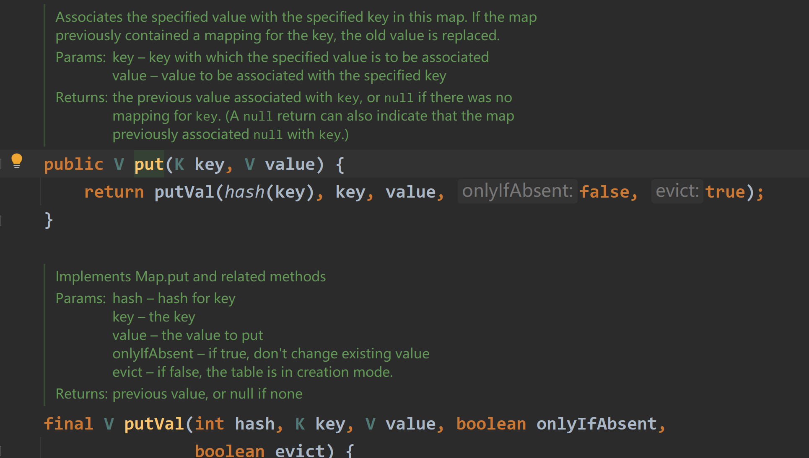

# 349两个数组的交集

## 题目要求：

给定两个数组 `nums1` 和 `nums2` ，返回 *它们的交集* 。输出结果中的每个元素一定是 **唯一** 的。我们可以 **不考虑输出结果的顺序** 。

**示例 1：**

```html
输入：nums1 = [1,2,2,1], nums2 = [2,2]
输出：[2]
```

## 思路一（哈希）

### 第一想法：

受到上一道242的影响，我觉得题目范围并不大的情况下，可以申请数组，空间换时间来解决问题。

### 困难：

在运行时发现返回数组的写法出了问题，因为我申请的返回数组的长度是定长的，而最后人家要的返回的很简洁。所以得先确定这个返回数组有多长。

### 错误解法：
```java
class Solution {
    public int[] intersection(int[] nums1, int[] nums2) {
        /**返回交集，如果以值作为下标索引，出现次数作为值创建一个哈希。因为题目条件的范围
        然后去遍历另外一个数组，判断每个值（即下标）在第一个数组中出现没有（即值）
        如果出现，则是要返回的。但是最后怎么返回呢？ 还要再创建一个数组？怎么保证唯一输出*/

        //新创建哈希数组对于nums1
        int[] arr = new int[1000];
        //进行哈希填充
        for(int i = 0;i < nums1.length;i ++){
            arr[nums1[i]] ++;
        }
        //创建另外一个新数组保存输出结果,但是这个数组长度得是动态的。这里出现问题了。
        int j = 0;
        int[] result = new int[j];
        //遍历另外一个数组
        for(int i = 0;i < nums2.length; i++){
            if(arr[nums2[i]] != 0){
                //为了保证唯一输出，只要交上了，就把哈希值改为0
                arr[nums2[i]] = 0;
                //放进输出数组
                result[j ++] = nums2[i];
            }
        }
        return result;
    }
}
```
### 正解：

使用set解决。目前自己对java中的哈希掌握的不好，老韩的教程得加把劲了。

### 代码

- 里面一些方法的使用原理不清楚。(二刷差不多了)
- 时间复杂度是由两个数组的长度确定的，空间复杂度有点高了因为设置了两个哈希，还有一个新数组来接收结果。

```java
class Solution {
    public int[] intersection(int[] nums1, int[] nums2) {
        //健壮性描述
        if(nums1 == null || nums1.length == 0 || nums2 == null || nums2.length == 0){
            return new int[0];
        }
        //设置两个哈希，一个用来判断是否有交集，一个用来存储最终的结果
        Set<Integer> set1 = new HashSet<>();
        Set<Integer> reset = new HashSet<>();
        //对数组1进行哈希的填充
        for(int i : nums1){
            set1.add(i);
        }
        //遍历数组二，看里面是否有交集
        for(int j : nums2){
            if(set1.contains(j)){
                reset.add(j);
            }
        }
        //这个哈希已经完成了去重，现在考虑怎么返回输出(reset是集合？)
        //使用新数组接收
        int[] arr = new int[reset.size()];
        int j = 0;
        for(int i : reset){
            arr[j ++] = i;
        }
        return arr;
    }
}
```

## 关于Hashset源码：

- 

- 时刻注意Hashset的特点是，元素**不能重复**但是无序；从源码中可以发现，其本质是Hashmap，并且有一个虚拟的值`PRESENT`——这是一个静态常量，用作 `HashMap` 中所有键的值。由于 `HashSet` **仅关心键的存在（不关心映射的值）**，因此所有键都映射到这个对象上。
- 它在添加、删除和查找元素时提供了常数时间的性能（在理想情况下）。
- 直接使用set 不仅占用空间比数组大，而且速度要比数组慢，set把数值映射到key上都要做hash计算的。不要小瞧 这个耗时，在数据量大的情况，差距是很明显的

## 思路二：（排序+指针）

### 正解：

- 将两个数组排好序然后双指针遍历，谁小谁往后走，比到一样的一起往后走
- 这个方法需要更改原始的数组，需要注意；并且为了保证最后结果数组是唯一的，不重复的，我们还是需要使用到`Hashset`来去重。

### 代码：

- 这个方法的时间复杂度会高一些，取决于排序的耗时；空间复杂度还好但是跟上面也差不了多少，最后都要创建数组来作为返回结果。

```java
        if (nums1 == null || nums2 == null || nums1.length == 0 || nums2.length == 0){
            return new int[0];
        }
        Arrays.sort(nums1);
        Arrays.sort(nums2);
        //设置工作指针与保存的set
        int i = 0 ,j = 0;
        Set<Integer> resultSet = new HashSet<>();
        while (i < nums1.length && j < nums2.length){
            if (nums1[i] == nums2[j]){
                resultSet.add(nums1[i]);
                i ++;
                j ++;
            }else if (nums1[i] < nums2[j]){
                i ++;
            }else {
                j ++;
            }
        }
        int[] result = new int[resultSet.size()];
        int p = 0;
        for (int q : resultSet){
            result[p ++] = q;
        }
        return result;
    }
```

## 思路三（暴力解法）：

### 正解：

- 由于题目条件将数组的长度改为了1-1000，大小是0-1000，所以可以使用两个哈希数组来存储出现次数，复杂度不会太高。
- 网站上写的申请的数组长度为1002，为什么不能是1001呢？(看来网站出问题了)

### 代码：

```java
public int[] intersection(int[] nums1, int[] nums2) {
        /**
         * 二刷写不出哈哈菜逼
         */
        int[] hash1 = new int[1001];
        int[] hash2 = new int[1001];
        //填充次数数组
        for (int count1 : nums1) {
            hash1[count1]++;
        }
        for (int count2 : nums2) {
            hash2[count2]++;
        }
        ArrayList<Integer> cur = new ArrayList<>();
        //
        for (int i = 0; i < 1001; i++) {
            if (hash1[i] > 0 && hash2[i] > 0) {
                cur.add(i);
            }
        }
        int index = 0;
        int[] result = new int[cur.size()];
        for (int j : cur) {
            result[index++] = j;
        }
        return result;
    }
```

# 350 两数组交集II

## 题目要求

给你两个整数数组 `nums1` 和 `nums2` ，请你以数组形式返回两数组的交集。返回结果中每个元素出现的次数，应与元素在两个数组中都出现的次数一致（如果出现次数不一致，则考虑取较小值）。可以不考虑输出结果的顺序。

## 思路一：（哈希数组）

- 因为有了新的要求，返回的结果可能会重复，次数与二者中出现的最小次数相同；是不是就不能使用hashset了
- 这样看来出现次数变得很重要了，`Hashset`中对于出现次数即值是不关心的，所以我想是不是得上`Hashmap`了。
- 先用哈希数组去考虑，即上面的思路三；修改哈希值同时大于0的条件即可，同时大于0意味着你有资格加入结果，然后再比较二者哈希值的大小，将键加入结果的次数即为小的值。
- 此时该用什么数据结构来保存返回的结果呢？可以发现，**List是可以重复的**（有序对本题返回结果不影响）

### 正解一：

- 加了上述条件居然ac了，但是感觉内部写的还是太冗余了？

### 代码一：

```java
public int[] intersect(int[] nums1, int[] nums2) {
        int[] hash1 = new int[1001];
        int[] hash2 = new int[1001];
        //填充次数数组
        for (int count1 : nums1) {
            hash1[count1]++;
        }
        for (int count2 : nums2) {
            hash2[count2]++;
        }
        ArrayList<Integer> cur = new ArrayList<>();
        //进行判断
        for (int i = 0; i < 1001; i++) {
            if (hash1[i] > 0 && hash2[i] > 0) {
//                cur.add(i);
                if (hash1[i] > hash2[i]){
                    while (hash2[i] > 0){
                        cur.add(i);
                        hash2[i] --;
                    }
                }else {
                    while (hash1[i] > 0){
                        cur.add(i);
                        hash1[i] --;
                    }
                }
            }
        }
        int index = 0;
        int[] result = new int[cur.size()];
        for (int j : cur) {
            result[index++] = j;
        }
        return result;
    }
```

## 思路二：（HashMap?）

### 正解：

- 的确使用了`HashMap`,但是由于自己的集合框架还是不太熟悉，需要去多写多看源码了。
- 将两个数组全部转化为Hashmap的形式，然后遍历其中一个，在遍历过程中判断其键是否在另外一个map当中，如果存在的话取二者值中的较小者；
- 以这个较小者为循环次数进行添加，添加仍然使用List因为其可重复的特性。

### 代码二：

- 重点关注其中的`put`方法，以及增强for循环如何遍历哈希表
- `getOrderDefault`是获得键所对应的当前计数，如果第一次出现的话设置为0，如果不是第一次就获取当前值。

```java
public int[] intersect(int[] nums1, int[] nums2) {
        HashMap<Integer, Integer> map1 = new HashMap<>();
        HashMap<Integer, Integer> map2 = new HashMap<>();
        //对两个哈希进行填充
        for(int i : nums1){
            map1.put(i,map1.getOrDefault(i,0) + 1);
        }
        for(int i : nums2){
            map2.put(i,map2.getOrDefault(i,0) + 1);
        }
        //
        ArrayList<Integer> tmp = new ArrayList<>();
        for (Map.Entry<Integer,Integer> entry : map1.entrySet()){
            int num = entry.getKey();
            int count = entry.getValue();
            if (map2.containsKey(num)){
                int minCount = Math.min(count,map2.get(num));
                for (int i = 0; i < minCount; i++) {
                    tmp.add(num);
                }
            }
        }
        int[] result = new int[tmp.size()];
        int index = 0;
        for(int num : tmp){
            result[index ++] = num;
        }
        return result;
    }
```

## HashMap中源码：

### Get方法的源码：

- 得到键对应的值，同时用到了下面的`getNode`方法得到了键值对结点。



### put方法的源码：

- 将键值联系起来，如果键之前有值就替换掉；使用到了下面的`putVal`方法，注意参数的设置


