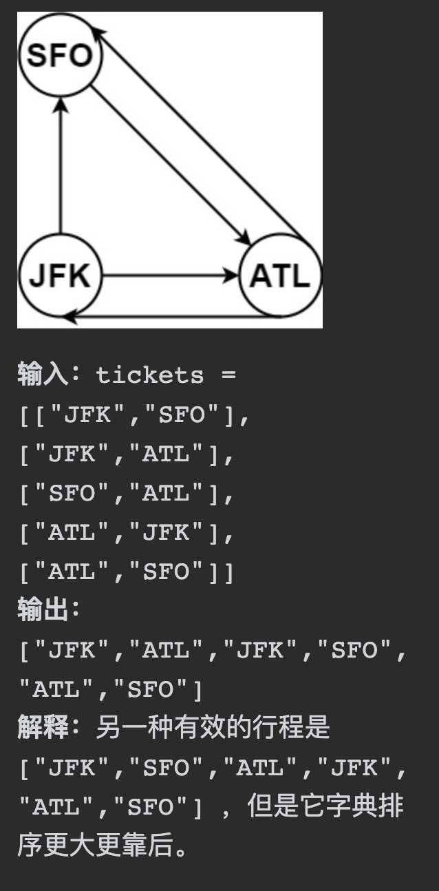
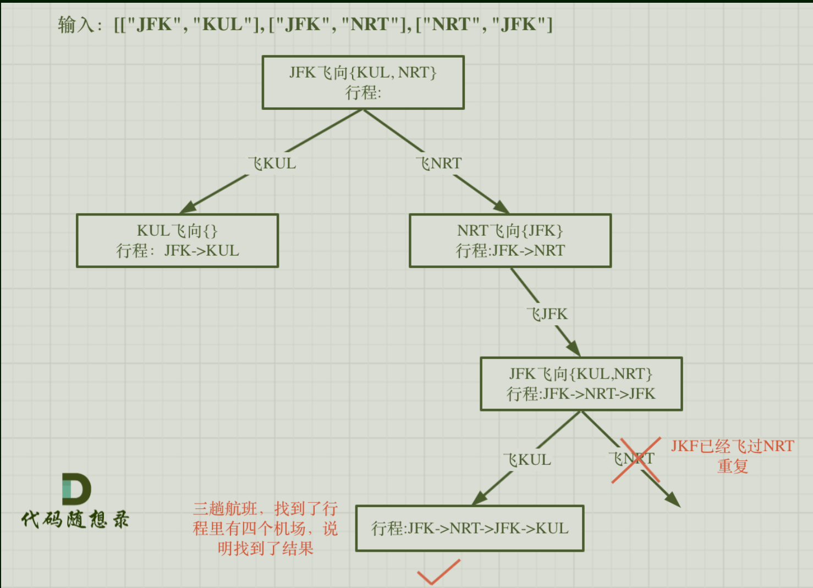
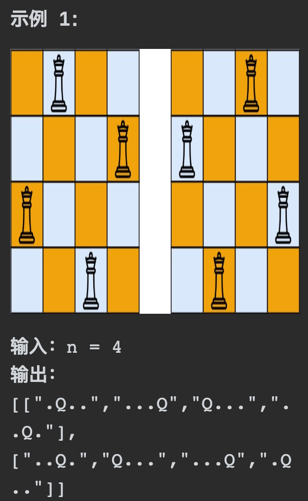
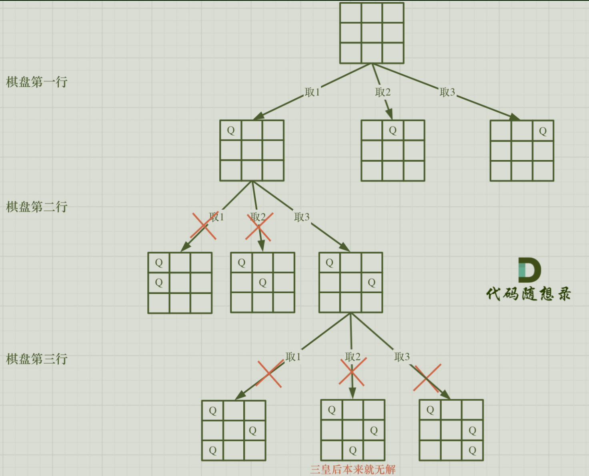
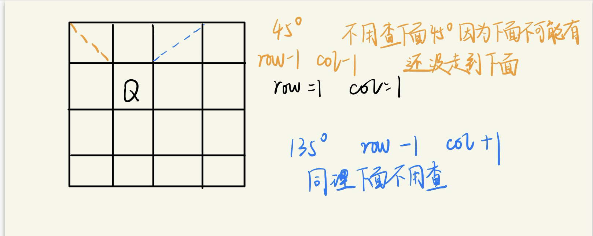
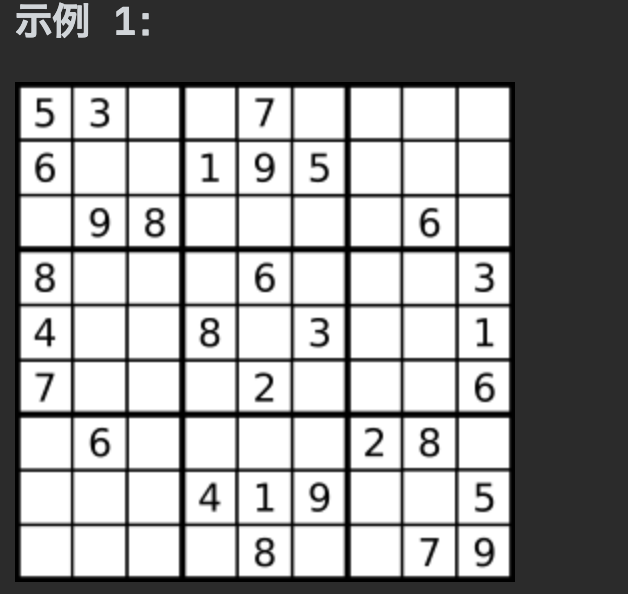
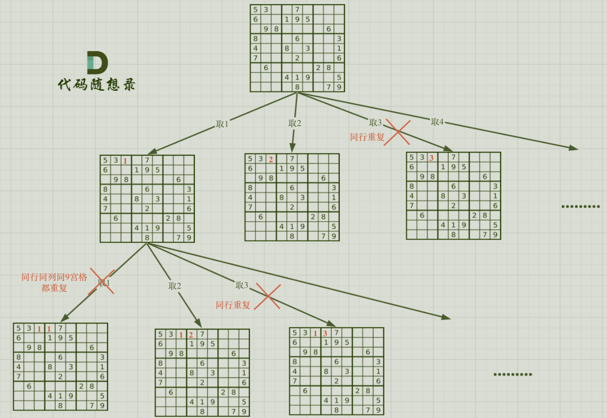

# 332重新安排行程

## 题目要求：

给你一份航线列表 `tickets` ，其中 `tickets[i] = [fromi, toi]` 表示飞机出发和降落的机场地点。请你对该行程进行重新规划排序。所有这些机票都属于一个从 `JFK`（肯尼迪国际机场）出发的先生，所以该行程必须从 `JFK` 开始。如果存在多种有效的行程，请你按字典排序返回最小的行程组合。

- 例如，行程 `["JFK", "LGA"]` 与 `["JFK", "LGB"]` 相比就更小，排序更靠前。

假定所有机票至少存在一种合理的行程。且所有的机票 必须都用一次 且 只能用一次。



```
tickets[i].length == 2
fromi.length == 3
toi.length == 3
```

`fromi` 和 `toi` 由大写英文字母组成

```
fromi != toi
```

## 第一想法：

从tickets里面可以获悉整个的行程结构，tickets内部的集合标记了每一次的出发点和终点，最终需要的是行程的组合（一个字典排序下最小的组合）

- 什么是字典排序啊？哈希？
- 这道题跟回溯有什么关系？难道是因为可能一个结点存在多种路径？要去进行判优？
- 本题的处理逻辑是什么该从哪里下手？大写的英文字母？感觉也得不到回溯的树型结构。但是从示例2可以看出本题的一个直观感受是先得到所有的有效路径，然后再根据字典排序得到最小路径。
- 本题的唯一好处就是告知了每次必须从JFK出发，那么先从tickets里面找到JFK，然后分叉（也就成为了不同的路径，诶突然想到其实在分叉的时候可以进行剪枝，直接去比较JFK后面的大小决定下一个不就最小了？）；到了下一个结点又是同样的逻辑（有点小疑问如何确定当前的路径不会断掉呢？）；最终可以发现有效路径都会将整个边用完。（注意条件，**所有机票必须都用且只能用一次**）；所以如何知道机票只用了一次呢，还要设置used数组来标识吗？
- 如果用回溯法的模板去想，结束条件应该是所有机票都被使用过一次，可以理解为所有内部列表都被遍历过？for循环对于每一层结点进行处理，将当前结点的下一个（？）加入到path中？如果是收集全部可能就不需要回溯了，所以处理结点时一定是有条件判断的。

## 题解：



- 首先，本题是一个深度优先搜索下的回溯问题：结束条件又比较取巧，路径中的城市数量总是比机票数量多一个，利用这个条件来结束；
- 解释题目的字典排序：其实就是按照字母的顺序对字符串进行排序，如何实现题目中所要求的字典排序：两种方法（根据这两种方法我们分出两种代码解决方法，注意第一种会超时）
	- 直接对每张机票进行排序，排序的规则是对目的地进行排序
	- 使用Map进行映射

### 代码一：直接排序

```java
class Solution {
    private LinkedList<String> path = new LinkedList<>();
    private LinkedList<String> res ;
    public List<String> findItinerary(List<List<String>> tickets) {
        Collections.sort(tickets,(a,b) -> a.get(1).compareTo(b.get(1)));//先对机票进行了排序，ab代表两张不同的机票比较目的地？
        path.add("JFK");//必须以JFK开头
        boolean[] used = new boolean[tickets.size()];
        backtracking(new ArrayList<>(tickets),used);//注意这里要进行强制类型转换
        return res;
    }
    private boolean backtracking(ArrayList<List<String>> tickets, boolean[] used){
        if (path.size() == tickets.size() + 1){
            res=new LinkedList(path);//可以这样直接把path加进来吗？
            return true;
        }

        for (int i = 0; i < tickets.size(); i++) {
            if (!used[i] && tickets.get(i).get(0).equals(path.getLast())){
                //如果当前机票没被使用过且当前机票的起始地和路径中的最后一个城市相同，证明可以使用
                path.add(tickets.get(i).get(1));//将当前机票的目的地加入到路径中
                used[i] = true;
                //其实这里递归为什么要使用if判断比较疑惑：每次递归会判断是否可以结束。
                if (backtracking(tickets,used)){
                    return true;
                }
                //走到这里证明此路不通，需要回溯
                used[i] = false;
                path.removeLast();
            }
        }
        return false;
    }
}
```

- 在示例一中，此代码居然没有一次走到回溯的地方，每次递归回来都要从头开始去判断每一张机票是否满足条件，显然这样的时间复杂度太高了。

- 额外注意在实际项目中如何声明一个二维的list集合：

- ```java
  List<List<String>> tickets = Arrays.asList(
          Arrays.asList("JFK", "SFO"),
          Arrays.asList("JFK", "ATL"),
          Arrays.asList("SFO", "ATL"),
          Arrays.asList("ATL", "JFK"),
          Arrays.asList("ATL", "SFO")
  );//这tm是什么创建方式？
  ```

- `Arrays.asList`返回的是一个`java.util.Arrays$ArrayList`,是一个私有静态类，不能进行强制类型转换为`ArrayList`(因为它不是其实例)

### 代码二：使用Map映射

- 使用Map的原因也很简单，降低时间复杂度。
- 使用HashMap的思路也发生变化，使用了目的机场所对应的航班次数作为字典排序标准。（详情见注释）

```java
class Solution {
    //记录从出发机场到 到达机场的航班次数
    private Map<String,Map<String,Integer>> targets = new HashMap<>();
    public List<String> findItinerary(List<List<String>> tickets) {
        for (List<String> ticket : tickets){
            //初始化整个targets映射，使用TreeMap完成字典排序（红黑树）
            targets.computeIfAbsent(ticket.get(0), k -> new TreeMap<>());
            //获取出发机场所对应的那个map
            Map<String,Integer> map = targets.get(ticket.get(0));
            //对刚获取的map进行初始化，记录目的地及其航班个数
            map.put(ticket.get(1),map.getOrDefault(ticket.get(1),0) + 1);
        }
        LinkedList<String> path = new LinkedList<>();
        path.add("JFK");
        backtraking(tickets.size(),path);
        return path;
    }

    /**
     *注意此方法并不是在每个叶子结点上获取结果，最终结果只在一个叶子上，
     * 所以只要找到合适的路径就返回true，也是为什么使用了boolean而不是void的原因
     * @param ticketNum 机票数目
     * @param path 当前路径而不是初始的机票列表
     * @return
     */
    private boolean backtraking(int ticketNum,LinkedList<String> path){
        if (path.size() == ticketNum + 1) return true;
        //从当前路径中取出最后一个即上次的到达机场，这次的出发机场
        String last = path.getLast();
        //得到这次出发机场  所对应的  目的机场与航班次数的map映射
        Map<String,Integer> targetMap = targets.getOrDefault(last,new HashMap<>());
        //遍历这个map映射
        for (Map.Entry<String,Integer> target : targetMap.entrySet()){
            int count = target.getValue();//得到此时这条路线的航班次数
            if (count > 0){
                path.add(target.getKey());
                target.setValue(count - 1);//

                if (backtraking(ticketNum,path)){
                    return true;//每次递归去判断是否达到了结束条件
                }
                //回溯
                path.removeLast();
                target.setValue(count);//?
            }
        }
        return false;
    }
} //（二刷时记得debug）
```

# 51N皇后

## 题目要求：

按照国际象棋的规则，皇后可以攻击与之处在同一行或同一列或同一斜线上的棋子。

**n 皇后问题** 研究的是如何将 `n` 个皇后放置在 `n×n` 的棋盘上，并且使皇后彼此之间不能相互攻击。

给你一个整数 `n` ，返回所有不同的 **n 皇后问题** 的解决方案。（本题n在1-9之间）

每一种解法包含一个不同的 **n 皇后问题** 的棋子放置方案，该方案中 `'Q'` 和 `'.'` 分别代表了皇后和空位。



## 第一想法：

需要输出一个list，list里面有结果数组，结果数组由字符串构成；n决定棋子数量和棋盘的大小。

- 首先本题是一个二维矩阵问题，限制条件就是Q所在的行和列以及对角线都不能出现Q（如何处理二维矩阵这种题目呢？）
- 本题的回溯有体现在哪里？是去暴力尝试所有路径之后如果违反规定就回溯吗？

## 题解：

对于N皇后问题，回溯算法的for循环每一次都控制当前一行的不同位置（树中的一层）树的深度由n决定，树的宽度也由n决定。



- 回溯模板中的终止条件为：叶子结点处收集结果，来到了最后一行如果满足条件就可以收集。所以仍然需要`startIndex`这样的参数，表明当前处理的是第几行。（注意这里的startindex和之前的不一样，之前的是在一个集合里面，所以限制的是下一个元素不再是前一个元素，而这里的startIndex只限制某一层）
- 所以使用row替代startIndex，只限制当前的行数，每次循环还是从0开始（即棋盘最左边开始）`for(int i = 0) for(int i = startIndex)`
- for循环里关键就是对于当前遍历到的位置进行条件判断。

### 条件判断:



- 关于同行的排查：每一层递归，在树枝上只会选取同行的一个元素，所以在此算法中永远不会出现同行的情况。

### 代码实现：

- 最后其实可以发现**每次递归都是新的一行，而每个for循环其实代表的每一列**。（可以回答上面第一想法中如何处理二维矩阵问题，也就是一行一行的去遍历）

```java
class Solution {
    private List<List<String>> result = new ArrayList<>();
    public List<List<String>> solveNQueens(int n) {
        char[][] chessboard = new char[n][n];//创建棋盘
        //为了满足条件需要先对棋盘进行填充为.
        for (char[] c : chessboard){
            Arrays.fill(c,'.');
        }
        backtracking(chessboard,n,0);//从第0行开始（物理上的第一行）
        return result;
    }
    private void backtracking(char[][] chessboard,int n,int row){
        //结束条件
        if (row == n){
            result.add(Array2List(chessboard));
        }
        //其实这里for循环的i控制的是列
        for (int i = 0; i < n; i++) {
            if (isValid(row,i,n,chessboard)){
                chessboard[row][i] = 'Q';
                backtracking(chessboard,n,row + 1);//向下一行进行递归
                //回溯
                chessboard[row][i] = '.';
            }
        }
    }
    /**
     * list代表着一种成功的解法，是一个一维列表（数组）
     * @param chessboard 创建的棋盘
     * @return
     */
    private List Array2List(char[][] chessboard){
        List<String> list = new ArrayList<>();
        for (char[] c : chessboard){
            list.add(String.copyValueOf(c));//收集结果，将一维数组转换为字符串
        }
        return list;
    }
    /**
     * 判断当前位置是否可以放入皇后
     * @param row 当前位置行
     * @param col 当前位置列
     * @param n 棋盘大小
     * @param chessboard 创建的棋盘
     * @return
     */
    private boolean isValid(int row,int col,int n,char[][] chessboard){
        //判断列,需要定住列移动行
        for (int i = 0; i < row; i++) {
            if (chessboard[i][col] == 'Q'){
                return false;
            }
        }
        //检查左上方，45°对角线
        for (int i = row - 1, j = col - 1;i >= 0 && j >= 0; i--,j--){
            if (chessboard[i][j] == 'Q') return false;
        }
        //检查右上方，135°对角线
        for (int i = row - 1, j = col + 1; i >= 0 && j < n; i--,j++){
            if (chessboard[i][j] == 'Q') return false;
        }
        return true;
        //注意上面的语法小细节，连续声明初始化两个变量时只用一个int
    }
}
```

本代码有些部分需要进行总结：

- 判断是否有效时，无需判断行（因为for循环只在当前行取一个元素的缘故）；检查的都是斜上方，所以i即行都是递减的。
- 最终的结果我们使用列表存储，所以必须将二维字符数组进行转换，将其存放在一个一维列表中；使用增强for循环进行遍历得到。
- 注意开始时我们需要创建整个棋盘。

# 37解数独

## 题目要求：

编写一个程序，通过填充空格来解决数独问题。

数独的解法需 **遵循如下规则**：

1. 数字 `1-9` 在每一行只能出现一次。
2. 数字 `1-9` 在每一列只能出现一次。
3. 数字 `1-9` 在每一个以粗实线分隔的 `3x3` 宫内只能出现一次。（请参考示例图）

数独部分空格内已填入了数字，空白格用 `'.'` 表示。



保证输入的数独只有一个解，棋盘大小为9*9。

## 第一想法：

其实这不也是一个N皇后问题吗，更大的二维数组，不同点在于里面已经存在了元素，且要求更高了（有一种嵌套要求的感觉，因为每个3*3宫内也只能出现一次）但是发现无从着手。

## 题解：



解数独与N皇后是不同的，*N皇后还是一个一维的递归逻辑*，而**解数独是一个二维递归的逻辑**。

- 这是因为每个皇后必须放在不同的行中。因此，一旦你放置了一个皇后，你就可以移动到下一行。**这意味着每个递归层级只需要关心一个维度——即列的位置**。（*移动行是一个自然而然的行为，伴随着递归*）
- 为了解决数独，通常需要两层嵌套循环（递归或迭代），一层遍历行，另一层遍历列。这是因为你**必须检查每一个单元格**是否符合数独的规则

与332题一样，最终结果只有一个，并不是每个叶子结点，所以**回溯的返回值类型设置为boolean**

其实本质上也是暴力遍历，只是利用了回溯防止出现多层的for循环嵌套。

### 代码实现

```java
class Solution {
    public void solveSudoku(char[][] board) {
        backtracking(board);
    }
    private boolean backtracking(char[][] board){
        for (int i = 0; i < 9; i++) {
            for (int j = 0; j < 9; j++) {
                if (board[i][j] != '.') continue;//只对空格无数字处操作
                //对空格处操作，去试1-9能否放入当前位置
                for (char k = '1';k <= '9'; k++){
                    if (isValid(i,j,k,board)){
                        board[i][j] = k;
                        if (backtracking(board)) return true;//这里的逻辑与332题目一样找到合适的直接返回
                        board[i][j] = '.';//回溯
                    }
                }
                return false;//如果9个数都试过了还走到这里意味着找不到结果数独了
            }
        }
        return true;
    }
    /**
     * 判断同行同列九宫格
     * @param row 行
     * @param col 列
     * @param val 当前需要判断的值
     * @param board 整个棋盘
     * @return
     */
    private boolean isValid(int row,int col,char val,char[][] board){
        //检查同行,就得定住行，移动列
        for (int i = 0; i < 9; i++) {
            if (board[row][i] == val) return false;
        }
        //检查同列
        for (int j = 0; j < 9; j++) {
            if (board[j][col] == val) return false;
        }
        //检查9宫格是否重复,这里根据所给的行列值跳到所在九宫格的起始行列操作十分精彩
        int startRow = (row / 3) * 3;
        int startCol = (col / 3) * 3;
        for (int i = startRow; i < startRow + 3; i++) {
            for (int j = startCol; j < startCol + 3; j++) {
                if (board[i][j] == val) return false;
            }
        }
        return true;
    }
}
```

- 本代码的核心在于双层递归逻辑，使用嵌套for循环进行行和列的同时控制
- 关于为什么backtracking那里要进行条件判断，因为数独的解只有一种结果，只要找到了合适的解就要立即返回，无需再进行后续操作：*在实际运行时，其实是填充完最后一个位置如果成功再次进行`backtraking`时进入双层for循环会跳过所有的循环（continue）然后直接来到最后的`return true`*
- 注意检查九宫格重复时如何定位到当前行列的九宫格的行列起止位置。
