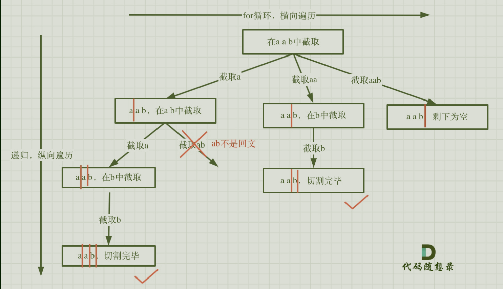

# 131分割回文串

## 题目要求

给你一个字符串 `s`，请你将 `s` 分割成一些子串，使每个子串都是 **回文串** 。返回 `s` 所有可能的分割方案。

**回文串** 是正着读和反着读都一样的字符串。
                                                               


## 第一想法

- 首先这个题目融合了字符串，将字符串先转换为字符数组，或者builder进行操作；整个题目还是一个组合问题。
- 如果转换成字符数组，整个树结构是：取出一个元素先判断其是否为回文，无论是与不是都要向下探索；这就引出如何判断是回文串，要再写一个方法。
- 回文串的判断应该是双指针，一前一后往中间走都得相等。
- 回溯模板，结束条件：如果是回文串还不能结束呢，还要往下走比如aa，（突然想到剪枝优化一定是在回文串的判断这里下文章）；难道用长度结束吗？参数，字符数组，起始位置。

## 题解：

树形图：

- 本题难点1：切割，切割和普通的组合还是不太一样的；并且如何切割，以什么样的标准去切割——可以想象为切蛋糕。
- 谁来决定树的深度，谁来决定树的层次：深度由分割线决定，**分割线为startIndex**;树的层次即for循环，重点在于*每次截取的子串*该如何表示：**[startIndex,i]就是要截取的子串**
- 可能刚开始一看startIndex就是i，但是在**每层for循环中，i是进行递增的，这个子串会不断地往后移动**。（比如第二层，切蛋糕地切割线不断往后移动，范围越来越大；或者第三层，为什么会截取ab呢，就是i进行了递增）
- 所以回溯模板中，参数为字符串和起始位置；结束条件（往**叶子结点**上看），**分割线来到了整个字符串的最后**，即结束；最后我们将判断是否为回文串的逻辑放在了for循环中。
- 最后一点我们可以发现path存放的就是树中满足回文的树枝。

```java
class Solution {
    private List<String> path = new ArrayList<>();
    private List<List<String>> result = new ArrayList<>();
    public List<List<String>> partition(String s) {
        backtracing(s,0);
        return result;
    }
    private void backtracing(String s,int startIndex){
        if (startIndex >= s.length()){
            //分割线来到了最后
            result.add(new ArrayList<>(path));//判断回文逻辑在加入path中
            return;
        }
        for (int i = startIndex; i < s.length(); i++) {
            if (isPalindrome(s,startIndex,i)){
                //这里很重要，范围为什么在startindex,i之间
                String str = s.substring(startIndex,i + 1);
                path.add(str);
            }else {
                continue;
            }
            backtracing(s,i + 1);
            path.remove(path.size() - 1);
        }
    }

    /**
     * 判断是否为回文串，注意这里是左闭右闭区间
     * @param s
     * @param start
     * @param end
     * @return
     */
    private boolean isPalindrome(String s,int start,int end){
        while (start < end){
            if (s.charAt(start) != s.charAt(end)){
                return false;
            }
            start ++;
            end --;
        }
        return true;
    }
}
```

### 优化：（待定）


# 93复原IP地址

## 题目要求：

给定一个只包含数字的字符串，复原它并返回所有可能的 IP 地址格式。

有效的 IP 地址 正好由四个整数（每个整数位于 0 到 255 之间组成，且不能含有前导 0），整数之间用 '.' 分隔。

例如："0.1.2.201" 和 "192.168.1.1" 是 有效的 IP 地址，但是 "0.011.255.245"、"192.168.1.312" 和 "192.168@1.1" 是 无效的 IP 地址。


## 第一想法：

- 第一感与切蛋糕有点像，切割线变成了'.'，在1切一刀，后面要不然切0，要不然01（但是包含了前导零）；切后面的结果也是一样，除非切到的结果有前导0或者整数不在0-255之间；
- 是一道同一集合内的题目。
- 回溯，参数是字符串，起始位置；结束条件：来到叶子结点，我觉得有些情况不能到叶子结点是因为违反了上面说的两个条件，所以能到叶子的一定是树枝的长度为4了；每一层的for循环：从起始位置出发，处理结点将其放入临时字符串的同时对上述条件进行判断，判断后进行递归，回溯，也是一个切割长度不断变长的过程，即截取子串长度也是[startindex,i]吗？
- 收集结果使用一维列表，收集临时结果用字符串？还忘记了要在path添加元素的过程中添加'.'这个分隔符。

## 题解：

- 结束条件：不再是切割点来到最后，确实是树枝长度为4，也就是当前被切成了四个部分，如何表示被切割成了四个部分呢——**我们使用'.'进行切割，所以四个部分一定是已经由三个'.'了，剩下的部分要满足题目条件**。这样就可以结束了。
- 注意本题需要额外插入字符'.'，且在原字符串上进行操作（builder），所以递归函数的参数起始位置也要相应地进行变化。
- 判断条件逻辑其实也有玄机：特别是**遍历字符串将其构建为一个数字**时的方法;再判断前导0时还要注意*单一的0*是满足条件的。

### 代码一：使用StringBuilder完成

- 本题在代码风格上一改往常，没有使用path，且对于字符串使用了StringBuilder，其方法`insert deleteCharAt`都是第一次使用。

```java
class Solution {
    private List<String> result = new ArrayList<>();
    public List<String> restoreIpAddresses(String s) {
        StringBuilder str = new StringBuilder(s);
        backtracking(str,0,0);
        return result;
    }

    /**
     * 回溯方法
     * @param s 使用builder作为工作集合，加入到结果集时要转换为字符串
     * @param startIndex 每层循环起始位置
     * @param dotcount 分割点的数量
     */
    private void backtracking(StringBuilder s,int startIndex,int dotcount){
        if (dotcount == 3){
            if (isValid(s,startIndex,s.length() - 1)){//注意isValid要求的左闭右闭区间
                result.add(s.toString());
            }
            return;
        }
        for (int i = startIndex; i < s.length() ; i++) {
            if (isValid(s,startIndex,i)){
                //与上一道分割一样，子串的范围在[startIndex,i]之间
                s.insert(i+1,'.');//插入点
                backtracking(s,i + 2,dotcount + 1);
                s.deleteCharAt(i + 1);//回溯删除的是什么：切割点，这个i + 1的地方也是上次进递归的i+1的地方即插入点
            }
        }
    }
    //想把这两个条件写成一个方法,注意这里使用了左闭右闭区间
    private boolean isValid(StringBuilder s,int start,int end){
        //先健壮性判断
        if (start > end) return false;
        //做前导0判断
        if (s.charAt(start) == '0'  && start != end) return false;
        //做0-255判断
        int num = 0;
        for (int i = start; i <= end ; i++) {
            //进行构建数字
            int digit = s.charAt(i) - '0';//取出数字
            num = num * 10 + digit;//将之前的数字往前移一位个位加上新数字
            if (num > 255){
                return false;
            }
        }
        return true;
    }
}

```

