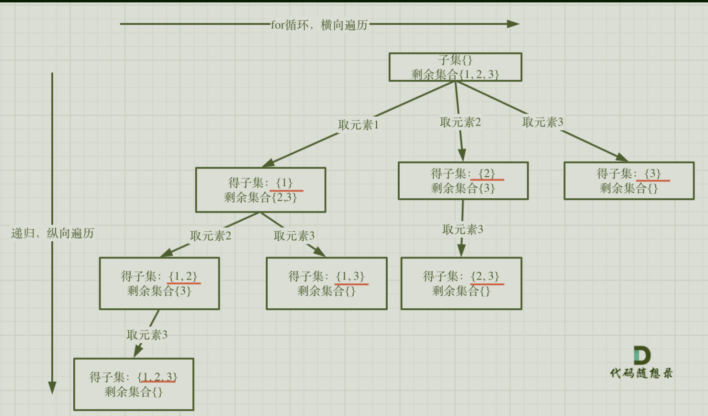
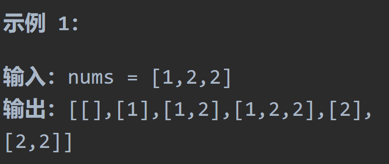
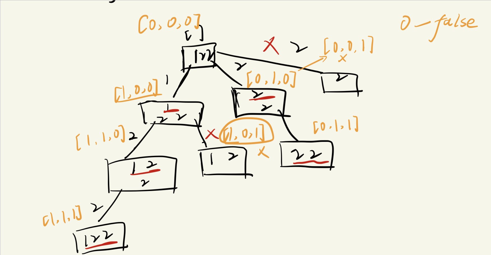
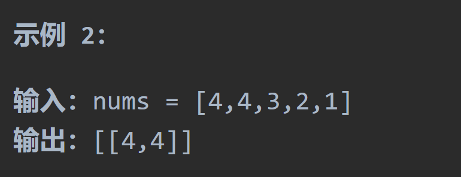
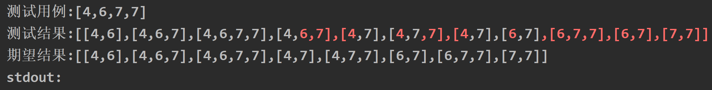

# 78子集

## 题目要求：

给你一个整数数组 `nums` ，数组中的元素 **互不相同** 。返回该数组所有可能的子集（幂集）。

解集 **不能** 包含重复的子集。你可以按 **任意顺序** 返回解集。


## 第一想法：

- 对于空集我先将其撇一边，这也是一个需要很多的for循环的问题，自然是回溯；但与之前的组合和切割一样吗？
- 回溯的模板，结束条件即叶子节点，取一个元素也算结束，两个也算结束这怎么样判断结束呢？感觉不只是遇到叶子节点才结束啊，遇到其他的中间符合条件的结点也会结束；参数需要数组、起始位置；每一层的for循环，如何处理节点？我觉得不符合条件的关键在于出现了重复。
- 提示方法中有位运算，怎么说？

## 题解：



与组合和切割问题最大的不同在于何处收集结果，**在每一层的for循环上都要进行结果的收集**。所以代码的整体结构也会出现变化。

- 以往都是在结束条件里收集结果，现在变成for循环中收集结果；且最终将结果的收集位置也要注意。

```java
class Solution {
    private List<Integer> path = new ArrayList<>();
    private List<List<Integer>> result = new ArrayList<>();
    public List<List<Integer>> subsets(int[] nums) {
        backtracking(nums,0);
        return result;
    }
    private void backtracking(int[] nums,int startIndex){
        //每次进入递归都先将上一次收集到的路径加入到结果中
        result.add(new ArrayList<>(path));
        //结束条件当每层的起始位置startIndex到最后即叶子节点
        if (startIndex >= nums.length){
            return;
        }
        for (int i = startIndex; i < nums.length ; i++) {
            //收集结果在这里执行
            path.add(nums[i]);
            //对下一层进行收集
            backtracking(nums,i + 1);
            //回溯
            path.remove(path.size() - 1);
        }
        return;
    }
}
```

- 甚至可以发现结束条件都可以省去，因为一旦`startIndex`走到了最后再进入for循环时是进不去的，意味着这次递归没有进行，所以结束条件可以省略。

# 90子集II

## 题目要求：

给你一个整数数组 `nums` ，其中可能包含重复元素，请你返回该数组所有可能的子集（幂集）。

解集 **不能** 包含重复的子集。返回的解集中，子集可以按 **任意顺序** 排列。



## 第一想法：

上次遇到重复元素的问题，是先进行排序了，上一道题避免重复的发生在于startIndex的功劳，这道题好像光使用startIndex挡不住重复的发生啊，所以在回溯过来for循环进行递增时即递归之前我们要进行多一层的判断，哦我想起来了当时那道重复的题目还设置了一个是否已经使用过的`used`数组。

- 所以used数组初始化为0即为false，每次进入for循环即同一层上的我们进行条件判断，**首先你得满足与上一个值相同，其次还得满足同一层上的上一个相同的值为false。**——因为回溯的缘故，上一个从1变道了0，即false了。
- 一旦满足上面的两个条件就意味着重复了，continue继续本层后面元素的操作。
- 那么其他的操作与上一道子集相同吗？我觉得相同，本质都是子集问题。

## 题解：

## 

- 还真的让我用以前做过的重复元素的题目used方法给过了，注意其中的回溯和处理结点都要处理used数组（是一个boolean数组）

```java
class Solution {
    private List<Integer> path = new ArrayList<>();
    private List<List<Integer>> result = new ArrayList<>();
    public List<List<Integer>> subsetsWithDup(int[] nums) {
        boolean[] used = new boolean[nums.length];
        Arrays.sort(nums);
        backtracking(nums,0,used);
        return result;
    }
    private void backtracking(int[] nums,int startIndex,boolean[] used){
        result.add(new ArrayList<>(path));
        if (startIndex >= nums.length) return;
        for (int i = startIndex; i < nums.length; i++) {
            if (i > 0 && nums[i-1] == nums[i] && used[i-1] == false){
                continue;
            }
            path.add(nums[i]);
            used[i] = true;
            backtracking(nums,i + 1,used);
            used[i] = false;
            path.remove(path.size() - 1);
        }
    }
}
```

# 491非递减子序列

## 题目要求：

给定一个整型数组, 你的任务是找到所有该数组的递增子序列，递增子序列的长度至少是2。

数组中可能含有重复元素，如出现两个整数相等，也可以视作递增序列的一种特殊情况。



## 第一想法：

开始我以为对数组一排列然后收集子集就完事了，看了示例2发现不是，他就要找给定的数组中的递增子集，顺序是定好的。

- 每次从集合中取一个数出来都要判断其与之前元素的大小，需要比较前面的所有元素吗？我觉得只要程序里每一个都遵守大于等于前一个再添加即可。
- 因为在任意树节点上面收集结果，所以还是子集问题。
- 对于回溯模板，结束条件为startindex大于长度；for循环里面要先对结点大小进行判断，满足条件才可以加入到path当中。

```java
class Solution {
    private List<Integer> path = new ArrayList<>();
    private List<List<Integer>> result = new ArrayList<>();
    public List<List<Integer>> findSubsequences(int[] nums) {
        backtracking(nums,0);
        return result;
    }
    private void backtracking(int[] nums,int startIndex){
        //如果在这里收集会多一个空数组，尝试添加一个条件。
        if (path.size() > 1){//并且注意长度至少为2
            result.add(new ArrayList<>(path));
        }
        if (startIndex >= nums.length){
            return;//最终收集在哪里收集
        }
        for (int i = startIndex; i < nums.length; i++) {
            if (i == 0) path.add(nums[i]);//为了让第一个元素进来。
            if (i > 0 && nums[i-1] <= nums[i]){
                path.add(nums[i]);//只有满足条件才往path里面放
            }
            //往下一层进行探索
            backtracking(nums,i+1);
            //回溯
            path.remove(path.size()-1);
        }
    }
}
```

- 为什么重复了一些组合呢？

- 因为回溯后有相同的元素在数组里，并没有限制收集完前一个不能用下一个相同的元素，所以如果能对结果集进行去重，或者再使用used数组来进行去重限制？（重复都发生在每一层上）

## 题解：

代码的核心确实是在**去重**上：

- 使用`Hashset`进行去重，每一层都设置一个Hashset集合（不能包含重复元素）来记录当前层使用过的元素，这样就可以使上面代码中发生重复的地方不再重复。
- 对于结点的处理前的条件判断，需要满足两个大条件：**当前元素大于路径中的最后的元素（路径不为空为了照顾第一个元素）+使用过的集合中不包含当前元素。**

```java
class Solution {
    private List<Integer> path = new ArrayList<>();
    private List<List<Integer>> result = new ArrayList<>();
    public List<List<Integer>> findSubsequences(int[] nums) {
        backtracking(nums,0);
        return result;
    }
    private void backtracking(int[] nums,int startIndex){
        //如果直接像子集那样在这里收集会多一个空数组，尝试添加一个条件。
        if (path.size() > 1){//并且注意长度至少为2
            result.add(new ArrayList<>(path));
        }
        if (startIndex >= nums.length){
            return;
        }
        //用于本层去重的辅助集合
        HashSet<Integer> used = new HashSet<>();
        for (int i = startIndex; i < nums.length; i++) {
            if ((!path.isEmpty() && nums[i] < path.get(path.size() -  1))
                || used.contains(nums[i])){//这是两个不满足条件的情况
                continue;
            }
            used.add(nums[i]);
            path.add(nums[i]);
            //往下一层进行探索
            backtracking(nums,i+1);
            //回溯
            ////回溯不用回hashset？因为每一层的hashset都是新的，独立的。
            path.remove(path.size()-1);
        }
    }
}
```

### 优化：

- 不使用集合而是使用数组当作哈希。
- 当然也可以用哈希表Map去重。
