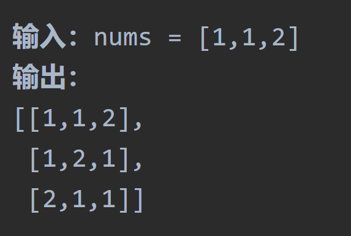

# 46全排列

## 题目要求：

给定一个不含重复数字的数组 `nums` ，返回其 *所有可能的全排列* 。你可以 **按任意顺序** 返回答案。

```
1 <= nums.length <= 6
-10 <= nums[i] <= 10
```

`nums` 中的所有整数 **互不相同**


## 第一想法：

何为全排列？从实例中可以发现，全排列就是必须在一个子数组中将数组中的所有数字列举出来，不同的排列内部的顺序也不一样。这跟普通的子集、切割、组合问题有什么区别呢？

- 全排列的树形结构也差不多，结果从叶子结点上取（与组合相近）
- 突然想到哪里不一样了，**如果同样使用startindex,在第二轮也就是2开头的序列中，你是取不到前面的1的。**如何解决这个问题，就是排列问题和组合问题不同的点，也是关键点。
- 回溯的模板中，递归终止条件到了叶子结点，path长度等于nums长度了即为结束；参数包括数组，要startindex吗？；for循环中如何处理结点呢？

## 题解：


- 正如我的第一想法，在排列问题中我们摒弃了`startIndex`这个概念，而加入了`used`数组，记录的是**此时哪些元素使用了**。
- 所以参数包括原数组和used数组、for循环处理逻辑每一层都从数组开头取数，取数时判断当前path中是否已经取过（used为true即为已经取过）

```java
class Solution {
    private List<Integer> path = new ArrayList<>();
    private List<List<Integer>> result = new ArrayList<>();
    public List<List<Integer>> permute(int[] nums) {
        boolean[] used = new boolean[nums.length];
        backtracking(nums,used);
        return result;
    }
    private void backtracking(int[] nums,boolean[] used){
        if (path.size() >= nums.length){
            result.add(new ArrayList<>(path));//收获结果
            return;
        }
        for (int i = 0; i < nums.length; i++) {//每次都是从头开始取数的
            if (used[i] == true) continue;//true意味着1在当前层被用过了
            //处理结点
            used[i] = true;
            path.add(nums[i]);
            backtracking(nums,used);
            //回溯
            used[i] = false;
            path.remove(path.size() - 1);
        }
    }
}
```

# 47全排列II

## 题目要求：

给定一个可包含重复数字的序列 `nums` ，***按任意顺序*** 返回所有不重复的全排列。



## 第一想法：

与上一道题不同的地方在于本题如果完全按照上一题的方式来则会造成输出结果的重复，上一道去重的题目用了个`Hashset`去重。其实像112，当再取到1的时候就不该让他取了，所以可以尝试`Hashset`

## 题解：

### Hashset

使用`hashset`成功完成了去重，但是在写的时候也新生出了一丝疑惑，`used`和`hashset`是不是作用重复了？

- 并没有重复，used记录的是此时元素的使用情况，是包括了之前（上一层）的使用情况的（因为层层递归）；
- 而hashset记录的是本层的元素使用情况，只限于本层的元素（每一层都会有自己独立的set）

```java
class Solution {
    private List<Integer> path = new ArrayList<>();
    private List<List<Integer>> result = new ArrayList<>();
    public List<List<Integer>> permuteUnique(int[] nums) {
        boolean[] used = new boolean[nums.length];
        backtracking(nums,used);
        return result;
    }
    private void backtracking(int[] nums,boolean[] used){
        if (path.size() >= nums.length){
            result.add(new ArrayList<>(path));
            return;
        }
        HashSet<Integer> hashSet = new HashSet<>();//每一层都有自己的hashset，悬在for循环之上保证这一层不会出现重复。
        for (int i = 0; i < nums.length; i++) {
            //如果此时当前元素之前被用过 或者 当前元素被本层使用过，都是不满足条件的。
            if (used[i] == true || hashSet.contains(nums[i])) continue;
            used[i] = true;
            hashSet.add(nums[i]);//总感觉这样写两个used一样了？
            path.add(nums[i]);
            backtracking(nums,used);
            //回溯不用回hashset？因为每一层的hashset都是新的，独立的。
            used[i] = false;
            path.remove(path.size() - 1);
        }
    }
}
```

### 排序后去重

- 在树层上进行去重

```java
class Solution {
    private List<Integer> path = new ArrayList<>();
    private List<List<Integer>> result = new ArrayList<>();
    public List<List<Integer>> permuteUnique(int[] nums) {
        boolean[] used = new boolean[nums.length];
        Arrays.sort(nums);
        backtracking(nums,used);
        return result;
    }
    private void backtracking(int[] nums,boolean[] used){
        if (path.size() >= nums.length){
            result.add(new ArrayList<>(path));
            return;
        }
        for (int i = 0; i < nums.length; i++) {
            //这一套是去重的逻辑
            if (i > 0 && nums[i] == nums[i-1] && used[i-1] == false) continue;
            //这一套是原本排列的逻辑，以前是used[i]写在前面的。
            if (used[i] == false){
                used[i] = true;
                path.add(nums[i]);
                backtracking(nums,used);
                //回溯不用回hashset？因为每一层的hashset都是新的，独立的。
                used[i] = false;
                path.remove(path.size() - 1);
            }
        }
    }
}
```


