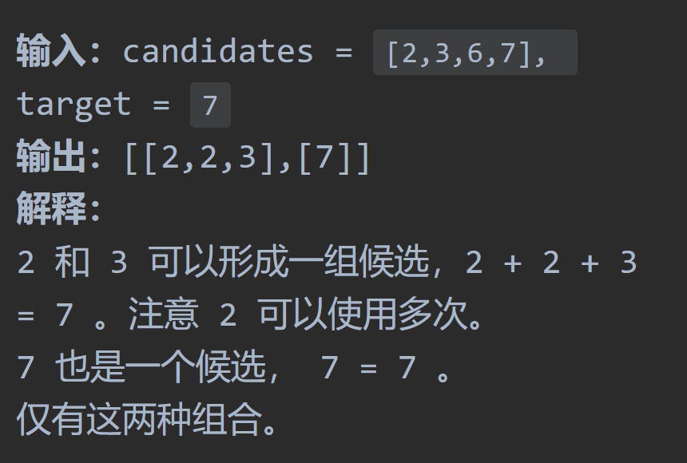
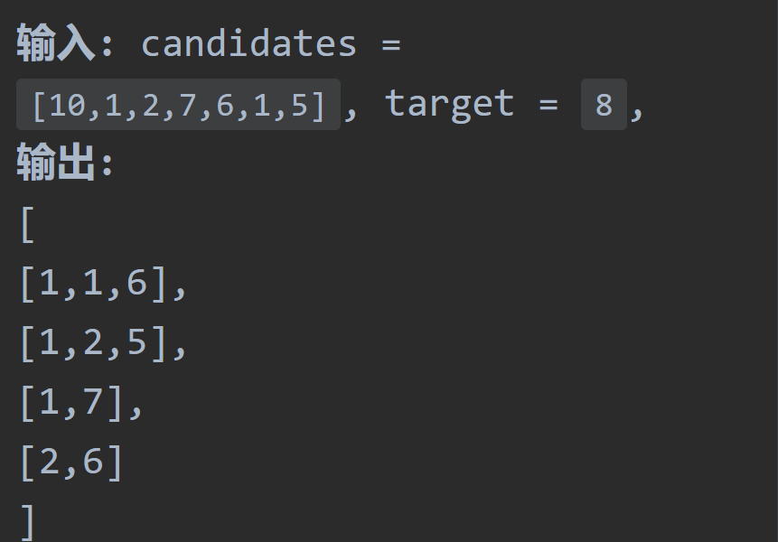
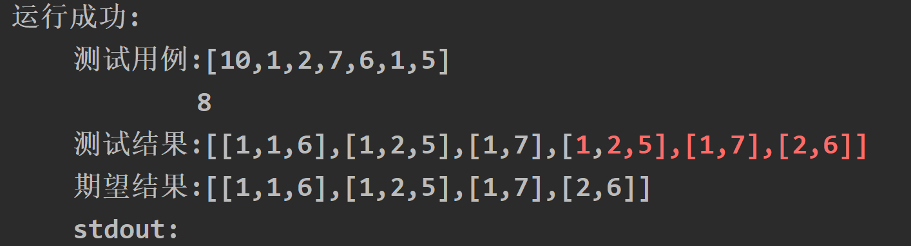
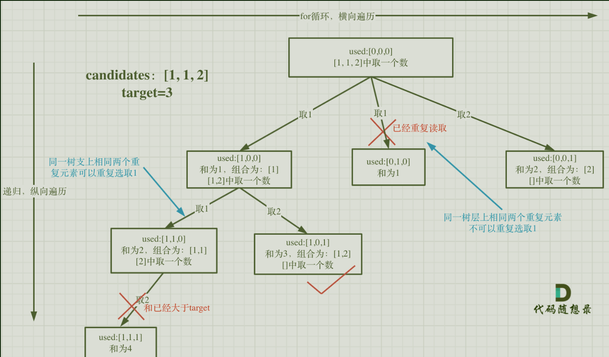

# 77组合

## 题目要求：

给定两个整数 `n` 和 `k`，返回范围 `[1, n]` 中所有可能的 `k` 个数的组合。

你可以按 **任何顺序** 返回答案。

**示例 1：**

```rust
输入：n = 4, k = 2
输出：
[
  [2,4],
  [3,4],
  [2,3],
  [1,2],
  [1,3],
  [1,4],
]
```

## 第一想法：

很典型的回溯问题，以前从来没有接触过；逻辑上定住一个左边，剩下的数根据k来往后找，找到一个合适的加入到结果集中，然后对这个进行回溯，回到左边，再往之前找的之后去找？

根本没有思路啊。

## 题解：

组合是无序的，不能颠倒否则重复；其中元素只能取一次，不能【2,2】这样

### 回溯法三部曲：

1. 递归函数的参数及返回值：
	- 回溯返回值一般为void，**参数n决定数据范围，k来决定路径长度**、以及最重要的startindex，每一次递归都将**本次递归的起始位置**传入。
2. 回溯函数终止条件
	- 当当前路径path中存储的路径满足条件时返回。
3. 单层搜索的过程
	- 处理遍历到的每一个结点，将其加入当前路径中。加入完后进行递归处理，递归完之后回溯删除上一个刚刚操作过的结点。
```java
//定义两个集合一个收集最终结果，一个收集当前路径
private List<List<Integer>> result = new ArrayList<>();
private List<Integer> path = new ArrayList<>();
//回溯
private void backtracing(int n,int k,int startindex){
  if(path.size() == k){//可以发现树的深度由k控制，所以k在终止条件上
    result.add(new ArrayList<>(path));
    return;
  }
  for(int i = startindex;i <=n; i ++){
    path.add(i);//处理结点，将当前结点先放入当前路径中
    backtracking(n,k,i + 1);//递归处理，对其他结点进行处理
    path.remove(path.size() - 1);//回溯处理
  }
}
//主方法
public List<List<Integer>> combine(int n,int k){
  backtracking(n,k,1);
  return result;
}
```

过程示例：


- 我的理解是每一层for循环代表着一组以x开头的组合
- 在找这个组合的时候会进行递归，但每一次寻找结束就会回溯回来，再次进行下一个for循环（即i++）
- 对于`startindex`,debug时发现其在**最外层的for循环里一直是1**，但是在进行递归时会发生变化，所以他是何种传参类型——基本数据类型每次传参都会创建副本，不会影响原始值，所以`startindex`原始值一直都是1 ！！！

### 剪枝操作：

- 由于在for循环中的**范围过大**，导致有一些没有必要的搜索操作产生，（数已经不够了，你还要去找那不是白瞎吗）；所以我们要在for循环的范围上做文章
- 我们要找到一个位置，**至多从这个位置上开始**，`k-path.size()`即还需要多少元素，所以**`n-(k-path.size) + 1`**即源范围里还剩多少个元素（或者该从哪个元素出发）即所求位置。

```java
private List<List<Integer>> result = new ArrayList<>();
private List<Integer> path = new ArrayList<>();
//回溯
private void backtracing(int n,int k,int startindex){
  if(path.size() == k){
    result.add(new ArrayList<>(path));
    return;
  }
  for(int i = startindex;i <=（n- (k-path.size()) + 1); i ++){//进行剪枝
    path.add(i);//处理结点，将当前结点先放入当前路径中
    backtracking(n,k,i + 1);//递归处理，对其他结点进行处理
    path.remove(path.size() - 1);//回溯处理
  }
}
//主方法
public List<List<Integer>> combine(int n,int k){
  backtracking(n,k,1);
  return result;
}
```


# 回溯的模板

递归-for循环-递归——最终可以视作一个树形结构。

```java
void backtracking(参数){
  if(终止条件){
    存放结果；
    return;
  }
  for(选择：本层集合中元素（树中结点孩子的数量就是集合的大小）){
    处理结点;
    backtracking(路径，选择列表);
    回溯，撤销本次处理结果;
  }
}
```

# 216组合总和III

## 题目要求

找出所有相加之和为 `n` 的 `k` 个数的组合，且满足下列条件：

- 只使用数字1到9
- 每个数字 **最多使用一次**

返回 *所有可能的有效组合的列表* 。该列表不能包含相同的组合两次，组合可以以任何顺序返回。


## 第一想法

对于回溯来讲，path的长度为k，此时的n不再是范围（因为范围已经定在了1-9），而是判断条件之一？

对照模板，参数：总和n，长度k，每一次递归的起始位置需要吗？

- 初始思路（自己还忘记了要记录当前和）

```java
    private void backtracking(int k,int n,int startIndex,int currentSum){
        if (path.size() == k && currentSum == n){
            result.add(new ArrayList<>(path));
            return;
        }
        for (int i = startIndex; i <= 9 ; i++) {
            path.add(i);
            currentSum += i;
            backtracking(k,n,i + 1,currentSum);
            //回溯
            currentSum -= i;
            path.remove(path.size() - 1);
        }
    }
```

## 题解

- 对于参数，需要加入一个**当前和**来记录
- 对于结束条件，只要path长度为k，即可结束；至于当前和是否为n，那是是否加入到结果集中的判断逻辑，跟结束与否没有关系。所以上面代码条件要修改。
- 后面的for循环可以进行**剪枝**操作，一旦当前这层for循环出现和为n的了，再往后for循环就没有意义了（因为选取的顺序是递增的1-9）

```java
class Solution {
    private List<Integer> path = new ArrayList<>();
    private List<List<Integer>> result = new ArrayList<>();
    public List<List<Integer>> combinationSum3(int k, int n) {
        backtracking(k,n,1,0);
        return result;
    }
    private void backtracking(int k,int n,int startIndex,int currentSum){
        if (path.size() == k ){
            if (currentSum == n){//这个条件管的范围不一样
                result.add(new ArrayList<>(path));
            }
            return;
        }
        for (int i = startIndex; i <= 9-(k-path.size()) +  1 ; i++) {
            path.add(i);
            currentSum += i;
            //进行剪枝
            if (currentSum > n){
                currentSum -= i;
                path.remove(path.size() - 1);
                return;//这里直接return出去，不用再进行后面的for循环了
            }
            backtracking(k,n,i + 1,currentSum);
            //回溯
            currentSum -= i;
            path.remove(path.size() - 1);
        }
    }
}
```

# 17电话号码的字母组合

## 题目要求：

给定一个仅包含数字 `2-9` 的字符串，返回所有它能表示的字母组合。答案可以按 **任意顺序** 返回。

给出数字到字母的映射如下（与电话按键相同）。注意 1 不对应任何字母。


## 第一想法：

思路：

- 乍眼一看是哈希表与回溯组合的组合问题，2-9的字符串，每一个作为key，对应3-4个value。对于给定的digits，是一个一个的框框，从框中选？

- 需要所有的字母组合，这个组合到底是怎么组合，一对一配对吗？注意如果只有一个数字，其结果就是value

- 以及传入的参数是String类型，我们需要将其转换为字符数组然后定位每一个元素吗？

如果使用回溯，模版该如何写：

- 参数：digits字符串，关于位置该如何确定？
- if结束条件，路径中已经存在digits长度个数？
- for循环

尝试

```java
    List<String> path = new ArrayList<>();
    List<List<String>> result = new ArrayList<>();
private void backtracking(String digits,int startIndex){
        if (path.size() == digits.length()){
            result.add(new ArrayList<>(path));
            return;
        }
        for (int i = startIndex; i <= digits.length(); i++) {
            //处理
            //递归
            //回溯
        }
    }
```


## 题解：


1. 上面说了一大堆，其实本题与前两题的区别就是在求**不同集合中的数的组合**，前两题都是相同集合中的。
2. 本题的一个难点在于之前的`startIndex`转变为`index`,他决定的是**当前遍历到所给digits的哪一个数字**，这也正与第一点对应，本题的着眼处在于不同集合，我需要定位不同的集合。

   - 因为index这个变量决定着当前for循环从何处开始遍历，从图中可以看出每一层即for循环，第二层for循环已经来到了3这个数字，所以`index`决定的就是当前走到哪个集合了。
3. 回溯中转换为树的思考过程还是十分重要的，前两题k决定了树的深度，本题就是index决定了树的深度。可以总结规律，**谁决定了树的深度谁就作为回溯的结束条件出现。**
4. 在for循环中不再从startindex出发，而是从某个集合开始，进行递归意味着要去找另一个集合。

```java
class Solution {
//    private String path = "";其实也可以用String声明，对于示例2进行健壮性判断即可。
    private StringBuilder path = new StringBuilder();
    private List<String> result = new ArrayList<>();
    private final String[] wordsMap ={
            "",
            "",
            "abc",
            "def",
            "ghi",
            "jkl",
            "mno",
            "pqrs",
            "tuv",
            "wxyz"
    };
    public List<String> letterCombinations(String digits) {
        if (digits.length() == 0){
            return result;
        }
        backtracking(digits,0);
        return result;
    }

    private void backtracking(String digits,int index){
        if (index == digits.length()){
            result.add(path.toString());
            return;
        }
        //定位
        int digit = digits.charAt(index) - '0';//将所给字符串中的字符转换为int类型的数字
        String words = wordsMap[digit];//从哈希表中取出对应数字所代表的字符串
        for (int i = 0; i < words.length(); i++) {
            path.append(words.charAt(i));//处理结点，加入路径
            backtracking(digits,index + 1);//来到新的集合去搜索
            path.deleteCharAt(path.length() - 1);//回溯，使用substring取子串
        }
    }
}
```

# 39组合总和

## 题目要求：

给你一个 **无重复元素** 的整数数组 `candidates` 和一个目标整数 `target` ，找出 `candidates` 中可以使数字和为目标数 `target` 的 所有 **不同组合** ，并以列表形式返回。你可以按 **任意顺序** 返回这些组合。

`candidates` 中的 **同一个** 数字可以 **无限制重复被选取** 。如果至少一个数字的被选数量不同，则两种组合是不同的。

对于给定的输入，保证和为 `target` 的不同组合数少于 `150` 个。



## 第一想法：

- 首先这道题目的类型是**同一集合**，其次最大的特点是同一个数字可以无限制重复选取。
- 那么对于回溯的树取一个数出来，剩下的还是整个集合，并没有少什么元素。
- 对于回溯模板，参数需要数组，目标值（也可以用减法做）当前和；if结束条件只有当值等于target时才可以结束（不再像之前题目限制集合的长度，因为可以无限取元素）树的深度不再由集合决定了；for循环代表着每一层的树，需要设置一个当前和。
- 其实树应该长成这样，最左边我们全取2，发现不能等于7，那何时取其他的呢，树就会特别大。
- 以及限制最后150个如何实现。

## 题解：

- 修改一下第一想法中的问题。参数还是需要`startindex`的，我们需要知道下一层树该从哪里开始，即使本题可以重复。
- 总结：**如果是一个集合来求组合的话，就需要startIndex；如果是多个集合取组合，各个集合之间相互不影响，那么就不用startIndex；而是集合间的index，且for循环从0开始单独对某个集合操作**
- 可以进行剪枝优化：**求和之中排序后做剪枝很常见**：可以发现每次回溯时会发生已经大于目标值了还要进去递归，所以我们需要在进入树的下一层（即下一个for循环）前就进行一次判断，看值是否已经大于了。（注意，**要先对数组进行排序**，防止你这一层回来后面更小的数还可以满足条件但你阻止了他进入for循环处理）

### 代码一：无剪枝

```java
class Solution {
    private List<Integer> path = new ArrayList<>();
    private List<List<Integer>> result = new ArrayList<>();
    public List<List<Integer>> combinationSum(int[] candidates, int target) {
        backtracing(candidates,target,0,0);
        return result;
    }
    private void backtracing(int[] candidates,int target,int currentSum,int startIndex){
        if (currentSum > target){
            return;
        }
        if (currentSum == target){
            result.add(new ArrayList<>(path));
            return;
        }
        //
        for (int i = startIndex; i < candidates.length; i++) {//注意这是数组长度，不能取最后
            currentSum += candidates[i];
            path.add(candidates[i]);
            backtracing(candidates,target,currentSum,i);//这里注意，由于无限制重复被选取起始位置可以从上一次位置开始
            //回溯
            currentSum -= candidates[i];
            path.remove(path.size() - 1);
        }
    }
}
```


### 代码二：剪枝

```java
Arrays.sort(candidates);
for (int i = startIndex; i < candidates.length && currentSum + candidates[i] <= target; i++) {//注意这是数组长度，不能取最后
            currentSum += candidates[i];
            path.add(candidates[i]);
            backtracing(candidates,target,currentSum,i);//这里注意，由于无限制重复被选取起始位置可以从上一次位置开始
            //回溯
            currentSum -= candidates[i];
            path.remove(path.size() - 1);
        }
```

# 40组合总和II

## 题目要求：

给定一个候选人编号的集合 `candidates` 和一个目标数 `target` ，找出 `candidates` 中所有可以使数字和为 `target` 的组合。

`candidates` 中的每个数字在每个组合中只能使用 **一次** 。

**注意：**解集不能包含重复的组合



## 第一想法

本题的小改动在于这个集合中可以有重复的数字，像116这样的。

- 但是不影响startindex的设置吧，又回到了最初的组合问题；
- 对于这道题目我们受上一道题目启发，先对数组进行排序再进行操作：**相邻元素放在一起**。
- 结束条件：当前值=目标值，大于目标值也可以返回；for循环从startindex开始，条件还是小于长度，处理结点值相加递归回溯。

```java
class Solution {
    private List<Integer> path = new ArrayList<>();
    private List<List<Integer>> result = new ArrayList<>();
    public List<List<Integer>> combinationSum2(int[] candidates, int target) {
        Arrays.sort(candidates);
        backtracing(candidates,target,0,0);
        return result;
    }
    private void backtracing(int[] candidates,int target,int currentSum,int startIndex){
        if (currentSum > target){
            return;
        }
        if (currentSum == target){
            result.add(new ArrayList<>(path));
            return;
        }
        for (int i = startIndex; i < candidates.length; i++) {
            currentSum += candidates[i];
            path.add(candidates[i]);
            backtracing(candidates,target,currentSum,i + 1);
            currentSum -= candidates[i];//进行回溯
            path.remove(path.size() - 1);
        }
    }
}
```

- 出现了错误：
- 错误原因就在于当有重复的元素时，在其第一次出现后如何避免其第二次出现并产生相同的结果加入结果集中，可以对结果集进行去重吗？（就算去该如何去重呢）还是在处理第二次出现时可以跳过这次处理呢？
- 感觉后者的处理方法更为合适。

## 题解：



- 需要判断同一层上的树枝是否有使用过的会重复。
- 使用used数组保存元素的使用信息：使用过的设置为true、没用过的设置为false
- 前后两数相同时：分为树枝相同和树层相同，树枝相同是不影响的，所以设置为true，每次条件判断都不会continue；树层相同是不能允许的，其实每次判断树层的时候都回溯到大的for循环里了，为false。
- **used[i-1]为0意味着处在树层的状态，为1处在树枝的状态。**
- 举例子就是我第一个1还没用，怎么轮到你第二个1了？（形象地理解一下）

```java
class Solution {
    private List<Integer> path = new ArrayList<>();
    private List<List<Integer>> result = new ArrayList<>();
    public List<List<Integer>> combinationSum2(int[] candidates, int target) {
        //需要一个辅助数组来记录元素的使用信息
        boolean[] used = new boolean[candidates.length];
        Arrays.sort(candidates);
        backtracing(candidates,target,0,0,used);
        return result;
    }
    private void backtracing(int[] candidates,int target,int currentSum,int startIndex,boolean[] used){
        if (currentSum > target){
            return;
        }
        if (currentSum == target){
            result.add(new ArrayList<>(path));
            return;
        }
        for (int i = startIndex; i < candidates.length && candidates[i] + currentSum <= target; i++) {
            if (i > 0 && candidates[i] == candidates[i-1] && used[i-1] == false){
                continue;//这里判断为false是因为前一个元素回溯到这个大的for循环里面来，此时path空空如也大家都是false
                //而在普通的树枝for循环中，之前出现过是不影响的，所以出现过的设置为true，不会进行continue
            }
            used[i] = true;//
            currentSum += candidates[i];
            path.add(candidates[i]);
            backtracing(candidates,target,currentSum,i + 1,used);
            used[i] = false;//
            currentSum -= candidates[i];//进行回溯
            path.remove(path.size() - 1);
        }
    }
}
```

