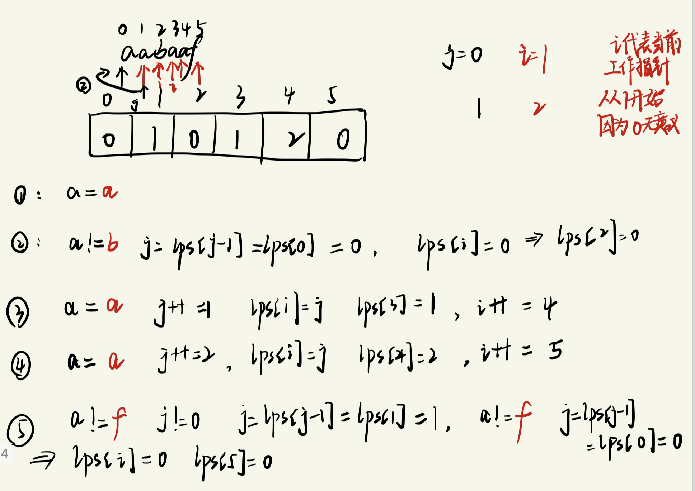

# 剑指offer58  - 左旋字符串

## 题目要求

字符串的左旋转操作是把字符串前面的若干个字符转移到字符串的尾部。请定义一个函数实现字符串左旋转操作的功能。比如，输入字符串"abcdefg"和数字2，该函数将返回左旋转两位得到的结果"cdefgab"。

## 第一想法

- 如果把字符串转换为字符数组，那由于数组的长度受限，我需要移动整个数组的元素，所以这个方法不考虑。

- 如果使用Builder新建一个字符串，动态长度可变，然后先把后面的字符放到新的前面，再把要旋转的放到新的后面。

- 可以在原字符串上面操作吗？使用指针？分成两个部分——一个指向开始，一个指向不用左旋的。好像不太对。

## 困难

使用Builder新建字符串的思路是没有错的，但是空间复杂度还是太高了。所以在源字符串上操作是可行的，只是我没有想到这个方法罢了。

## 正解

类比上一道字符串题目，这些翻转题目往往都存在一定的规律，比如这道题目可以**先把ab翻转，再把后面翻转，再对整个字符串进行翻转。**实现了在原字符串上操作。

## 代码实现1

- 异或运算可以避免额外的空间的消耗——异或运算具有交换律，一个数异或自己结果为0（相同为0，不同为1），**一个数与0进行异或结果为这个数本身。**
- 所以利用这些特性，可以记住口诀：左右右左左右，三次交换下来实现了左右位置的互换。

```java
class Solution_02{
    //在原数组的基础上进行操作
    public String reverseWords(String s,int n){
        char[] chars = s.toCharArray();
        reverse(chars,0,n-1);
        reverse(chars,n,s.length()-1);
        reverse(chars,0,s.length()-1);
        return new String(chars);
    }
    //写一个颠倒字符数组里指定位置元素的方法，这里注意啊，异或操作可以实现两个位置元素的互换
    public void reverse(char[] chars,int left,int right){
        while (left < right){
            chars[left] ^= chars[right];//左右异或结果放在左边里面
            chars[right] ^= chars[left];//右边和上面结果进行异或只剩下了原来左边的值，并且最终放入右边的区域
            chars[left] ^= chars[right];//异或得到原来右边的值，放入左边位置。
            //这样就完成了左右位置的交换
            left ++;
            right --;
        }
    }
}

```
## 代码实现2
```java
class SolutionLeft{
    public String reverse(String s,int n){
        StringBuilder sb = new StringBuilder();
        //完成后半部分的字符填充
        for (int i = n ; i < s.length(); i++) {
            sb.append(s.charAt(i));
        }
        //将需要左旋的填充到后面。
        for (int i = 0; i < n ; i++) {
            sb.append(s.charAt(i));
        }
        //将builder转换为sb
        String s1 = sb.toString();
        return s1;
    }
}
```

# 28找出字符串第一个匹配的下标项

## 题目要求：

给你两个字符串 `haystack` 和 `needle` ，请你在 `haystack` 字符串中找出 `needle` 字符串的第一个匹配项的下标（下标从 0 开始）。如果 `needle` 不是 `haystack` 的一部分，则返回 `-1` 。

## 第一想法

## 困难

## 正解(KMP)
- 见手写示例：
## 代码实现
- 见下方KMP算法实现

# KMP算法

### 前缀
- 在代码中使用i表示
包含首字母，不包含尾字母的**所有子串**。

### 后缀
- 在代码中使用j表示（或者len）
包含尾字母，不包含首字母的所有子串。

### 最长相等前后缀
- 对所有的子串记录其最长相等前后缀，保存于next数组中；当发生失配时，**前一个字符的前缀表的数值**是多少就到这里去重新匹配。

## 获得LPS前缀和数组
- j指向前缀末尾位置，i指向后缀末尾位置。
- j其实也代表了i之前包括i子串最长相等前后缀的长度
- 关键步骤：
```java
public int[] buildLPS(String pattern){
			//init
			int[] lps = new int[pattern.length()];
			lps[0] = 0;
			int j = 0,i = 1;//这里的初始化很重要
			
			while(i < pattern.length()){
					if(pattern.charAt(i) == pattern.charAt(j)){
							j ++;
							lps[i] = j;//先对j进行递增再赋给前缀数组元素值
							i ++;
					}else {
						if(j != 0){
              //回退
							j = lps[j - 1];//如果失配就让j回退到lps[j - 1]处再去比较
						}else{
              //当j已经提到了最开头退无可退了，对应值赋0，工作指针再往后走。
							lps[i] = 0;
							i ++;
						}
					}
			}
			return lps;
}
```
## 整体方法：
- 遍历文本串与模式串，使用`buildLPS`方法来获得前缀和数组来标记匹配失效时的回退位置

```java
public int strStr(String s1,String s2){
	if(s1.isEmpty()) return 0;
	if(s2.isEmpty()) return 0;
	
	int[] lps = buildLPS(s2);
	int i = 0,j = 0;
	while(i < s1.length()){
		if(s1.charAt(i) == s2.charAt(j)){
			i ++;//i代表着文本串的工作指针
			j ++;
      //因为j现在代表着模式串的工作指针，所以一旦j走到了工作指针的末尾一定就遍历完了模式串即成功了
			if(j == s2.length()){
				return i - j;//返回满足条件的最开始的位置，相对位置。
			}
      //这下面的回退操作与创建lps数组操作一致
		}else if(j > 0){
			j = lps[j - 1];
		}else{
			i ++;
		}
	}
	return -1;
}
```

# 459 重复的子字符串

## 题目要求：

给定一个非空的字符串 `s` ，检查是否可以通过由它的一个子串重复多次构成

## 思路：（深刻理解KMP）

- 在 KMP 算法中，LPS 数组表示字符串中每个前缀的最长相等前后缀的长度。对于一个由子串重复构成的字符串，LPS 数组的最后一个值将反映这种重复模式。
- 如果 `s` 是由一个子串重复构成的，那么：

  - 最长相等前后缀的长度 `len` 应该是这个重复子串的完整长度。
  - 剩余的部分（`n - len`）应该等于这个重复子串的长度。
  - 因此，`n` 应该是 `n - len` 的整数倍。
- 会有这样的情况出现：`ababab`最后一个LPS数组的值为4，并不符合由`abab`这个子串去重复构成原字符串；但是这并不是最小的重复单元。
- 但是**让我不理解的是**：上面那个判断等式居然可以覆盖这种情况？？？？？

来自代码随想录的解释：
- 数组长度减去最长相同前后缀的长度相当于是**第一个周期的长度**，也就是一个周期的长度，如果这个周期可以被整除，就说明整个数组就是这个周期的循环。
- **在由重复子串组成的字符串中，最长相等前后缀不包含的子串就是最小重复子串**
- 

## 代码：

```java
class Solution {
    public boolean repeatedSubstringPattern(String s) {
        int n = s.length();
        int[] lps = buildLPS(s);//构建原字符串自己的前缀和数组，算是自身操作自己了
        //得到lps的最后一个值
        int len = lps[n - 1];
        //检查这个值是否满足条件
        return (len > 0 && n % (n - len) == 0);
    }
    public int[] buildLPS(String pattern){
        //初始化
        int n = pattern.length();
        int[] lps = new int[n];
        int j = 0;
        int i = 1;
        lps[0] = 0;

        while (i < n){
            if (pattern.charAt(i) == pattern.charAt(j)){
                j ++;
                lps[i] = j;
                i ++;
            }else {
                if (j != 0){
                    j = lps[j - 1];
                }else {
                    lps[i] = 0;
                    i ++;
                }
            }
        }
        return lps;
    }
}
```

