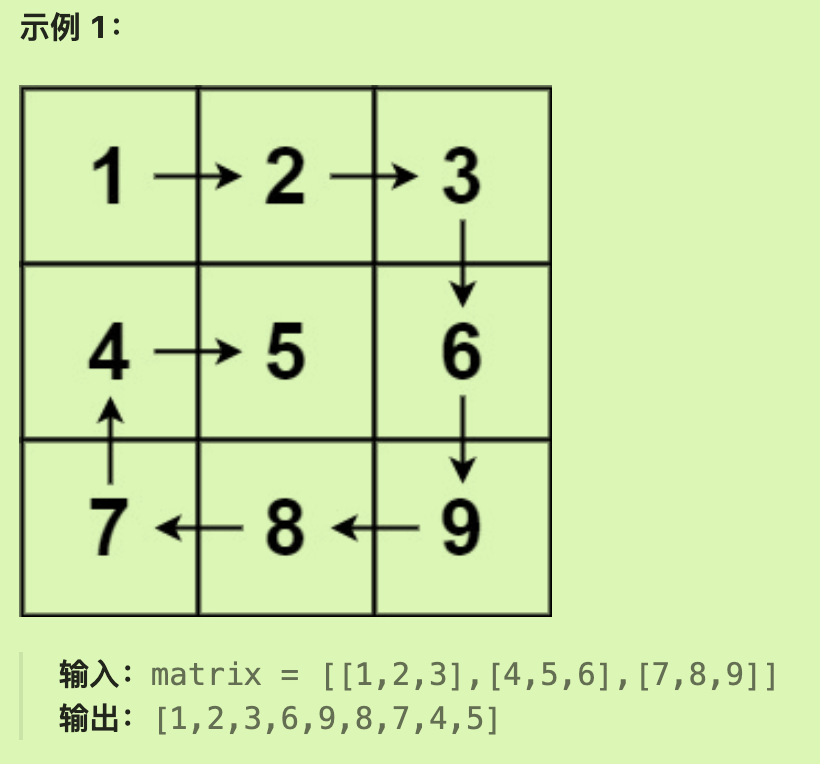

# 59螺旋矩阵II

## 题目要求

给你一个正整数 `n` ，生成一个包含 `1` 到 `n2` 所有元素，且元素按顺时针顺序螺旋排列的 `n x n` 正方形矩阵 `matrix` 。

**示例 1：**


```java
输入：n = 3
输出：[[1,2,3],[8,9,4],[7,6,5]]
```

## 思路

### 第一感觉：

没思路，不知道怎么写。以前从来没有遇到过这类题目。

### 困难：

### 正解：

- 注意**循环不变量原则**，每一条边都遵循**左闭右开**的原则去遍历模拟。（每次将最后一个元素留给下一次遍历的第一个元素）
- 并且转圈的次数也有讲究，如果n为偶数转 n/2圈，n为奇数那么中间会剩下。
- 在写的时候十分注意每一条路怎么走这个**二维数组**。

### 代码实现：

- 可以发现，此代码中并没有设定转圈次数，而是利用`num`与`n`的关系表示循环结束条件。

```java
public int[][] generateMatrix(int n){
//        声明结果矩阵并设置边界值
        int[][] result = new int[n][n];
        int num = 1;
        int left = 0;
        int right = n - 1;
        int top = 0;
        int bottom = n - 1;
//      按照顺序设置值
        while (num <= n * n){
//          向右填充，并缩减上边界（谁被填满就缩减谁）
            for(int i = left; i <= right && num <= n * n; i ++){
                result[top][i] = num ++;
            }
            top ++;
//          向下填充，并缩减右边界
            for (int i = top; i <= bottom && num <= n * n; i ++){
                result[i][right] = num ++;
            }
            right --;
//          向左填充，缩减下边界
            for (int i = right; i >= left && num <= n * n; i --){
                result[bottom][i] = num ++;
            }
            bottom --;
//          向上填充,缩减左边界
            for (int i = bottom; i >= top && num <= n * n; i--) {
                result[i][left] = num ++;
            }
            left ++;
        }
        return result;
    }
```

# 54螺旋矩阵

## 题目要求

给你一个 `m` 行 `n` 列的矩阵 `matrix` ，请按照 **顺时针螺旋顺序** ，返回矩阵中的所有元素



- `m == matrix.length`
- `n == matrix[i].length`
- `1 <= m, n <= 10`
- `-100 <= matrix[i][j] <= 100`

## 第一想法

上面题目是让我们顺时针构造矩阵，这个题目让我们顺时针取出矩阵中的元素，但是原二维矩阵并不是顺时针构造的而是正常按行构造。

还是按照上面的思路进行四个方向的遍历？

## 题解

### 思路

- 确实按照上面的思路进行遍历，但是注意**循环条件的改变**以及**向左向上两个反方向**的条件限制
- 因为题目条件不再是正方形矩阵，可能出现单列或者单行矩阵（m*n）所以需要注意边界条件。

```java
public List<Integer> spiralOrder(int [][] matrix){
//        设置边界条件
        List<Integer> list = new ArrayList<>();
        int m = matrix.length;
        int n = matrix[0].length;//行列值
        int left = 0;
        int right = n - 1;
        int top = 0;
        int bottom = m - 1;
//      遍历取出元素，放入list中返回
        while (left <= right && top <= bottom){//结束条件应该是由原矩阵的长度所限制
//            四个方向取出元素，取出后缩减范围
            for (int i = left; i <= right ; i++) {
                list.add(matrix[top][i]);
            }
            top ++;
            for (int i = top; i <= bottom; i++) {
                list.add(matrix[i][right]);
            }
            right --;
//          当矩阵至少有两行或者两列时，才可以进行向左移动和向上移动（可以想象单行单列）
            if (top <= bottom){
                for (int i = right; i >= left; i--) {
                    list.add(matrix[bottom][i]);
                }
                bottom --;
            }
            if (left <= right){
                for (int i = bottom; i >= top; i --) {
                    list.add(matrix[i][left]);
                }
                left ++;
            }
        }
        return list;
    }
```

