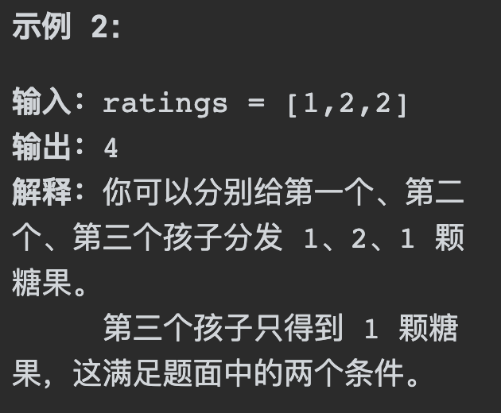
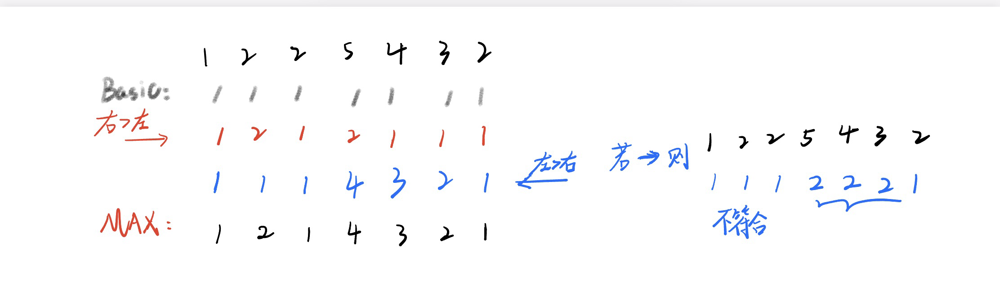
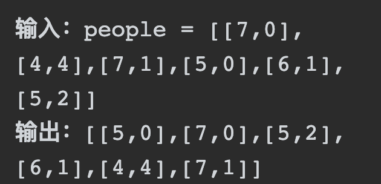

# 135分发糖果

## 题目要求：

`n` 个孩子站成一排。给你一个整数数组 `ratings` 表示每个孩子的评分，你需要按照以下要求，给这些孩子分发糖果：

-  每个孩子至少分配到 `1` 个糖果。

- 相邻两个孩子评分更高的孩子会获得更多的糖果。

请你给每个孩子分发糖果，计算并返回需要准备的 **最少糖果数目**



```rust
n == ratings.length
1 <= n <= 2 * 104
0 <= ratings[i] <= 2 * 104
```

## 第一想法：

如何贪心？从头开始遍历，每次只比较两个数，小的给一个，大的在小的基础上加一个，相同的话后者给一个？需要一个变量记录当前位置上给的糖果数，还有一个变量记录总共给出的糖果数。条件判断会比较多。

```java
    public int candy(int[] ratings) {
        int[] candies = new int[ratings.length];
        int sum = 0;
        for (int i = 0; i < ratings.length; i++) {
            if (ratings[i] > ratings[i+1]){
                candies[i+1] == 1;
                candies[i] = candies[i+1] + 1;
            } else if (ratings[i] < ratings[i+1]) {
                candies[i] == 1;
                candies[i+1] = candies[i] + 1;
            }else {
                candies[i] == 1;
                candies[i+1] == candies[i];
            }
        }//这种写法很明显没有考虑完全，并且比较过程太死板。
    }
}
```

## 题解：



本题的思路是从两个方向使每一个位置上的元素同时满足左右的条件。

- 首先**从左向右**遍历，需要将每个元素满足**与自己左边元素**的比较条件（右>左orxxx），这样一遍遍历，所有元素对于其左边元素都已经满足条件。
- 其次我们还需要所有元素对右边也要满足条件，所以**从右向左**遍历，旨在判断当前元素**与右边元素**的关系。
- 至于为什么选择这两个方向，因为要满足于右边元素的关系，这个**关系是层层累积**的，必须从右向左走。

最终每一个位置上我们要选取**最大值**，只有最大值才能既满足左边的累计又满足右边的累计。

```java
class Solution {
    public int candy(int[] ratings) {
        int[] candies = new int[ratings.length];
        int sum = 0;
        //初始化先全部置为1
        for (int i = 0; i < ratings.length; i++) {
            candies[i] = 1;
        }
        //从左向右走，累计左边的条件
        for (int i = 1; i < ratings.length; i++) {
            if (ratings[i] > ratings[i-1]){
                candies[i] = candies[i-1] + 1;
            }
        }
        //从右向左走，比较右边，累计右边的条件
        for (int i = ratings.length-2; i >= 0; i--) {
            if (ratings[i] > ratings[i+1]){
                candies[i] = Math.max(candies[i],candies[i+1] + 1);
            }
        }
        //收集最终结果
        for (int candy : candies) {
            sum += candy;
        }
        return sum;
    }
}
```

# 406根据身高重组队列

## 题目要求：

假设有打乱顺序的一群人站成一个队列，数组 `people` 表示队列中一些人的属性（不一定按顺序）。每个 `people[i] = [hi, ki]` 表示第 `i` 个人的身高为 `hi` ，前面 **正好** 有 `ki` 个身高大于或等于 `hi` 的人。

请你重新构造并返回输入数组 `people` 所表示的队列。返回的队列应该格式化为数组 `queue` ，其中 `queue[j] = [hj, kj]` 是队列中第 `j` 个人的属性（`queue[0]` 是排在队列前面的人）。



## 第一想法：

看了五分钟才把题读懂，两个维度都要考虑：身高和前面应该排多少人。那么这个题目又怎么贪心呢？

先排列我觉得最重要的还是k，k决定了整个的顺序；拿示例一，k=0意味着前面没人比自己高，要不然自己是第一个，要不然自己很高？；但是这种思路又陷入了模拟的误区。

## 题解：

其实刚开始想到了先确定一边，但是确定错了顺序，应先对身高进行从大到小的排序；再在这个排序的基础上对k进行插入处理。

- 此时对k进行插入处理是不会影响其他的元素的，因为身高的排序已经定死了整个相对顺序。即将[5,2]插在[7,1]前面是不影响的。
- 如果先根据k排序，那么影响很大，无法实现。因为后续无法按照身高的顺序进行插入。

```java
class Solution {
    public int[][] reconstructQueue(int[][] people) {
        Arrays.sort(people,(a,b) ->{
            if (a[0] == b[0]) return a[1] - b[1];//a-b是升序,如果身高相同，按照k升序排列
            return b[0] - a[0];//b-a是降序
        });//此时people已经按照身高排好了序
        //
        LinkedList<int[]> que = new LinkedList<>();
        //将排好序的进行按照k值的插入
        for (int[] p : people) {
            que.add(p[1],p);//按照k值插入到指定下标处,[7,0][5,0]呢？
        }
        //
        return que.toArray(new int[people.length][]);
    }
}
```

- 注意，LinkedList属于List，特点有序可重复；在同一位置插入元素时，先插入的那个元素会往后移动。