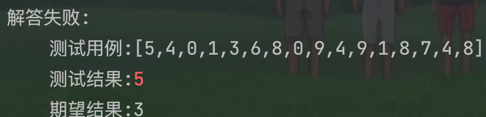

# 55跳跃游戏

## 题目要求：

给你一个非负整数数组 `nums` ，你最初位于数组的 **第一个下标** 。数组中的每个元素代表你在该位置可以跳跃的最大长度。

判断你是否能够到达最后一个下标，如果可以，返回 `true` ；否则，返回 `false` 。


```rust
1 <= nums.length <= 104
0 <= nums[i] <= 105
```
## 第一想法：
- 应该从失败的情况出发，只要元素不为0都是能够走到末尾的，但如果中间有元素为0了，那就存在无法到达的情况——其实就是无论怎么走都会落到0处，但是该如何刻画这个无论怎么走呢？示例二之所以会失败是因为第一步3已经能够涵盖掉后面的两步2，1了。
- 如何使用贪心呢？局部最优是跳到一个比自己大的数，这样会有更多的机会进行后续的选择？

## 题解：
### 思路一：覆盖范围
将本题的跳跃几步的思路转换为当前元素向后的覆盖范围有多大，只要最后可以覆盖到最后一个元素，就满足条件。
- 每次选取元素时，应在当前元素的覆盖范围内选取，并且选到的元素如果条件满足，可以不断地增加当前的覆盖范围（即覆盖范围每次会取一个最大值）
- 其实覆盖范围锚定的是数组的下标，只要其大于等于数组的最后一个位置即可。

```java
class Solution {
    public boolean canJump(int[] nums) {
        int coverIndex = 0;
        if (nums.length == 1) return true;
        for (int i = 0; i <= coverIndex ; i++) {
            coverIndex = Math.max(nums[i] + i,coverIndex);
            if (coverIndex >= nums.length - 1) return true;
        }
        return false;
    }
}
```

###思路二判断能否跨越0：
这个思路与第一想法贴合：遍历整个数组，遇到0的时候我们进行判断：
- 如果0前面的元素可以跨过0或者此时可以走到0且刚好0为最后一个元素，那么证明成立。（注意，即使0前面的元素有的跨不过，也不影响因为前面肯定都是正数，都能来到0前面的一个元素）
- 再具体一点就是只要0前一个元素能跨过0即可，中间的元素能跨过更好。

```java
class Solution {
    public boolean canJump(int[] nums) {
        for (int i = 0; i < nums.length; i++) {
            if (nums[i] == 0){
                //走到了0元素，需要对其前面的元素进行判断
                if (i == nums.length - 1) return true;
                //
                boolean canCross = false;
                for (int j = 0; j < i; j++) {
                    if (nums[j] > i-j ){
                        canCross = true;
                        break;
                    }
                }
                if (!canCross){
                    return false;
                }
            }
        }
        return true;
    }
}
```

# 45跳跃游戏II
## 题目条件
给定一个长度为 n 的 0 索引整数数组 nums。初始位置为 nums[0]。

每个元素 nums[i] 表示从索引 i 向前跳转的最大长度。换句话说，如果你在 nums[i] 处，你可以跳转到任意 nums[i + j] 处:

```
0 <= j <= nums[i]
i + j < n
```

返回到达 `nums[n - 1]` 的最小跳跃次数。生成的测试用例可以到达 `nums[n - 1]`。

```
1 <= nums.length <= 104
0 <= nums[i] <= 1000
```

题目保证可以到达 `nums[n-1]`


## 第一想法：

本题的所求是最小跳跃数，即有一个次数的累计；并且题目条件也有所加强，不允许范围超出数组界限。那么要求这种最小的次数贪心是一定会做的，又回到股票问题了，你并不知道接下来哪一个跳跃（元素值）是最大且合理的，不能一直去等待峰值。

考虑这个次数能否等于跳跃范围的延伸次数，第一次延伸到3是一次，第二次扩展到4是第二次。（扩展到4就可以结束了）并且注意本题的提示，一定可以到达最后的位置。

- 所以更改上面的那段代码，每次获取coverIndex的时候，去判断即可——如果此次获取的coverIndex不大于上一次的，那么次数不会更改；如果此次获取的coverIndex大于上一次的，次数++

```java
class Solution {
    public int jump(int[] nums) {
        int coverIndex = 0;
        int pre = 0;//使用一个变量记录上一次的范围
        int result = 0;
        if (nums.length == 1) return 0;
        for (int i = 0; i <= coverIndex; i++) {
            pre = coverIndex;
            coverIndex = Math.max(i + nums[i] ,coverIndex);
            if (coverIndex > pre){
                result ++;
            }
            if (coverIndex >= nums.length - 1) break;
            if(nums[i] + coverIndex >= nums.length - 1) break;
        }
        return result;
    }
}
```

- 出现错误，发现还是想的太简单了，不仅仅是范围扩大的问题，

- 像这种样例，范围确实在一步步的扩大，但是其实只需要两步就可以来到终点，所以这个代码是否还需要一些额外的条件判断呢？比如范围扩大过程中如果当前范围可以直达终点了？
- 增加了条件还是报错了。

## 题解：

### 方法一：贪心：

与第一想法不同的地方在于**我记录的是上一次的最大距离，而题解的贪心中记录的是下一次的最大距离**（作为后备能源）；还有一点不同在于为什么他每一个范围都尝试到了最后位置？？？

- 并且对于每一个覆盖范围都会尝试着走到覆盖范围的最后，当走到最后还没有走到终点，就意味着要使用下一次的最大范围了
- 除此之外还有一个条件判断是与我相同的，就是更新最大范围后要来看当前范围是不是已经可以来到终点了。

```java
class Solution {
    public int jump(int[] nums) {
        int coverIndex = 0;//当前覆盖范围的最远位置
        int nextCover = 0;//使用一个变量记录下一次的最大范围最远位置
        int result = 0;
        if (nums.length == 1) return 0;
        for (int i = 0; i < nums.length; i++) {//每一次的覆盖范围的终点是否已经到了最后位置
            nextCover = Math.max(i+nums[i],nextCover);
            if (i == coverIndex){//走到当前步的最远位置
                result ++;
                coverIndex = nextCover;
                if (nextCover >= nums.length-1) break;
            }
        }
        return result;
    }
}
```

- 注意，一开始的范围都是0，所以第一次就会进入if进行result++；然后才将范围更新为第一个元素，所以看似只加了一次。