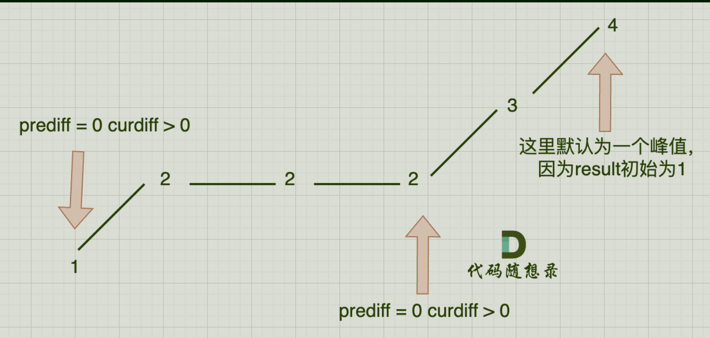

# 357摆动序列

## 题目要求

如果连续数字之间的差严格地在正数和负数之间交替，则数字序列称为 **摆动序列 。**第一个差（如果存在的话）可能是正数或负数。仅有一个元素或者含两个不等元素的序列也视作摆动序列

**子序列** 可以通过从原始序列中删除一些（也可以不删除）元素来获得，剩下的元素保持其原始顺序。

给你一个整数数组 `nums` ，返回 `nums` 中作为 **摆动序列** 的 **最长子序列的长度** 。


```rust
1 <= nums.length <= 1000
0 <= nums[i] <= 1000
```

## 第一想法

这个题的子序列可以跳跃着选取，我觉得这是一个难点。我一开始想的是肯定要有一个判断某个序列是否为摆动序列的方法，但是示例二这个存在多个满足条件的子序列，难道我要全部都找出来，然后去比较哪个最长？

- 先说判断是否为摆动序列吧：根据题目所给的条件，前后差值正负不同去比较即可。
- 后面开始无从下手了。

## 题解：


### 贪心：

- 为何考虑贪心：以示例二数据为例，要找的其实是单调性有改变的地方，即峰值和山脚两个数（可以不去考虑选择坡上多出来的情况，再多也多不过峰值情况）；在局部的单调上，题目提示子序列可以从原序列中删除得到，所以贪心的处理就是删除单调坡上多余的元素。推到整体上贪心就变成了构造一个不断地在变化坡度的序列。
- 当然删除也不是真正的删除，我们只需要进行条件判断然后记录个数即可。

### 特殊情况：

- 一般情况下根据上面说的贪心我们**需要三个数作为一组**才可以判断坡度，峰值的两侧坡。
- `prediff = nums[i - 1] - nums[i] ; curdiff = nums[i] - nums[i + 1]`条件判断为`(prediff > 0 && curdiff < 0) || (prediff < 0 && curdiff > 0)`
- 可以发现prediff不用专门去算，对于*下一个数它的prediff不就是上一个数的curdiff*吗？

#### 1平坡夹在上下坡之间

- 这种情况会导致一般情况下的判断出问题，差值会来到0，且有多个平坡的元素。
- 所以处理这种情况我们要将条件判断加入=，平坡元素也只判断一个；**故将=加到prediff的判断中即可**。

#### 2首尾元素如何处理


- 初始条件判断中我们需要三个元素来判断，所以对于只有两个元素我们该如何处理？
- 为了遵循情况1，我们可以**在首元素前面假设添加一个相同元素构成平坡**，这样也只能对首元素进行判断，尾元素如何判断呢？（[25]这个序列应该结果为2个）
- 为了判断尾元素，我们直接在`result`中设置初始值为1.（注意此时for循环就不要到最后一个元素了）

#### 3单调坡中有平坡（区别于1）



- 还是因为需要遵循一个条件，在2上坡的情况下又出现了误判。
- 所以**prediff不需要随时更新，只在坡度变化时才更新**（反应到这张图上就是从1-2的坡度变化会一直保留，从而2-3的变化判断不会误判出现峰值，都是上坡单调性相同）。

### 贪心代码

```java
class Solution {
    public int wiggleMaxLength(int[] nums) {
        int prediff = 0;//这里设置为0为了照顾首元素
        int curdiff = 0;
        int result = 1;
        for (int i = 0; i < nums.length - 1; i++) {//因为result已经设置为1了
            curdiff = nums[i] - nums[i + 1];
            //判断是否为峰值
            if ((prediff >= 0 && curdiff < 0) || (prediff <= 0 && curdiff > 0)){
                result ++;
                prediff = curdiff;//在峰值处再更新prediff，因为prediff代表着前面的单调性
            }
        }
        return result;
    }
}
```

### 贪心二(From ChatGpt)

```java
class Solution {
    public int wiggleMaxLength(int[] nums) {
        if (nums.length < 2) {
            return nums.length;
        }

        int up = 1, down = 1;//为了单独元素也有结果1

        for (int i = 1; i < nums.length; i++) {
            if (nums[i] > nums[i - 1]) {
                up = down + 1;
            } else if (nums[i] < nums[i - 1]) {
                down = up + 1;
            }
        }

        return Math.max(up, down);
    }
}
```

- `up`表示以当前元素结尾的，且最后一次趋势是上升的摆动序列的最大长度。
- `down` 表示以当前元素结尾的，且最后一次趋势是下降的摆动序列的最大长度。
- 在debug时可以发现只要开始单调，二者的值是不会变的，只有发生了单调性的改变值才会变化。

# 738单调递增的数字

## 题目要求

当且仅当每个相邻位数上的数字 `x` 和 `y` 满足 `x <= y` 时，我们称这个整数是**单调递增**的。

给定一个整数 `n` ，返回 *小于或等于 `n` 的最大数字，且数字呈 **单调递增*** 。


## 第一想法

这是一道操作数位的题目，我觉得还是得遍历原数，对原数的每一位？进行判断，但是好像不需要每一位。拿332举例子，我们首先得确定百位，由于原数字不单增，所以百位得降1，其实只要百位降1了，后面几位全部写成9就行了。

所以规律好像是依次去看每一位，如果不需要降就不变，如果需要降位就当前位置降1，后面位置也不需要判断了直接全部设置为9即可。

- 所以最关键的在于怎么遍历这个数字
- 以及没有考虑是否能从前往后遍历

## 题解

- 将数字转换为字符数组进行遍历，并且只能从后往前去遍历——我们需要判断当前位置是否需要降，就得去比较当前位置和前一位，前一位大于当前位置，证明非递增，前一位得-1，当前位置往后全部置为9；如果从前向后遍历332-》329，导致-1的那一位又不满足条件了。
- 所以从后往前比就避免了这个问题，每次比较都保证了条件的满足
- 还需要注意的是为了将往后全部置为9，我们需要设置一个**标记位**，标记从哪里开始设置为9，其实就是从后往前比中最后一次出现条件不满足的地方。

```java
class Solution {
    public int monotoneIncreasingDigits(int n) {
        //
        String s = String.valueOf(n);
        char[] chars = s.toCharArray();
        int Ninestart = s.length();
      //第一个for循环用来判断条件是否满足以及设置标记位的位置
        for (int i = s.length()-1; i > 0; i--) {
            if (chars[i-1] > chars[i]){
                chars[i-1] --;
                Ninestart = i;
            }
        }
      //第二个for循环用来从标记位开始置为9
        for (int i = Ninestart; i < chars.length; i++) {
            chars[i] = '9';
        }
        return Integer.parseInt(String.valueOf(chars));
    }
}
```

